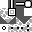
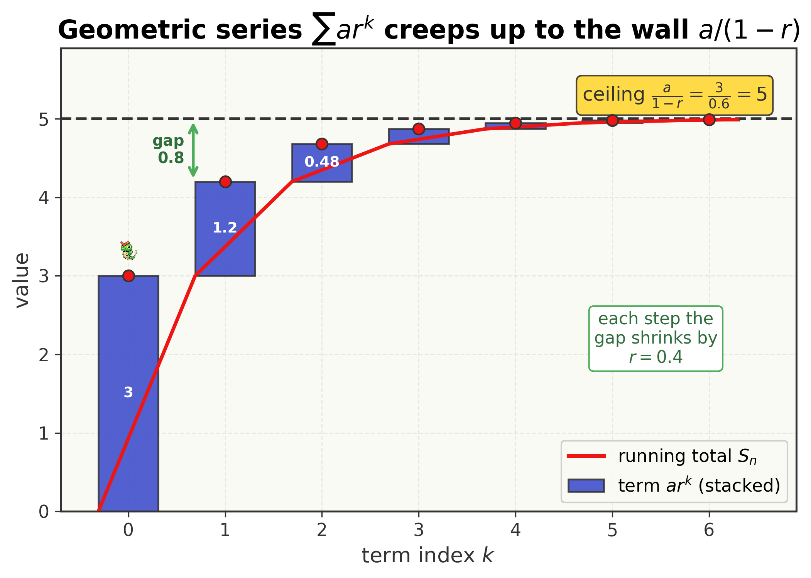
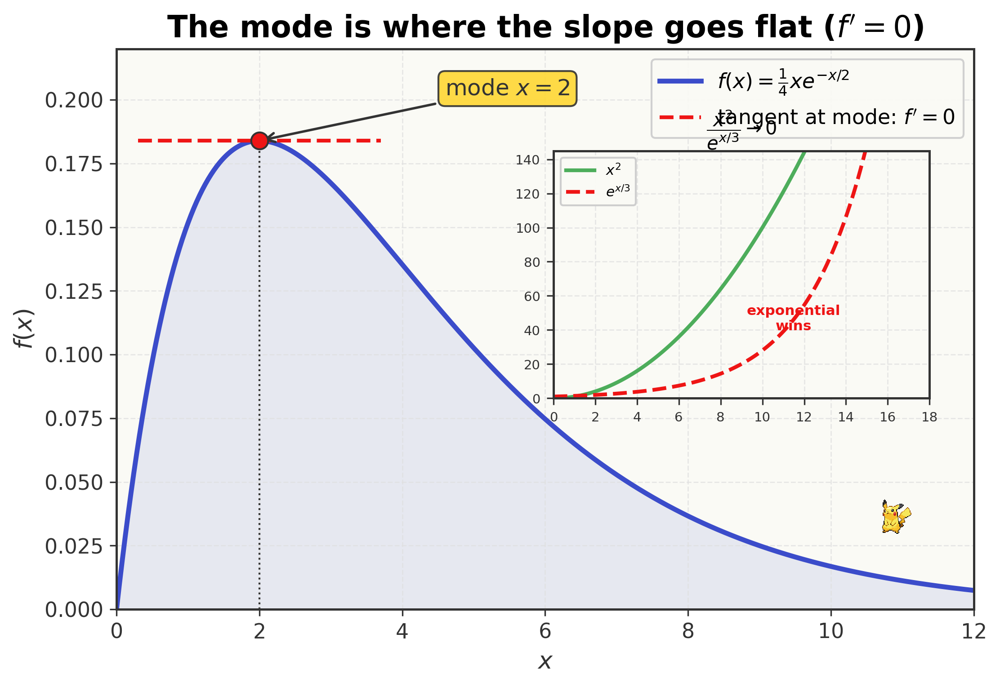
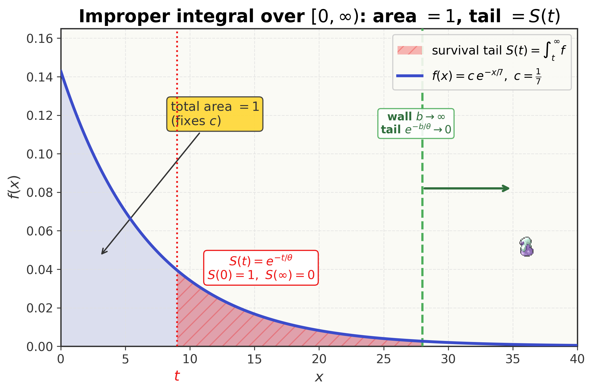
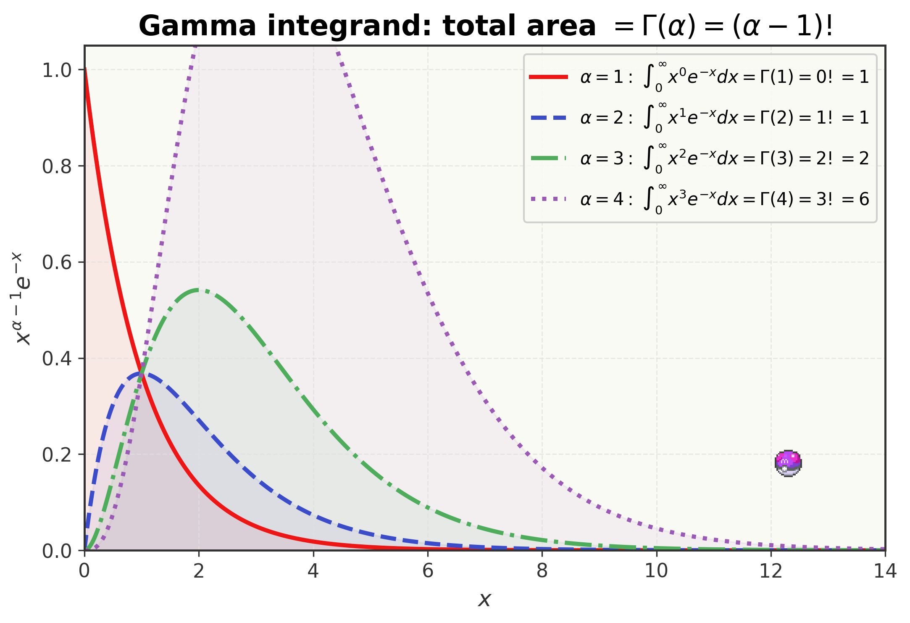
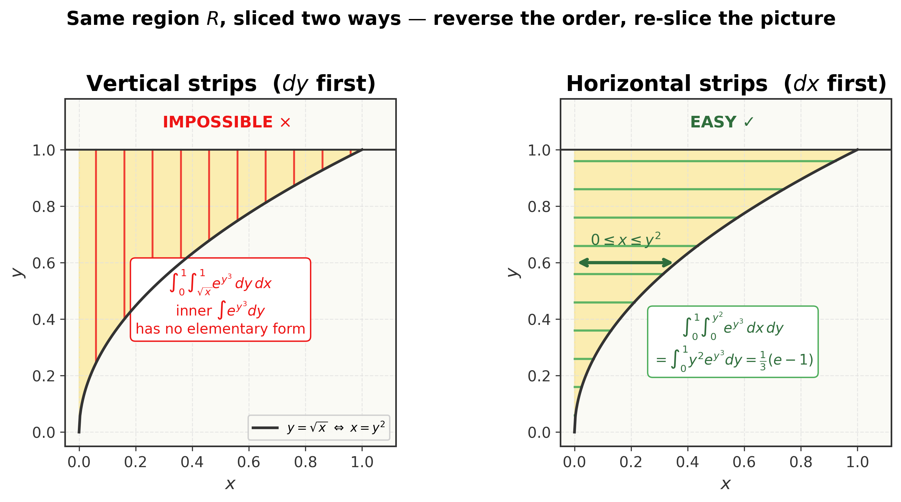

<!--
  file: ch02_toolkit_calculus
  tier: B
  outcomes: prereq
  draft1_source: drafts/chapters_draft1/ch01_trainer_school.md
  maps_to: Trainer School, part two — the night before Route 1
-->

# The Toolkit II — Series & Calculus for Probability {.type-normal}

<figure>

<figcaption>Still in Pallet Town — but this is the last night. Master these instruments and Route 1 opens.</figcaption>
</figure>

::: cold-open
**▶ COLD OPEN — EPISODE: "The Night Before the Journey, Part II"**

It is past midnight in Professor Oak's lab. You earned your Trainer's License this afternoon — you can wield exponents, logs, and the algebra of the previous chapter. But Oak is not finished with you.

He slides a single Poké Ball across the table, then pulls it back before you can grab it.

"A trainer who can't throw a ball loses in Viridian Forest," he says. "A trainer who can't *integrate* loses the moment a wild distribution appears — and on this journey, they always do."

He chalks one line on the board and taps it:

$$\int_0^\infty x^{3}\, e^{-x/2}\, dx \;=\; ?$$

"This shape — a power of $x$ times a decaying exponential, swept from zero to infinity — appears on Exam P more than almost any other. Every expected lifetime, every gamma loss, every average claim collapses into it. A weak trainer grinds it out by parts, four times, and runs out of clock. A strong trainer *recognizes* it and writes the answer in a single line."

Pikachu — not yet *your* Pikachu, watching from a charging cradle on the shelf — cocks its head, plainly doubting you can.

Then Oak writes a second thing, a swarm of shrinking terms:

$$1 + \tfrac12 + \tfrac14 + \tfrac18 + \cdots \;=\; ?$$

"And this. An *endless* sum that somehow lands on a finite number. The whole machinery of the Poisson and the geometric — half the distributions you'll ever price — is built on adding infinitely many things and getting a clean total. If infinity scares you, you'll freeze."

The lamp flickers. "So. Before I hand you a Pokémon at dawn — prove you can wield the instruments. What is that integral? What is that sum? And how do you catch them *without a fight*?"
:::

## Where You Are — 60-Second Retrieval

You're holding the Trainer's License from the previous Toolkit chapter. Back there you learned the **algebra** this chapter stands on: the exponent laws ($a^m a^n = a^{m+n}$, $(a^m)^n = a^{mn}$), the fact that $e$ and $\ln$ undo each other ($e^{\ln x}=x$), and how to **read a variable out of an exponent by taking logs**. Every integral in this chapter is a function built from $e^{-x/\theta}$, and you will lean on those laws on every line.

::: trainers-tip
**60-SECOND RETRIEVAL — prove you still own the last chapter**

Answer from memory; if any feels shaky, flip back before continuing.

1. Simplify $e^{-x/\theta}\cdot e^{-x/\theta}$ to a single exponential. *(Answer: $e^{-2x/\theta}$ — add the exponents.)*
2. Solve $e^{-x/5} = 0.2$ for $x$. *(Answer: $x = -5\ln 0.2 = 5\ln 5 \approx 8.047$ — take logs to free $x$.)*
3. What is $e^{0}$? And what does $\ln(e^{k})$ equal? *(Answer: $1$; and $k$ — they undo each other.)*

All three instant? You're ready. Any hesitation? Reclaim it first — every line below uses these.
:::

## Oak's Briefing — Learning Outcomes & Test-Out Gate

<figure style="margin:1.5em auto; max-width:160px; text-align:center;">

<figcaption style="font-size:0.85em;">Professor Oak — the formalizer</figcaption>
</figure>

Oak's voice settles. "Exam P does not teach you calculus, Ash. The SOA *assumes* it is already in your bag. This chapter is where we put it there — not as a list of formulas to memorize, but as a small set of instruments you understand well enough to reach for without thinking. We'll build each one from the ground up, then compress it into a Pokédex Entry you can carry onto the exam."

By the end of this chapter you will be able to:

- **Sum** geometric and exponential series in closed form, recognizing $\sum ar^k = \tfrac{a}{1-r}$ and $\sum \tfrac{\lambda^k}{k!} = e^{\lambda}$ on sight. *(Prereq — series; powers Poisson & geometric.)*
- **Differentiate** with the product, quotient, and chain rules; **find a mode** by optimization; and resolve $\tfrac00$ or $\tfrac{\infty}{\infty}$ limits with **L'Hôpital's rule** and the "exponential beats polynomial" principle. *(Prereq — differentiation, limits.)*
- **Integrate** by $u$-substitution and by parts, and evaluate **improper integrals** over $[0,\infty)$ — including normalizing a density and finding a survival tail. *(Prereq — integration.)*
- **Deploy the gamma-integral identity** $\displaystyle\int_0^\infty x^{\alpha-1}e^{-x/\theta}\,dx = \Gamma(\alpha)\,\theta^{\alpha}$ as a one-line shortcut — the **Master Ball** of integrals. *(Prereq — the single most leveraged tool in the book.)*
- **Set up and reverse** double / iterated integrals over rectangular *and* non-rectangular regions. *(Prereq — the multivariate workhorse of the joint-distribution chapters.)*

> *Exam-weight signpost.* Nothing here is a numbered SOA *topic* — these are the **prerequisites** the exam silently demands. But that makes them load-bearing in a different way: the gamma identity recurs in nearly every later chapter, and the double-integral skill is the spine of the entire multivariate half of the syllabus. This is a **Tier B** toolkit chapter — thorough, but **fully skippable in pieces**. Own a tool already? Prove it at its gate and move on.

::: concept-gate
**CHAPTER TEST-OUT GATE — Do You Already Own All of This Toolkit?**

Already fluent? Prove it. Work these five, ~2 minutes each, *with correct method*:

1. Sum $\displaystyle\sum_{k=0}^{\infty} 3\,(0.4)^k$.
2. Evaluate $\displaystyle\int_0^\infty x^{2} e^{-x/3}\,dx$ in one line.
3. Find the mode of $f(x) = \tfrac14 x\,e^{-x/2}$ on $x>0$.
4. Find $c$ so that $f(x) = c\,e^{-x/7}$ ($x>0$) is a valid density.
5. Reverse the order to evaluate $\displaystyle\int_0^1\!\!\int_{\sqrt{x}}^{1} e^{\,y^{3}}\,dy\,dx$.

*(Answers: $5$; $\Gamma(3)\,3^3 = 2\cdot 27 = 54$; mode $=2$; $c=\tfrac17$; $\tfrac13(e-1)\approx 0.573$.)* Five for five with the right reasoning? **Skip to the Gym Challenge** and stamp the license. Any miss or hesitation? The teaching below was built exactly for you — and each tool has its own skip-gate, so even a partial owner loses no time.
:::

---

Five tools build here, in increasing difficulty. We teach them **in order**, each with its own "do you already own this?" skip-check, then the full nine-beat lesson, then a Pokédex Entry you can carry into the exam:

1. **Geometric & exponential series** — adding an endless swarm and getting a finite total
2. **Differentiation, modes & limits** — slopes, peaks, and who wins as $x\to\infty$
3. **Integration & improper integrals** — summing infinitely many tiny slices over $[0,\infty)$
4. **The gamma identity** — the Master Ball: power $\times$ decaying exponential in one line
5. **Double & iterated integrals** — nesting two integrals, and reversing the order

## Concept 1 — Series: Adding an Endless Swarm

::: concept-gate
**DO YOU ALREADY OWN THIS? — Series**

A swarm of Caterpie each give energy $3$ times $(0.4)^k$ for $k = 0,1,2,\dots$ forever. Total energy is $\displaystyle\sum_{k=0}^{\infty} 3\,(0.4)^k$.

If you immediately wrote **$\dfrac{3}{1-0.4} = 5$** (and you can say *why* an endless sum lands on a finite number), **skip to Concept 2**. If you're not sure an infinite sum can even *be* finite — or you reached for a calculator to add terms — this section is for you.
:::

**Beat 1 — The one-sentence idea.** *When each term in an endless sum shrinks fast enough, the running total creeps up to a finite ceiling and never passes it — and there is a clean formula for that ceiling.*

**Beat 2 — Anchor + concrete instance.** You already met $e$ and powers in the last chapter. A **series** is just "keep adding." Here is the story, with real numbers.

A swarm of Caterpie spills out of Viridian Forest. The first gives **$3$** units of energy. The next gives $0.4$ as much, the next $0.4$ of *that*, and so on forever — the $k$-th Caterpie gives $3\,(0.4)^k$. There are *endlessly* many. *What is the total?*

**Beat 3 — Reason through it in plain words.** Add them one at a time and watch the running total:

$$3,\quad 3+1.2 = 4.2,\quad +0.48 = 4.68,\quad +0.192 = 4.872,\quad +0.0768 = 4.9488,\ \dots$$

The total is *climbing*, but each new Caterpie adds less than the last, and the steps are shrinking by a factor of $0.4$ every time. The running total is sneaking up on a wall it never crosses. What wall? Here is the trick. Call the total $S$. Multiply the whole sum by the shrink factor $0.4$ and line it up:

$$S = 3 + 3(0.4) + 3(0.4)^2 + \cdots, \qquad 0.4\,S = \phantom{3 + {}}3(0.4) + 3(0.4)^2 + \cdots.$$

Every term of $0.4\,S$ matches a term of $S$ except the very first $3$. Subtract:

$$S - 0.4\,S = 3 \;\Longrightarrow\; 0.6\,S = 3 \;\Longrightarrow\; S = \frac{3}{0.6} = 5.$$

The wall is exactly $5$. The running total ($4.95\dots$) was creeping up to it.

**Beat 4 — Surface and dismantle the tempting wrong idea.** The instinct that sinks beginners is: *"infinitely many positive things must add to infinity."* Not so. That is only true when the terms **don't shrink fast enough**. The shrink factor here is $r = 0.4$, and because $|r| < 1$ each term is a fraction of the one before, so the leftover tail vanishes. If instead $r$ were $1$ (every term equals $3$) or bigger, the sum really *would* blow up to infinity. The rule is the gate $|r|<1$: shrink fast enough and you get a finite ceiling; don't, and you don't.

**Beat 5 — Translate into notation, one glyph at a time.** "Add these up" gets the **summation** symbol — a big Greek capital sigma:

$$\sum_{k=0}^{\infty} \qquad \text{read aloud: ``the sum, as } k \text{ runs from } 0 \text{ to infinity, of\dots''}$$

The little $k=0$ underneath is the **starting index** (we start counting at zero); the $\infty$ on top says **keep going forever**. The thing to its right is the **general term**. Our swarm is

$$\sum_{k=0}^{\infty} 3\,(0.4)^k \qquad \text{read aloud: ``the sum of } 3 \text{ times } 0.4 \text{ to the } k\text{, over all } k\text{.''}$$

The sigma is *only* shorthand for "add all of these" — nothing more mysterious than that.

**Beat 6 — Generalize: derive the formula from the instance.** Replace the specific $3$ with a general first term $a$, and the $0.4$ with a general ratio $r$. The exact same line-up-and-subtract trick gives

$$S = a + ar + ar^2 + \cdots, \quad rS = ar + ar^2 + \cdots, \quad S - rS = a \;\Longrightarrow\; \boxed{\,\sum_{k=0}^{\infty} a r^k = \frac{a}{1-r}, \quad |r|<1.\,}$$

We did not assert this — we *built* it, exactly as we built $S=5$. (Cutting the sum off early gives the **finite** version $\sum_{k=0}^{n-1} ar^k = a\,\tfrac{1-r^n}{1-r}$ by the same subtraction.)

**Beat 7 — Ramp the difficulty.**

- *Simplest:* the Caterpie swarm, $\tfrac{3}{0.6}=5$.
- *A second, different series you must also recognize:* the **factorial** series $\sum_{k=0}^\infty \tfrac{\lambda^k}{k!}$. This is *not* geometric — the terms are divided by $k!$, which grows ferociously, so it converges for **every** $\lambda$. It happens to be the Taylor series of $e^\lambda$, so $\sum_{k=0}^\infty \tfrac{\lambda^k}{k!} = e^{\lambda}$. (This *is* the total that makes the Poisson distribution's probabilities sum to one.)
- *A twist:* the "weighted" geometric sum $\sum_{k=0}^\infty k\,r^k = \tfrac{r}{(1-r)^2}$ for $|r|<1$ — it appears when you compute the *mean* of a geometric random variable. (Derivable by differentiating the geometric series; you'll meet it again in the distributions chapter.)
- *Edge:* if $|r|\ge 1$ the geometric series **diverges** — no finite total. Always check the ratio before writing $\tfrac{a}{1-r}$.

**Beat 8 — Picture it.** The figure makes "creeps up to a wall" literal: each bar is one term, stacked, and the running height approaches a horizontal line at $5$.

<figure>

<figcaption>A convergent geometric series: each term shrinks by $r=0.4$, so the cumulative total climbs toward the ceiling $\tfrac{a}{1-r}=5$ and never crosses it.</figcaption>
</figure>

**Beat 9 — Consolidate.** You can now collapse an endless geometric sum to $\tfrac{a}{1-r}$ on sight (after checking $|r|<1$), and recognize the factorial series as $e^\lambda$. These two closed forms are exactly what make the geometric and Poisson distributions' probabilities add to one — you'll reuse them the moment those distributions appear.

::: pokedex-entry
**POKÉDEX ENTRY №01 — Geometric & Exponential Series**

$$\sum_{k=0}^{\infty} a r^{k} = \frac{a}{1-r}\quad(|r|<1), \qquad \sum_{k=0}^{n-1} a r^k = a\,\frac{1-r^{n}}{1-r},$$
$$\sum_{k=0}^{\infty}\frac{\lambda^{k}}{k!} = e^{\lambda}, \qquad \sum_{k=0}^{\infty} k\,r^{k}=\frac{r}{(1-r)^2}\quad(|r|<1).$$

*In plain terms:* a geometric sum (each term a fixed fraction $r$ of the last) collapses to $\tfrac{a}{1-r}$ when $|r|<1$. The factorial series is exactly $e^\lambda$.

*Recognition cue:* a sum with $r^k \to$ geometric (the **geometric distribution**). A sum with $\lambda^k/k! \to$ it equals $e^\lambda$ (the **Poisson distribution**). Seeing either should make you write the closed form **instantly**, never term-by-term — and always check $|r|<1$ first.
:::

## Concept 2 — Differentiation, Modes & Limits

::: concept-gate
**DO YOU ALREADY OWN THIS? — Derivatives, Modes & Limits**

For $f(x) = \tfrac14 x\,e^{-x/2}$ on $x>0$, find the value of $x$ where $f$ peaks (its **mode**). Then evaluate $\displaystyle\lim_{x\to\infty} x^2 e^{-x/3}$.

If you got **mode $=2$** (via the product + chain rule, setting $f'=0$) and **$\lim = 0$** ("exponential beats polynomial"), **skip to Concept 3**. If either made you hesitate — especially if you tried to differentiate $x\,e^{-x/2}$ without the product rule — read on.
:::

**Beat 1 — The one-sentence idea.** *A derivative is the slope of a curve; where the slope is zero the curve is flat, which is exactly where a density peaks — and when you hit a $\tfrac00$ or $\tfrac{\infty}{\infty}$ stalemate, differentiating top and bottom breaks the tie.*

**Beat 2 — Anchor + concrete instance.** You'll meet densities that rise, crest, and fall — like $f(x)=\tfrac14 x\,e^{-x/2}$. The **mode** is the crest: the most likely value. At a crest the tangent line is horizontal, i.e. the slope $f'(x) = 0$. So finding the peak means differentiating and solving $f'=0$. Here is the concrete task: *find the mode of $f(x)=\tfrac14 x\,e^{-x/2}$ on $x>0$.*

**Beat 3 — Reason through it in plain words.** The function $\tfrac14 x\,e^{-x/2}$ is a **product** of two pieces: a rising part $x$ and a falling part $e^{-x/2}$. Early on the rising $x$ wins and the curve climbs; eventually the decaying exponential wins and the curve falls. The peak is the handoff point — where the climb exactly stops, i.e. slope zero. To differentiate a product, you can't just differentiate each piece; you need the **product rule** ("derivative of the first times the second, plus the first times the derivative of the second"), and the exponential's derivative needs the **chain rule** (an inside function $-x/2$). Working it out:

$$f'(x) = \tfrac14\Big[\underbrace{1\cdot e^{-x/2}}_{(x)'\,e^{-x/2}} + \underbrace{x\cdot\big(-\tfrac12\big)e^{-x/2}}_{x\,(e^{-x/2})'}\Big] = \tfrac14\,e^{-x/2}\Big(1 - \tfrac{x}{2}\Big).$$

Set $f'(x)=0$. Since $e^{-x/2}$ is always positive (it can't be zero), the only way is $1 - \tfrac{x}{2} = 0$, i.e. $x = 2$. The slope goes from $+$ (climbing) to $-$ (falling) there, so it's a **maximum** — the mode is $x=2$.

**Beat 4 — Surface and dismantle the tempting wrong idea.** The classic slip is to differentiate the product *piece by piece*: $(x\,e^{-x/2})' \overset{?}{=} 1 \cdot (-\tfrac12)e^{-x/2}$, dropping a whole term. That's wrong — the derivative of a product is **not** the product of the derivatives. You must use the product rule and keep **both** terms. A second common slip: forgetting the chain rule on $e^{-x/2}$ and writing its derivative as $e^{-x/2}$ instead of $-\tfrac12 e^{-x/2}$. The inside function $-x/2$ has its own derivative $-\tfrac12$, which multiplies out front.

**Beat 5 — Translate into notation, one glyph at a time.** The three rules, named and read aloud:

$$(fg)' = f'g + fg' \qquad \text{read: ``derivative of a } \textbf{product}\text{.''}$$
$$\left(\frac{f}{g}\right)' = \frac{f'g - fg'}{g^2} \qquad \text{read: ``derivative of a } \textbf{quotient}\text{.''}$$
$$\frac{d}{dx}\,f\big(g(x)\big) = f'\big(g(x)\big)\,g'(x) \qquad \text{read: ``the } \textbf{chain rule}\text{ — outside derivative times inside derivative.''}$$

The symbol $\tfrac{d}{dx}$ reads **"the derivative with respect to $x$ of"** — it is an *instruction*, not a fraction. The prime, $f'$, is shorthand for the same thing.

**Beat 6 — Generalize: the mode recipe, and the limit tool.** *Mode recipe:* to find where any density $f$ peaks, compute $f'$, set $f'=0$, solve, and confirm the sign of $f'$ flips $+\to-$. That's it — every mode problem is this. *The limit tool:* sometimes a limit collapses to the meaningless forms $\tfrac00$ or $\tfrac{\infty}{\infty}$. **L'Hôpital's rule** says: differentiate top and bottom *separately* and try again.

$$\text{If } \lim \frac{f}{g} \text{ is } \frac00 \text{ or } \frac{\infty}{\infty}, \quad \lim \frac{f(x)}{g(x)} = \lim \frac{f'(x)}{g'(x)}.$$

**Beat 7 — Ramp the difficulty.**

- *Simplest:* the mode $x=2$, above.
- *The limit you'll use constantly:* $\displaystyle\lim_{x\to\infty} x^2 e^{-x/3}$. Written as $\tfrac{x^2}{e^{x/3}}$ it is $\tfrac{\infty}{\infty}$. One L'Hôpital pass differentiates to $\tfrac{2x}{\frac13 e^{x/3}}$ — still $\tfrac{\infty}{\infty}$; a second pass gives $\tfrac{2}{\frac19 e^{x/3}} \to 0$. The exponential in the denominator outgrows any polynomial on top. **Exponential beats polynomial** — memorize it and you rarely even reach for the rule.
- *Why this matters:* every probability density on $[0,\infty)$ has a tail like $x^n e^{-x/\theta}$; this limit being $0$ is *why* that tail's area is finite (Concept 3) and why expectations exist.
- *Edge:* L'Hôpital applies *only* to $\tfrac00$ and $\tfrac{\infty}{\infty}$. Don't use it on a limit that isn't indeterminate — you'll get a wrong answer.

**Beat 8 — Picture it.**

<figure>

<figcaption>The mode is where the tangent goes flat ($f'=0$): here $x=2$. Inset: the exponential outruns the polynomial, so $x^2 e^{-x/3}\to 0$.</figcaption>
</figure>

**Beat 9 — Consolidate.** You can now differentiate products and compositions with the product and chain rules, find a density's mode by setting $f'=0$, and clear a $\tfrac00$ or $\tfrac{\infty}{\infty}$ limit with L'Hôpital — knowing in advance that exponential decay always beats polynomial growth.

::: pokedex-entry
**POKÉDEX ENTRY №02 — Differentiation, Modes & Limits**

$$(fg)' = f'g + fg', \qquad \left(\tfrac{f}{g}\right)' = \tfrac{f'g - fg'}{g^2}, \qquad \tfrac{d}{dx}f(g(x)) = f'(g(x))\,g'(x).$$
$$\textbf{Mode:}\ \text{solve } f'(x)=0. \qquad \textbf{L'Hôpital } \left(\tfrac00,\tfrac{\infty}{\infty}\right):\ \lim\tfrac{f}{g}=\lim\tfrac{f'}{g'}. \qquad \lim_{x\to\infty} x^n e^{-x/\theta}=0.$$

*In plain terms:* the slope of a curve; zero slope marks a peak (the mode). When a limit jams at $\tfrac00$ or $\tfrac{\infty}{\infty}$, differentiate top and bottom and retry — and exponential decay always wins against polynomial growth.

*Recognition cue:* "most likely value / peak / mode" $\to$ set $f'=0$. A limit that evaluates to $\tfrac00$ or $\tfrac{\infty}{\infty}$ $\to$ L'Hôpital. A tail $x^n e^{-x/\theta}$ as $x\to\infty$ $\to$ it's $0$, no work needed.
:::

## Concept 3 — Integration & Improper Integrals

::: concept-gate
**DO YOU ALREADY OWN THIS? — Integration over $[0,\infty)$**

Find the constant $c$ that makes $f(x) = c\,e^{-x/7}$ ($x>0$) a valid probability density (total area $1$). Then write the survival probability $S(t) = \int_t^\infty \tfrac14 e^{-u/4}\,du$ as a clean formula in $t$.

If you wrote **$c = \tfrac17$** (because $\int_0^\infty e^{-x/7}dx = 7$) and **$S(t) = e^{-t/4}$** (and you can confirm $S(0)=1$), **skip to Concept 4**. If the upper limit of $\infty$ made you uneasy, or you wrote $S(t)=1-e^{-t/4}$, read on.
:::

**Beat 1 — The one-sentence idea.** *An integral sums infinitely many infinitely-thin slices of area under a curve; pushing the upper limit to infinity is fine as long as the curve's tail decays, and "total area $=1$" is exactly what makes a function a probability density.*

**Beat 2 — Anchor + concrete instance.** A continuous distribution spreads probability over a *range*, not single points, and "how much probability sits here" is an **area** under the density curve — an integral. Before any of that area means anything, the *whole* area must be $1$. Concrete task: *the Pokédex models encounter intensity by $f(x) = c\,e^{-x/7}$ for $x>0$; find the $c$ that makes the total area $1$.*

**Beat 3 — Reason through it in plain words.** We need $\int_0^\infty c\,e^{-x/7}\,dx = 1$. The antiderivative of $e^{-x/7}$ is $-7e^{-x/7}$ (check: differentiate $-7e^{-x/7}$, the chain rule gives $-7 \cdot (-\tfrac17) e^{-x/7} = e^{-x/7}$ ✓). But the upper limit is *infinity*, which we can't plug in directly. So we integrate up to a finite wall $b$, then let the wall slide to infinity:

$$\int_0^\infty e^{-x/7}\,dx = \lim_{b\to\infty}\Big[-7e^{-x/7}\Big]_0^{b} = \lim_{b\to\infty}\Big(-7e^{-b/7} + 7\Big) = 0 + 7 = 7,$$

because $e^{-b/7}\to 0$ as the wall recedes (Concept 2: exponential decay wins). So $\int_0^\infty c\,e^{-x/7}dx = 7c$, and setting $7c = 1$ gives $c = \tfrac17$.

**Beat 4 — Surface and dismantle the tempting wrong idea.** Two traps live here. First, the infinity panic: *"you can't integrate to infinity."* You can — you take a **limit**, and as long as the tail $e^{-b/7}$ dies (it does), the area is a finite number. Second, the *survival-vs-CDF* mix-up. The **survival** function $S(t) = \int_t^\infty f$ is the probability of landing *above* $t$; the **CDF** $F(t) = \int_0^t f$ is the probability *below* $t$. They satisfy $S = 1 - F$, and it is dangerously easy to compute one and label it the other. Anchor on the endpoints: a survival function has $S(0)=1$ and $S(\infty)=0$; a CDF has $F(0)=0$ and $F(\infty)=1$. If your formula fails that test, you computed the other one.

**Beat 5 — Translate into notation, one glyph at a time.** The **improper integral** over $[0,\infty)$ is *defined* as a limit:

$$\int_0^{\infty} f(x)\,dx \;=\; \lim_{b\to\infty}\int_0^{b} f(x)\,dx \qquad \text{read: ``integrate to a wall } b\text{, then slide } b \text{ to infinity.''}$$

The integral sign $\int$ is an elongated "S" for **sum**; $dx$ is the **width** of an infinitely thin slice; together $\int f(x)\,dx$ reads **"sum the slice heights $f(x)$ times their tiny widths $dx$."** Two integration moves you'll reuse:

$$\int f(g(x))\,g'(x)\,dx = \int f(u)\,du \quad(u\text{-substitution, reverses the chain rule}),$$
$$\int u\,dv = uv - \int v\,du \quad(\text{integration by parts, reverses the product rule}).$$

**Beat 6 — Generalize: the two facts you'll lean on.** From the work above, the exponential's total area over $[0,\infty)$ is just its scale:

$$\int_0^{\infty} e^{-x/\theta}\,dx = \theta, \qquad\text{hence}\qquad \int_0^\infty \frac{1}{\theta}e^{-x/\theta}\,dx = 1.$$

That second line is *why* $\tfrac1\theta e^{-x/\theta}$ is a valid density — it integrates to one. And the survival tail of that exponential is

$$S(t) = \int_t^\infty \tfrac1\theta e^{-u/\theta}\,du = \Big[-e^{-u/\theta}\Big]_t^\infty = e^{-t/\theta},$$

which indeed has $S(0)=1$ and $S(\infty)=0$ — a survival function, not a CDF.

**Beat 7 — Ramp the difficulty.**

- *Simplest:* normalize $e^{-x/7}$, getting $c=\tfrac17$.
- *Survival tail:* $S(t)=\int_t^\infty \tfrac14 e^{-u/4}du = e^{-t/4}$ (the gate problem); confirm $S(0)=1$.
- *$u$-substitution twist:* $\int_0^1 y^2 e^{y^3}\,dy$ — spot the inside function $y^3$ whose derivative $3y^2$ is (up to a constant) sitting right there; let $u=y^3$, $du=3y^2\,dy$, and it collapses to $\tfrac13\int_0^1 e^u\,du = \tfrac13(e-1)$.
- *By-parts / the harder road:* $\int_0^\infty x^3 e^{-x/2}\,dx$ can be ground out by parts three times — but that's exactly the labor the **next** concept eliminates with one identity.

**Beat 8 — Picture it.**

<figure>

<figcaption>The full area under a density is $1$ (which fixes $c$); the tail area from $t$ rightward is the survival function $S(t)$. The upper wall $b$ slides to infinity and the tail $e^{-b/\theta}$ vanishes.</figcaption>
</figure>

**Beat 9 — Consolidate.** You can now integrate over $[0,\infty)$ by taking a limit, find a density's normalizing constant by forcing the total area to $1$, compute a survival tail $S(t)$ (and tell it apart from the CDF by the endpoint test), and reach for $u$-substitution or by-parts when needed.

::: pokedex-entry
**POKÉDEX ENTRY №03 — Improper Integrals, Normalizing & Survival**

$$\int_0^{\infty} f(x)\,dx = \lim_{b\to\infty}\int_0^{b} f(x)\,dx, \qquad \int_0^{\infty} e^{-x/\theta}\,dx = \theta, \qquad \int_0^\infty \tfrac1\theta e^{-x/\theta}\,dx = 1.$$
$$\textbf{Normalize:}\ \text{choose } c \text{ so } \int f = 1. \qquad \textbf{Survival:}\ S(t)=\int_t^\infty f = 1-F(t),\quad S(0)=1,\ S(\infty)=0.$$

*In plain terms:* integrate to a finite wall, then let it slide to infinity; if the tail decays, the area is finite. "Total area $=1$" defines a density; the tail area from $t$ rightward is survival.

*Recognition cue:* limits $0$ to $\infty$ with an $e^{-x/\theta}$ factor $\to$ a continuous distribution on $[0,\infty)$. Asked for a normalizing constant $\to$ set $\int f=1$. Endpoint test ($S(0)=1$ vs $F(0)=0$) tells survival from CDF.
:::

## Concept 4 — The Gamma Identity (the Master Ball)

::: concept-gate
**DO YOU ALREADY OWN THIS? — The Gamma Integral**

Evaluate $\displaystyle\int_0^\infty x^{3}\, e^{-x/2}\, dx$ in **one line**, no integration by parts.

If you wrote **$\Gamma(4)\,2^4 = 3!\cdot 16 = 96$** (and you know the power on $x$ is $\alpha-1$, so $\alpha = 4$, **not** $3$), you own the most leveraged tool in the book — **skip to Concept 5**. If you reached for integration by parts, or you'd have written $\Gamma(3)\,2^3$, this is the section that saves you the most exam time you will ever save.
:::

**Beat 1 — The one-sentence idea.** *Any integral of the shape "a power of $x$ times a decaying exponential, swept from $0$ to $\infty$" equals a gamma function times the scale raised to that power — so you write the answer instead of integrating.*

**Beat 2 — Anchor + concrete instance.** Concept 3 left you able to grind $\int_0^\infty x^3 e^{-x/2}\,dx$ out by parts — three rounds of labor. This concept replaces all of it with one identity. Concrete task: *evaluate $\int_0^\infty x^3 e^{-x/2}\,dx$.* (This is Oak's Cold-Open integral.)

**Beat 3 — Reason through it in plain words.** There is a special function, $\Gamma(\alpha)$ ("the gamma function"), built to be the value of exactly this kind of integral. The key fact: for whole-number inputs it is just a **factorial**, $\Gamma(n) = (n-1)!$. The identity says the integral equals $\Gamma(\alpha)\,\theta^{\alpha}$, where $\alpha$ is read off the **power on $x$ plus one**, and $\theta$ is the **scale** in the exponential. In our integral the power on $x$ is $3$, so $\alpha = 3+1 = 4$, and the exponential is $e^{-x/2}$, so $\theta = 2$. Therefore

$$\int_0^\infty x^3 e^{-x/2}\,dx = \Gamma(4)\,2^4 = 3!\cdot 16 = 6\cdot 16 = 96.$$

One line. No parts.

**Beat 4 — Surface and dismantle the tempting wrong idea.** The single most punished error here is **off-by-one on $\alpha$**. The exponent on $x$ is $\alpha - 1$, **not** $\alpha$ — so a power of $3$ means $\alpha = 4$, and $\Gamma(4) = 3! = 6$. The trap is to match the power directly and write $\Gamma(3)\,2^3 = 2\cdot 8 = 16$, which is wrong by a factor of six. (Team Rocket will make exactly this mistake in a moment, and it will cost them.) **Always set $\alpha = (\text{power on } x) + 1$ before reaching for the factorial.**

**Beat 5 — Translate into notation, one glyph at a time.** The capital Greek **gamma**, $\Gamma$, names the function:

$$\Gamma(\alpha) = \int_0^\infty t^{\alpha-1} e^{-t}\,dt \qquad \text{read: ``gamma of alpha.''}$$

Two facts make it usable without ever evaluating that defining integral:

$$\Gamma(n) = (n-1)! \ \text{ for integer } n, \qquad \Gamma\!\left(\tfrac12\right) = \sqrt{\pi}.$$

The letter $\theta$ ("theta") is the **scale**: the number under $x$ in $e^{-x/\theta}$.

**Beat 6 — Generalize: derive the identity from the factorial case.** Start with $\theta = 1$ and integer $\alpha = n$. Integration by parts on $\int_0^\infty x^n e^{-x}\,dx$ with $u = x^n$, $dv = e^{-x}dx$ gives

$$\int_0^\infty x^n e^{-x}\,dx = \Big[-x^n e^{-x}\Big]_0^\infty + n\int_0^\infty x^{n-1}e^{-x}\,dx = 0 + n\int_0^\infty x^{n-1}e^{-x}\,dx,$$

(the boundary term vanishes because exponential beats polynomial — Concept 2). Each round peels off one factor; repeating from the base case $\int_0^\infty e^{-x}dx = 1 = 0!$ gives $\int_0^\infty x^n e^{-x}dx = n!$. Now restore the scale with the substitution $u = x/\theta$ ($x=\theta u$, $dx = \theta\,du$):

$$\int_0^\infty x^{\alpha-1}e^{-x/\theta}\,dx = \int_0^\infty (\theta u)^{\alpha-1}e^{-u}\,\theta\,du = \theta^{\alpha}\int_0^\infty u^{\alpha-1}e^{-u}\,du = \boxed{\Gamma(\alpha)\,\theta^{\alpha}.}$$

We *derived* it — the identity is just by-parts, done $\alpha-1$ times and packaged, with the scale pulled out by a substitution.

**Beat 7 — Ramp the difficulty.**

- *Simplest:* $\int_0^\infty x^3 e^{-x/2}\,dx = \Gamma(4)\,2^4 = 96$.
- *Normalizing constant:* find $c$ for $f(x)=c\,x\,e^{-x/3}$. The integral $\int_0^\infty x\,e^{-x/3}dx = \Gamma(2)\,3^2 = 1!\cdot 9 = 9$, so $c=\tfrac19$.
- *Expectation:* $\E[X]$ multiplies the density by an extra $x$, *raising the power by one*. For $f(x)=\tfrac19 x e^{-x/3}$, $\E[X] = \tfrac19\int_0^\infty x^2 e^{-x/3}dx = \tfrac19\,\Gamma(3)\,3^3 = \tfrac19\cdot 2\cdot 27 = 6$.
- *Half-integer edge:* when $\alpha$ is a half-integer, use $\Gamma(\tfrac12)=\sqrt\pi$ and the step-down $\Gamma(\alpha+1)=\alpha\,\Gamma(\alpha)$ — e.g. $\Gamma(\tfrac32) = \tfrac12\Gamma(\tfrac12) = \tfrac{\sqrt\pi}{2}$. (This is the normal distribution's hidden normalizer.)

**Beat 8 — Picture it.**

<figure>

<figcaption>The gamma integrand for several $\alpha$. The entire area under each curve is a factorial — no integration by parts required.</figcaption>
</figure>

**Beat 9 — Consolidate.** The instant you see $\int_0^\infty x^{\text{power}} e^{-x/\theta}\,dx$, you now **stop**, read $\alpha = (\text{power})+1$ and $\theta$ off the page, and write $\Gamma(\alpha)\,\theta^\alpha = (\alpha-1)!\,\theta^\alpha$. This one move normalizes densities, computes means and second moments, and short-circuits half the integrals in the rest of the book.

::: pokedex-entry
**POKÉDEX ENTRY №04 — The Gamma Integral Identity (the Master Ball ⚪)**

$$\boxed{\int_0^{\infty} x^{\alpha-1} e^{-x/\theta}\, dx = \Gamma(\alpha)\,\theta^{\alpha}}$$
$$\Gamma(n) = (n-1)!\ (\text{integer } n), \qquad \Gamma\!\left(\tfrac12\right) = \sqrt{\pi}, \qquad \Gamma(\alpha+1) = \alpha\,\Gamma(\alpha).$$
$$\text{Special case } (\theta = 1): \quad \int_0^\infty x^n e^{-x}\,dx = n!.$$

*In plain terms:* power-of-$x$ times decaying-exponential over $[0,\infty)$ equals a gamma (a factorial, for whole numbers) times the scale to that power. You never integrate it by hand.

*Recognition cue:* the instant you see $\int_0^\infty x^{\text{power}} e^{-x/\theta}\,dx$, **stop** — don't do parts. Set $\alpha = (\text{power on } x) + 1$, read $\theta$ off the exponential, write $\Gamma(\alpha)\,\theta^{\alpha}$. **The trap is off-by-one on $\alpha$.**
:::

## Concept 5 — Double & Iterated Integrals

::: concept-gate
**DO YOU ALREADY OWN THIS? — Double Integrals & Reversing Order**

Evaluate $\displaystyle\int_0^1\!\!\int_{\sqrt{x}}^{1} e^{\,y^{3}}\,dy\,dx$. (The inner integral is *impossible* in the order written.)

If you sketched the region, flipped to $\int_0^1\!\!\int_0^{y^2} e^{y^3}\,dx\,dy$, and got **$\tfrac13(e-1)\approx 0.573$**, **skip to the Worked Examples**. If "reverse the order" isn't an automatic reflex when an inner integral looks impossible, read on.
:::

**Beat 1 — The one-sentence idea.** *A double integral is two single integrals nested — an inner one done first with the outer variable held frozen, then an outer one — and because both orders measure the same region, you may swap them to make the work easier.*

**Beat 2 — Anchor + concrete instance.** Joint distributions of *two* random variables spread probability over a *region* of the plane, and "how much probability sits in this region" is a **double integral**. Concrete task: *evaluate $\int_0^1\!\!\int_{\sqrt x}^{1} e^{y^3}\,dy\,dx$* — except the inner integral $\int e^{y^3}\,dy$ has **no elementary antiderivative**. We are stuck unless we change the order.

**Beat 3 — Reason through it in plain words.** Read the region off the limits as written: $x$ runs $0$ to $1$, and for each $x$, $y$ runs from $\sqrt x$ up to $1$. That is the set of points with $0\le x\le 1$ and $\sqrt x \le y \le 1$. Rewrite $\sqrt x \le y$ as $x \le y^2$. So the *same* region, described with $y$ on the outside, is: $y$ runs $0$ to $1$, and for each $y$, $x$ runs from $0$ to $y^2$. Now integrate $x$ first — and $e^{y^3}$ doesn't even contain $x$, so the inner integral is trivial:

$$\int_0^1\!\!\int_0^{y^2} e^{y^3}\,dx\,dy = \int_0^1 e^{y^3}\big[x\big]_0^{y^2}\,dy = \int_0^1 y^2 e^{y^3}\,dy.$$

The outer integral is now a clean $u$-substitution (Concept 3): $u = y^3$, $du = 3y^2\,dy$, giving $\tfrac13\int_0^1 e^u\,du = \tfrac13(e-1) \approx 0.573$. The impossible integral became easy *purely by choosing the other order*.

**Beat 4 — Surface and dismantle the tempting wrong idea.** The error that wrecks double integrals is putting a **variable in the outer limits** — writing something like $\int_0^x \cdots dx$. That is meaningless: after you finish the outer integral there is no $x$ left for the answer to depend on. The rule is firm: **outer limits are always constants; only the inner limits may depend on the outer variable.** The second trap is reversing the order by blindly swapping the limit *expressions* without re-reading the region — you must **sketch the region** and read the four numbers (two outer constants, two inner functions) off the picture.

**Beat 5 — Translate into notation, one glyph at a time.** The double integral over a region $R$:

$$\iint_R f(x,y)\,dA \qquad \text{read: ``the double integral of } f \text{ over the region } R\text{,''}$$

where $dA$ is a tiny **patch of area**. It is computed as a nested (**iterated**) pair:

$$\iint_R f\,dA = \int_{a}^{b}\!\!\int_{g_1(x)}^{g_2(x)} f(x,y)\,dy\,dx = \int_{c}^{d}\!\!\int_{h_1(y)}^{h_2(y)} f(x,y)\,dx\,dy.$$

The **inner** $dy$ (or $dx$) is done first, treating the other variable as a constant; the **outer** runs over constant limits. The two forms are the same region sliced two ways.

**Beat 6 — Generalize: reversing order is a re-description, not a new computation.** Both iterated forms equal the same $\iint_R f\,dA$ (this is Fubini's theorem for the well-behaved densities you'll meet). So reversing order never changes the answer — it only changes the *labor*. The recipe: **(1)** sketch $R$ from the given limits; **(2)** decide which variable to integrate first for an easier inner integral; **(3)** read the new four limits off the sketch — inner limits as functions of the outer variable, outer limits as the constant extent.

**Beat 7 — Ramp the difficulty.**

- *Simplest:* a *rectangular* region — both inner limits are constants, order doesn't matter for difficulty.
- *Triangular region:* $R = \{0\le x\le 1,\ x\le y\le 1\}$ with $f=8xy$. Verify it's a valid density: in order $dx\,dy$, $\int_0^1\!\int_0^y 8xy\,dx\,dy = \int_0^1 4y^3\,dy = 1$ ✓.
- *Order forced by impossibility:* the $e^{y^3}$ integral above — one order is impossible, the other is easy.
- *Edge:* a region whose description **splits** in one order but not the other (e.g. $0<y<\min(x,1)$). Choosing the non-splitting order avoids breaking the integral into pieces.

**Beat 8 — Picture it.** Always sketch $R$ first; the figure is the whole method.

<figure>

<figcaption>The same region, sliced two ways. Vertical strips ($dy$ first) hit the impossible $\int e^{y^3}dy$; horizontal strips ($dx$ first) make it trivial. Reverse the order $=$ re-slice the picture.</figcaption>
</figure>

**Beat 9 — Consolidate.** You can now set up a double integral as a nested pair, sketch its region, and — when the inner integral is ugly or impossible — **reverse the order** by re-reading the same region the other way, keeping outer limits constant. This is the workhorse of every joint-distribution chapter.

::: pokedex-entry
**POKÉDEX ENTRY №05 — Iterated Integrals & Reversing Order**

$$\iint_R f(x,y)\,dA = \int_{a}^{b}\!\!\int_{g_1(x)}^{g_2(x)} f(x,y)\,dy\,dx = \int_{c}^{d}\!\!\int_{h_1(y)}^{h_2(y)} f(x,y)\,dx\,dy.$$

*In plain terms:* a double integral is two nested single integrals. The **inner** limits may depend on the outer variable; the **outer** limits are **always constants**. Either order gives the same answer.

*Recognition cue:* a joint density over a triangular / bounded region. If the inner antiderivative is ugly or impossible, **reverse the order** — sketch $R$, swap which variable is the slice, and read the new limits off the picture.
:::

## Worked Examples — Faded Guidance

<figure style="margin:1.5em auto; max-width:160px; text-align:center;">

<figcaption style="font-size:0.85em;">Oak administers the Trainer's License practical</figcaption>
</figure>

Four examples, fading from fully narrated to exam-speed. The first leads with the **Professor's Path** (the rigorous *why* — the labor you're avoiding) before the **Trainer's Path** (the fast *how*), because the gamma shortcut is the load-bearing instrument of the chapter.

### Worked Example 2.1 — Calibrating the Pokédex Energy Model (full narration; understanding-first)

**ARCHETYPE:** *gamma-integral evaluation (power $\times$ decaying exponential over $[0,\infty)$).*

**Setup.** Oak hands you the Pokédex: its "expected lifetime activity" integral is
$$I = \int_0^\infty x^{3}\,e^{-x/2}\,dx.$$
Dawn is close. Evaluate it in one line.

**Step 1 — Identify (which archetype, and read off the parameters).** This is $\int_0^\infty x^{\alpha-1}e^{-x/\theta}\,dx$ — the gamma shape. Match the pattern: the power on $x$ is $3$, so $\alpha - 1 = 3 \Rightarrow \alpha = 4$; the exponential scale is $\theta = 2$.

**Step 2 — Trainer's Path (the fast how).** Apply the identity directly:
$$I = \Gamma(4)\,\theta^4 = 3!\cdot 2^4 = 6\cdot 16 = 96.$$
Done — about fifteen seconds.

**Step 3 — Professor's Path (the labor you avoided).** By parts, $u = x^3$, $dv = e^{-x/2}dx \Rightarrow v = -2e^{-x/2}$:
$$I = \big[-2x^3 e^{-x/2}\big]_0^\infty + 6\int_0^\infty x^2 e^{-x/2}\,dx = 0 + 6\int_0^\infty x^2 e^{-x/2}\,dx.$$
The remaining gamma pieces are $\int_0^\infty x^2 e^{-x/2}dx = \Gamma(3)\,2^3 = 2\cdot 8 = 16$, so $I = 6\cdot 16 = 96$ — three rounds of parts, same answer.

**Step 4 — Check & pitfall.** $\alpha = 4$ is a positive integer, so $\Gamma(4) = 3! = 6$ — **not** $4!$. **The trap is off-by-one on $\alpha$:** the exponent on $x$ is $\alpha - 1$, so $\alpha$ is one *more* than the power you see. Sanity: the answer is positive (it's an integrated activity), and a larger $\theta$ would make $\theta^4$ dominate and grow it, which feels right for a long-lived Pokémon. *(Back-ref: Entry №04.)*

### Worked Example 2.2 — Normalizing a Density (partial guidance)

**ARCHETYPE:** *normalizing constant via the gamma identity.*

**Setup.** The Pokédex models encounter intensity by $f(x) = c\,x\,e^{-x/3}$ for $x>0$. Find the $c$ that makes it a valid density.

**Identify.** A valid density integrates to $1$: $\int_0^\infty c\,x\,e^{-x/3}\,dx = 1$. The integral is gamma-shaped with power $1$ on $x$ (so $\alpha = 2$) and scale $\theta = 3$. *Your move: evaluate the integral, then solve for $c$.*

$$\int_0^\infty x\,e^{-x/3}\,dx = \Gamma(2)\,3^2 = 1!\cdot 9 = 9 \quad\Longrightarrow\quad 9c = 1 \quad\Longrightarrow\quad c = \tfrac19.$$

**Check & pitfall.** $\Gamma(2) = 1! = 1$, easy to misread as $2!$. With $c = \tfrac19$, this is exactly a $\GammaDist(\alpha=2,\theta=3)$ density (you'll meet the family later). Sanity: $c>0$ and $f\ge 0$ on the support, as any density must be. *(Back-ref: Entries №03, №04.)*

### Worked Example 2.3 — A Survival Tail and a Disappearing Limit (light guidance)

**ARCHETYPE:** *improper-integral survival tail + exponential-beats-polynomial limit.*

**Setup.** A fainted Pokémon's remaining recovery time has density $f(t) = \tfrac15 e^{-t/5}$ for $t>0$. Find (a) the survival probability $S(t) = P(T>t)$ as a clean formula, and (b) confirm the tail truly vanishes as $t\to\infty$.

**(a)** Survival is the tail integral:
$$S(t) = \int_t^\infty \tfrac15 e^{-u/5}\,du = \big[-e^{-u/5}\big]_t^\infty = 0 - \big(-e^{-t/5}\big) = e^{-t/5}.$$

**(b)** $\displaystyle\lim_{t\to\infty} e^{-t/5} = 0$ directly — pure exponential decay, no work needed. (Had a polynomial factor appeared, e.g. $t^2 e^{-t/5}$, "exponential beats polynomial" still forces the limit to $0$.)

**Check & pitfall.** $S(0) = e^0 = 1$ (a survival function must start at $1$) and $S$ is decreasing — both correct. **The trap:** writing $S(t) = 1 - e^{-t/5}$, which is the *CDF* $F(t)$, not the survival function. Survival is $1 - F$; always confirm $S(0)=1$ and $S(\infty)=0$. *(Back-ref: Entries №02, №03.)*

### Worked Example 2.4 — Two Territories Overlap (exam speed)

**ARCHETYPE:** *double integral over a triangular region; reverse order for speed.*

**Setup.** Two Pokémon's territories overlap on the triangle $R = \{(x,y): 0\le x\le 1,\ x\le y\le 1\}$ (above the line $y=x$), with joint density $f(x,y) = 8xy$ there. Confirm it integrates to $1$.

**Reverse to the easy order $dx\,dy$.** For fixed $y\in[0,1]$, $x$ runs $0$ to $y$:
$$\iint_R 8xy\,dA = \int_0^1\!\!\int_0^{y} 8xy\,dx\,dy = \int_0^1 8y\Big[\tfrac{x^2}{2}\Big]_0^{y}dy = \int_0^1 4y^3\,dy = \big[y^4\big]_0^1 = 1.\ \checkmark$$

**Check & pitfall.** Both orders give $1$ (the original $dy\,dx$ order: $\int_0^1\!\int_x^1 8xy\,dy\,dx = \int_0^1 4x(1-x^2)dx = [2x^2 - x^4]_0^1 = 1$). **The trap is a variable in the outer limits** (e.g. $\int_0^x\cdots dx$) — outer limits are *always* constants; only the inner may depend on the outer variable. *(Back-ref: Entry №05.)*

## Trainer's Tips

::: trainers-tip
**TRAINER'S TIP — read $\alpha$ off the page**

For any $\int_0^\infty x^{p}e^{-x/\theta}\,dx$: the power $p$ is $\alpha - 1$, so $\alpha = p+1$ and the answer is $\Gamma(p+1)\,\theta^{p+1} = p!\,\theta^{p+1}$ for integer $p$. Train yourself to write the answer *before* you'd have finished the first integration by parts. This single reflex saves more exam minutes than any other in the book.
:::

::: trainers-tip
**TRAINER'S TIP — survival vs. CDF, every time**

After integrating a tail, sanity-check the endpoints. A **survival** function has $S(0)=1,\ S(\infty)=0$; a **CDF** has $F(0)=0,\ F(\infty)=1$. If your formula fails the endpoint test, you computed the *other* one — subtract from $1$.
:::

::: trainers-tip
**TRAINER'S TIP — when an inner integral looks impossible, reverse**

If the inner antiderivative is ugly or has no elementary form (like $\int e^{y^3}dy$), don't push — **sketch the region and swap the order**. Outer limits stay constant; read the new inner limits off the picture. Half of "hard" double integrals are easy in the other order.
:::

::: trainers-tip
**TRAINER'S TIP — calculator factorials on the TI-30XS**

Compute $\Gamma(n) = (n-1)!$ with the factorial key: type the number, then `[math] → !`. Store $\sqrt\pi \approx 1.7725$ (for $\Gamma(\tfrac12)$) with `STO→` so you never re-key it. Clearing memory before the exam is mandatory — do it at the Prometric desk.
:::

## Team Rocket's Trap

::: team-rocket
**TRANSMISSION INTERCEPTED — Team Rocket's Trap**

Jessie, James, and Meowth have stolen a Pokédex and are trying to crack Oak's energy integral $\int_0^\infty x^3 e^{-x/2}\,dx$ to power their balloon's twerp-detector.

"Easy!" crows Meowth. "Da power on $x$ is $3$, da scale is $2$ — so it's $\Gamma(3)\cdot 2^{3} = 2\cdot 8 = 16$!"

"Sixteen units of twerp-tracking power!" cheers James, flipping the switch. The detector glows feebly, points at a Magikarp, and the whole contraption sputters out.

<figure style="margin:1.5em auto; max-width:160px; text-align:center;">

<figcaption style="font-size:0.85em;">All the underpowered detector can find — a Magikarp, while Pikachu sits next door.</figcaption>
</figure>
 The *correct* value was $96$ — they were off by a factor of six, and their underpowered gadget couldn't even find Pikachu next door. "Looks like Team Rocket's *underestimating* again!"

**Where it fails:** Meowth set $\alpha$ equal to the power on $x$. But the exponent on $x$ is $\alpha - 1$, **not** $\alpha$ — so a power of $3$ means $\alpha = 4$, and $\Gamma(4) = 3! = 6$, giving $6\cdot 16 = 96$. **Always set $\alpha = (\text{power on } x) + 1$ before reaching for the factorial.** The off-by-one is the exact trap from Concept 4 — and it is the most-punished gamma-integral error on the exam.
:::

## From Kanto to the Real World

::: kanto-realworld
**⬛ FROM KANTO TO THE REAL WORLD**

This is the literal arithmetic of **pricing insurance.**

Actuaries integrate loss densities every single day. When a claim's severity is modeled as exponential or gamma — the two most common loss models in property-casualty work — computing the **expected claim**, the **expected payment above a deductible**, or a **limited expected value** *is* a gamma integral. A pricing actuary who recognizes $\int_0^\infty x^{\alpha-1}e^{-x/\theta}\,dx = \Gamma(\alpha)\,\theta^\alpha$ on sight prices a policy in seconds; one who grinds it out by parts wastes billable hours and risks an arithmetic slip on a quote a client is waiting for.

The **series** tools are just as load-bearing: an insurer's expected number of claims in a year is a Poisson sum $\sum \tfrac{\lambda^k}{k!}$, and the present value of a stream of level payments is a geometric series $\sum a r^k$ — the same $\tfrac{a}{1-r}$ that bounds an annuity's value. The **double-integral** skill underpins joint loss models for correlated perils (fire *and* smoke, wind *and* flood), which live or die on getting the region of integration right.

*Series bridge:* this gamma shortcut and the loss-integration setup return in force on **CAS Exam 5 (Basic Ratemaking)** and the loss-models portion of **Exam FAM/ALTAM**; the geometric-sum-as-present-value idea is the entire spine of **Exam FM (Financial Mathematics)**.

*Transfer check:* could you solve this with **no Pokémon in it**? "A loss $X$ has density $f(x) = \tfrac19 x\,e^{-x/3}$ on $x>0$; find $\E[X]$." Same gamma identity, answer $6$. If you can do that, the skill has transferred.
:::

## The Gym Battle — The Trainer's License Practical

<figure style="margin:1.5em auto; max-width:160px; text-align:center;">

<figcaption style="font-size:0.85em;">Pikachu watches from the charging cradle — pass this and Route 1 opens.</figcaption>
</figure>

**Oak's Challenge.** "One problem," Oak says, "that fuses every tool. Pass it and you take a Pokémon onto Route 1 at dawn." A wild Pokémon's *replacement value* is modeled by the density
$$f(x) = \tfrac14\,x\,e^{-x/2}, \qquad x>0.$$
Three tasks, one breath each:
**(a)** Confirm $f$ is a valid density (integrates to $1$).
**(b)** Compute $\E[X] = \int_0^\infty x\,f(x)\,dx$.
**(c)** A second, independent Pokémon has joint "presence density" $g(x,y) = \tfrac18 e^{-x/2}$ on $\{0 < y < x\}$. Find $P(Y < 1)$ by **choosing the easier order of integration**.

**ARCHETYPE:** *integrative — gamma normalization + gamma expectation + double integral with order chosen for speed.*

**Step 1 — Identify.** (a) and (b) are gamma-identity evaluations; (c) is a double integral over a non-rectangular region where order choice matters.

**Step 2 — Trainer's Path.**

**(a)** Power on $x$ is $1$ ($\alpha = 2$), scale $\theta = 2$:
$$\int_0^\infty \tfrac14 x\,e^{-x/2}\,dx = \tfrac14\,\Gamma(2)\,2^2 = \tfrac14\cdot 1\cdot 4 = 1.\ \checkmark$$
Valid density. (In fact $X \sim \GammaDist(2, 2)$.)

**(b)** The integrand $x\cdot f(x) = \tfrac14 x^2 e^{-x/2}$ has power $2$ on $x$, so $\alpha = 3$, $\theta = 2$:
$$\E[X] = \int_0^\infty \tfrac14 x^2 e^{-x/2}\,dx = \tfrac14\,\Gamma(3)\,2^3 = \tfrac14\cdot 2\cdot 8 = 4.$$

**(c)** Integrate $x$ *first* — because $y < x < \infty$ makes the inner $x$-integral a clean gamma tail and the outer $y$-integral runs over the finite $[0,1]$:
$$P(Y<1) = \int_0^1\!\!\int_{y}^{\infty}\tfrac18 e^{-x/2}\,dx\,dy = \int_0^1 \tfrac18\big[-2e^{-x/2}\big]_{y}^{\infty}dy = \int_0^1 \tfrac14 e^{-y/2}\,dy.$$
$$= \tfrac14\big[-2e^{-y/2}\big]_0^1 = \tfrac14\big(2 - 2e^{-1/2}\big) = \tfrac12\big(1 - e^{-1/2}\big) \approx \tfrac12(1 - 0.6065) = 0.1967.$$

**Step 3 — Professor's Path (why the order mattered).** Taking $dy$ first forces $0 < y < \min(x,1)$, which **splits** at $x=1$ into two integrals — a by-parts on one piece and a tail on the other, more than twice the work for the same $0.1967$. The lesson: sketch the region, integrate over the variable with the simpler bound first.

**Step 4 — Check & pitfall.** $\E[X] = 4 = \alpha\theta = 2\cdot 2$ — exactly the gamma mean, a clean cross-check. $P(Y<1)\approx 0.197 \in [0,1]$, as a probability must be. The capstone trap is attempting (c) in the order written without sketching: the naive order is integrable but slow, and under exam time the careless solver burns six minutes here alone.

> "That," Oak says, pocketing the chalk, "is wielding the instruments. Pikachu's yours at dawn. Get some sleep — Route 1 won't wait."

## The Gym Challenge — Problem Set

::: problem-set
**TEST-OUT INSTRUCTIONS.** Work this set timed (~5 min/problem; faster on Route Trainers), then check the **Answer Key** below. Hit the mastery bar (**80%+ with correct method**) and you may move on. Problems are listed first; full worked solutions follow afterward (never interleaved). Markers: 🔴 Poké Ball = routine method · 🟡 routine-with-a-twist · 🔵 stretch.

### Route Trainers (mechanics)

**C2.1.** 🔴 *Route 1, dusk.* Evaluate a Caterpie's foraging integral $\displaystyle\int_0^\infty x^{2}e^{-x}\,dx$.

**C2.2.** 🟡 *Pewter outskirts.* To normalize the Pokédex hunger model, evaluate $\displaystyle\int_0^\infty x^{4}e^{-x/3}\,dx$.

**C2.3.** 🔴 *Viridian rest stop.* Find the constant $c$ making $f(x) = c\,e^{-x/7}$ ($x>0$) a valid density.

**C2.4.** 🔴 *Oak's lab, series drill.* A swarm of Caterpie contributes total energy $\displaystyle\sum_{k=0}^{\infty} 3\,(0.4)^{k}$. Sum it.

**C2.5.** 🔴 *Charging the Pokédex.* Evaluate $\displaystyle\sum_{k=0}^{\infty}\frac{2^{k}}{k!}$ in closed form.

**C2.6.** 🟡 *Quick tail check.* Compute the survival probability $S(t) = \displaystyle\int_t^\infty \tfrac14 e^{-u/4}\,du$ as a formula in $t$, and state $S(0)$.

**C2.7.** 🟡 *Log practice.* Solve for $x$: $e^{-x/5} = 0.2$ (leave the answer in terms of $\ln$).

### Gym Battles (true SOA difficulty)

**C2.8.** 🟡 *Calibrating the energy model.* For $\displaystyle\int_0^\infty x^{3}e^{-x/\theta}\,dx$ with scale $\theta = 2$, evaluate the integral.

**C2.9.** 🟡 *Finding the mode.* A wild Pokémon's encounter density is $f(x) = \tfrac14 x\,e^{-x/2}$ ($x>0$). Find the *most likely* value (the mode) by optimization.

**C2.10.** 🟡 *Expected value of a gamma.* For $f(x) = \tfrac19 x\,e^{-x/3}$ ($x>0$), compute $\E[X] = \displaystyle\int_0^\infty x f(x)\,dx$.

**C2.11.** 🟡 *Territory overlap.* For $R = \{(x,y): 0\le x\le 2,\ 0\le y\le x\}$ with $f(x,y) = \tfrac38 x$, verify $\iint_R f\,dA = 1$ (either order).

**C2.12.** 🔵 *Reverse the order.* Evaluate $\displaystyle\int_0^1\!\!\int_{\sqrt{x}}^{1} e^{\,y^{3}}\,dy\,dx$ by reversing the order (it's impossible as written).

**C2.13.** 🟡 *Exponential beats polynomial.* Evaluate $\displaystyle\lim_{x\to\infty} x^{2}e^{-x/3}$, and explain in one line why a tail of this shape integrates to a finite value.

**C2.14.** 🟡 *Second moment.* For $f(x) = \tfrac12 e^{-x/2}$ ($x>0$, an exponential with mean $2$), compute $\E[X^{2}] = \int_0^\infty x^{2}f(x)\,dx$ via the gamma identity, then report $\Var(X) = \E[X^2] - (\E[X])^2$.

### Elite Challenge (integrative / stretch)

**C2.15.** 🔵 *Oak's dawn capstone.* For $f(x) = \tfrac{1}{2\theta^{3}}x^{2}e^{-x/\theta}$ ($x>0$, a $\GammaDist(3,\theta)$): (a) verify it integrates to $1$; (b) show $\E[X] = 3\theta$; (c) show $\E[X^2] = 12\theta^2$ and hence $\Var(X) = 3\theta^2$. Keep $\theta$ symbolic.

**C2.16.** 🔵 *Half-integer Master Ball.* Using $x = u^2$ ($dx = 2u\,du$) and the known fact $\int_0^\infty e^{-u^2}\,du = \tfrac{\sqrt\pi}{2}$, show that $\Gamma(\tfrac12) = \int_0^\infty x^{-1/2}e^{-x}\,dx = \sqrt\pi$.
:::

## Answer Key

::: answer-key
**Full worked solution per problem, archetype-labeled and back-referenced to the Pokédex Entry used. A quick-answer table closes the section.**

**C2.1** — *Gamma evaluation (Entry №04).* Power on $x$ is $2 \Rightarrow \alpha = 3$, scale $\theta = 1$:
$$\int_0^\infty x^2 e^{-x}\,dx = \Gamma(3)\,1^3 = 2! = 2.$$

**C2.2** — *Gamma evaluation with scale (Entry №04).* Power $4 \Rightarrow \alpha = 5$, $\theta = 3$:
$$\int_0^\infty x^4 e^{-x/3}\,dx = \Gamma(5)\,3^5 = 4!\cdot 243 = 24\cdot 243 = 5832.$$

**C2.3** — *Normalizing constant (Entries №03, №04).* $\int_0^\infty c\,e^{-x/7}dx = c\cdot 7 = 1 \Rightarrow c = \tfrac17$. (Here $\alpha = 1$, $\theta = 7$, $\Gamma(1) = 1$.)

**C2.4** — *Geometric series (Entry №01).* $a = 3$, $r = 0.4$:
$$\sum_{k\ge 0} 3\,(0.4)^k = \frac{3}{1 - 0.4} = \frac{3}{0.6} = 5.$$

**C2.5** — *Exponential series (Entry №01).* $\displaystyle\sum_{k\ge 0}\frac{2^k}{k!} = e^2 \approx 7.389.$

**C2.6** — *Survival tail (Entry №03).*
$$S(t) = \int_t^\infty \tfrac14 e^{-u/4}\,du = \big[-e^{-u/4}\big]_t^\infty = e^{-t/4}, \qquad S(0) = e^0 = 1.$$

**C2.7** — *Log to free a variable from an exponent (retrieval / Toolkit I).* $e^{-x/5} = 0.2 \Rightarrow -\tfrac{x}{5} = \ln 0.2 \Rightarrow x = -5\ln 0.2 = 5\ln 5 \approx 8.047.$

**C2.8** — *Gamma evaluation, off-by-one $\alpha$ (Entry №04).* Power $3 \Rightarrow \alpha = 4$, $\theta = 2$:
$$\int_0^\infty x^3 e^{-x/2}\,dx = \Gamma(4)\,2^4 = 3!\cdot 16 = 6\cdot 16 = 96.$$
(Same as WE 2.1 and the Team Rocket trap.)

**C2.9** — *Mode by optimization (Entry №02).* $f(x) = \tfrac14 x e^{-x/2}$. Product + chain rule:
$$f'(x) = \tfrac14\big(e^{-x/2} + x\cdot(-\tfrac12)e^{-x/2}\big) = \tfrac14 e^{-x/2}\big(1 - \tfrac{x}{2}\big).$$
Set $f' = 0$: since $e^{-x/2} > 0$, need $1 - \tfrac{x}{2} = 0 \Rightarrow x = 2$. Sign of $f'$ goes $+\to-$, so it's a max. **Mode $= 2$.**

**C2.10** — *Gamma expectation (Entry №04).*
$$\E[X] = \int_0^\infty x\cdot\tfrac19 x e^{-x/3}\,dx = \tfrac19\int_0^\infty x^2 e^{-x/3}\,dx = \tfrac19\,\Gamma(3)\,3^3 = \tfrac19\cdot 2\cdot 27 = 6.$$
(Cross-check: gamma mean $\alpha\theta = 2\cdot 3 = 6$.)

**C2.11** — *Double-integral validity (Entry №05).* Order $dy\,dx$:
$$\int_0^2\!\!\int_0^x \tfrac38 x\,dy\,dx = \int_0^2 \tfrac38 x\cdot x\,dx = \int_0^2 \tfrac38 x^2\,dx = \tfrac38\cdot\tfrac{8}{3} = 1.\ \checkmark$$

**C2.12** — *Reverse order + $u$-substitution (Entries №03, №05).* Region $0\le x\le 1$, $\sqrt x\le y\le 1$ means $x\le y^2$, i.e. $0\le y\le 1$, $0\le x\le y^2$. Reverse:
$$\int_0^1\!\!\int_0^{y^2} e^{y^3}\,dx\,dy = \int_0^1 y^2 e^{y^3}\,dy.$$
$u = y^3$, $du = 3y^2\,dy$: $= \tfrac13\int_0^1 e^u\,du = \tfrac13(e - 1) \approx 0.573.$

**C2.13** — *Exponential-beats-polynomial limit (Entry №02).* $\tfrac{x^2}{e^{x/3}}$ is $\tfrac{\infty}{\infty}$. Two L'Hôpital passes: $\to \tfrac{2x}{\frac13 e^{x/3}} \to \tfrac{2}{\frac19 e^{x/3}} \to 0$. Because the integrand decays faster than any polynomial grows, its tail area $\int_b^\infty$ vanishes as $b\to\infty$, so the total integral is finite. **Limit $= 0$.**

**C2.14** — *Gamma second moment + variance identity (Entry №04).*
$$\E[X^2] = \int_0^\infty x^2\cdot\tfrac12 e^{-x/2}\,dx = \tfrac12\,\Gamma(3)\,2^3 = \tfrac12\cdot 2\cdot 8 = 8.$$
Mean of this exponential is $\theta = 2$, so $\Var(X) = 8 - 2^2 = 4$ (matching $\theta^2 = 4$ for an exponential). **$\E[X^2] = 8$, $\Var(X) = 4$.**

**C2.15** — *Integrative symbolic gamma (Entry №04).*
(a) $\int_0^\infty \tfrac{1}{2\theta^3}x^2 e^{-x/\theta}\,dx = \tfrac{1}{2\theta^3}\Gamma(3)\theta^3 = \tfrac{1}{2\theta^3}\cdot 2\cdot\theta^3 = 1.\ \checkmark$
(b) $\E[X] = \tfrac{1}{2\theta^3}\int_0^\infty x^3 e^{-x/\theta}\,dx = \tfrac{1}{2\theta^3}\Gamma(4)\theta^4 = \tfrac{1}{2\theta^3}\cdot 6\cdot\theta^4 = 3\theta.$
(c) $\E[X^2] = \tfrac{1}{2\theta^3}\Gamma(5)\theta^5 = \tfrac{1}{2\theta^3}\cdot 24\cdot\theta^5 = 12\theta^2$, so $\Var = 12\theta^2 - (3\theta)^2 = 3\theta^2.$ (These are the $\GammaDist(3,\theta)$ mean $\alpha\theta$ and variance $\alpha\theta^2$.)

**C2.16** — *Half-integer gamma via substitution (Entry №04).* By definition $\Gamma(\tfrac12) = \int_0^\infty x^{-1/2}e^{-x}\,dx$. Substitute $x = u^2$, $dx = 2u\,du$, $x^{-1/2} = u^{-1}$ (limits stay $0\to\infty$):
$$\Gamma(\tfrac12) = \int_0^\infty u^{-1}e^{-u^2}(2u\,du) = 2\int_0^\infty e^{-u^2}\,du = 2\cdot\tfrac{\sqrt\pi}{2} = \sqrt\pi.$$

### Quick-Answer Table

| # | Answer | | # | Answer |
|---|---|---|---|---|
| C2.1 | $2$ | | C2.9 | mode $= 2$ |
| C2.2 | $5832$ | | C2.10 | $6$ |
| C2.3 | $c = \tfrac17$ | | C2.11 | integrates to $1$ |
| C2.4 | $5$ | | C2.12 | $\tfrac13(e-1)\approx 0.573$ |
| C2.5 | $e^2 \approx 7.389$ | | C2.13 | $0$ |
| C2.6 | $S(t)=e^{-t/4},\ S(0)=1$ | | C2.14 | $\E[X^2]=8,\ \Var=4$ |
| C2.7 | $x = 5\ln 5 \approx 8.047$ | | C2.15 | $3\theta,\ 12\theta^2,\ 3\theta^2$ |
| C2.8 | $96$ | | C2.16 | $\sqrt\pi$ |
:::

## Badge Earned — Mastery Checklist

<figure style="text-align:center; margin:1.5em auto;">

<figcaption class="badge-caption"><strong>Toolkit Cleared (Trainer's License, Part II) — Pallet Town → Route 1!</strong></figcaption>
</figure>

You clear the **Series & Calculus Toolkit** when you can, unaided:

1. **Sum geometric and exponential series** in closed form — $\sum ar^k = \tfrac{a}{1-r}$ (after checking $|r|<1$) and $\sum \tfrac{\lambda^k}{k!} = e^\lambda$ — recognizing each on sight. *(Prereq — series.)*
2. **Differentiate** products and compositions, **find a mode** by setting $f'=0$, and **resolve $\tfrac00$ / $\tfrac{\infty}{\infty}$ limits** via L'Hôpital / exponential-beats-polynomial. *(Prereq — differentiation, limits.)*
3. **Integrate over $[0,\infty)$**, **find a normalizing constant** by forcing $\int f = 1$, and **distinguish survival from CDF** by the endpoint test ($S(0)=1$ vs $F(0)=0$). *(Prereq — improper integrals.)*
4. **Evaluate any gamma integral on sight** — $\int_0^\infty x^{p}e^{-x/\theta}dx = \Gamma(p+1)\,\theta^{p+1} = p!\,\theta^{p+1}$ with $\alpha = p+1$ (no off-by-one). *(Prereq — the Master Ball.)*
5. **Set up and reverse a double integral** over a non-rectangular region, keeping outer limits constant and choosing the easier order. *(Prereq — iterated integrals.)*

> **Gym rematch pointers (🧴 Potion).** Miss item 1 $\to$ re-read Concept 1 + C2.4–2.5. Miss item 2 $\to$ Concept 2 + C2.9 / C2.13. Miss item 3 $\to$ Concept 3 + WE 2.3 / C2.3, C2.6. Miss item 4 $\to$ rebuild Concept 4, WE 2.1, and the Team Rocket trap, then retry C2.8 and C2.15. Miss item 5 $\to$ Concept 5 + WE 2.4 / C2.12 — sketch the region *every* time.

*Onward — out of the lab, onto Route 1, where the first wild **space of possible outcomes** is waiting.*
