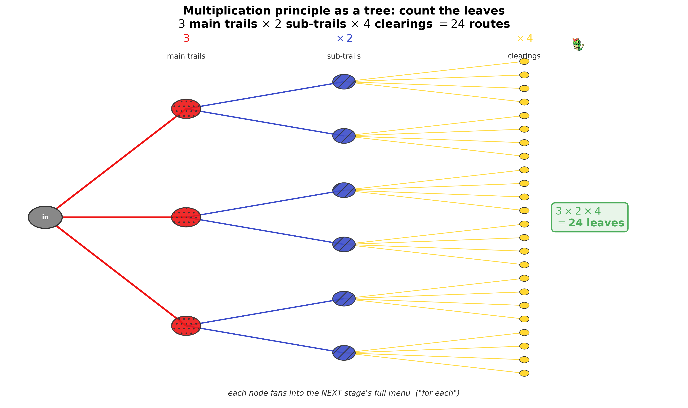
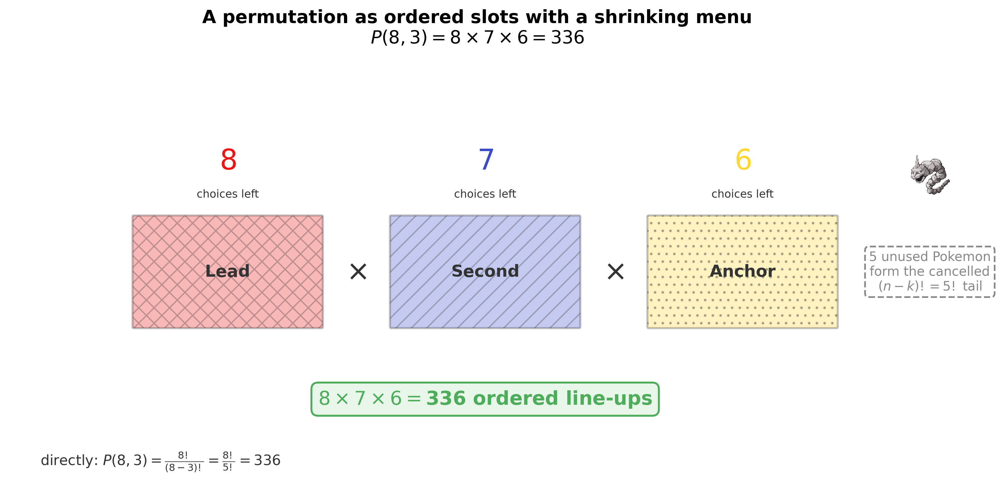
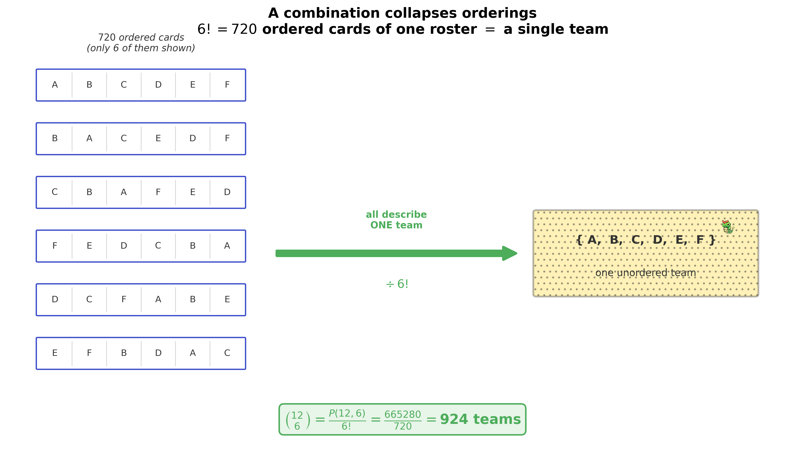
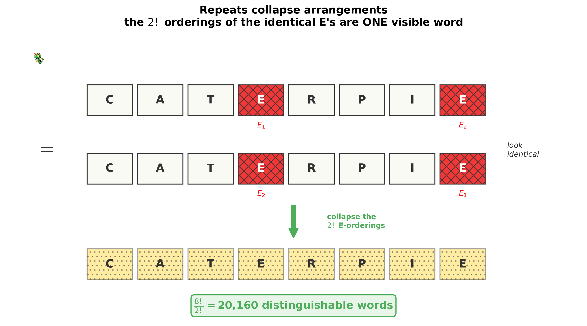
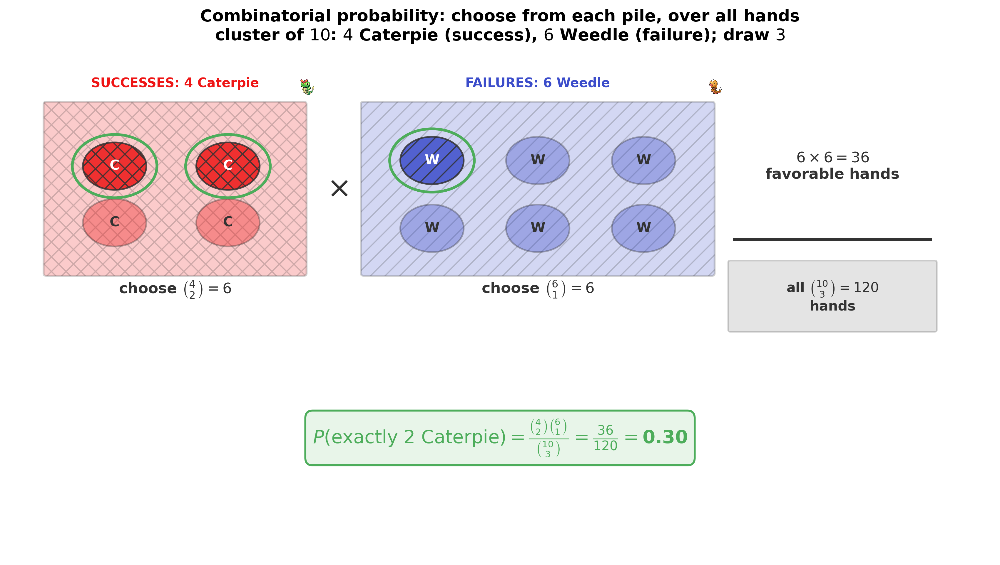

<!--
  file: ch04_counting
  tier: B
  outcomes: 1b
  draft1_source: drafts/chapters_draft1/ch03_pewter_city.md
  maps_to: Viridian Forest → Pewter, Brock
-->

# Counting the Uncountable {.type-rock}

<figure>

<figcaption>Route to a 10 — you have crossed Viridian Forest and reached Pewter City, home of the Boulder Badge and the gym where you learn to <em>count</em>.</figcaption>
</figure>

::: cold-open
**▶ COLD OPEN — EPISODE: "A Forest of a Thousand Faces"**

You step under the canopy of Viridian Forest and the daylight dies to a green dusk. Somewhere overhead a Caterpie rustles; somewhere ahead, a bug-catcher is already reaching for a Poké Ball. Your Pokédex chimes into **Actuary Mode**.

"Three trails fork ahead," Brock says, catching up, his pack rattling with rock samples. "The left branch splits again. Each split ends at a different clearing." He folds his arms. "Pick wrong and you'll wander till nightfall."

You crouch over the dirt and try to count the routes by eye — left, then left-or-right, then this clearing or that one — and your head spins before you reach a dozen. There are too many to list.

At the forest's edge, Brock turns, and his easy grin hardens into the look of a Gym Leader. "Before I hand anyone the Boulder Badge, they prove they can *count* — not guess. My Pokémon can be sent out in any order. A team can be arranged a thousand ways. A trainer who can't count the possibilities can't see the battle." He tosses a smooth stone in his palm. "So here's the toll: tell me *exactly* how many distinct ways you can do the things I ask. No 'about.' No 'roughly.' The number — or no badge."

Pikachu's ears flatten. It feels the trap in the question: the gap between *seems like a lot* and *is exactly this many*. The screen fills with branching paths, team rosters, and clusters of identical Caterpie, all waiting to be enumerated.

You can't list them one by one — there are far too many. So how do you count a thing you can't see all of at once?
:::

## Where You Are — 60-Second Retrieval

You carry no badge yet, but you carry the last chapter's idea. Back in **Chapter 3** you built the **sample space** $S$ — the set of *all* equally likely outcomes — and read a probability straight off it:

$$P(A) = \frac{\text{number of outcomes in } A}{\text{number of outcomes in } S}.$$

That formula has a quiet demand hidden inside it: to use it, you must *count the outcomes in $A$ and the outcomes in $S$.* In tiny examples you listed them by hand. But "how many 6-Pokémon teams from 12 species?" has $924$ outcomes — too many to list. **This chapter is the machinery for counting when listing is impossible.** It is the floor beneath every "equally likely" problem you will ever meet.

::: trainers-tip
**60-SECOND RETRIEVAL — prove you still own the last chapter**

Answer from memory; if any feels shaky, flip back before continuing.

1. A bag holds 4 red and 6 blue lures; you draw one at random. What is $P(\text{red})$? *(Answer: $4/10 = 0.4$.)*
2. If every outcome in $S$ is equally likely, how do you get $P(A)$? *(Answer: count $A$, count $S$, divide.)*
3. What does it mean for two events to be **mutually exclusive**? *(Answer: they can't both happen; their outcome-sets don't overlap.)*

All three instant? You're ready. Any hesitation? The retrieval *is* the lesson — go reclaim it, then come back.
:::

## Oak's Briefing — Learning Outcomes & Test-Out Gate

<figure style="margin:1.5em auto; max-width:160px; text-align:center;">

<figcaption style="font-size:0.85em;">Professor Oak — the formalizer</figcaption>
</figure>

Professor Oak's voice crackles through the Pokédex, calm against the forest gloom.

"Counting, Ash, is the floor beneath all of probability. Every 'equally likely' problem is secretly a counting problem in a costume. There are only a handful of counting *machines* — and the entire art is knowing **which one** a problem is asking for. Master that, and you'll never fear a 'how many ways' question again, and you'll compute combinatorial probabilities in seconds while everyone else is still scribbling lists."

By the end of this chapter you will be able to:

- **Apply** the **fundamental counting principle** to multi-stage choices, and decide when stages *multiply* (and when you *add* instead). *(Outcome 1b.)*
- **Compute permutations** $P(n,k)$ — count ordered arrangements, where rearranging the same items is a *new* outcome. *(Outcome 1b.)*
- **Compute combinations** $\binom{n}{k}$ — count unordered selections, where rearranging the chosen items is the *same* outcome. *(Outcome 1b.)*
- **Count arrangements with repeated items** using the multinomial coefficient $\dfrac{n!}{n_1!\,n_2!\cdots n_r!}$. *(Outcome 1b.)*
- **Turn a count into a probability** under equal likelihood (favorable $\div$ total), seeding the **hypergeometric** model of a later chapter. *(Outcome 1b.)*

> *Exam-weight signpost.* Counting is a **Tier B** topic: it carries real weight in Exam P's General Probability section *and* it is the silent engine behind hypergeometric and combinatorial-probability questions later. The single highest-leverage move in the whole chapter is **telling a combination from a permutation on sight** — roughly four out of five exam counting questions are an unordered, without-replacement choice (a $\binom{n}{k}$) in disguise.

::: concept-gate
**CHAPTER TEST-OUT GATE — Do You Already Own All of Pewter?**

Already fluent? Prove it. Work these five, ~2 minutes each, *with the correct machine*:

1. A 4-digit code allows digits $0$–$9$ in each slot, repeats allowed. How many codes? *(Answer: $10^4 = 10{,}000$.)*
2. From $8$ Pokémon, how many ordered line-ups of $3$? *(Answer: $P(8,3)=336$.)*
3. From $12$ species, how many unordered teams of $6$? *(Answer: $\binom{12}{6}=924$.)*
4. How many distinguishable arrangements of the letters in **CATERPIE** (two E's)? *(Answer: $8!/2!=20{,}160$.)*
5. A cluster of $10$ has $4$ Caterpie and $6$ Weedle; grab $3$ without replacement. $P(\text{exactly }2\text{ Caterpie})$? *(Answer: $\binom{4}{2}\binom{6}{1}/\binom{10}{3}=0.30$.)*

Five for five with the right method? **Skip to the Gym Challenge** and claim the badge. Any miss or hesitation? The teaching below was built exactly for you — and each concept has its *own* skip-gate, so even a partial owner loses no time.
:::

---

Five counting machines build on one another, in increasing difficulty. We teach them **in order**, each with its own "do you already own this?" skip-check, then the full nine-beat lesson, then a Pokédex Entry you can carry into the exam:

1. **The fundamental counting principle** — multiply across stages *(the engine everything else is built from)*
2. **Permutations** — ordered selections, where order makes a new outcome
3. **Combinations** — unordered selections, where order is thrown away
4. **Arrangements with repeats** — the multinomial, when some items are identical
5. **Combinatorial probability** — turn favorable-over-total into a number *(the payoff)*

## Concept 1 — The Fundamental Counting Principle: Multiply Across Stages

::: concept-gate
**DO YOU ALREADY OWN THIS? — The Multiplication Principle**

A forest path forks into $3$ main trails; each main trail splits into $2$ sub-trails; each sub-trail ends at one of $4$ clearings. How many distinct entrance-to-clearing routes are there?

If you instantly answered **$3 \times 2 \times 4 = 24$** (and you'd never write $3+2+4=9$), you own this — **skip to Concept 2**. If you reached for addition, or you're unsure why the stages multiply, this section is for you.
:::

**Beat 1 — The one-sentence idea.** *If a task is a sequence of independent choices, and each choice has its own menu, the number of ways to do the whole task is the menus multiplied together.*

**Beat 2 — Anchor + concrete instance.** This is the engine. Permutations, combinations, the multinomial — every formula ahead is this one rule with bookkeeping bolted on. So we start with Brock's literal forest.

From the forest entrance you pick **1 of 3** main trails. Each main trail then splits into **2** sub-trails, and each sub-trail ends at one of **4** clearings where wild Pokémon gather. *How many distinct entrance-to-clearing routes are there?*

**Beat 3 — Reason through it in plain words.** Don't try to picture all of them at once — build *one* route and watch how many ways each step could have gone. Pick a main trail: $3$ ways. For *each* of those $3$, the sub-trail can go $2$ ways — so after two steps there are $3 \times 2 = 6$ partial routes. For *each* of those $6$, the clearing can be any of $4$ — so there are $6 \times 4 = 24$ complete routes. The word **"for each"** is the whole secret: every earlier choice fans out into the full menu of the next choice.

$$3 \times 2 \times 4 = 24 \text{ routes.}$$

**Beat 4 — Surface and dismantle the tempting wrong idea.** The natural slip is to *add* the menus:

$$3 + 2 + 4 = 9. \qquad\textbf{(wrong)}$$

But $9$ answers a *different* question: "how many trail-pieces are there in total?" — count the main trails *or* the sub-trails *or* the clearings as separate things. That's not what was asked. A *route* is one main trail **and then** one sub-trail **and then** one clearing — three choices that all happen together, not one choice among nine pieces. Here is the rule that keeps you straight: **"and then" (do this stage *and* that stage) multiplies; "either/or" (do this *or* that, one single choice) adds.** Adding the stages throws away every combination.

**Beat 5 — Translate into notation, one glyph at a time.** Suppose the task has $k$ stages (here $k=3$). Call the number of choices at stage $i$ by the symbol $n_i$:

$$n_i \quad \text{read aloud: ``} n\text{-sub-}i\text{''} \;=\; \text{the number of choices available at stage } i.$$

The little subscript $i$ is just a *label* — $n_1$ is the first stage's menu, $n_2$ the second's, and so on (here $n_1=3,\ n_2=2,\ n_3=4$). The total number of ways is every menu multiplied:

$$N = n_1 \times n_2 \times \cdots \times n_k.$$

**Beat 6 — Generalize: derive the formula from the instance.** We didn't assert this — we *built* it. With one stage there are $n_1$ ways. Adding a second stage replaces each of those $n_1$ partial outcomes with $n_2$ continuations, giving $n_1 \times n_2$. Each further stage multiplies the running count by its own menu size for the same "for each" reason. So $N = n_1 n_2 \cdots n_k$ is just the "for each" reasoning written compactly — provided each stage's menu size doesn't depend on *which* earlier choices were made.

**Beat 7 — Ramp the difficulty.**

- *Simplest:* the forest routes, $3 \times 2 \times 4 = 24$.
- *Twist — does the menu shrink?* A $4$-digit lock with digits $0$–$9$ and **repeats allowed** is $10 \times 10 \times 10 \times 10 = 10^4 = 10{,}000$, because each slot still has all $10$ digits. But if **no digit may repeat**, the menu shrinks as you go: $10 \times 9 \times 8 \times 7 = 5040$. The principle still holds — you just feed it the *remaining* menu each stage. (That shrinking menu is exactly the next concept, permutations.)
- *Edge — equal menus:* $k$ stages each with the same $n$ choices give $n^k$. A $5$-question true/false quiz has $2^5 = 32$ answer keys.

**Beat 8 — Picture it.** A tree makes "for each" visible: every node fans into the next stage's full menu, and the number of leaves is the product.

<figure>

<figcaption>The multiplication principle as a tree: each node fans into the next stage's full menu. Count the leaves — $3 \times 2 \times 4 = 24$.</figcaption>
</figure>

**Beat 9 — Consolidate.** You can now take any multi-stage task, identify the menu size at each stage, and multiply — and you know to *add* only when the choice is a single "either/or," never an "and then." This one rule generates every formula that follows.

::: pokedex-entry
**POKÉDEX ENTRY №01 — The Fundamental Counting Principle**

If a task is built from $k$ stages, where stage $i$ can be done in $n_i$ ways *regardless of the earlier choices*, the whole task can be done in

$$N = n_1 \times n_2 \times \cdots \times n_k \text{ ways.}$$

*In plain terms:* a sequence of choices, each with its own menu — multiply the menu sizes. Equal menus ($n$ each, $k$ stages) give $n^k$.

*Recognition cue:* **"first… then…," slots to fill in sequence, "how many ways in total."** "And then" $\to$ **multiply**. A single "either this or that" $\to$ **add**.
:::

## Concept 2 — Permutations: Order Matters, No Repeats

::: concept-gate
**DO YOU ALREADY OWN THIS? — Permutations**

Brock keeps $8$ Pokémon and battles with $3$, *sent out in a definite order*. How many distinct ordered line-ups can he form?

If you wrote **$P(8,3) = 8 \cdot 7 \cdot 6 = 336$** (and can say *why* the factors march down $8, 7, 6$), **skip to Concept 3**. If you wrote $8^3$ or $\binom{8}{3}$, read on.
:::

**Beat 1 — The one-sentence idea.** *To fill $k$ ordered slots from $n$ distinct items with no repeats, multiply the shrinking menu — $n$ choices for the first slot, $n-1$ for the next, and so on.*

**Beat 2 — Anchor + concrete instance.** This is Concept 1 with a *shrinking* menu: each item used is gone, so the next slot has one fewer choice.

"I keep **8** trained Pokémon," Brock says, "but I battle with **3**, sent out in sequence — and the *order* I send them changes everything." A different lead means a different strategy. *How many distinct ordered line-ups of $3$ can Brock form from his $8$ Pokémon?*

**Beat 3 — Reason through it in plain words.** Fill the slots left to right. The **lead** can be any of the $8$. Once it's chosen, that Pokémon is on the field, so the **second** slot has only the $7$ remaining. The **anchor** then has $6$ left. By the multiplication principle, multiply the shrinking menu:

$$8 \times 7 \times 6 = 336 \text{ ordered line-ups.}$$

The menu marches *down* — $8, 7, 6$ — because each pick removes itself from the pool.

**Beat 4 — Surface and dismantle the tempting wrong idea.** Two slips lurk here. First, reusing the full menu:

$$8 \times 8 \times 8 = 512. \qquad\textbf{(wrong — assumes repeats / replacement)}$$

That would be right only if Brock could send the *same* Pokémon to multiple slots — he can't; it's already on the field. Second, and more important, *forgetting that order counts* and writing $\binom{8}{3}=56$. But $56$ counts the **roster** of three; it ignores that lead-vs-anchor is a different battle. Here, order is part of the answer, so $336$, not $56$. (We'll see exactly how those two numbers relate in the next concept.)

**Beat 5 — Translate into notation, one glyph at a time.** First, the **factorial**. For a whole number $n$,

$$n! \quad \text{read aloud: ``}n \text{ factorial''} \;=\; n \times (n-1) \times \cdots \times 2 \times 1,$$

the product of every whole number from $n$ down to $1$ (and by convention $0! = 1$). It is exactly "arrange all $n$ distinct things in a row": $n$ choices, then $n-1$, all the way down. Now the **permutation count** — ordered, without repeats, $k$ from $n$:

$$P(n,k) \quad \text{read aloud: ``the number of permutations of } n \text{ things taken } k \text{ at a time.''}$$

Our line-up was $P(8,3) = 8 \cdot 7 \cdot 6 = 336$.

**Beat 6 — Generalize: derive the formula from the instance.** We multiplied $8 \cdot 7 \cdot 6$ — that's $8!$ with the unused tail $5! = 5\cdot4\cdot3\cdot2\cdot1$ chopped off. Multiply and divide by that tail to write it cleanly:

$$P(8,3) = 8\cdot7\cdot6 = \frac{8\cdot7\cdot6\cdot \cancel{5!}}{\cancel{5!}} = \frac{8!}{5!} = \frac{8!}{(8-3)!}.$$

The same bookkeeping for general $n,k$ gives

$$\boxed{\,P(n,k) = n(n-1)\cdots(n-k+1) = \frac{n!}{(n-k)!}.\,}$$

The denominator $(n-k)!$ is just the part of the factorial you *didn't* use — the items left in the pool after filling all $k$ slots. The special case $k=n$ gives $P(n,n) = n!/0! = n!$: arrange *all* of them.

**Beat 7 — Ramp the difficulty.**

- *Simplest:* the $3$-of-$8$ line-up, $P(8,3)=336$.
- *Full arrangement:* arrange all $6$ Poké Balls on a belt — $P(6,6)=6!=720$.
- *Edge / sanity:* $P(n,1)=n$ (one slot, $n$ choices) and $P(n,0)=1$ (one way to choose nothing — the empty arrangement). Both fall straight out of $n!/(n-k)!$.

**Beat 8 — Picture it.** Think of $k$ labeled slots; write the shrinking menu above each.

<figure>

<figcaption>A permutation as ordered slots with a shrinking menu: $8 \times 7 \times 6 = 336$. The $5$ unused Pokémon are the cancelled $(n-k)! = 5!$ tail.</figcaption>
</figure>

**Beat 9 — Consolidate.** You can now count ordered selections without repeats: fill the slots with a shrinking menu, or compute $n!/(n-k)!$ directly. The trigger is **order matters**.

::: pokedex-entry
**POKÉDEX ENTRY №02 — Permutations (Order Matters, No Repeats)**

$$P(n,k) = \frac{n!}{(n-k)!} = n(n-1)\cdots(n-k+1), \qquad P(n,n)=n!.$$

*In plain terms:* fill $k$ ordered slots from $n$ distinct items, no reuse — the menu shrinks by one each slot.

*Recognition cue:* **"arrange," "line up," "order," "rank 1st/2nd/3rd," "schedule," "seat," "battle order."** If rearranging the chosen items is a *new* outcome, it's a permutation.
:::

## Concept 3 — Combinations: Order Does Not Matter

::: concept-gate
**DO YOU ALREADY OWN THIS? — Combinations**

From $12$ species you must **choose** a $6$-Pokémon team; the order on the team sheet is irrelevant. How many distinct teams?

If you wrote **$\binom{12}{6} = 924$** (and can explain *why you divide $P(12,6)$ by $6!$*), **skip to Concept 4**. If you wrote $P(12,6)=665{,}280$, read on — you counted each team $720$ times.
:::

**Beat 1 — The one-sentence idea.** *A combination is a permutation with the internal ordering thrown away — so you count the ordered selections, then divide out the $k!$ orderings of each chosen group.*

**Beat 2 — Anchor + concrete instance.** This is Concept 2 with one correction: now reshuffling the chosen items is the **same** outcome, so we've over-counted and must divide.

By the time you reach Pewter you've caught **12** distinct species. To register for the Gym you must **choose** which **6** make your team — the order on the sheet doesn't matter, a team is a *set*. *How many distinct teams are there?*

**Beat 3 — Reason through it in plain words.** Pretend for a moment that order *did* matter. Then you'd be filling $6$ ordered slots from $12$: that's $P(12,6) = 12\cdot11\cdot10\cdot9\cdot8\cdot7 = 665{,}280$ ordered cards. But a *team* doesn't care about order — the same six Pokémon listed in any sequence is one team. How many sequences does each team get counted as? Exactly $6!$, the number of ways to arrange six items (Concept 2's $P(6,6)$). So every team was counted $6! = 720$ times. Divide it back out:

$$\frac{P(12,6)}{6!} = \frac{665{,}280}{720} = 924 \text{ teams.}$$

**Beat 4 — Surface and dismantle the tempting wrong idea.** The classic error is stopping at the permutation:

$$P(12,6) = 665{,}280. \qquad\textbf{(wrong — counts each team } 6! \text{ times)}$$

That's the answer to "how many ordered *cards*," not "how many *teams*." {Squirtle, Pikachu, …} in one order is the same team as in any other; the permutation counts all $720$ orderings as distinct. The fix is always the same: **if reshuffling the picked items changes nothing, divide the permutation count by $k!$.**

**Beat 5 — Translate into notation, one glyph at a time.** The **binomial coefficient**:

$$\binom{n}{k} \quad \text{read aloud: ``}n \text{ choose } k\text{''} \;=\; \text{the number of unordered } k\text{-subsets of } n \text{ distinct items.}$$

Read it top-to-bottom as "from $n$, choose $k$." It is *not* a fraction — the stacked $n$ over $k$ inside the parentheses is one symbol meaning "choose."

**Beat 6 — Generalize: derive the formula from the instance.** We divided the ordered count by $k!$. So

$$\binom{n}{k} = \frac{P(n,k)}{k!} = \frac{n!/(n-k)!}{k!} = \boxed{\;\frac{n!}{k!\,(n-k)!}\;}.$$

Read the bottom as a balance sheet: $k!$ removes the ordering *inside* the chosen group, and $(n-k)!$ removes the ordering of the items you *left behind*. Check our case: $\binom{12}{6} = \frac{12!}{6!\,6!} = 924.$ Two identities fall straight out and save real time:

$$\binom{n}{k} = \binom{n}{n-k} \quad(\text{choosing who's *in* = choosing who's *out*}), \qquad \binom{n}{0}=\binom{n}{n}=1.$$

**Beat 7 — Ramp the difficulty.**

- *Simplest:* the $6$-of-$12$ team, $\binom{12}{6}=924$.
- *Symmetry shortcut:* to count $4$-person panels from $12$ you can compute $\binom{12}{4}=495$; note $\binom{12}{4}=\binom{12}{8}$, so always choose the *smaller* bottom to multiply fewer terms.
- *Choose-then-arrange (uniting Concepts 2 and 3):* pick the team **and then** order it. $\binom{12}{6}\cdot 6! = 924 \times 720 = 665{,}280 = P(12,6)$ — the two routes agree, which is exactly the identity $P(n,k)=\binom{n}{k}\,k!$ read forward.

**Beat 8 — Picture it.** The figure shows one unordered team collapsing the $k!$ ordered cards that all describe it.

<figure>

<figcaption>A combination collapses orderings: all $k!=720$ ordered cards of one roster are a single team. Dividing $P(12,6)$ by $6!$ yields $924$.</figcaption>
</figure>

**Beat 9 — Consolidate.** You can now count unordered selections, convert between $P(n,k)$ and $\binom{n}{k}$ via the $\times k!$ / $\div k!$ bridge, and use $\binom{n}{k}=\binom{n}{n-k}$ to compute fewer terms. The trigger is **order does not matter**.

::: pokedex-entry
**POKÉDEX ENTRY №03 — Combinations (Order Doesn't Matter, No Repeats)**

$$\binom{n}{k} = \frac{n!}{k!\,(n-k)!} = \frac{P(n,k)}{k!}, \qquad \binom{n}{k}=\binom{n}{n-k}, \quad \binom{n}{0}=\binom{n}{n}=1.$$

*In plain terms:* a combination is a permutation with the $k!$ internal orderings divided out — a *set*, not a sequence.

*Recognition cue:* **"select," "choose," "a team / committee / hand / sample of $k$," "group."** If reshuffling the chosen items gives the *same* outcome, it's $\binom{n}{k}$.
:::

::: trainers-tip
**TRAINER'S TIP — The $2\times2$ Classifier (pick your machine on sight)**

Before you write a single factorial, drop the problem into this grid:

| | **Order matters** | **Order doesn't matter** |
|---|---|---|
| **Without replacement** | $P(n,k)=\dfrac{n!}{(n-k)!}$ | $\dbinom{n}{k}=\dfrac{n!}{k!\,(n-k)!}$ |
| **With replacement** | $n^k$ | $\dbinom{n+k-1}{k}$ (stars & bars) |

Two questions place any problem: *does order matter?* and *can items repeat?* The lower-right cell (with-replacement, unordered) is rare on Exam P; the upper-right cell — **unordered, without replacement, a $\binom{n}{k}$** — is where roughly four of five counting questions live. When in doubt, ask the next tip's question.
:::

## Concept 4 — Arrangements with Repeats: The Multinomial

::: concept-gate
**DO YOU ALREADY OWN THIS? — Arrangements with Repeats**

How many *distinguishable* arrangements of the letters in **CATERPIE** are there? (Eight letters: C, A, T, E, R, P, I, E — note the **two E's**.)

If you wrote **$\dfrac{8!}{2!} = 20{,}160$** (and can say *why* you divide by $2!$), **skip to Concept 5**. If you wrote $8! = 40{,}320$, read on — you counted every word twice.
:::

**Beat 1 — The one-sentence idea.** *Start from all $n!$ orderings as if every item were distinct, then divide out the rearrangements within each block of identical items — because shuffling identical things changes nothing you can see.*

**Beat 2 — Anchor + concrete instance.** This is Concept 3's "divide out what you can't tell apart," applied to *repeated items* instead of unordered groups.

The Pokédex wants to scramble the letters of **CATERPIE** into a registration cipher. *How many distinguishable letter-arrangements exist?* The catch: there are **two E's**, and the two E's look identical.

**Beat 3 — Reason through it in plain words.** Pretend the two E's are secretly different — paint one $\text{E}_1$ and one $\text{E}_2$. Then all eight letters are distinct and there are $8! = 40{,}320$ arrangements. But you *can't* actually see the paint: $\text{E}_1\text{E}_2$ and $\text{E}_2\text{E}_1$ in the same positions are the **same visible word**. The two E's can be ordered $2! = 2$ ways, and those two ways are indistinguishable. So every real arrangement was counted twice. Divide it out:

$$\frac{8!}{2!} = \frac{40{,}320}{2} = 20{,}160 \text{ distinguishable arrangements.}$$

**Beat 4 — Surface and dismantle the tempting wrong idea.** The slip is to forget the repeat:

$$8! = 40{,}320. \qquad\textbf{(wrong — double-counts every word)}$$

That treats the two E's as if you could tell them apart, so it lists each visible word twice (once per ordering of the E's). The rule generalizes: **every block of identical items inflates the count by the factorial of its size — divide each block back out.**

**Beat 5 — Translate into notation, one glyph at a time.** Suppose $n$ items split into $r$ types: $n_1$ identical of type 1, $n_2$ of type 2, …, $n_r$ of type $r$, with $n_1 + n_2 + \cdots + n_r = n$. The **multinomial coefficient**:

$$\binom{n}{n_1,\,n_2,\,\ldots,\,n_r} \quad \text{read aloud: ``}n \text{ choose } n_1, n_2, \ldots, n_r\text{''} \;=\; \frac{n!}{n_1!\,n_2!\cdots n_r!}.$$

For CATERPIE, the types are "two E's" and six singletons: $\dfrac{8!}{2!\,1!\,1!\,1!\,1!\,1!\,1!} = \dfrac{8!}{2!}$, since $1!=1$ contributes nothing.

**Beat 6 — Generalize: derive the formula from the instance.** All $n!$ orderings over-count by exactly the rearrangements *within* each identical block. Type $i$ can be internally shuffled $n_i!$ ways with no visible change, and these inflations multiply across types (Concept 1), so the total over-count factor is $n_1!\,n_2!\cdots n_r!$. Divide it out:

$$\boxed{\;\binom{n}{n_1,\ldots,n_r} = \frac{n!}{n_1!\,n_2!\cdots n_r!}.\;}$$

Notice the two-type case $\dfrac{n!}{k!\,(n-k)!}$ is exactly $\binom{n}{k}$ — the binomial coefficient is the multinomial with just two blocks ("chosen" and "not chosen"). The multinomial is the same idea, generalized.

**Beat 7 — Ramp the difficulty.**

- *Simplest:* one repeated letter — CATERPIE, $8!/2! = 20{,}160$.
- *Several blocks:* line up $3$ identical Water Stones, $2$ identical Thunder Stones, $1$ Leaf Stone — $\dfrac{6!}{3!\,2!\,1!} = \dfrac{720}{12} = 60$ ways.
- *Surprising twist — lattice paths:* a shortest grid walk that is $4$ blocks East and $3$ blocks North is just an arrangement of $4$ E's and $3$ N's: $\dfrac{7!}{4!\,3!} = \binom{7}{3} = 35$ paths. "Choose which $3$ of the $7$ steps are North" — a multinomial *is* a combination in disguise.

**Beat 8 — Picture it.** The figure shows the $2!$ identical-E orderings collapsing to one visible word.

<figure>

<figcaption>Repeats collapse arrangements: the $2!$ orderings of the identical E's are one visible word, so $8!/2! = 20{,}160$.</figcaption>
</figure>

**Beat 9 — Consolidate.** You can now count distinguishable arrangements when some items repeat: take $n!$, then divide by the factorial of each identical block — and you recognize lattice-path problems as the same machine.

::: pokedex-entry
**POKÉDEX ENTRY №04 — Arrangements with Repeats (Multinomial)**

For $n$ items of which $n_1$ are alike of type 1, …, $n_r$ alike of type $r$ ($n_1+\cdots+n_r=n$):

$$\binom{n}{n_1,\ldots,n_r} = \frac{n!}{n_1!\,n_2!\cdots n_r!}.$$

*In plain terms:* all $n!$ orderings, divided by the factorial of each identical block (shuffling identical items changes nothing). With two blocks this *is* $\binom{n}{k}$.

*Recognition cue:* **"distinguishable arrangements," repeated identical items, "split into groups of sizes…," lattice / grid-path problems.**
:::

## Concept 5 — Combinatorial Probability: Favorable Over Total

::: concept-gate
**DO YOU ALREADY OWN THIS? — Combinatorial Probability**

A tree cluster holds $10$ identical-looking grass Pokémon: $4$ Caterpie and $6$ Weedle. You blindly grab $3$ at once (without replacement). What is $P(\text{exactly } 2 \text{ Caterpie})$?

If you wrote **$\dfrac{\binom{4}{2}\binom{6}{1}}{\binom{10}{3}} = \dfrac{6\cdot6}{120} = 0.30$**, you own this chapter end to end — **skip to the Gym Battle** for one expert rep, or straight to the **Gym Challenge** for the badge. If you reached for a binomial $\binom{3}{2}(0.4)^2(0.6)$, read on — that silently assumes replacement.
:::

**Beat 1 — The one-sentence idea.** *When every outcome is equally likely, a probability is just a count divided by a count: arrange the favorable hands over all possible hands, using the combination machine to do the counting.*

**Beat 2 — Anchor + concrete instance.** This closes the loop with Chapter 3's $P(A)=\#A/\#S$ — except now you *count* $\#A$ and $\#S$ with $\binom{n}{k}$ instead of listing them.

A cluster on a tree holds **10** identical-looking grass Pokémon: **4** are Caterpie and **6** are Weedle. You blindly grab **3** at once (without replacement). *What is the probability you grabbed exactly $2$ Caterpie?*

<figure style="margin:0; text-align:center;">

<figcaption style="font-size:0.8em;">#010 Caterpie (4 in the cluster)</figcaption>
</figure>
<figure style="margin:0; text-align:center;">

<figcaption style="font-size:0.8em;">#013 Weedle (6 in the cluster)</figcaption>
</figure>

**Beat 3 — Reason through it in plain words.** Every set of $3$ Pokémon you could grab is equally likely, so the probability is (number of favorable grabs) $\div$ (number of total grabs). 

- **Total grabs:** any $3$ of the $10$, order irrelevant — $\binom{10}{3} = 120$.
- **Favorable grabs:** exactly $2$ Caterpie *and* exactly $1$ Weedle. Choose $2$ of the $4$ Caterpie — $\binom{4}{2}=6$ ways — **and then** $1$ of the $6$ Weedle — $\binom{6}{1}=6$ ways. By the multiplication principle (Concept 1), $6 \times 6 = 36$ favorable grabs.

$$P(\text{exactly } 2 \text{ Caterpie}) = \frac{\binom{4}{2}\binom{6}{1}}{\binom{10}{3}} = \frac{6 \cdot 6}{120} = \frac{36}{120} = 0.30.$$

**Beat 4 — Surface and dismantle the tempting wrong idea.** The seductive slip is to treat the three grabs as independent trials with a fixed $40\%$ Caterpie rate — the **binomial**:

$$\binom{3}{2}(0.4)^2(0.6) = 3(0.16)(0.6) = 0.288. \qquad\textbf{(wrong — assumes replacement)}$$

But you grabbed *without replacement*: pulling a Caterpie *depletes* the cluster, so the chance the next is a Caterpie drops. The fraction of Caterpie isn't a fixed $0.4$ across draws — it changes with every grab. The combination count handles that automatically by counting actual hands. (The binomial $0.288$ and the correct $0.30$ are close here only because the cluster is small; the gap widens fast as draws pile up.)

**Beat 5 — Translate into notation, one glyph at a time.** Generalize the cluster. Let the population be $N$ items containing $K$ "successes" (Caterpie) and $N-K$ "failures" (Weedle); draw $k$ without replacement and ask for exactly $x$ successes. The favorable count is "choose your successes **and** choose your failures":

$$\underbrace{\binom{K}{x}}_{\text{choose the } x \text{ successes}} \cdot \underbrace{\binom{N-K}{k-x}}_{\text{choose the } k-x \text{ failures}} \quad\text{over}\quad \underbrace{\binom{N}{k}}_{\text{all hands}}.$$

Read $\binom{N-K}{k-x}$ aloud: "from the $N-K$ failures, choose the $k-x$ that fill the rest of the hand."

**Beat 6 — Generalize: derive the formula.** Every favorable hand is *one* choice of $x$ successes paired with *one* choice of $k-x$ failures, and those two choices are independent stages — multiply (Concept 1). All hands are $\binom{N}{k}$, equally likely. So

$$\boxed{\;P(\text{exactly } x \text{ successes}) = \frac{\binom{K}{x}\binom{N-K}{k-x}}{\binom{N}{k}}.\;}$$

This is the **hypergeometric** probability — the model for *any* without-replacement draw counted by exact type. You will meet it again, by name, as a full distribution in a later chapter; here it is simply favorable-over-total.

**Beat 7 — Ramp the difficulty.**

- *Simplest:* exactly $2$ Caterpie, $0.30$.
- *"At least / at most" — sum the cases:* there is no single $\binom{}{}$ for "$\ge 2$." Add the disjoint exact-counts, or complement. For the cluster, $P(\ge 2 \text{ Caterpie}) = P(2)+P(3) = \tfrac{36}{120}+\tfrac{\binom{4}{3}\binom{6}{0}}{120} = \tfrac{36+4}{120} = \tfrac{40}{120} = \tfrac13$.
- *Sanity boundary:* the four exact-counts must sum to $1$ — $\dfrac{\binom{6}{3}+\binom41\binom62+\binom42\binom61+\binom43}{120} = \dfrac{20+60+36+4}{120} = 1$. If your exact-counts don't sum to $\binom{N}{k}$, you miscounted.

**Beat 8 — Picture it.** The figure splits the cluster into the "success" pile and the "failure" pile, choosing from each.

<figure>

<figcaption>Combinatorial probability: choose $x$ from the successes $\times$ choose $k-x$ from the failures, over all hands — $\dfrac{6\cdot6}{120}=0.30$.</figcaption>
</figure>

**Beat 9 — Consolidate.** You can now turn any equal-likelihood, without-replacement count into a probability: favorable hands over total hands, with the $\binom{K}{x}\binom{N-K}{k-x}/\binom{N}{k}$ form for exact type-counts, and "at least/at most" handled by summing cases or complementing. This is the payoff the whole chapter was building toward.

::: pokedex-entry
**POKÉDEX ENTRY №05 — Combinatorial Probability (Equal Likelihood)**

For equally likely outcomes, $P(A) = \dfrac{\#A}{\#S} = \dfrac{\text{favorable count}}{\text{total count}}$. For a without-replacement draw of $k$ from $N$ items containing $K$ successes,

$$P(\text{exactly } x \text{ successes}) = \frac{\binom{K}{x}\binom{N-K}{k-x}}{\binom{N}{k}}.$$

*In plain terms:* count the good hands, count all hands, divide. "Choose your successes **and** your failures, over all possible hands." This is the **hypergeometric** seed.

*Recognition cue:* **"drawn at random," "all equally likely," "without replacement," "exactly / at least / at most $x$ of a type."** Count favorable over total; sum cases (or complement) for "at least / at most."
:::

## Worked Examples — Faded Guidance

<figure style="margin:1.5em auto; max-width:160px; text-align:center;">

<figcaption style="font-size:0.85em;">Brock — Pewter City Gym Leader, your counting mentor</figcaption>
</figure>

Five examples, fading from fully narrated to exam-speed. The first leads with the **Professor's Path** (the rigorous *why*) before the **Trainer's Path** (the fast *how*), because telling a combination from a permutation is the load-bearing skill.

### Worked Example 4.1 — Building a Team of Six (full narration; understanding-first)

**ARCHETYPE:** *Choose-then-arrange — combination, then the $P(n,k)=\binom{n}{k}\,k!$ bridge.*

**Setup.** From $12$ caught species: (a) how many distinct **teams** of $6$ (order irrelevant), and (b) how many distinct **ordered cards** of those $6$?

**Step 1 — Identify (which machine, and does order matter?).** Part (a): "team," order irrelevant $\to$ combination, $\binom{12}{6}$. Part (b): "ordered card" $\to$ arrange the chosen $6$, an extra $6!$, or equivalently $P(12,6)$ directly. The whole point is watching one number turn into the other.

**Step 2 — Professor's Path (the why).** A *team* is a set: reshuffling its six members is the same team. An *ordered card* distinguishes those reshuffles. Each team corresponds to exactly $6!$ ordered cards (the arrangements of its six members, Concept 2). So
$$\text{(ordered cards)} = \text{(teams)} \times 6! \quad\Longrightarrow\quad \binom{12}{6}\cdot 6! = P(12,6).$$
That *is* the identity $\binom{n}{k}\,k! = P(n,k)$ — choosing-then-arranging and arranging-directly are the same count, partitioned two ways.

**Step 3 — Trainer's Path (the fast how).**
$$\text{(a)}\;\; \binom{12}{6} = \frac{12!}{6!\,6!} = 924. \qquad \text{(b)}\;\; 924 \times 6! = 924 \times 720 = 665{,}280 = P(12,6).$$

**Step 4 — Check & pitfall.** $\binom{12}{6}=924$ is the *central* (largest) binomial coefficient for $n=12$, a good sanity check. **Pitfall:** multiplying $\binom{12}{6}$ by $12!$ instead of $6!$ — you arrange only the *chosen* six, not all twelve. *(Back-ref: Entries №02, №03.)*

### Worked Example 4.2 — Brock's Battle Order (partial guidance)

**ARCHETYPE:** *Ordered selection without replacement — permutation $P(n,k)$.*

**Setup.** Brock keeps $8$ Pokémon and battles with $3$, sent out in order. How many distinct ordered line-ups?

**Identify.** Three ordered battle slots, no reuse, **order matters** (lead vs. anchor differ). Permutation. *Your move: fill the shrinking menu.*

**Slot by slot (Concept 1 with a shrinking menu):**
$$P(8,3) = \underbrace{8}_{\text{lead}} \times \underbrace{7}_{\text{second}} \times \underbrace{6}_{\text{anchor}} = \frac{8!}{5!} = 336.$$
On the TI-30XS: `8` → `prb` → `nPr` → `3` → `=` gives `336`.

**Check & pitfall.** $P(8,3)$ should exceed the unordered $\binom{8}{3}=56$ by exactly $3!=6$, and $56\times6=336$ ✓. **Pitfall:** using $\binom{8}{3}$ — that counts the *roster*, ignoring send-out order. *(Back-ref: Entry №02.)*

### Worked Example 4.3 — The Caterpie Cluster (light guidance)

**ARCHETYPE:** *Without-replacement exact type-count — combinatorial / hypergeometric probability.*

**Setup.** Cluster of $10$: $4$ Caterpie, $6$ Weedle. Grab $3$ without replacement. Find (a) $P(\text{exactly }2\text{ Caterpie})$ and (b) $P(\text{at least }2\text{ Caterpie})$.

**(a)** Favorable = choose $2$ of $4$ Caterpie **and** $1$ of $6$ Weedle, over all $3$-of-$10$ hands:
$$P(2) = \frac{\binom{4}{2}\binom{6}{1}}{\binom{10}{3}} = \frac{6\cdot6}{120} = 0.30.$$

**(b)** "At least $2$" = exact-$2$ plus exact-$3$:
$$P(\ge2) = P(2) + P(3) = \frac{36}{120} + \frac{\binom{4}{3}\binom{6}{0}}{120} = \frac{36+4}{120} = \frac{40}{120} = \frac{1}{3} \approx 0.333.$$

**Check & pitfall.** The four counts sum to the whole: $\tfrac{20+60+36+4}{120}=1$ ✓. **Pitfall:** modelling this **with** replacement (binomial) — wrong model, since grabbing a Caterpie depletes the cluster. *(Back-ref: Entry №05.)*

### Worked Example 4.4 — Arranging "CATERPIE" (exam speed)

**ARCHETYPE:** *Arrangement with a repeated element — multinomial.*

**Setup.** Distinguishable arrangements of the $8$ letters in **CATERPIE** (two E's)?

<figure style="margin:1em auto; max-width:120px; text-align:center;">

<figcaption style="font-size:0.8em;"><strong>#010 Caterpie</strong> — eight letters, two of them E</figcaption>
</figure>

$$\frac{8!}{2!} = \frac{40{,}320}{2} = 20{,}160.$$

**Check & pitfall.** All distinct would be $8!$; the two identical E's collapse each pair to one, so divide by $2!$. **Pitfall:** reporting $40{,}320$ — that double-counts every word by swapping indistinguishable E's. *(Back-ref: Entry №04.)*

### Worked Example 4.5 — The Forest Lock (exam speed)

**ARCHETYPE:** *Multi-stage choice — fundamental counting principle, with vs. without repeats.*

**Setup.** A forest gate has $4$ dial positions, each showing a digit $0$–$9$. How many codes (a) if repeats are allowed, (b) if no digit may repeat?

$$\text{(a)}\;\; 10^4 = 10{,}000. \qquad \text{(b)}\;\; 10 \times 9 \times 8 \times 7 = P(10,4) = 5040.$$

**Check & pitfall.** Without repeats must be *fewer* than with repeats, and $5040 < 10{,}000$ ✓. **Pitfall:** writing $10^4$ when the problem forbids repeats (or $P(10,4)$ when it allows them) — read the replacement condition first. *(Back-ref: Entries №01, №02.)*

## Trainer's Tips

::: trainers-tip
**TRAINER'S TIP — The "would reshuffling change the answer?" test**

When you can't tell a permutation from a combination, ask one question: *if I rearrange the items I picked, is that a new outcome?* **Yes** $\to$ permutation ($P(n,k)$ or $n!$). **No** $\to$ combination ($\binom{n}{k}$). "Battle order," "podium," "PIN," "schedule" = yes. "Team," "hand," "committee," "sample" = no. This one question resolves the great majority of counting questions before you write anything.
:::

::: trainers-tip
**TRAINER'S TIP — nCr / nPr keystrokes (TI-30XS MultiView)**

For $\binom{n}{k}$: type $n$, press `prb`, select `nCr`, type $k$, press `=`. For $P(n,k)$: same path, select `nPr`. Example: `12` `prb` `nCr` `6` `=` → `924`. For a combinatorial probability, compute numerator and denominator separately and store the denominator with `sto→` to avoid retyping and rounding drift.
:::

::: trainers-tip
**TRAINER'S TIP — "At least / at most" = sum the cases (or complement)**

There is no single binomial coefficient for "$\ge 2$" or "$\le 1$." Either **add the disjoint exact-counts**, or take **$1$ minus the complement** — whichever has fewer terms. "At least $1$" is almost always fastest as $1 - P(\text{none})$. And remember: your exact-counts across all type-counts must sum to $\binom{N}{k}$ — a free error check.
:::

## Team Rocket's Trap

::: team-rocket
**TRANSMISSION INTERCEPTED — Team Rocket's Trap**

"Easy, twoirps!" James crows, spreading a blueprint. "We pick **3** Pokémon from our stash of **6** to ambush the brat. So the number of evil schemes is $P(6,3) = 6\cdot5\cdot4 = 120$! A hundred and twenty plots!"

"A hundred and twenty?!" Meowth's eyes gleam. "We're geniuses!"

Jessie frowns. "But James — Weezing-then-Arbok-then-Lickitung is the *same ambush squad* as Lickitung-then-Arbok-then-Weezing. They all attack at once. We just counted each squad six times over."

James's grin curdles.

**Where it fails:** James used a **permutation** for an **unordered** choice. A simultaneous ambush squad is a *set*, not a sequence — order doesn't matter, so reshuffling the three is the *same* plot. Their "$120$ schemes" are really $\binom{6}{3} = 20$; they multiplied by the $3! = 6$ orderings of a group whose order is irrelevant. The fix is the whole of Concept 3: if rearranging the chosen items changes nothing, use $\binom{n}{k}$, not $P(n,k)$ — divide the permutation count by $k!$. (This is the single most common counting error on the exam, and it cost Team Rocket a factor of six.)
:::

## From Kanto to the Real World

::: kanto-realworld
**⬛ FROM KANTO TO THE REAL WORLD**

Counting is the skeleton of **risk classification**.

When an auto insurer prices a policy, it sorts each driver into a **rating cell** defined by a *combination* of factors — age band $\times$ territory $\times$ vehicle class $\times$ prior-claims tier. Counting how many distinct cells a model produces is a pure fundamental-counting-principle calculation: multiply the number of levels in each factor. That count tells the actuary how *thinly* the data is spread — if six factors with a handful of levels each produce thousands of cells, many cells will hold too few policies to be credible, and the model must be coarsened. Multiplication across stages literally sizes the rating plan.

The same combination machine prices **coincidence risk**: the astronomically small odds behind a lottery jackpot ($1/\binom{49}{6}$-style counts), or a reinsurer's estimate of "two catastrophes striking the same county in one season," are favorable-over-total counts exactly like the Caterpie cluster.

*Series bridge:* the rating-cell count returns in **CAS Exam 5** (ratemaking) and in the design matrices of the **predictive-analytics** exams; the without-replacement count you built here is the **hypergeometric distribution**, which reappears by name when we study discrete distributions.

*Transfer check:* could you solve this with **no Pokémon in it**? "An urn holds $4$ red and $6$ white balls; draw $3$ without replacement — find $P(\text{exactly } 2 \text{ red})$." Same machine, same $0.30$. If you can do that, the skill has transferred.
:::

## The Gym Battle — Boulder Badge Capstone

<figure style="margin:1.5em auto; max-width:160px; text-align:center;">

<figcaption style="font-size:0.85em;">Brock's Rock-type Gym — the Boulder Badge challenge</figcaption>
</figure>

**Brock's Challenge.** "One question for the Boulder Badge, Ash — and it's four counts in one. Count, don't guess."

> From a pool of **5 Rock-type trainers** and **7 non-Rock trainers** ($12$ distinct people), Brock forms a **panel of 4**.
>
> **(a)** How many distinct panels are possible?
> **(b)** How many panels contain **at least 2** Rock-type trainers?
> **(c)** If the panel is drawn *at random* from the $12$, what is $P(\text{exactly 2 Rock-types})$?
> **(d)** Once a $4$-person panel is chosen, in how many ways can they be seated in $4$ distinct chairs (Lead, Second, Third, Anchor)?

**ARCHETYPE:** *Integrative — combination counting, "at least" by casework, combinatorial probability, and choose-then-seat.*

**Step 1 — Identify each part.** (a) unordered choice of $4$ from $12$ $\to \binom{12}{4}$. (b) "at least $2$ of $5$ Rock" $\to$ sum the favorable Rock-counts $\{2,3,4\}$ with $\binom{K}{x}\binom{N-K}{k-x}$, or complement. (c) divide the exact-$2$ count by $\binom{12}{4}$. (d) seat the chosen $4$ $\to 4!$.

**Step 2 — Trainer's Path.**

**(a)** Total panels:
$$\binom{12}{4} = \frac{12\cdot11\cdot10\cdot9}{4!} = \frac{11{,}880}{24} = 495.$$

**(b)** "At least $2$ Rock" = exactly $2$, $3$, or $4$ Rock (rest from the $7$ non-Rock):
$$\binom{5}{2}\binom{7}{2} + \binom{5}{3}\binom{7}{1} + \binom{5}{4}\binom{7}{0} = (10)(21)+(10)(7)+(5)(1) = 210+70+5 = 285.$$
*Faster by complement* — total minus ($0$ Rock) minus ($1$ Rock):
$$495 - \binom{5}{0}\binom{7}{4} - \binom{5}{1}\binom{7}{3} = 495 - 35 - 5\cdot35 = 495 - 35 - 175 = 285. \;\checkmark$$

**(c)** Probability of exactly $2$ Rock under random draw:
$$P(\text{exactly 2 Rock}) = \frac{\binom{5}{2}\binom{7}{2}}{\binom{12}{4}} = \frac{(10)(21)}{495} = \frac{210}{495} = \frac{14}{33} \approx 0.4242.$$

**(d)** Seat the chosen $4$ in $4$ labeled chairs:
$$4! = 24.$$

**Step 3 — Professor's Path (cross-check on (b)).** The full Rock-count distribution must total $\binom{12}{4}=495$:
$$\sum_{x=0}^{4}\binom{5}{x}\binom{7}{4-x} = 35 + 175 + 210 + 70 + 5 = 495. \;\checkmark$$
"At least $2$" is the last three terms, $210+70+5 = 285$ — the Trainer's Path confirmed.

**Step 4 — Check, verdict & the pitfalls Brock is testing.** Every probability sits in $[0,1]$, and the counts in (b)/(c) are bounded by $495$ ✓. **Two pitfalls:** in (b), there is no single $\binom{}{}$ for "$\ge 2$" — you must sum disjoint cases or complement; and in (d), seating only the *four* chosen panelists means $4!$, not $12!$ or $4^4$.

> "You counted," Brock says, unclipping a stone-gray badge. "You didn't guess. The Boulder Badge is yours."

<figure style="margin:1.5em auto; max-width:180px; text-align:center;">

<figcaption style="font-size:0.85em;"><strong>#095 Onix</strong> — Brock's anchor</figcaption>
</figure>

## The Gym Challenge — Problem Set

::: problem-set
**TEST-OUT INSTRUCTIONS.** Work this set timed (~5 min/problem), then check the **Answer Key** below. Hit the mastery bar (**80%+ with correct method**) and you may move on. Miss it, and the forest is waiting. Problems are listed first; full worked solutions follow afterward (never interleaved). Markers: 🔴 Poké Ball = routine method · 🟡 routine-with-a-twist · 🔵 stretch.

### Route Trainers (mechanics)

**C4.1.** 🔴 The forest gate's lock has $4$ dial positions, each an independent digit $0$–$9$ with repeats allowed. How many distinct codes must you be prepared to try?

**C4.2.** 🔴 You've caught $7$ distinct Pokémon and display $3$ of them left-to-right in a photo for Professor Oak (left-to-right order is part of the picture). How many distinct photos?

**C4.3.** 🔴 From the same $7$ caught Pokémon, you select a $3$-Pokémon team for a battle (order on the team sheet is irrelevant). How many distinct teams?

**C4.4.** 🔴 How many distinguishable arrangements of the letters in **WEEDLE** are there? (Note the repeated letter.)

**C4.5.** 🟡 Misty packs $3$ identical Water Stones, $2$ identical Thunder Stones, and $1$ Leaf Stone into a row of $6$ slots. How many distinguishable line-ups?

**C4.6.** 🔴 A Poké Ball belt has $6$ distinct clips. In how many ways can you arrange all $6$ of your distinct Poké Balls along the belt?

### Gym Battles (true SOA difficulty)

**C4.7.** 🟡 A cluster of $9$ grass Pokémon holds $4$ Oddish and $5$ Bellsprout. You scoop $3$ at random without replacement. Find $P(\text{exactly 1 Oddish})$.

**C4.8.** 🟡 Brock fields $9$ Pokémon and must choose $4$ to battle, then assign them to $4$ *distinct* positions (Lead, Second, Third, Anchor). In how many ways can he both choose and assign?

**C4.9.** 🟡 A study group of $10$ trainers — $6$ Boulder-Badge holders and $4$ without — randomly selects a $3$-trainer panel. Find $P(\text{at least 1 holder})$ using the complement.

**C4.10.** 🟡 You walk a grid from camp (bottom-left) to Pewter (top-right) taking only steps East or North. The grid is $4$ blocks East by $3$ blocks North. How many distinct shortest paths? *(Each path is an arrangement of $4$ E's and $3$ N's.)*

**C4.11.** 🟡 From $5$ Fire, $4$ Water, and $3$ Grass distinct Pokémon ($12$ total), you assemble a team of $5$ with **exactly** $2$ Fire, $2$ Water, $1$ Grass. How many such teams?

**C4.12.** 🟡 A Game Corner lock uses a $5$-symbol passcode from $8$ distinct symbols, no symbol repeated, order matters. What fraction of all such passcodes begin with a **specific** chosen symbol?

**C4.13.** 🔵 Ten distinct trainers, including you and Gary, are randomly seated in a row of $10$ chairs. Find $P(\text{you and Gary sit next to each other})$.

### Elite Challenge (integrative / stretch)

**C4.14.** 🔵 A box holds $13$ Poké Balls: $3$ Master, $4$ Ultra, $6$ Great. Draw $5$ at random without replacement. Find $P(\text{at least 2 Master})$ and $P(\text{at most 1 Master})$, and confirm they sum to $1$.

**C4.15.** 🔵 From $6$ Rock-type and $6$ non-Rock distinct trainers ($12$ total), a $4$-person squad is chosen at random and seated in $4$ labeled chairs. **(a)** How many seated arrangements in total? **(b)** $P(\text{all 4 chairs filled by Rock-types})$? **(c)** $P(\text{the squad contains exactly 2 Rock-types})$ (seating irrelevant for (c)).
:::

## Answer Key

::: answer-key
**Full worked solution per problem, archetype-labeled and back-referenced to the Pokédex Entry used. A quick-answer table closes the section.**

**C4.1** — *With-replacement ordered count (Entry №01).* Four independent dials, $10$ choices each, repeats allowed:
$$10 \times 10 \times 10 \times 10 = 10^4 = 10{,}000 \text{ codes.}$$

**C4.2** — *Ordered selection without replacement (Entry №02).*
$$P(7,3) = 7\cdot6\cdot5 = 210 \text{ photos.}$$

**C4.3** — *Unordered selection (Entry №03).*
$$\binom{7}{3} = \frac{7\cdot6\cdot5}{3!} = \frac{210}{6} = 35 \text{ teams.}$$
(Note $35 = P(7,3)/3!$ — the same scene as C4.2 with order discarded.)

**C4.4** — *Arrangement with repeats (Entry №04).* WEEDLE has $6$ letters with **E repeated $3$ times** (W, E, E, D, L, E):
$$\frac{6!}{3!} = \frac{720}{6} = 120 \text{ distinguishable arrangements.}$$

**C4.5** — *Multinomial arrangement (Entry №04).* Six items in blocks of sizes $3, 2, 1$:
$$\binom{6}{3,2,1} = \frac{6!}{3!\,2!\,1!} = \frac{720}{6\cdot2\cdot1} = 60 \text{ ways.}$$

**C4.6** — *Full arrangement, $k=n$ (Entry №02).*
$$P(6,6) = 6! = 720 \text{ ways.}$$

**C4.7** — *Without-replacement exact count (Entry №05).* Favorable = $1$ of $4$ Oddish and $2$ of $5$ Bellsprout, over all $3$-of-$9$ draws:
$$P(\text{1 Oddish}) = \frac{\binom{4}{1}\binom{5}{2}}{\binom{9}{3}} = \frac{4\cdot10}{84} = \frac{40}{84} = \frac{10}{21} \approx 0.4762.$$

**C4.8** — *Choose-then-arrange / ordered selection (Entries №02, №03).*
$$\binom{9}{4}\cdot 4! = 126 \cdot 24 = 3024 = P(9,4) = 9\cdot8\cdot7\cdot6. \;\checkmark$$

**C4.9** — *"At least one" via complement (Entries №03, №05).* Complement = panel of $3$ chosen entirely from the $4$ non-holders:
$$P(\text{at least 1 holder}) = 1 - \frac{\binom{4}{3}}{\binom{10}{3}} = 1 - \frac{4}{120} = 1 - \frac{1}{30} = \frac{29}{30} \approx 0.9667.$$

**C4.10** — *Lattice path = multinomial (Entry №04).* Each path is a sequence of $4$ E's and $3$ N's:
$$\frac{7!}{4!\,3!} = \binom{7}{3} = 35 \text{ paths.}$$

**C4.11** — *Independent group choices, multiply combinations (Entries №01, №03).*
$$\binom{5}{2}\binom{4}{2}\binom{3}{1} = 10 \cdot 6 \cdot 3 = 180 \text{ teams.}$$

**C4.12** — *Ordered without replacement + favorable fraction (Entries №02, №05).* Total $= P(8,5)$; fixing the first symbol leaves $P(7,4)$:
$$\frac{P(7,4)}{P(8,5)} = \frac{7\cdot6\cdot5\cdot4}{8\cdot7\cdot6\cdot5\cdot4} = \frac{1}{8} = 0.125.$$
(Each of the $8$ symbols is equally likely to lead, so the fraction is $1/8$.)

**C4.13** — *Arrangements with a "glued block" (Entries №02, №05).* Total seatings $= 10!$. Treat you-and-Gary as one block ($2$ internal orders), arranging $9$ units:
$$P = \frac{2\cdot 9!}{10!} = \frac{2}{10} = \frac{1}{5} = 0.2.$$

**C4.14** — *"At least"/"at most" by casework, totals sum to $1$ (Entry №05).* Total $= \binom{13}{5}=1287$; let $M$ = Master Balls drawn ($M \le 3$).
$$P(M\le 1) = \frac{\binom{3}{0}\binom{10}{5} + \binom{3}{1}\binom{10}{4}}{1287} = \frac{252 + 3\cdot210}{1287} = \frac{882}{1287} \approx 0.6853,$$
$$P(M\ge 2) = \frac{\binom{3}{2}\binom{10}{3} + \binom{3}{3}\binom{10}{2}}{1287} = \frac{3\cdot120 + 45}{1287} = \frac{405}{1287} \approx 0.3147.$$
Check: $882 + 405 = 1287$, so the two sum to $1$. ✓

**C4.15** — *Integrative: choose-then-seat, all-one-type, exactly-$k$ probability (Entries №02, №03, №05).*
**(a)** Choose $4$ of $12$ and seat, or $P(12,4)$ directly:
$$\binom{12}{4}\cdot 4! = 495 \cdot 24 = 11{,}880 = P(12,4). \;\checkmark$$
**(b)** All $4$ Rock. Seating cancels (identical in favorable and total), so it equals the unordered version:
$$P(\text{all Rock}) = \frac{\binom{6}{4}}{\binom{12}{4}} = \frac{15}{495} = \frac{1}{33} \approx 0.0303.$$
**(c)** Exactly $2$ Rock:
$$P(\text{exactly 2 Rock}) = \frac{\binom{6}{2}\binom{6}{2}}{\binom{12}{4}} = \frac{15\cdot15}{495} = \frac{225}{495} = \frac{5}{11} \approx 0.4545.$$

### Quick-Answer Table

| # | Answer | | # | Answer |
|---|---|---|---|---|
| C4.1 | $10{,}000$ | | C4.9 | $29/30 \approx 0.9667$ |
| C4.2 | $210$ | | C4.10 | $35$ |
| C4.3 | $35$ | | C4.11 | $180$ |
| C4.4 | $120$ | | C4.12 | $1/8 = 0.125$ |
| C4.5 | $60$ | | C4.13 | $1/5 = 0.2$ |
| C4.6 | $720$ | | C4.14 | $P(\ge2)\approx0.3147;\ P(\le1)\approx0.6853$ |
| C4.7 | $10/21 \approx 0.4762$ | | C4.15 | (a) $11{,}880$; (b) $1/33$; (c) $5/11$ |
| C4.8 | $3024$ | | | |
:::

## Badge Earned — Mastery Checklist

<figure style="text-align:center; margin:1.5em auto;">

<figcaption class="badge-caption"><strong>Boulder Badge earned!</strong></figcaption>
</figure>

You earn the **Boulder Badge** when you can, unaided:

1. **Multiply across stages.** Decompose a multi-stage task with the fundamental counting principle, and correctly choose *multiply* (AND) over *add* (OR). *(Outcome 1b — Entry №01.)*
2. **Permute vs. combine on sight.** Decide whether order matters and compute $P(n,k)$ or $\binom{n}{k}$, including the bridge $P(n,k)=\binom{n}{k}\,k!$. *(Outcome 1b — Entries №02, №03.)*
3. **Handle repeats.** Count distinguishable arrangements of items with identical copies via the multinomial $\frac{n!}{n_1!\cdots n_r!}$ (including lattice-path problems). *(Outcome 1b — Entry №04.)*
4. **Classify any task** with the ordered/unordered $\times$ with/without-replacement $2\times2$ grid before computing. *(Outcome 1b — Trainer's Tip.)*
5. **Turn counts into probabilities.** Compute favorable/total under equal likelihood; handle "exactly," "at least," and "at most" by casework or complement; recognize the $\binom{K}{x}\binom{N-K}{k-x}/\binom{N}{k}$ (hypergeometric) form. *(Outcome 1b — Entry №05.)*

> **Gym rematch pointers (🧴 Potion).** Miss item 1 $\to$ Concept 1 + WE 4.5 + Team Rocket. Miss item 2 $\to$ Concepts 2–3, WE 4.1–4.2, and re-run the reshuffle test. Miss item 3 $\to$ Concept 4 + WE 4.4 + C4.5 / C4.10. Miss item 4 $\to$ the $2\times2$ classifier tip. Miss item 5 $\to$ Concept 5, WE 4.3, the Gym Battle, and retry C4.7, C4.9, C4.14, C4.15.

*Onward — out of Pewter and toward the city of inference, where a single clue becomes a probability of guilt.*
