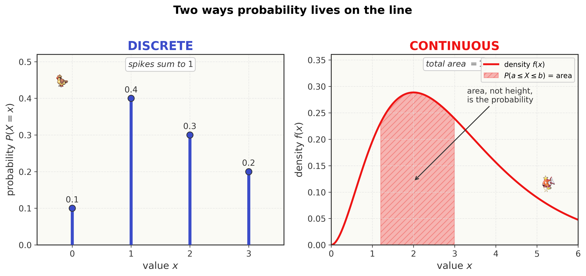
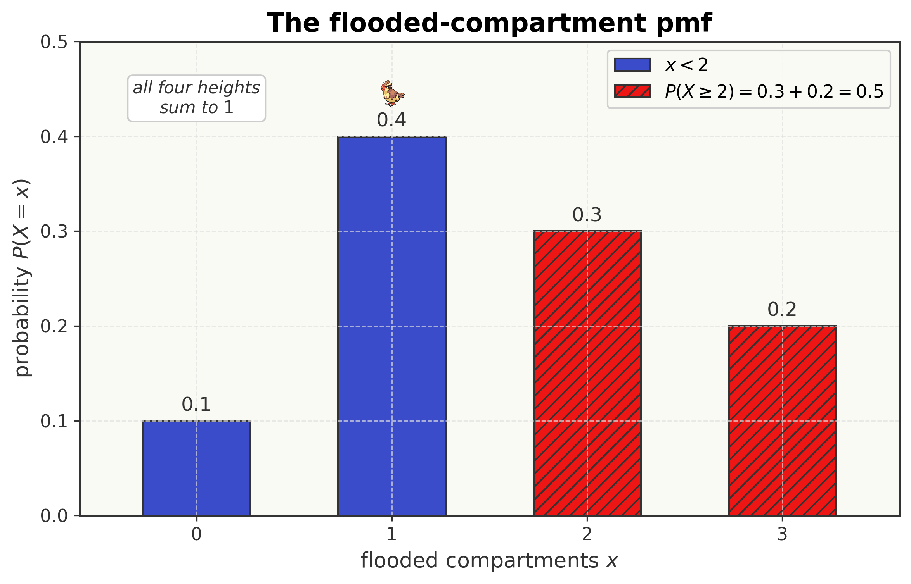
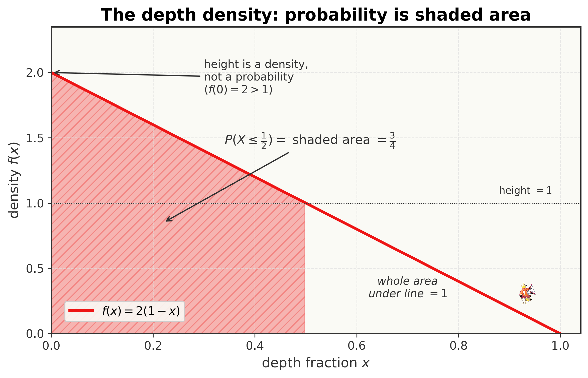
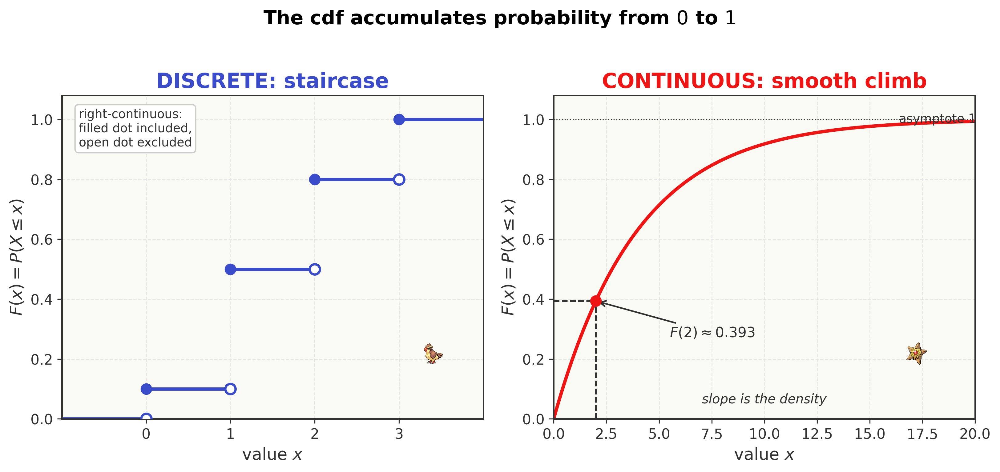
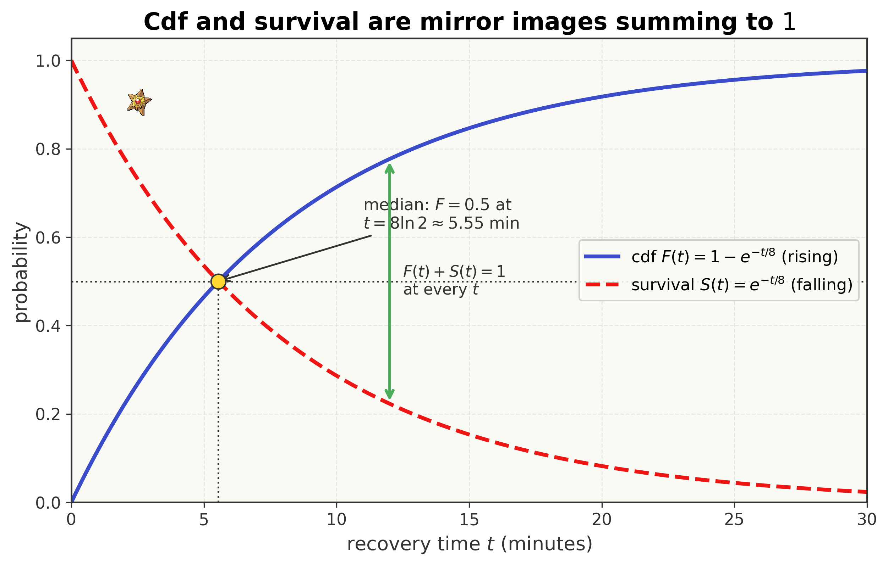
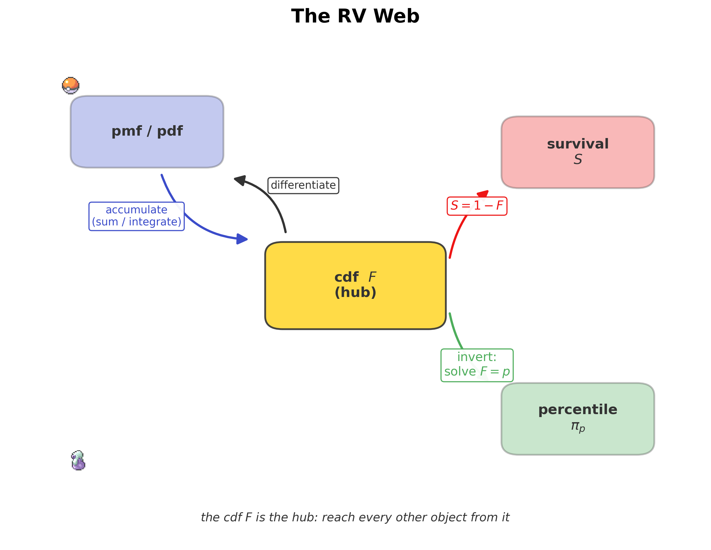

<!--
  file: ch06_random_variables
  tier: A
  outcomes: 2a
  draft1_source: drafts/chapters_draft1/ch05_vermilion_city.md
  maps_to: S.S. Anne, part one — the RV language
-->

# Variables of Fortune {.type-electric}

<figure>

<figcaption>Route to a 10 — you have earned the Cascade Badge in Cerulean and sailed south to the harbor at <strong>Vermilion City</strong>, where the <em>S.S. Anne</em> is docked. This is the first half of the voyage: learning the <em>language</em> of a number left to chance.</figcaption>
</figure>

::: cold-open
**▶ COLD OPEN — EPISODE: "A Number Left to Chance"**

The S.S. Anne rolls beneath you — a floating city of trainers swapping Pokémon and trading battle stories. You came aboard to swap your Butterfree, but Team Rocket's sabotage has other plans. Somewhere below the waterline a charge has cracked the hull, and the captain's voice crackles over the speakers: *"Flooding detected. Lower decks compromised. Stand by for evacuation."*

You sprint for the upper deck, Pikachu on your shoulder, and run straight into the first mate. He is holding a clipboard and shouting over the alarm. "I can't tell you *exactly* how many compartments will flood — it's random, depends where the water finds a seam. But Engineering handed me *this*." He shoves the clipboard at you.

On it is not a single number. It is a little **table**:

| Compartments flooded | $0$ | $1$ | $2$ | $3$ |
|---|---|---|---|---|
| Chance | $0.1$ | $0.4$ | $0.3$ | $0.2$ |

"The number that floods is *anybody's guess* tonight," he says. "But the *pattern* of guesses — that we know. I need you to read this thing. What's the chance **two or more** go under? What's the chance it's **at most one**? If you can read the pattern, I can time the lifeboats."

Pikachu's cheeks spark. You realize the thing on the clipboard isn't an *event* like the ones you mastered in Cerulean — "it rained," "the test was positive." It is a **number whose value is left to chance**: the count of flooded compartments. It has a whole *menu* of possible values, each carrying its own slice of probability. You have never actually written down the rules for an object like this — how to *list* its probabilities, how to *accumulate* them, how to ask "more than $x$" of a quantity that could be anything.

The deck tilts. The first mate is waiting. **How do you describe — exactly, in symbols you can compute with — a number you cannot predict?**
:::

## Where You Are — 60-Second Retrieval

You hold the **Cascade Badge** from Cerulean. Back there you learned to assign a probability to an **event** $A$ — a *yes/no* happening — and to combine events: conditioning $P(A\given B)$, the addition rule, total probability, Bayes. Every one of those took an event and returned a single number in $[0,1]$.

This chapter changes the *object*. Instead of asking about one event, we attach a **number** to every outcome and study the whole spread of numbers at once. But the machinery underneath is exactly the events you already own: "$X$ equals $2$" is an event, "$X$ is at most $1$" is an event, "$X$ exceeds $8$" is an event. A random variable is just a tidy way of carrying *infinitely many events at once* — and reading a probability off it is still the Cerulean move of measuring a region. Take sixty seconds and prove you still own the foundation.

::: trainers-tip
**60-SECOND RETRIEVAL — prove you still own the last chapter**

Answer from memory; if any feels shaky, flip back before continuing.

1. Events $A$ and $B$ are **mutually exclusive** with $P(A)=0.3$, $P(B)=0.4$. What is $P(A\cup B)$? *(Answer: $0.3+0.4=0.7$ — no overlap to subtract.)*
2. Probabilities live in what range, and what must the probabilities of a complete list of non-overlapping outcomes add to? *(Answer: each in $[0,1]$; the complete list sums to $1$.)*
3. From the clipboard above, what is $P(\text{exactly }2)$? *(Answer: read it straight off — $0.3$.)*

All three instant? You're ready. Any hesitation? The retrieval *is* the lesson — go reclaim it, then come back.
:::

## Oak's Briefing — Learning Outcomes & Test-Out Gate

<figure style="margin:1.5em auto; max-width:160px; text-align:center;">

<figcaption style="font-size:0.85em;">Professor Oak — the formalizer</figcaption>
</figure>

Professor Oak's voice comes through the Pokédex's Actuary Mode as the deck tilts. "Ash — a **random variable** is the bridge between the events you mastered in Cerulean and the named distributions waiting in every town ahead. This chapter is *only* about its **anatomy**: how to write down its probabilities, how to accumulate them, and how to ask 'more than $x$.' We are not yet computing *averages* or *spread* — that is the Thunder Badge, in Surge's gym, next. First you must learn to *read the creature* before you can measure it. Take it slowly; everything downstream stands on this language."

By the end of this chapter you will be able to:

- **Define** a random variable and tell **discrete** from **continuous**. *(Outcome 2a.)*
- **Build and verify** a **probability mass function** (pmf) for a discrete variable — including solving for an unknown **normalizing constant**. *(Outcome 2a.)*
- **Build and verify** a **probability density function** (pdf) for a continuous variable, read a probability as an **area**, and solve for its normalizing constant. *(Outcome 2a.)*
- **Construct** the **cumulative distribution function** (cdf) $F(x)=P(X\le x)$ from a pmf or pdf, move back to the pmf/pdf, and check its defining properties. *(Outcome 2a.)*
- **Use** the **survival function** $S(x)=P(X>x)$ and invert the cdf to read **percentiles** and the **median**. *(Outcome 2a.)*

> *Exam-weight signpost.* The Univariate block is the **largest** on Exam P (~44–50%), and *every* problem in it begins by reading one of these four objects — pmf, pdf, cdf, survival — correctly. This is a **Tier A** chapter: the four are a single connected **web**, and fluency in moving among them is the foundation the entire univariate world is built on.

::: concept-gate
**CHAPTER TEST-OUT GATE — Do You Already Own the RV Language?**

Already fluent? Prove it. Work these four, ~3 minutes each, *with correct method*:

1. A pmf is $p(x)=k\,x$ for $x=1,2,3,4$. Find $k$, then $P(X\ge 3)$.
2. A density is $f(x)=c(1-x)$ on $0\le x\le 1$. Find $c$, then $P(X\le \tfrac12)$.
3. A continuous $X\ge 0$ has cdf $F(x)=1-e^{-x/4}$. Find $S(3)=P(X>3)$ and the density $f(x)$.
4. The same $X$: find the **median** (the value with $F=\tfrac12$).

*(Answers: $k=0.1$, $P(X\ge3)=0.7$; $c=2$, $P(X\le\tfrac12)=\tfrac34$; $S(3)=e^{-3/4}\approx0.472$, $f(x)=\tfrac14 e^{-x/4}$; median $=4\ln 2\approx2.77$.)* Four for four with the right reasoning? **Skip to the Gym Challenge.** Any miss or hesitation? The teaching below was built exactly for you — and each concept has its own skip-gate, so even a partial owner loses no time.
:::

---

Five ideas build on one another here, in increasing difficulty. We teach them **in order**, each with its own "do you already own this?" skip-check, then the full nine-beat lesson, then a Pokédex Entry you can carry into the exam:

1. **What a random variable is** — a number chance decides, discrete or continuous *(the object everything else describes)*
2. **The pmf** — listing a *discrete* variable's probabilities
3. **The pdf** — smearing a *continuous* variable's probability along a line *(area, not height, is probability)*
4. **The cdf** — the one object that works for both: accumulated probability
5. **The survival function & percentiles** — "more than $x$," and reading the cdf backward

## Concept 1 — What a Random Variable Is

::: concept-gate
**DO YOU ALREADY OWN THIS? — Random Variables**

A six-sided die is rolled and $X$ is the number shown. A dart lands at a random spot on a $1$-meter ruler and $Y$ is the distance from the left end. Which of $X,Y$ is **discrete**, which is **continuous**, and why?

If you instantly said **"$X$ discrete (it lands on one of six separated values), $Y$ continuous (it can be any real number in an interval)"**, you own this — **skip to Concept 2**. If "discrete vs. continuous" is fuzzy, read on; it decides whether you reach for a *sum* or an *integral* in every problem to come.
:::

**Beat 1 — The one-sentence idea.** *A random variable is a number whose value is decided by chance — a rule that hands each outcome of an experiment a number.*

**Beat 2 — Anchor + concrete instance.** In Cerulean, the outcome of an experiment was a *happening*: "it rained," "the grunt struck." A random variable goes one step further — it pins a **number** to each happening. The clipboard from the cold open is exactly this: the experiment is "tonight's flooding," and the random variable is

$$X = \text{the number of compartments that flood}.$$

Before the water settles, $X$ has no fixed value — it could be $0$, $1$, $2$, or $3$. After, it is one definite number. The randomness lives in *which* of its possible values it will turn out to be.

**Beat 3 — Reason through it in plain words.** Notice $X$ can only ever be one of **four separated values**: $0,1,2,3$. You cannot flood $1.7$ compartments. The possible values sit at *isolated points* with gaps between them. Contrast that with a different quantity the first mate also cares about:

$$T = \text{the number of minutes until the lower deck goes under}.$$

$T$ could be $3$ minutes, or $3.5$, or $3.5001$ — *any* number in a continuous range. There are no gaps; between any two possible times there is always another. These two behave so differently that they need different tools, so we give them names.

**Beat 4 — Surface and dismantle the tempting wrong idea.** The tempting mistake is to call any variable with "lots of values" continuous. **The test is not how many values — it's whether they form an unbroken interval.** The number of grains of sand on a beach is astronomically large, but it is still a *count*: $0, 1, 2, \dots$ with gaps. It is **discrete**, no matter how big. What makes a variable continuous is not *quantity* of values but *no gaps* — every point in some interval is reachable. Counts are discrete; measurements (time, length, weight, voltage) are continuous.

**Beat 5 — Translate into notation, one glyph at a time.** Two conventions, used everywhere from here on:

- A **capital letter** $X$ names the random variable itself — *the thing that hasn't resolved yet.*
- A **lowercase letter** $x$ names a *particular value it might take* — a fixed number you plug in.

So "$X = x$" reads **"the random variable $X$ takes the specific value $x$,"** and that is an **event** — exactly the kind of yes/no happening you measured in Cerulean. This capital-vs-lowercase split is load-bearing: $P(X = 2)$ asks "how likely is the value $2$?", while $X$ alone is the whole unsettled quantity. We will write the **support** — the set of values $X$ can actually take — and call $X$:

$$\textbf{discrete} \;\Longleftrightarrow\; \text{support is a list of separated values } \{x_1, x_2, \dots\},$$
$$\textbf{continuous} \;\Longleftrightarrow\; \text{support is an interval (or union of intervals).}$$

**Beat 6 — Generalize.** Formally, a random variable is a *function* $X$ that assigns a real number to each outcome in the sample space $S$ you built in Cerulean. We rarely need that definition to compute — but it explains *why* "$X = x$," "$X \le x$," and "$X > x$" are all genuine events we can take probabilities of: each is just the set of outcomes whose assigned number satisfies the condition. **Every question about a random variable is secretly a question about an event** — which is why nothing from Cerulean is wasted.

**Beat 7 — Ramp the difficulty.**

- *Simplest (discrete):* flooded compartments $X\in\{0,1,2,3\}$ — four values, read straight off the table.
- *Twist (discrete but infinite):* the number of trainers you battle before your first loss could be $1, 2, 3, \dots$ with no upper bound — still **discrete** (a list with gaps), just an endless one.
- *Continuous:* minutes-to-flood $T \ge 0$, or a voltage in $[0,2]$ — an unbroken interval.
- *Edge (mixed):* an insurance payout that is *exactly* $0$ with some lump probability and otherwise a continuous amount is **neither** purely discrete nor continuous. You'll meet these in pricing (Ch 10); for now, every variable is cleanly one or the other.

**Beat 8 — Picture it.** The two kinds *look* different the moment you plot their probability.

<figure>

<figcaption>Discrete (left): probability sits as <em>spikes</em> on separated values. Continuous (right): probability is <em>smeared</em> as area under a smooth curve. Spikes sum to $1$; area totals $1$.</figcaption>
</figure>

**Beat 9 — Consolidate.** You can now look at any "number left to chance," name it with a capital letter, and classify it as discrete (a list of separated values → you'll **sum**) or continuous (an interval → you'll **integrate**). That single fork decides every tool that follows.

::: pokedex-entry
**POKÉDEX ENTRY №01 — Random Variables: Discrete vs. Continuous**

A **random variable** $X$ assigns a real number to each outcome of an experiment; its value is settled only when chance resolves. Capital $X$ = the unsettled variable; lowercase $x$ = a specific value. "$X=x$," "$X\le x$," "$X>x$" are all **events**.

- **Discrete:** support is a list of separated values $\{x_1,x_2,\dots\}$ (counts). Probabilities are **summed**.
- **Continuous:** support is an interval. Probabilities are **integrated** (area).

*In plain terms:* if you can *count* the outcomes one-by-one (even forever), it's discrete; if they fill an unbroken range, it's continuous.

*Recognition cue:* the words **"number of / count of / how many"** → discrete. The words **"time / length / weight / amount / voltage"** → continuous. This fork chooses sum vs. integral.
:::

## Concept 2 — The pmf: Listing a Discrete Variable's Probabilities

::: concept-gate
**DO YOU ALREADY OWN THIS? — The pmf**

A discrete $X$ has $p(x)=k\,x$ for $x=1,2,3,4$ and $0$ otherwise. Find the constant $k$ that makes this a valid distribution, then $P(X\ge 3)$.

If you wrote **$k=\tfrac{1}{10}=0.1$** (because $k(1+2+3+4)=1$) and **$P(X\ge3)=0.3+0.4=0.7$**, **skip to Concept 3**. If you're unsure why the probabilities must sum to $1$, or how to use that to pin down $k$, read on.
:::

**Beat 1 — The one-sentence idea.** *For a discrete variable, the pmf is simply the list of how much probability sits on each possible value — and the whole list must add to one.*

**Beat 2 — Anchor + concrete instance.** This is the clipboard, formalized. The first mate's table *is* a pmf:

| flooded compartments $x$ | $0$ | $1$ | $2$ | $3$ |
|---|---|---|---|---|
| probability $p(x)$ | $0.1$ | $0.4$ | $0.3$ | $0.2$ |

Each entry $p(x)$ is the probability that $X$ lands on exactly that value. To answer the first mate's questions, you only ever **add the relevant entries**.

**Beat 3 — Reason through it in plain words.** "Two or more flood" means $X=2$ *or* $X=3$. These are mutually exclusive (the count is one number), so — straight out of Cerulean's addition rule — you add:

$$P(X\ge 2) = p(2) + p(3) = 0.3 + 0.2 = 0.5.$$

"At most one" means $X=0$ *or* $X=1$:

$$P(X\le 1) = p(0) + p(1) = 0.1 + 0.4 = 0.5.$$

That's the entire skill: a probability about a discrete variable is a **sum of the masses on the values that qualify.** And notice the whole table sums to $0.1+0.4+0.3+0.2 = 1$ — every bit of probability is accounted for.

**Beat 4 — Surface and dismantle the tempting wrong idea.** When a pmf is given by a *formula* with an unknown constant — say $p(x)=k\,x$ for $x=1,2,3,4$ — the tempting move is to start computing probabilities right away. **You can't, until you find $k$.** The constant is whatever makes the masses total $1$. Skipping that step gives probabilities that don't add to one — a broken distribution. The constant isn't decoration; it's the price of being a valid pmf.

**Beat 5 — Translate into notation, one glyph at a time.** The **probability mass function** is written

$$p(x) = P(X = x) \qquad \text{read aloud: ``}p\text{ of }x\text{ — the probability that }X\text{ equals }x\text{.''}$$

It must satisfy two conditions, and they are just "probabilities behave like probabilities":

$$p(x) \ge 0 \quad (\text{no negative chances}), \qquad \sum_{x} p(x) = 1 \quad (\text{the masses total one}).$$

The big sigma $\displaystyle\sum_{x}$ reads **"add up over all values $x$ in the support"** — exactly the summation you met in Cerulean's total-probability law, here just running over the variable's possible values. A probability of a *set* of values $A$ is the sum over that set:

$$P(X \in A) = \sum_{x \in A} p(x) \qquad \text{read aloud: ``add the masses on the values in }A\text{.''}$$

**Beat 6 — Generalize: derive the normalizing constant from the instance.** Take $p(x) = k\,x$ on $x=1,2,3,4$. The "must total one" rule *is* the equation that pins down $k$:

$$\sum_{x=1}^{4} k\,x = k(1+2+3+4) = 10k = 1 \;\;\Longrightarrow\;\; k = \tfrac{1}{10} = 0.1.$$

We didn't guess $k$ — we **solved** for it by forcing the masses to sum to $1$. The constant chosen this way is called the **normalizing constant**, because it normalizes the list to total one. Now every probability is a sum of these masses; e.g. $P(X\ge 3) = p(3)+p(4) = 0.3 + 0.4 = 0.7$.

**Beat 7 — Ramp the difficulty.**

- *Simplest:* read masses straight off a table (the clipboard).
- *Twist (solve for the constant):* a formula pmf like $k\,x$ — set the sum to $1$, solve, *then* compute.
- *Infinite support:* $p(x) = c\,(1/2)^x$ for $x=1,2,3,\dots$ needs a **geometric series** $\sum_{x\ge1}(1/2)^x = 1$, so $c=1$. (The series tools from Ch 2 earn their keep here.)
- *Edge:* a "pmf" with a negative entry, or one whose masses sum to $0.9$, is **not a valid distribution** — a favorite exam trap. Always check both conditions.

**Beat 8 — Picture it.** A pmf is a bar chart of spikes: height = probability on that value.

<figure>
=2)=0.5, and an annotation notes all four heights sum to 1." style="width:72%; max-width:520px; display:block; margin:1em auto;">
<figcaption>The flooded-compartment pmf. Each spike's height is the probability on that value; a probability like $P(X\ge2)$ is the total height of the qualifying spikes ($0.3+0.2=0.5$). All heights sum to $1$.</figcaption>
</figure>

**Beat 9 — Consolidate.** You can now read a discrete probability as a sum of masses, and — when handed a formula with an unknown constant — solve for it by forcing the total to $1$. That "set the total to $1$" move is the same one you'll use for continuous variables next, with an integral in place of the sum.

::: pokedex-entry
**POKÉDEX ENTRY №02 — Probability Mass Function (pmf)**

For discrete $X$, the **pmf** is $p(x) = P(X = x)$, satisfying
$$p(x) \ge 0, \qquad \sum_{x} p(x) = 1, \qquad P(X\in A) = \sum_{x\in A} p(x).$$

*In plain terms:* the pmf lists how much probability sits on each value. Any probability is the **sum** of the masses on the qualifying values. A formula pmf with an unknown constant is normalized by setting its total to $1$ and solving.

*Recognition cue:* a discrete value-list with masses, or "$p(x)=k\cdot(\text{something})$, find $k$." → **sum to $1$**, then add the masses you need.
:::

## Concept 3 — The pdf: Smearing Probability Along a Line

::: concept-gate
**DO YOU ALREADY OWN THIS? — The pdf**

A continuous $X$ has density $f(x) = c(1-x)$ on $0\le x\le 1$ and $0$ elsewhere. Find $c$, then $P(X\le \tfrac12)$. And: what is $P(X = \tfrac12)$ exactly?

If you wrote **$c=2$**, **$P(X\le\tfrac12)=\tfrac34$**, and **$P(X=\tfrac12)=0$** (a single point has no area), **skip to Concept 4**. If "$P(X=\text{a point})=0$" surprises you, or you're shaky on getting $c$ from an integral, read on.
:::

**Beat 1 — The one-sentence idea.** *For a continuous variable, probability is not stacked on individual points but smeared along the line as a density — and the probability of a range is the **area** under that density over the range.*

**Beat 2 — Anchor + concrete instance.** The pmf put a *spike* on each value. But a continuous variable has *infinitely many* values packed into an interval — you can't put a positive spike on each, or they'd sum to infinity. Instead probability is spread out, and we measure it by **area**, just as the addition rule measured a region in Cerulean.

The first mate hands you a second clipboard: the depth $X$ (in meters) of water in a sealed compartment has density

$$f(x) = c(1-x), \qquad 0 \le x \le 1,$$

and $0$ elsewhere. He wants the chance the depth is at most half a meter.

**Beat 3 — Reason through it in plain words.** First, $c$ must make the *total* area under $f$ equal to $1$ — same "all probability accounted for" rule as the pmf, but now the total is an **area**, not a sum. The region under $f(x)=c(1-x)$ from $0$ to $1$ is a triangle of base $1$ and height $c$, so its area is $\tfrac12 \cdot 1 \cdot c = \tfrac{c}{2}$. Setting that to $1$ gives $c=2$. Then $P(X\le\tfrac12)$ is the area under $f$ from $0$ to $\tfrac12$ — a smaller trapezoid — which works out (Beat 6) to $\tfrac34$. The depth is *more likely shallow*, exactly as a triangle leaning toward $0$ should be.

**Beat 4 — Surface and dismantle the tempting wrong idea.** Here is the misconception that trips *everyone* the first time: **the height $f(x)$ is not a probability.** At $x=0$, $f(0)=2$ — and a probability can never exceed $1$! The height is a *density* (probability **per unit length**), not a probability. Only **area** is probability. A direct consequence: the probability that $X$ equals any *single* exact value is

$$P(X = a) = \text{area over a single point} = 0.$$

A line segment has no width, so no area. This is why, for continuous $X$, you never have to fuss over $\le$ versus $<$: $P(X\le a) = P(X<a)$, because the endpoint contributes zero. (For discrete $X$ the endpoint carries a real spike, so there the distinction *does* matter — don't mix the two up.)

**Beat 5 — Translate into notation, one glyph at a time.** The **probability density function** $f(x)$ turns "area" into an integral. The integral sign

$$\int_a^b f(x)\,dx \qquad \text{read aloud: ``the area under }f\text{ from }a\text{ to }b\text{''}$$

is just "add up the slivers of area" — the continuous cousin of the pmf's sum, with $dx$ the infinitesimal width of each sliver (the calculus tools from Ch 2). The two conditions mirror the pmf's exactly, with $\int$ replacing $\sum$:

$$f(x) \ge 0, \qquad \int_{-\infty}^{\infty} f(x)\,dx = 1, \qquad P(a \le X \le b) = \int_a^b f(x)\,dx.$$

Read the middle one aloud: **"the total area under the density is one."** That is the continuous "all probability accounted for."

**Beat 6 — Generalize: derive the constant and the probability.** Normalize first:

$$\int_0^1 c(1-x)\,dx = c\left[x - \tfrac{x^2}{2}\right]_0^1 = c\left(1 - \tfrac12\right) = \tfrac{c}{2} = 1 \;\Longrightarrow\; c = 2.$$

(The integral confirms the triangle-area shortcut from Beat 3.) Now the requested probability is the area from $0$ to $\tfrac12$:

$$P\!\left(X\le\tfrac12\right) = \int_0^{1/2} 2(1-x)\,dx = 2\left[x - \tfrac{x^2}{2}\right]_0^{1/2} = 2\left(\tfrac12 - \tfrac18\right) = 2\cdot\tfrac38 = \tfrac34.$$

We *derived* both numbers: the constant from "total area $=1$," the probability from "area over the range."

**Beat 7 — Ramp the difficulty.**

- *Simplest:* a triangular or constant density — area by geometry, no calculus needed.
- *Twist (solve for the constant):* $f(x)=c\,x(2-x)$ on $[0,2]$ — integrate, set to $1$, solve ($c=\tfrac34$).
- *General:* a density on $[1,\infty)$ like $f(x)=3/x^4$ — an *improper* integral, but the same "total area $=1$" check.
- *Edge:* a "density" that goes negative somewhere, or whose total area isn't $1$, is **invalid** — the continuous twin of the pmf trap. And remember $P(X=a)=0$ always.

**Beat 8 — Picture it.** Probability is the shaded area, not the curve's height.

<figure>

<figcaption>The depth density $f(x)=2(1-x)$. Probability is the <em>shaded area</em> ($P(X\le\tfrac12)=\tfrac34$), never the height — note $f(0)=2>1$. The whole area under the line is $1$.</figcaption>
</figure>

**Beat 9 — Consolidate.** You can now treat a continuous variable's probabilities as areas: normalize a density by setting its total area to $1$, read any range-probability as an integral, and you'll never again mistake the height for a probability — or forget that a single point carries none.

::: pokedex-entry
**POKÉDEX ENTRY №03 — Probability Density Function (pdf)**

For continuous $X$, the **pdf** $f(x)$ satisfies
$$f(x) \ge 0, \qquad \int_{-\infty}^{\infty} f(x)\,dx = 1, \qquad P(a\le X\le b) = \int_a^b f(x)\,dx.$$
The **height is a density, not a probability** (it may exceed $1$); only **area** is probability. Consequently $P(X=a)=0$, so $P(X\le a)=P(X<a)$.

*In plain terms:* probability is smeared along the line; the chance of a range is the area under the curve over it. Normalize an unknown-constant density by setting its total area to $1$.

*Recognition cue:* a density with an unknown $c$, or "for what value is this a valid density," or "$P(a\le X\le b)$" for continuous $X$ → **integrate** (set total area to $1$ first if $c$ is unknown).
:::

## Concept 4 — The cdf: Accumulated Probability (Works for Both)

::: concept-gate
**DO YOU ALREADY OWN THIS? — The cdf**

A continuous $X\ge 0$ has density $f(x)=\tfrac14 e^{-x/4}$. Find the cdf $F(x)=P(X\le x)$, then $P(X\le 2)$. And going backward: if you were *handed* $F(x)=1-e^{-x/4}$, how would you recover $f(x)$?

If you wrote **$F(x)=1-e^{-x/4}$**, **$P(X\le2)=1-e^{-1/2}\approx0.393$**, and **"differentiate: $f=F'$"**, **skip to Concept 5**. If building $F$ from $f$ (or the reverse) is shaky, read on — the cdf is the hinge of the whole web.
:::

**Beat 1 — The one-sentence idea.** *The cdf is the running total of probability accumulated up to $x$ — and unlike the pmf and pdf, it works for discrete and continuous variables with one and the same definition.*

**Beat 2 — Anchor + concrete instance.** So far discrete and continuous needed *different* objects — pmf vs. pdf, sum vs. integral. The cdf unifies them: it asks one question that makes sense for *any* random variable — **"how much probability is at or below $x$?"** Back to the flooded compartments $X\in\{0,1,2,3\}$ with masses $0.1, 0.4, 0.3, 0.2$. The first mate now wants "at most $x$" for every $x$ — the *accumulated* chance.

**Beat 3 — Reason through it in plain words (discrete case).** "At most $x$" means add every mass from the bottom up to $x$:

- $F(0) = P(X\le 0) = 0.1$
- $F(1) = P(X\le 1) = 0.1 + 0.4 = 0.5$
- $F(2) = P(X\le 2) = 0.1 + 0.4 + 0.3 = 0.8$
- $F(3) = P(X\le 3) = 0.1 + 0.4 + 0.3 + 0.2 = 1.0$

The running total climbs from $0$ up to $1$, jumping at each value by that value's mass. For a discrete variable the cdf is a **staircase**: flat between values, a vertical jump *of size $p(x)$* at each value.

**Beat 4 — Surface and dismantle the tempting wrong idea.** Two classic slips. First, **the cdf is $P(X\le x)$, not $P(X=x)$** — it *accumulates*, it doesn't report a single mass. Confusing $F(2)=0.8$ with $p(2)=0.3$ is the most common cdf error. Second — for the discrete staircase — **at a jump point, $F$ takes the value at the *top* of the jump** (the "$\le$" includes the point): $F(2)=0.8$ includes the mass at $2$. Getting that backward gives off-by-one-mass errors. (We say $F$ is *right-continuous*, which is just the precise name for "includes its endpoint.")

**Beat 5 — Translate into notation, one glyph at a time.** The **cumulative distribution function** is

$$F(x) = P(X \le x) \qquad \text{read aloud: ``}F\text{ of }x\text{ — the probability that }X\text{ is at most }x\text{.''}$$

It is built from the pmf or pdf by accumulating:

$$F(x) = \sum_{t \le x} p(t) \quad(\text{discrete}), \qquad F(x) = \int_{-\infty}^{x} f(t)\,dt \quad(\text{continuous}).$$

The integral upper limit is a *variable* $x$, and the dummy $t$ just runs underneath it — "accumulate the density from the far left up to $x$." Every cdf, discrete or continuous, obeys three defining properties (each is just common sense about a running total of probability):

$$\textbf{(i) } F \text{ never decreases}; \qquad \textbf{(ii) } \lim_{x\to-\infty}F(x)=0,\;\; \lim_{x\to\infty}F(x)=1; \qquad \textbf{(iii) } F \text{ is right-continuous}.$$

Property (i) holds because adding more probability can't shrink a total; (ii) because below everything you've accumulated nothing and above everything you've accumulated all of it; (iii) is the "$\le$ includes the endpoint" rule.

**Beat 6 — Generalize: the cdf $\leftrightarrow$ pdf bridge (the hinge of the web).** For continuous $X$, the cdf and pdf are linked by calculus' Fundamental Theorem. **Forward** (pdf → cdf): integrate. Take $f(x)=\tfrac14 e^{-x/4}$ on $x\ge 0$:

$$F(x) = \int_0^x \tfrac14 e^{-t/4}\,dt = \left[-e^{-t/4}\right]_0^x = 1 - e^{-x/4}, \qquad x\ge 0.$$

So $P(X\le 2) = F(2) = 1 - e^{-1/2} \approx 0.393$. **Backward** (cdf → pdf): differentiate, because the density is the *rate* at which probability accumulates —

$$f(x) = F'(x) = \frac{d}{dx}\left(1 - e^{-x/4}\right) = \tfrac14 e^{-x/4}. \;\checkmark$$

This two-way street — **integrate to go $f\to F$, differentiate to go $F\to f$** — is the single most useful relationship in the chapter. Whichever object a problem hands you, you can reach the other.

**Beat 7 — Ramp the difficulty.**

- *Simplest (discrete):* accumulate masses into a staircase, as above.
- *Continuous forward:* integrate a density to get $F$ (the exponential here).
- *Continuous backward:* differentiate a given $F$ to recover $f$ — and remember $f=0$ wherever $F$ is flat.
- *Edge (piecewise):* a density defined on $[0,2]$ gives $F=0$ below $0$, the integral *inside* $[0,2]$, and $F=1$ above $2$. Writing all three pieces is the exam-grade answer; forgetting the flat tails loses marks.

**Beat 8 — Picture it.** Discrete cdf = staircase; continuous cdf = smooth S-curve. Both start at $0$, end at $1$, never fall.

<figure>

<figcaption>The cdf accumulates probability. Discrete (left): a right-continuous <em>staircase</em> jumping by $p(x)$ at each value. Continuous (right): a smooth curve climbing from $0$ to $1$; its slope is the density.</figcaption>
</figure>

**Beat 9 — Consolidate.** You can now build the cdf from either a pmf (accumulate to a staircase) or a pdf (integrate to a smooth curve), recover the pdf by differentiating, and check the three defining properties. The cdf is the **hub** that connects every other object — which is exactly why the next concept, the survival function, is just "one minus" it.

::: pokedex-entry
**POKÉDEX ENTRY №04 — Cumulative Distribution Function (cdf)**

$$F(x) = P(X \le x), \qquad F(x)=\sum_{t\le x}p(t)\;(\text{discrete}), \qquad F(x)=\int_{-\infty}^{x}f(t)\,dt\;(\text{continuous}).$$
Properties: **nondecreasing**; $F(-\infty)=0$, $F(\infty)=1$; **right-continuous**. For continuous $X$, $\;f(x)=F'(x)\;$ and $\;P(a<X\le b)=F(b)-F(a)$.

*In plain terms:* the cdf is the running total of probability up to $x$. **Integrate $f$ to get $F$; differentiate $F$ to get $f$.** It is the one object defined the same way for discrete and continuous variables.

*Recognition cue:* "$P(X\le x)$," "accumulated / cumulative," "find the cdf," or a percentile request (read $F$ backward). Given $F$, recover $f$ by differentiating; given a probability of an interval, use $F(b)-F(a)$.
:::

## Concept 5 — The Survival Function & Percentiles

::: concept-gate
**DO YOU ALREADY OWN THIS? — Survival & Percentiles**

A continuous $X\ge0$ has cdf $F(x)=1-e^{-x/4}$. Find $S(3)=P(X>3)$ and the **median** (the value $m$ with $F(m)=\tfrac12$).

If you wrote **$S(3)=e^{-3/4}\approx0.472$** and **$m=4\ln 2\approx2.77$** (from $e^{-m/4}=\tfrac12$), **skip to the Worked Examples**. If "$S=1-F$" or "invert $F$ to get a percentile" is shaky, read on — this closes the web.
:::

**Beat 1 — The one-sentence idea.** *The survival function is just "one minus the cdf" — the chance of exceeding $x$ — and a percentile is the cdf read backward: the value at which a target amount of probability has accumulated.*

**Beat 2 — Anchor + concrete instance.** The cdf answers "at most $x$." Its mirror answers "more than $x$" — the natural question when $X$ is a *lifetime* or *time-to-failure*, the first mate's original worry: how long until the deck goes under. Take the recovery time of Misty's Staryu, $T$ minutes, with $F(t)=1-e^{-t/8}$ for $t\ge 0$. The first mate wants two things: the chance recovery *exceeds* $8$ minutes, and the time by which recovery is *half* done (the median).

<figure style="margin:1.5em auto; max-width:150px; text-align:center;">

<figcaption style="font-size:0.85em;"><strong>#120 Staryu — recovery time as a random variable</strong></figcaption>
</figure>

**Beat 3 — Reason through it in plain words.** "More than $8$" is the *complement* of "at most $8$" — straight from Cerulean: the chance you exceed a value is one minus the chance you don't. So

$$P(T>8) = 1 - P(T\le 8) = 1 - F(8) = 1 - (1 - e^{-8/8}) = e^{-1} \approx 0.368.$$

For the median, run the cdf *backward*: instead of "plug in $t$, get the accumulated probability," ask "what $t$ accumulates exactly half?" Solve $F(m)=\tfrac12$. The median is the time by which recovery is as likely to be done as not.

**Beat 4 — Surface and dismantle the tempting wrong idea.** Two traps. First, **the survival function is one minus the cdf, not the cdf** — mixing $P(X>x)$ with $P(X\le x)$ flips your answer to its complement. Always anchor on "survive = exceed = $1-F$." Second, on a **percentile**, people set $F$ equal to the *wrong tail*. The $p$-th percentile $\pi_p$ solves $F(\pi_p)=p$ — accumulate $p$ from the *bottom*. If a problem asks for "the value exceeded only $10\%$ of the time," that's the $90$th percentile: $F=0.90$ (equivalently $S=0.10$), **not** $F=0.10$. Tie the equation to the tail the words name.

**Beat 5 — Translate into notation, one glyph at a time.** The **survival function** (a.k.a. the *tail*) is

$$S(x) = P(X > x) = 1 - F(x) \qquad \text{read aloud: ``}S\text{ of }x\text{ — the probability }X\text{ exceeds }x\text{.''}$$

For a nonnegative continuous $X$ it falls from $S(0)=1$ down toward $0$. The **$p$-th percentile** $\pi_p$ (a number with $0<p<1$) is defined by

$$F(\pi_p) = p \quad\Longleftrightarrow\quad S(\pi_p) = 1-p \qquad \text{read aloud: ``the value with }p\text{ of the probability at or below it.''}$$

The **median** is the special case $p=\tfrac12$: the value $m$ with $F(m)=\tfrac12$, splitting the distribution into two equal halves.

**Beat 6 — Generalize: derive the two answers.** Survival from the cdf is one subtraction:

$$S(8) = 1 - F(8) = 1 - \left(1 - e^{-8/8}\right) = e^{-1} \approx 0.368.$$

The median inverts the cdf. Set $F(m)=\tfrac12$ and solve:

$$1 - e^{-m/8} = \tfrac12 \;\Longrightarrow\; e^{-m/8} = \tfrac12 \;\Longrightarrow\; -\tfrac{m}{8} = \ln\tfrac12 \;\Longrightarrow\; m = 8\ln 2 \approx 5.55 \text{ minutes.}$$

A percentile is *always* this move — set the cdf to the target probability, solve for the value. The median is just the $p=\tfrac12$ instance.

**Beat 7 — Ramp the difficulty.**

- *Simplest:* survival as a single subtraction, $S(x)=1-F(x)$.
- *Median (continuous):* solve $F(m)=\tfrac12$, as above.
- *Other percentiles / "exceeded $10\%$ of the time":* set $F=0.90$ (i.e. $S=0.10$) — watch which tail.
- *Edge (discrete median):* with a staircase, the median is the *smallest* value whose cumulative reaches $\tfrac12$; it can land exactly on a value or be reported as the first value with $F\ge\tfrac12$. Don't try to "solve" — read it off the accumulated column.

**Beat 8 — Picture it.** The cdf going *up* and the survival going *down* are mirror images that sum to $1$; a percentile is a horizontal read across to the curve.

<figure>
= 0 showing the cdf F(t)=1-e^{-t/8} rising from 0 to 1 and the survival function S(t)=e^{-t/8} falling from 1 to 0, the two curves mirror images crossing at F=S=0.5. A horizontal dashed line at height 0.5 meets the cdf at the median t = 8 ln 2 approximately 5.55, with a vertical dashed line dropping to that value on the axis. The vertical gap between the two curves at any t is annotated as summing to 1." style="width:78%; max-width:560px; display:block; margin:1em auto;">
<figcaption>Cdf (rising) and survival (falling) sum to $1$ at every $t$. Reading a percentile is a horizontal cut: the median is where the cdf crosses $0.5$, here $t=8\ln 2\approx5.55$ minutes.</figcaption>
</figure>

**Beat 9 — Consolidate.** You can now flip between "at most" and "more than" with a single subtraction, and read any percentile — median included — by setting the cdf to the target probability and solving. With pmf, pdf, cdf, and survival all in hand, **the web is complete**: given any one, you can reach the others.

::: pokedex-entry
**POKÉDEX ENTRY №05 — Survival Function & Percentiles**

$$S(x) = P(X>x) = 1 - F(x).$$
The **$p$-th percentile** $\pi_p$ solves $F(\pi_p)=p$ (equivalently $S(\pi_p)=1-p$); the **median** is $p=\tfrac12$, i.e. $F(m)=\tfrac12$.

*In plain terms:* the survival function is the tail "$X$ exceeds $x$," one minus the cdf. A percentile is the cdf read backward — the value at which probability $p$ has accumulated.

*Recognition cue:* "exceeds / survives past / lasts longer than" → $S(x)=1-F(x)$. "Median / percentile / the value exceeded $q\%$ of the time" → set $F$ to the named cumulative level and solve.
:::

<figure>

<figcaption><strong>The RV web.</strong> The cdf $F$ is the hub: <em>accumulate</em> a pmf/pdf to reach it (sum or integrate), <em>differentiate</em> to return to the pdf, take $1-F$ for survival, and <em>invert</em> it for percentiles. Master these arrows and you can move among all five objects at will.</figcaption>
</figure>

## Worked Examples — Faded Guidance

<figure style="margin:1.5em auto; max-width:160px; text-align:center;">

<figcaption style="font-size:0.85em;">Brock — your companion aboard the S.S. Anne, posing the sub-problems</figcaption>
</figure>

Four examples, fading from fully narrated to exam-speed. The first leads with the **Professor's Path** (the rigorous *why*) before the **Trainer's Path** (the fast *how*), because building and reading a distribution is the load-bearing skill of the whole univariate block.

### Worked Example 6.1 — Validating the Pidgey Log (full narration; understanding-first)

**ARCHETYPE:** *Normalize a formula pmf, then read a tail probability and a cdf value.*

**Setup.** A dockworker says the number of Pidgey nesting on the S.S. Anne's mast each morning, $X$, has pmf $p(x) = k\,x$ for $x=1,2,3,4$ and $0$ otherwise. Find the constant $k$ that makes the log a valid distribution, then state $P(X\ge 3)$ and $F(2)=P(X\le2)$.

<figure style="margin:1.25em auto; max-width:130px; text-align:center;">

<figcaption style="font-size:0.8em;">#016 Pidgey</figcaption>
</figure>

**Step 1 — Identify (which object, discrete or continuous?).** The values $1,2,3,4$ are a *separated list* → **discrete** → this is a **pmf** (Entry №02). A formula with an unknown constant means: *normalize first*.

**Step 2 — Professor's Path (the why).** A valid pmf must have its masses total $1$ (Entry №02) — that is the only thing $k$ is for. Write the masses as $k\cdot1, k\cdot2, k\cdot3, k\cdot4$ and force the total:
$$\sum_{x=1}^{4} k\,x = k(1+2+3+4) = 10k = 1 \;\Longrightarrow\; k = \tfrac{1}{10} = 0.1.$$
Now the distribution is fixed: $p(1)=0.1,\;p(2)=0.2,\;p(3)=0.3,\;p(4)=0.4$. Any probability is a **sum of the masses** on qualifying values.

**Step 3 — Trainer's Path (the fast how).** $k=1/\!\sum x = 1/10$. Then:
$$P(X\ge3) = p(3)+p(4) = 0.3+0.4 = 0.7, \qquad F(2)=P(X\le2) = p(1)+p(2) = 0.1+0.2 = 0.3.$$

**Step 4 — Check & pitfall.** The four masses sum to $0.1+0.2+0.3+0.4=1.0$ ✓, so the distribution is valid. Sanity: $P(X\ge3)=0.7$ and $P(X\le2)=0.3$ are complementary and add to $1$ ✓. **Pitfall:** computing $P(X\ge3)$ *before* solving for $k$ — every probability is wrong until the masses are normalized. *(Back-ref: Entry №02.)*

### Worked Example 6.2 — The Compartment Depth (partial guidance)

**ARCHETYPE:** *Normalize a continuous density, then a range probability and the cdf.*

**Setup.** The water depth $X$ (meters) in a sealed compartment has density $f(x)=c(1-x)$ for $0\le x\le 1$, and $0$ elsewhere. Find $c$, then $P(X\le\tfrac12)$, and write the full cdf $F(x)$.

**Identify.** An interval support $[0,1]$ → **continuous** → **pdf** (Entry №03). Normalize by setting total **area** to $1$, then integrate for the probability, then accumulate for $F$. *Your move: normalize first.*

**Normalize.**
$$\int_0^1 c(1-x)\,dx = c\left[x-\tfrac{x^2}{2}\right]_0^1 = c\cdot\tfrac12 = 1 \;\Longrightarrow\; c=2.$$

**Range probability** — area from $0$ to $\tfrac12$:
$$P\!\left(X\le\tfrac12\right) = \int_0^{1/2} 2(1-x)\,dx = 2\left[x-\tfrac{x^2}{2}\right]_0^{1/2} = 2\left(\tfrac12-\tfrac18\right) = \tfrac34.$$

**Full cdf** — three pieces (Entry №04), accumulating from the left:
$$F(x) = \int_0^x 2(1-t)\,dt = 2x - x^2 \quad\text{for }0\le x\le1, \qquad F(x)=0\ (x<0),\quad F(x)=1\ (x>1).$$

**Check & pitfall.** $F\!\left(\tfrac12\right)=2\cdot\tfrac12-\tfrac14=\tfrac34$ matches the integral ✓; $F(1)=2-1=1$ ✓; differentiating, $F'(x)=2-2x=2(1-x)=f(x)$ ✓ (the $f\leftrightarrow F$ bridge). **Pitfall:** writing only the middle piece of $F$ and omitting the flat $0$ and $1$ tails — an incomplete cdf loses marks. *(Back-ref: Entries №03, №04.)*

### Worked Example 6.3 — Staryu's Recovery (light guidance)

**ARCHETYPE:** *cdf → survival probability and median for a continuous lifetime.*

**Setup.** Misty's Staryu recovers in $T$ minutes with cdf $F(t)=1-e^{-t/8}$ for $t\ge0$. Find (a) $P(T>8)$, (b) the density $f(t)$, and (c) the median recovery time.

<figure style="margin:1.25em auto; max-width:130px; text-align:center;">

<figcaption style="font-size:0.8em;">#120 Staryu — recovery time $T$</figcaption>
</figure>

**(a)** Survival is one minus the cdf (Entry №05):
$$P(T>8) = S(8) = 1 - F(8) = 1 - (1-e^{-1}) = e^{-1} \approx 0.368.$$

**(b)** Density is the derivative of the cdf (Entry №04):
$$f(t) = F'(t) = \tfrac18 e^{-t/8}, \qquad t\ge 0.$$

**(c)** Median solves $F(m)=\tfrac12$:
$$1 - e^{-m/8} = \tfrac12 \;\Longrightarrow\; e^{-m/8}=\tfrac12 \;\Longrightarrow\; m = 8\ln 2 \approx 5.55 \text{ minutes.}$$

**Check & pitfall.** $F(5.55)=1-e^{-0.693}=1-0.5=0.5$ ✓; $f(t)\ge0$ and integrates to $1$ ✓. **Pitfall:** reporting $S(8)$ as $F(8)$ (the complement) — anchor on "survive = exceed = $1-F$." *(Back-ref: Entries №04, №05.)*

### Worked Example 6.4 — The 90th-Percentile Jolt (exam speed)

**ARCHETYPE:** *Percentile from a survival function (invert the cdf, watch the tail).*

**Setup.** Before stepping on Surge's mat you want the worst-case jolt to brace for: the $90$th percentile of a shock $Y$ (hundreds of volts), Exponential with $S(y)=e^{-y/5}$ for $y\ge0$ — the value exceeded only $10\%$ of the time.

$$\text{``exceeded }10\%\text{''} \Rightarrow S(\pi_{0.90}) = 0.10 \Rightarrow e^{-\pi/5}=0.10 \Rightarrow \pi = -5\ln 0.10 = 5\ln 10 \approx 11.51.$$

So brace for about **$1151$ volts**.

**Check & pitfall.** $F(11.51)=1-0.10=0.90$ ✓ — exactly $90\%$ of the probability is at or below it. **Pitfall:** setting $F=0.10$ (the *tenth* percentile) instead of $F=0.90$ — tie the equation to whichever tail the words name. *(Back-ref: Entry №05.)*

## Trainer's Tips

::: trainers-tip
**TRAINER'S TIP — Normalize before you compute**

The instant a pmf or pdf carries an unknown constant ($k$, $c$), your *first* keystroke is the normalizing equation — masses sum to $1$ (discrete) or total area is $1$ (continuous). Solve for the constant, *then* answer the actual question. Every probability you compute before normalizing is wrong.
:::

::: trainers-tip
**TRAINER'S TIP — Integrate down, differentiate up the web**

Lost about which way to move? **Density → cdf: integrate.** **cdf → density: differentiate.** **Survival: $1-F$.** **Percentile: set $F=p$, solve.** On the TI-30XS, for an exponential-type $F=1-e^{-x/\theta}$, a percentile is one $\ln$: $x = -\theta\ln(1-p)$. Memorize the four arrows and no problem can strand you.
:::

::: trainers-tip
**TRAINER'S TIP — $\le$ vs. $<$: it only matters for discrete**

For continuous $X$, $P(X=a)=0$, so $P(X\le a)=P(X<a)$ — never burn time on the boundary. For *discrete* $X$ the endpoint carries a real mass, so $P(X\le2)$ and $P(X<2)$ differ by exactly $p(2)$. Check which world you're in before deciding whether the endpoint counts.
:::

::: trainers-tip
**TRAINER'S TIP — Write all three pieces of a bounded cdf**

When the density lives on a finite interval $[a,b]$, the cdf has three parts: $0$ below $a$, the accumulated integral on $[a,b]$, and $1$ above $b$. State all three. The graders (and the next problem) expect the flat tails; omitting them is the most common point-loss on cdf questions.
:::

## Team Rocket's Trap

::: team-rocket
**TRANSMISSION INTERCEPTED — Team Rocket's Trap**

<figure style="margin:1em auto; max-width:120px; text-align:center;">

<figcaption style="font-size:0.8em;">#129 Magikarp — the "resale value" $X$</figcaption>
</figure>

Jessie has "found" a density for the resale value $X$ (in thousands) of a swiped Magikarp: $f(x) = c\,x$ on $0\le x\le 3$. "We don't need that pesky constant," she sneers. "The chance the value's below $2$? The density there runs from $0$ up to $c\cdot2$ — call it, eh, *two-ish*. Probability two!" James squints. "Jessie… a probability can't be more than one." Meowth waves him off — "details!" — and they price the Magikarp on a probability of *two*, which is nonsense, and the deal collapses.

**Where it fails:** Team Rocket made the canonical pdf error — **treating the density's height as a probability.** The height $f(x)$ is probability *per unit length*; it can exceed $1$ (here $f(3)=3c$). Only **area** is probability, and only after normalizing. The fix is two steps they skipped: first set the total area to $1$ — $\int_0^3 c x\,dx = \tfrac{9c}{2}=1$, so $c=\tfrac29$ — *then* integrate over the range: $P(X<2)=\int_0^2 \tfrac29 x\,dx = \tfrac29\cdot 2 = \tfrac49\approx0.44$. A real probability, safely in $[0,1]$.

**The fix:** $f(x)$ is a **density, not a probability**; probabilities are **areas** ($\int f\,dx$), computed only after normalizing so the total area is $1$.
:::

## From Kanto to the Real World

::: kanto-realworld
**⬛ FROM KANTO TO THE REAL WORLD**

The four objects you just built are the working vocabulary of every actuary.

The **survival function** $S(x)=P(X>x)$ is *the* central object of life and health actuarial work: it is the probability a life — or a machine, or a policy — lasts past age (or time) $x$. A life table is, at heart, a survival function read off at integer ages. The **cdf** $F(x)=P(X\le x)$ is how a P&C actuary states the chance a loss comes in *at or below* a threshold, and **percentiles** of a loss distribution are exactly how reinsurance attachment points and "value-at-risk" capital levels are set — the $99.5$th percentile of annual loss is the regulatory capital figure under Solvency II. The **density / pmf** is what gets *fit to data*: a claim-count model is a pmf (how many claims), a claim-size model is a pdf (how large), and the very first sanity check on any fitted model is the one you just learned — *does it integrate (or sum) to one, and stay nonnegative?*

*Series bridge:* this pmf/pdf/cdf/survival language is the literal foundation of the entire actuarial sequence — loss models (SOA FAM / Exam STAM), life contingencies (FAM-L / LTAM, built directly on $S(x)$), and credibility. You are not learning a one-chapter trick; you are learning the alphabet the rest of the syllabus is written in.

*Transfer check:* could you do this with **no Pokémon in it**? "A continuous loss $X$ has cdf $F(x)=1-(1+x)^{-3}$ for $x\ge0$; find the probability the loss exceeds $1$, and the median loss." That's $S(1)=2^{-3}=0.125$ and $F(m)=\tfrac12 \Rightarrow (1+m)^{-3}=\tfrac12 \Rightarrow m=2^{1/3}-1\approx0.26$. Same web, no sprites. If you can do that, the skill has transferred.
:::

## The Gym Battle — Reading the S.S. Anne's Hull

<figure style="margin:1.5em auto; max-width:160px; text-align:center;">

<figcaption style="font-size:0.85em;">The S.S. Anne challenge — the whole RV web in one battle</figcaption>
</figure>

**The First Mate's Challenge.** "Forget the lifeboats for a second," the first mate says, shoving Engineering's master clipboard at you. "I need the *whole* picture of the hull, and I need it now." The time-to-flood $X$ (in minutes, $X\ge0$) of the lower deck has density

$$f(x) = \tfrac{3}{8}x^2, \qquad 0\le x\le 2,$$

and $0$ elsewhere. He fires off, all in one breath: (a) confirm it's a **valid density**; (b) write the **cdf** $F(x)$ and the **survival function** $S(x)$; (c) the chance flooding takes **more than $1$ minute**, $P(X>1)$; (d) the chance it lands **between $1$ and $1.5$ minutes**; and (e) the **median** time-to-flood.

**ARCHETYPE:** *Full single-RV reading — verify a density, build cdf & survival, compute interval and tail probabilities, find a percentile.*

**Identify.** An interval support $[0,2]$ → continuous → pdf. This battle walks the entire web: Entry №03 (valid density) → Entry №04 (cdf, interval probability) → Entry №05 (survival, median).

**Trainer's Path.**

*(a) Valid?* $f(x)=\tfrac38 x^2 \ge 0$ on $[0,2]$, and the total area is
$$\int_0^2 \tfrac38 x^2\,dx = \tfrac38\cdot\tfrac{x^3}{3}\Big|_0^2 = \tfrac18\cdot 8 = 1.\ \checkmark$$

*(b) cdf & survival.* Accumulate the density from the left. For $0\le x\le2$,
$$F(x) = \int_0^x \tfrac38 t^2\,dt = \tfrac{x^3}{8}, \qquad S(x) = 1 - F(x) = 1 - \tfrac{x^3}{8},$$
with $F=0$ below $0$ and $F=1$ above $2$ (state the tails).

*(c) More than $1$ minute.*
$$P(X>1) = S(1) = 1 - \tfrac{1^3}{8} = 1 - \tfrac18 = \tfrac78 = 0.875.$$

*(d) Between $1$ and $1.5$.* Use $F(b)-F(a)$ (Entry №04):
$$P(1\le X\le 1.5) = F(1.5) - F(1) = \tfrac{1.5^3}{8} - \tfrac{1^3}{8} = \tfrac{3.375}{8} - \tfrac{1}{8} = \tfrac{2.375}{8} \approx 0.297.$$

*(e) Median.* Solve $F(m)=\tfrac12$:
$$\tfrac{m^3}{8} = \tfrac12 \;\Longrightarrow\; m^3 = 4 \;\Longrightarrow\; m = 4^{1/3} \approx 1.587 \text{ minutes.}$$

**Professor's Path (why the median exceeds the "middle").** The density $f\propto x^2$ *rises* across $[0,2]$ — more probability piles toward the high end. So the value splitting probability in half sits *above* the midpoint $1$: indeed $m\approx1.587 > 1$. Reading that ordering off the shape is a built-in sanity check — a rising density always pushes the median right of center.

**Check & pitfall.** Every probability lands in $[0,1]$ ✓; $F(2)=\tfrac{8}{8}=1$ ✓; differentiating, $F'(x)=\tfrac{3x^2}{8}=f(x)$ ✓ (the bridge closes); the median $1.587$ satisfies $\tfrac{1.587^3}{8}=0.5$ ✓. **Pitfall:** writing $P(X>1)$ as $F(1)=\tfrac18$ instead of $S(1)=\tfrac78$ — the survival-vs-cdf flip, the single most common slip on this kind of item.

> "That," the first mate says, pocketing the clipboard, "is reading a hull. The lifeboats launch on *your* numbers now." You've read the whole web — pmf, pdf, cdf, survival, percentile — in one battle.

## The Gym Challenge — Problem Set

::: problem-set
**TEST-OUT INSTRUCTIONS.** Work this set timed (~6 min/problem), then check the **Answer Key** below. Hit the mastery bar (**80%+ with correct method**) and you may move on to Vermilion's gym. Problems are listed first; full worked solutions follow afterward (never interleaved). Markers: 🔴 Poké Ball = routine method · 🟡 routine-with-a-twist · 🔵 stretch.

### Route Trainers (mechanics)

**C6.1.** 🔴 The number of Pidgey nesting on the S.S. Anne's mast each morning, $X$, has pmf $p(x)=k\,x$ for $x=1,2,3,4$ and $0$ otherwise. Find $k$, then state $P(X\ge 3)$ and $F(2)=P(X\le 2)$.

**C6.2.** 🔴 A Geodude's nap time $X$ (hours) in the cargo hold has density $f(x)=c(1-x)$ for $0\le x\le 1$. Find $c$ and $P(X\le \tfrac12)$.

**C6.3.** 🔴 The flooded-compartment count $X$ has pmf $p(0)=0.1,\,p(1)=0.4,\,p(2)=0.3,\,p(3)=0.2$. Write the full cdf $F(x)$ (all four steps) and state $P(X\ge 2)$.

**C6.4.** 🟡 A continuous $X\ge 0$ has cdf $F(x)=1-e^{-x/8}$. Find the density $f(x)$, the survival probability $P(X>8)$, and the median.

**C6.5.** 🟡 A loss $X$ has cdf $F(x)=1-\dfrac{16}{(x+4)^2}$ for $x\ge 0$. Find the median.

**C6.6.** 🔴 A Voltorb's stored charge $X$ has density $f(x)=\tfrac{3}{16}(4-x^2)$ for $0\le x\le 2$. Verify it integrates to $1$ and find $P(X>1)$.

**C6.7.** 🟡 A discrete $X$ has pmf $p(x)=c\,(1/2)^x$ for $x=1,2,3,\dots$. Find $c$ (using the geometric series), then $P(X\le 2)$.

### Gym Battles (true SOA difficulty)

**C6.8.** 🟡 Lt. Surge's backup capacitor discharges energy $X$ (hundreds of volts) with density $f(x)=\tfrac12 x$ for $0\le x\le 2$. Find the cdf $F(x)$ (all pieces), $P(X>1)$, and the median.

**C6.9.** 🔵 A salvage drone's repair cost $X$ (thousands) has density $f(x)=\dfrac{3}{x^4}$ for $x\ge 1$. Verify it is a valid density, find the cdf $F(x)$ for $x\ge1$, and find $P(X>2)$.

**C6.10.** 🟡 The shock $Y$ (hundreds of volts) of Surge's Raichu is Exponential with survival function $S(y)=e^{-y/5}$ for $y\ge0$. Find the $90$th percentile (the value exceeded only $10\%$ of the time).

**C6.11.** 🟡 The depth $X$ (meters) of a flooded compartment has density $f(x)=\tfrac{3}{16}(4-x^2)$ for $0\le x\le 2$. Write the cdf $F(x)$ on $[0,2]$ and find $P(1\le X\le 2)$.

**C6.12.** 🔵 A discrete loss $N\in\{0,1,2,3\}$ has survival values $P(N>0)=0.6$, $P(N>1)=0.35$, $P(N>2)=0.15$, $P(N>3)=0$. Recover the full pmf $p(0),\dots,p(3)$ and the cdf, and find $P(N\ge 2)$.

**C6.13.** 🔵 A density is $f(x)=c\,x(2-x)$ on $0\le x\le 2$ and $0$ elsewhere. Find $c$, then $P(X\le 1)$, then verify your $c$ keeps $f\ge0$ on the support.

### Elite Challenge (integrative / stretch)

**C6.14.** 🔵 A continuous $X$ has cdf $F(x)=\begin{cases}0 & x<0\\ x^2 & 0\le x\le 1\\ 1 & x>1\end{cases}$. Find the density $f(x)$, confirm it integrates to $1$, find $P(0.25\le X\le 0.75)$, and find the $80$th percentile.

**C6.15.** 🔵 The time-to-flood $T$ (minutes) has density $f(t)=\dfrac{t}{50}e^{-t^2/100}$ for $t\ge 0$ (a Rayleigh-type model, given). (i) Find the survival function $S(t)$ using the substitution $w=t^2/100$. (ii) Find the median time-to-flood. (iii) State $P(T>10)$.
:::

## Answer Key

::: answer-key
**Full worked solution per problem, archetype-labeled and back-referenced to the Pokédex Entry used. A quick-answer table closes the section.**

**C6.1** — *Normalize a formula pmf; tail and cdf value (Entry №02).* Force the masses to total $1$: $\sum_{x=1}^4 kx = k(1+2+3+4)=10k=1$, so $k=0.1$. Then $p(1)=0.1,p(2)=0.2,p(3)=0.3,p(4)=0.4$.
$$P(X\ge3)=p(3)+p(4)=0.3+0.4=0.7, \qquad F(2)=p(1)+p(2)=0.1+0.2=0.3.$$

**C6.2** — *Normalize a density; range probability (Entry №03).* $\int_0^1 c(1-x)\,dx = c\big[x-\tfrac{x^2}{2}\big]_0^1 = \tfrac{c}{2}=1 \Rightarrow c=2$. Then
$$P\!\left(X\le\tfrac12\right)=\int_0^{1/2}2(1-x)\,dx = 2\big[x-\tfrac{x^2}{2}\big]_0^{1/2}=2\left(\tfrac12-\tfrac18\right)=\tfrac34.$$

**C6.3** — *Build a discrete cdf staircase (Entry №04).* Accumulate from the bottom:
$$F(x)=\begin{cases}0 & x<0\\ 0.1 & 0\le x<1\\ 0.5 & 1\le x<2\\ 0.8 & 2\le x<3\\ 1.0 & x\ge3\end{cases}$$
$P(X\ge2)=p(2)+p(3)=0.3+0.2=0.5$ (equivalently $1-F(1)=1-0.5=0.5$).

**C6.4** — *cdf → density, survival, median (Entries №04, №05).* $f(x)=F'(x)=\tfrac18 e^{-x/8}$. $P(X>8)=S(8)=1-F(8)=e^{-1}\approx0.368$. Median: $1-e^{-m/8}=\tfrac12 \Rightarrow m=8\ln2\approx5.55$.

**C6.5** — *Median from a cdf (Entry №05).* Set $F(m)=\tfrac12$: $\tfrac{16}{(m+4)^2}=\tfrac12 \Rightarrow (m+4)^2=32 \Rightarrow m+4=4\sqrt2 \Rightarrow m=4\sqrt2-4\approx1.657$.

**C6.6** — *Verify a density; tail probability (Entries №03, №05).* $\int_0^2 \tfrac{3}{16}(4-x^2)\,dx = \tfrac{3}{16}\big[4x-\tfrac{x^3}{3}\big]_0^2 = \tfrac{3}{16}\left(8-\tfrac83\right)=\tfrac{3}{16}\cdot\tfrac{16}{3}=1$ ✓. Then
$$P(X>1)=\tfrac{3}{16}\int_1^2(4-x^2)\,dx = \tfrac{3}{16}\left(\tfrac{16}{3}-\tfrac{11}{3}\right)=\tfrac{3}{16}\cdot\tfrac{5}{3}=\tfrac{5}{16}\approx0.3125.$$

**C6.7** — *Normalize an infinite-support pmf via geometric series (Entry №02).* $\sum_{x=1}^\infty c(1/2)^x = c\cdot\dfrac{1/2}{1-1/2}=c=1$, so $c=1$. Then $P(X\le2)=p(1)+p(2)=\tfrac12+\tfrac14=\tfrac34$.

**C6.8** — *Continuous cdf, survival, median (Entries №03–05).* $F(x)=\int_0^x \tfrac12 t\,dt = \tfrac{x^2}{4}$ on $[0,2]$ ($0$ below, $1$ above). $P(X>1)=S(1)=1-\tfrac14=\tfrac34$. Median: $\tfrac{m^2}{4}=\tfrac12 \Rightarrow m^2=2 \Rightarrow m=\sqrt2\approx1.414$.

**C6.9** — *Verify density, cdf, tail on $[1,\infty)$ (Entries №03–05).* $\int_1^\infty 3x^{-4}\,dx = 3\cdot\tfrac{x^{-3}}{-3}\big|_1^\infty = \big[-x^{-3}\big]_1^\infty = 0-(-1)=1$ ✓. $F(x)=\int_1^x 3t^{-4}\,dt = 1-x^{-3}$ for $x\ge1$. $P(X>2)=S(2)=2^{-3}=\tfrac18=0.125$.

**C6.10** — *Percentile from a survival function (Entry №05).* "Exceeded $10\%$ of the time" → $S(\pi)=0.10$: $e^{-\pi/5}=0.10 \Rightarrow \pi=-5\ln0.10 = 5\ln10\approx11.51$. (Check: $F(11.51)=0.90$.)

**C6.11** — *cdf and interval probability (Entry №04).* $F(x)=\int_0^x \tfrac{3}{16}(4-t^2)\,dt = \tfrac{3}{16}\big(4x-\tfrac{x^3}{3}\big)$ on $[0,2]$. $P(1\le X\le2)=F(2)-F(1)=1-\tfrac{3}{16}\big(4-\tfrac13\big)=1-\tfrac{3}{16}\cdot\tfrac{11}{3}=1-\tfrac{11}{16}=\tfrac{5}{16}\approx0.3125$.

**C6.12** — *Survival → pmf → cdf (Entries №02, №04, №05).* Differences of the survival values give masses: $p(0)=1-0.6=0.4$, $p(1)=0.6-0.35=0.25$, $p(2)=0.35-0.15=0.20$, $p(3)=0.15-0=0.15$. cdf: $F(0)=0.4,F(1)=0.65,F(2)=0.85,F(3)=1$. $P(N\ge2)=p(2)+p(3)=0.20+0.15=0.35$ (also $=S(1)=0.35$ ✓).

**C6.13** — *Normalize a parabolic density; range probability (Entry №03).* $\int_0^2 c\,x(2-x)\,dx = c\big[x^2-\tfrac{x^3}{3}\big]_0^2 = c\left(4-\tfrac83\right)=\tfrac{4c}{3}=1 \Rightarrow c=\tfrac34$. Then $P(X\le1)=\tfrac34\int_0^1 x(2-x)\,dx = \tfrac34\big[x^2-\tfrac{x^3}{3}\big]_0^1=\tfrac34\left(1-\tfrac13\right)=\tfrac34\cdot\tfrac23=\tfrac12$. Since $c=\tfrac34>0$ and $x(2-x)\ge0$ on $[0,2]$, $f\ge0$ ✓.

**C6.14** — *cdf → density, verify, interval, percentile (Entries №03–05).* $f(x)=F'(x)=2x$ on $[0,1]$ (and $0$ elsewhere). Check: $\int_0^1 2x\,dx = x^2\big|_0^1=1$ ✓. $P(0.25\le X\le0.75)=F(0.75)-F(0.25)=0.75^2-0.25^2=0.5625-0.0625=0.5$. $80$th percentile: $F(\pi)=\pi^2=0.80 \Rightarrow \pi=\sqrt{0.8}\approx0.894$.

**C6.15** — *Survival via substitution, median, tail (Entries №05).* (i) $S(t)=\int_t^\infty \tfrac{u}{50}e^{-u^2/100}\,du$; with $w=u^2/100$, $dw=\tfrac{u}{50}du$, $S(t)=\int_{t^2/100}^\infty e^{-w}\,dw = e^{-t^2/100}$. (ii) Median: $e^{-m^2/100}=\tfrac12 \Rightarrow m^2=100\ln2 \Rightarrow m=10\sqrt{\ln2}\approx8.33$. (iii) $P(T>10)=S(10)=e^{-1}\approx0.368$.

### Quick-Answer Table

| # | Answer | | # | Answer |
|---|---|---|---|---|
| C6.1 | $k=0.1$; $P(X\ge3)=0.7$; $F(2)=0.3$ | | C6.9 | valid; $F=1-x^{-3}$; $P(X>2)=0.125$ |
| C6.2 | $c=2$; $P(X\le\tfrac12)=3/4$ | | C6.10 | $\pi_{0.90}=5\ln10\approx11.51$ |
| C6.3 | staircase $0.1/0.5/0.8/1$; $P(X\ge2)=0.5$ | | C6.11 | $P(1\le X\le2)=5/16\approx0.3125$ |
| C6.4 | $f=\tfrac18 e^{-x/8}$; $S(8)=e^{-1}\approx0.368$; med $8\ln2\approx5.55$ | | C6.12 | pmf $0.4/0.25/0.20/0.15$; $P(N\ge2)=0.35$ |
| C6.5 | $m=4\sqrt2-4\approx1.657$ | | C6.13 | $c=3/4$; $P(X\le1)=1/2$ |
| C6.6 | valid; $P(X>1)=5/16\approx0.3125$ | | C6.14 | $f=2x$; $P=0.5$; $\pi_{0.80}=\sqrt{0.8}\approx0.894$ |
| C6.7 | $c=1$; $P(X\le2)=3/4$ | | C6.15 | $S=e^{-t^2/100}$; med $10\sqrt{\ln2}\approx8.33$; $P(T>10)=e^{-1}\approx0.368$ |
| C6.8 | $F=x^2/4$; $P(X>1)=3/4$; med $\sqrt2\approx1.414$ | | | |
:::

## Badge Earned — Mastery Checklist

<figure style="text-align:center; margin:1.5em auto;">

<figcaption class="badge-caption"><strong>S.S. Anne checkpoint cleared — the RV language is yours!</strong></figcaption>
</figure>

You clear the **S.S. Anne** and earn the right to challenge Vermilion's gym when you can, unaided:

1. **Classify** a random variable as **discrete** (a list of separated values → sum) or **continuous** (an interval → integrate), and read $X=x$, $X\le x$, $X>x$ as events. *(Outcome 2a.)*
2. **Build and verify** a **pmf** — including solving for a normalizing constant — and read any discrete probability as a sum of masses. *(Outcome 2a.)*
3. **Build and verify** a **pdf**, normalize an unknown constant by setting total area to $1$, read a range probability as an area, and never mistake the height for a probability (or forget $P(X=a)=0$). *(Outcome 2a.)*
4. **Construct** the **cdf** $F(x)=P(X\le x)$ from a pmf or pdf, move back via $f=F'$, and state all three pieces of a bounded cdf with its defining properties. *(Outcome 2a.)*
5. **Use** the **survival function** $S(x)=1-F(x)$ and **invert** the cdf to read percentiles and the median. *(Outcome 2a.)*

> **Gym rematch pointers (🧴 Potion).** Miss item 1 → re-read Concept 1. Miss item 2 → Concept 2 + WE 6.1 / C6.1, C6.7. Miss item 3 → Concept 3 + WE 6.2 + Team Rocket's Trap. Miss item 4 → Concept 4 + WE 6.2 / C6.3, C6.14. Miss item 5 → Concept 5 + WE 6.3–6.4 / C6.10, C6.15.

*Onward — into Vermilion's gym, where these single numbers get a **center** and a **spread**: expectation, variance, and the Darth Vader rule await the Thunder Badge.*
