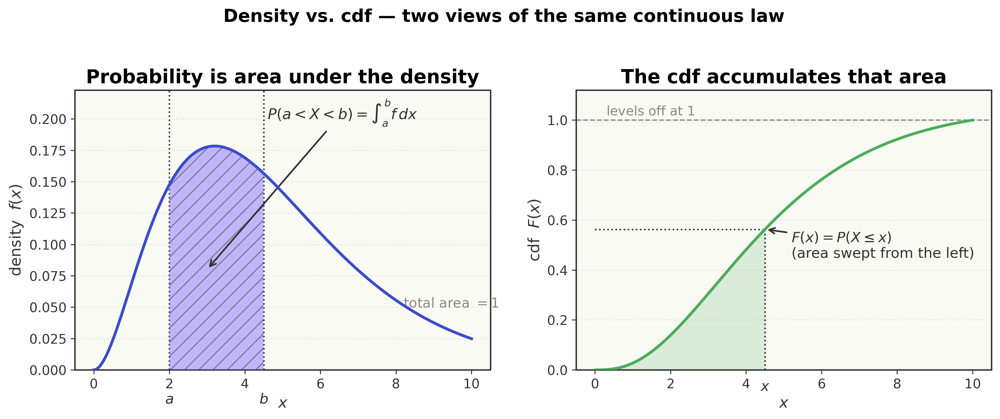
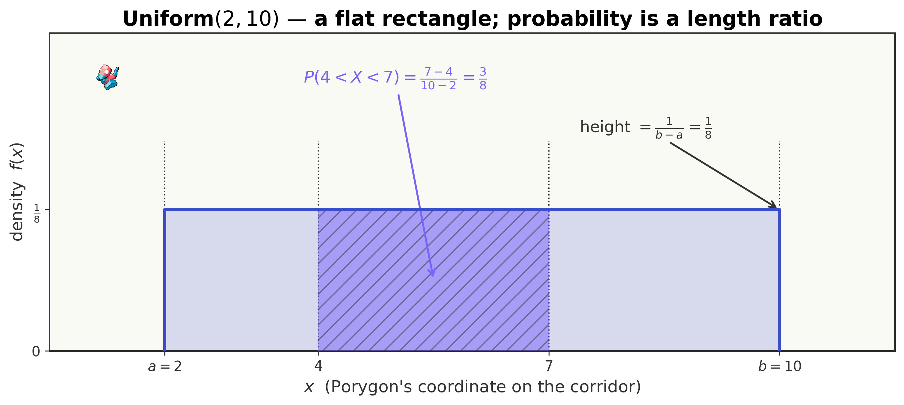
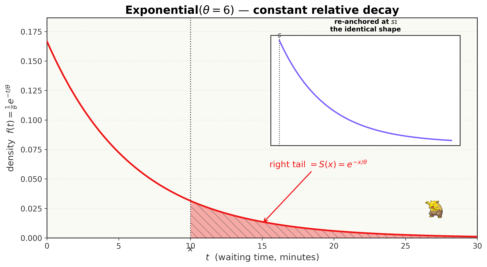
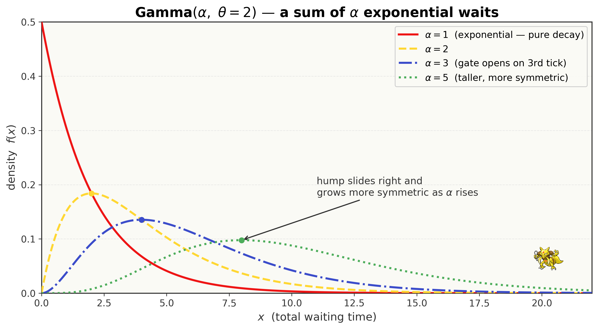
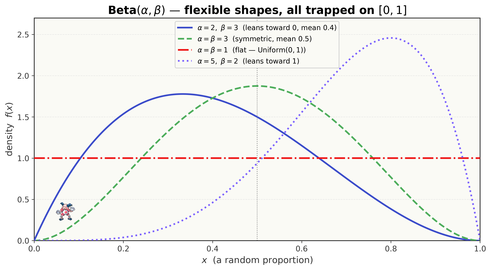
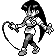
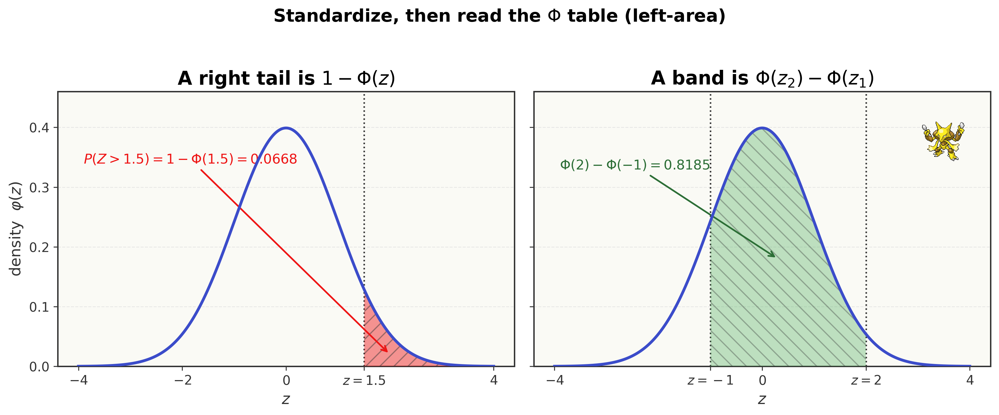
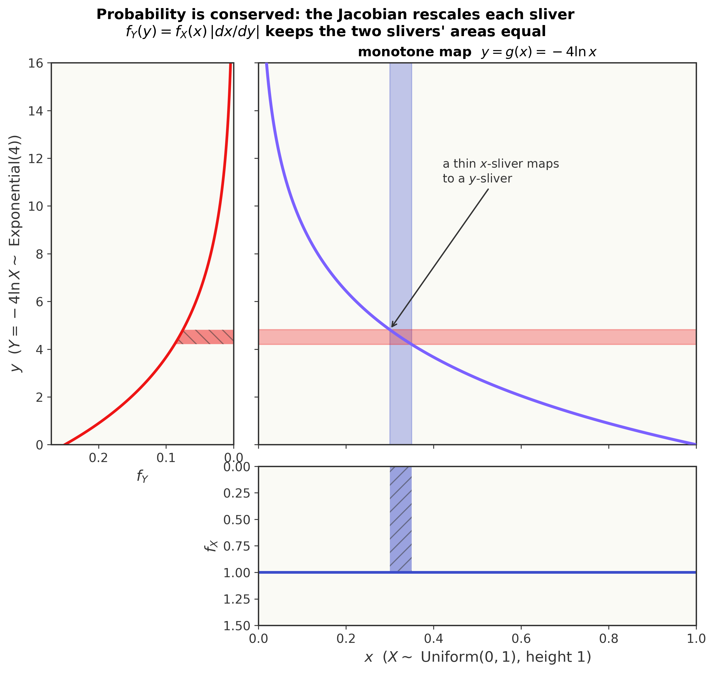

<!--
  file: ch09_continuous
  tier: B
  outcomes: 2d3
  draft1_source: drafts/chapters_draft1/ch07_saffron_city.md
  maps_to: Saffron, Sabrina — the smooth, continuous world
-->

# The Named Patterns II — Continuous Distributions & Transformations {.type-psychic}

<figure>

<figcaption>Route to a 10 — you have reached <strong>Saffron City</strong>, the central hub of Kanto, the Silph Co. tower, and Sabrina's Psychic gym: the home of the <em>Marsh Badge</em> and the <em>smooth, continuous</em> world.</figcaption>
</figure>

::: cold-open
**▶ COLD OPEN — EPISODE: "The Tower of Smooth Things"**

You step off the maglev into Saffron City, and the world stops feeling *discrete*. In Celadon, every problem came in countable chunks — *how many* Gastly, *how many* spins, *how many* successful catches. You could line the answers up: $0, 1, 2, 3, \dots$, and a probability sat on each.

Here, inside the Silph Co. tower that Sabrina's mind has folded into a single endless gradient, nothing comes in chunks at all. A psychic meter on the wall does not *tick* from $4$ to $5$; it **glides**, smooth and continuous, settling anywhere between — $4.3$, $4.31$, $4.317\ldots$ — with no smallest step.

"Her power is a *quantity*," Misty whispers, watching the dial breathe. "Not a count. You can't list its values — there are too many, packed too tight. You can only ever ask how likely a *range* is."

A telepathic voice settles directly into your skull, calm and amused. *"My readings follow a curve, trainer. Most of the time I sit near my average. Rarely — very rarely — I spike far above it. Tell me the chance my next reading lands in a band you choose, and I will let you challenge me. Fail, and the doll-dimension keeps you."*

Pikachu's cheeks spark — the intuition check. There's a wall chart of the dial's behavior, and it is shaped like a **bell**: tall in the middle, tailing off smoothly to either side. You've heard Oak mutter about a curve so universal it shows up everywhere — heights, measurement errors, the sum of many small shocks.

Across the room a fainted Abra glows faintly, recovering. A timer beside it reads *"expected remaining recovery: ?"* — and the timer has been running for ten minutes already, yet the estimate **refuses to drop**. *How can waiting longer not bring the cure any closer?*

To leave Saffron you'll need to read a smooth curve, turn it into the probability of a range, recognize the handful of named shapes the world keeps falling into, and explain a memory that resets itself. *But the dial has no list of values to add up — so where does the probability even come from?*
:::

## Where You Are — 60-Second Retrieval

You hold the Rainbow Badge from Celadon. There you met your first **named patterns** — the *discrete* families (Bernoulli, binomial, geometric, Poisson). For a discrete $X$ you had a **probability mass function** $p(x) = P(X = x)$: a real probability sitting on each value, all of them summing to $1$,

$$\sum_x p(x) = 1, \qquad \E[X] = \sum_x x\,p(x).$$

You also learned, back in Vermilion, that **expectation is a probability-weighted average** and that **variance** measures spread, $\Var(X) = \E[X^2] - (\E[X])^2$.

This chapter keeps every one of those ideas — but trades the **sum** for an **integral**, because now the values come in an unbroken continuum and there is nothing to "add up." Take sixty seconds and prove you still own the discrete picture before we make it smooth.

::: trainers-tip
**60-SECOND RETRIEVAL — prove you still own the last chapter**

Answer from memory; if any feels shaky, flip back before continuing.

1. For a discrete $X$, what must $\sum_x p(x)$ equal? *(Answer: $1$.)*
2. Write $\E[X]$ for a discrete $X$ as a sum. *(Answer: $\sum_x x\,p(x)$.)*
3. $\Var(X) = \E[X^2] - (\;?\;)^2$. *(Answer: $\E[X]$ — variance is the mean of the square minus the square of the mean.)*

All three instant? You're ready to make them smooth. Any hesitation? The retrieval *is* the lesson — go reclaim it, then come back.
:::

## Oak's Briefing — Learning Outcomes & Test-Out Gate

<figure style="margin:1.5em auto; max-width:160px; text-align:center;">

<figcaption style="font-size:0.85em;">Professor Oak — the formalizer</figcaption>
</figure>

Professor Oak's voice crackles through the Pokédex's Actuary Mode as you stare at the gliding dial.

"Saffron is the *smooth* city, Ash. Everything you measure here — a time, a length, a temperature, a proportion — is **continuous**: it lives on a number line with no gaps, and a single exact value has probability *zero*. That sounds strange, but it is the gateway to nearly all of actuarial science. Five named curves do almost all the work — the **uniform**, the **exponential**, the **gamma**, the **beta**, and the famous **normal** bell. Learn to recognize each on sight, integrate a density into a probability, and *reshape* one variable into another, and you can price a waiting time, a loss, or a measurement error. Take it carefully; this is the continuous half of the whole exam."

By the end of this chapter you will be able to:

- **Read** a probability *density* $f(x)$ and turn it into a probability by **integrating** ($P(a<X<b)=\int_a^b f$), moving fluently among the density, the **cdf** $F$, and the **survival function** $S$. *(Outcome 2d3.)*
- **Recognize and use the five in-scope continuous families** — uniform, exponential, gamma, beta, normal — stating each pdf, mean, and variance from its recognition cue. *(Outcome 2d3.)*
- **Standardize** any normal via $Z = (X-\mu)/\sigma$ and read probabilities off the provided $\Phi$ table, using symmetry $\Phi(-z) = 1-\Phi(z)$ and inverse lookups. *(Outcome 2d3.)*
- **Exploit** the exponential's **memorylessness** to collapse any "given it has already lasted $s$" condition, and apply the gamma-integral shortcut $\int_0^\infty x^{\alpha-1}e^{-x/\theta}\,dx = \Gamma(\alpha)\theta^{\alpha}$. *(Outcome 2d3.)*
- **Transform** a single variable $Y=g(X)$ by the **cdf method** and the **change-of-variable (Jacobian) method**. *(Outcome 2d3.)*

> *Exam-weight signpost.* Continuous distributions and single-variable transformations are a **steadily tested** slice of Exam P's Univariate section — the normal and exponential especially. This is a **Tier B** chapter: it earns the full nine-beat teaching for each idea, with a lighter ramp than the Tier-A proving grounds, and everything here is reused in pricing, joint distributions, and the CLT.

::: concept-gate
**CHAPTER TEST-OUT GATE — Do You Already Own All of Saffron?**

Already fluent with continuous distributions? Prove it. Work these five, ~3 minutes each, *with correct method*:

1. $X\sim\Unif(2,10)$. Find $P(4<X<7)$, $\E[X]$, and $\Var(X)$.
2. $X\sim\Expo(\theta=6)$ minutes, already running $4$ minutes with no event. Find $P(X>10\given X>4)$ and the expected *remaining* wait.
3. $X\sim\Normal(50,8^2)$. Find $P(X>62)$ using $\Phi(1.5)=0.9332$.
4. $X\sim\GammaDist(\alpha=3,\theta=2)$. Find $\E[X]$ and $\Var(X)$.
5. $X\sim\Unif(0,1)$ and $Y=-4\ln X$. Find the density of $Y$ and name the family.

*(Answers: $0.375$, $\E=6$, $\Var=5.\overline{3}$; $\,e^{-1}\approx0.368$ and $6$ min; $\,0.0668$; $\,\E=6$, $\Var=12$; $\,f_Y(y)=\tfrac14 e^{-y/4}$, an $\Expo(4)$.)* Five for five with the right reasoning? **Skip to the Gym Challenge** and claim the badge. Any miss or hesitation? The teaching below was built exactly for you — and each concept has its own skip-gate, so even a partial owner loses no time.
:::

---

Seven ideas build on one another here, in increasing difficulty. We teach them **in order**, each with its own "do you already own this?" skip-check, then the full nine-beat lesson, then a Pokédex Entry you can carry into the exam:

0. **Density, cdf, survival** — what "continuous" even means *(the foundation everything uses)*
1. **The continuous uniform** — flat, the simplest curve
2. **The exponential** — waiting time, and the memory that resets
3. **The gamma** — the sum of waits, and a Master-Ball integral
4. **The beta** — a random proportion trapped on $[0,1]$
5. **The normal** — the bell, and how to standardize it
6. **Transformations** — reshaping one variable into another *(the capstone skill)*

## Concept 0 — Density, CDF, and Survival: What "Continuous" Means

::: concept-gate
**DO YOU ALREADY OWN THIS? — Density vs. probability**

A continuous $X$ has density $f(x) = \tfrac{1}{2}$ on the interval $0 < x < 2$. What is $P(X = 1)$, and what is $P(0.5 < X < 1.5)$?

If you answered **$P(X=1) = 0$** (a single point has zero probability) and **$P(0.5<X<1.5) = \tfrac12\cdot 1 = 0.5$** (area = height $\times$ width), you own the foundation — **skip to Concept 1**. If "$P(X=1)=0$" surprised you, or you tried to read $f(1)=\tfrac12$ as a probability, this section is for you.
:::

**Beat 1 — The one-sentence idea.** *For a continuous variable, probability is not a number sitting on each value — it is the **area under a curve** over a range, and the curve itself is the density.*

**Beat 2 — Anchor + concrete instance.** In Celadon, a discrete $X$ had a *bar* of height $p(x)$ over each value, and the bars' heights *were* the probabilities. Now picture Sabrina's dial, which can land *anywhere* in $0 < x < 2$, with no value preferred. There are infinitely many possible readings, so no single one can carry positive probability — if each of infinitely many points had even a tiny probability, the total would blow past $1$. Instead the probability is spread *smoothly* across the interval as a curve $f(x)$ of height $\tfrac12$.

**Beat 3 — Reason through it in plain words.** Ask: what's the chance the dial lands *exactly* on $1.000000\ldots$? Essentially impossible — it's one point out of a continuum, so $P(X=1)=0$. The right question is about a **band**: what's the chance it lands between $0.5$ and $1.5$? That band is $1$ unit wide, and the curve sits at height $\tfrac12$ across it, so the area is

$$\text{height}\times\text{width} = \tfrac12 \times 1 = 0.5.$$

Probability *is* that rectangle of area. The whole interval $0<x<2$ has area $\tfrac12\times 2 = 1$ — as every probability must total $1$.

**Beat 4 — Surface and dismantle the tempting wrong idea.** The natural mistake carried over from discrete-land is to read **the height of the density as a probability**:

$$f(1) = \tfrac12 \;\overset{?}{=}\; P(X=1). \qquad\textbf{(wrong)}$$

It is *not*. A density can even exceed $1$ — if $X\sim\Unif(0,0.5)$ the height is $\tfrac{1}{0.5}=2$ — and no probability is ever $2$. The height is a *rate of probability per unit length*; only when you **multiply by a width** (integrate) does it become a probability. For a single point the width is $0$, so the probability is $0$. *Density is not probability; area is.*

**Beat 5 — Translate into notation, one glyph at a time.** Three objects, introduced one at a time.

The **probability density function** (pdf) is written $f(x)$, read aloud *"the density of $X$ at $x$."* It must be non-negative and enclose total area $1$:

$$f(x) \ge 0, \qquad \int_{-\infty}^{\infty} f(x)\,dx = 1.$$

That $\int$ is the **integral sign**, read *"the integral of."* It is the continuous cousin of the summation $\sum$ you met in Cerulean: where $\sum$ *adds up* values, $\int \ldots dx$ *accumulates area* under the curve. The little $dx$ marks the variable you sweep across. Probability of a band is the integral over that band:

$$P(a < X < b) = \int_a^b f(x)\,dx \qquad \text{read: "the area under } f \text{ from } a \text{ to } b\text{."}$$

The **cumulative distribution function** (cdf), written $F(x)$ and read *"the cdf of $X$,"* sweeps the area up *to* a point:

$$F(x) = P(X \le x) = \int_{-\infty}^{x} f(t)\,dt.$$

And because integrating then differentiating undo each other, the density is the **slope** of the cdf:

$$f(x) = F'(x).$$

Finally the **survival function**, written $S(x)$ and read *"the survival function"* (or *"the chance of exceeding $x$"*), is everything to the *right*:

$$S(x) = P(X > x) = 1 - F(x).$$

**Beat 6 — Generalize: derive the relationships from the instance.** None of these is asserted; each follows from "probability is area." The total area is $1$, so $P(X>x)$ (right area) and $P(X\le x)$ (left area) must sum to $1$ — that *is* $S = 1-F$. The band $(a,b)$ is the left-area up to $b$ minus the left-area up to $a$, so $P(a<X<b) = F(b)-F(a)$. And since $F$ accumulates area, its instantaneous rate of accumulation — its derivative — is exactly the height $f$. Three facts, one picture.

**Beat 7 — Ramp the difficulty.**

- *Simplest:* flat density, area = height $\times$ width, as above.
- *Twist (curved density):* if $f(x)=2x$ on $(0,1)$, the area is no longer a rectangle — you must integrate: $P(X<\tfrac12)=\int_0^{1/2}2x\,dx = [x^2]_0^{1/2}=\tfrac14$. The taller right side means values near $1$ are more likely.
- *Edge (open vs. closed):* because single points have probability $0$, it never matters whether an endpoint is included: $P(X<b)=P(X\le b)$ for continuous $X$. (For discrete $X$ it *did* matter — that's a real difference between the two worlds.)

**Beat 8 — Picture it.** The density and the cdf are two views of the same information: area versus accumulated-area.

<figure>

<figcaption>Probability is area. $P(a<X<b)$ is the shaded region under the density $f$; the whole area is $1$. The cdf $F(x)$ is the area swept from the left up to $x$.</figcaption>
</figure>

**Beat 9 — Consolidate.** You can now move freely among the four faces of a continuous law: $f$ (density/slope), $F$ (left area), $S$ (right area), and a band probability (an integral or a difference $F(b)-F(a)$). Every named curve below is just a *specific choice* of $f$.

::: pokedex-entry
**POKÉDEX ENTRY №01 — Density, CDF, Survival**

$$f(x)\ge 0,\quad \int_{-\infty}^{\infty} f = 1, \qquad P(a<X<b)=\int_a^b f(x)\,dx.$$
$$F(x) = P(X\le x) = \int_{-\infty}^x f,\qquad f(x)=F'(x),\qquad S(x)=P(X>x)=1-F(x).$$

*In plain terms:* the density is a *rate* of probability, not a probability; you only get a probability by **integrating** over a range. A single point has probability $0$, so open and closed endpoints agree.

*Recognition cue:* a smooth curve, a "time/length/temperature/proportion," "density $f(x)=\ldots$," or "find $P(a<X<b)$" $\to$ integrate the density, or difference the cdf $F(b)-F(a)$.
:::

## Concept 1 — The Continuous Uniform: The Flat Curve

::: concept-gate
**DO YOU ALREADY OWN THIS? — Uniform**

A glitching Porygon spawns at a coordinate $X\sim\Unif(2,10)$ (equally likely anywhere on $[2,10]$). What is $P(4<X<7)$?

If you answered **$\tfrac{7-4}{10-2}=\tfrac{3}{8}=0.375$** (a length ratio) and can write $\E[X]=6$, **skip to Concept 2**. If you're not sure why it's a ratio of lengths, read on — this is the gentlest curve in the chapter.
:::

**Beat 1 — The one-sentence idea.** *When every value in an interval is equally likely, the density is a flat rectangle, and any probability is just a ratio of lengths.*

**Beat 2 — Anchor + concrete instance.** This is Concept 0 with the simplest possible $f$: a constant. A glitching **Porygon** spawns somewhere on the corridor between coordinates $2$ and $10$, with **no point preferred**. Its position is $X\sim\Unif(2,10)$. To dodge it you need $P(4<X<7)$.

<figure style="margin:1.5em auto; max-width:150px; text-align:center;">

<figcaption style="font-size:0.85em;"><strong>#137 Porygon — spawns uniformly on the corridor</strong></figcaption>
</figure>

**Beat 3 — Reason through it in plain words.** The corridor is $10-2 = 8$ units long, and the probability is spread evenly across it. The dangerous band $(4,7)$ is $7-4 = 3$ units long. "Evenly spread" means probability is proportional to length, so

$$P(4<X<7) = \frac{\text{band length}}{\text{total length}} = \frac{3}{8} = 0.375.$$

For the density to enclose area $1$ over a length-$8$ interval, its constant height must be $\tfrac{1}{8}$ — then $\tfrac18\times 8 = 1$.

**Beat 4 — Surface and dismantle the tempting wrong idea.** A common slip is to forget the interval doesn't start at $0$ and divide by the *upper endpoint*:

$$\frac{7-4}{10} = 0.30. \qquad\textbf{(wrong — the corridor starts at 2, not 0)}$$

The total length is $b-a = 10-2 = 8$, **not** $10$. Always measure both the band and the whole interval from the *true* lower endpoint $a$.

**Beat 5 — Translate into notation, one glyph at a time.** Write $X\sim\Unif(a,b)$, read *"$X$ is uniform on $a$ to $b$."* The flat density is

$$f(x) = \frac{1}{b-a}, \qquad a \le x \le b,$$

and zero elsewhere. The cdf accumulates that constant linearly: $F(x) = \dfrac{x-a}{b-a}$.

**Beat 6 — Generalize: derive the mean and variance.** The center of a flat rectangle is its midpoint, so $\E[X]=\tfrac{a+b}{2}$ — no integral needed, by symmetry. For the spread, integrate $\E[X^2]=\int_a^b x^2\tfrac{1}{b-a}\,dx$ and subtract $(\E[X])^2$; the algebra collapses to the clean

$$\E[X] = \frac{a+b}{2}, \qquad \Var(X) = \frac{(b-a)^2}{12}.$$

**Beat 7 — Ramp the difficulty.**

- *Simplest:* the Porygon band, $0.375$.
- *Twist (the standard uniform):* $\Unif(0,1)$ has $f(x)=1$, $\E=\tfrac12$, $\Var=\tfrac{1}{12}$. It is the raw material every simulator uses to manufacture *every other* distribution (you'll see this in Concept 6).
- *Edge:* for our Porygon, $\Var = \tfrac{(10-2)^2}{12} = \tfrac{64}{12} = 5.\overline{3}$, so $\SD \approx 2.31$ — a little over a quarter of the corridor, which matches the eye.

**Beat 8 — Picture it.** The density is literally a rectangle; probability is the sub-rectangle over your band.

<figure>

<figcaption>The uniform density is a flat rectangle of height $1/(b-a)$. A band's probability is its shaded sub-rectangle — a pure length ratio.</figcaption>
</figure>

**Beat 9 — Consolidate.** You can read any uniform probability as a length ratio, and write its mean (the midpoint) and variance $\tfrac{(b-a)^2}{12}$ on sight.

::: pokedex-entry
**POKÉDEX ENTRY №02 — Continuous Uniform $\Unif(a,b)$**

$$f(x)=\frac{1}{b-a}\ (a\le x\le b),\quad F(x)=\frac{x-a}{b-a},\quad \E[X]=\frac{a+b}{2},\quad \Var(X)=\frac{(b-a)^2}{12}.$$

*In plain terms:* every value on $[a,b]$ is equally likely; probability is a ratio of lengths.

*Recognition cue:* "equally likely anywhere between," "chosen at random from the interval," "no point preferred" $\to$ uniform. Mean = midpoint; the $/12$ in the variance is worth memorizing.
:::

## Concept 2 — The Exponential: Waiting Time and the Memory That Resets

::: concept-gate
**DO YOU ALREADY OWN THIS? — Exponential & memorylessness**

A Drowzee's hypnosis lasts $X\sim\Expo(\theta=6)$ minutes. It has already lasted $4$ minutes. What is $P(X>10\given X>4)$, and what is the expected *remaining* duration?

If you answered **$P(X>10\given X>4) = P(X>6) = e^{-1}\approx 0.368$** (the clock resets) and **expected remaining $= \theta = 6$ minutes**, you own memorylessness — **skip to Concept 3**. If you tried to subtract probabilities the long way or expected the remaining time to shrink, read on — this is the signature idea of the chapter.
:::

**Beat 1 — The one-sentence idea.** *The exponential is the waiting time until a purely random event, and it is **memoryless**: however long you've already waited, the remaining wait is a fresh exponential.*

**Beat 2 — Anchor + concrete instance.** Back in Celadon, the **Poisson** counted how *many* random events happen in a fixed time. The exponential is the other side of the same coin: the *gap between* those events — a continuous waiting time. A **Drowzee** puts your Pokémon under hypnosis that lasts $X\sim\Expo(\theta=6)$ minutes (mean $6$). You've already waited $4$ minutes; what's the chance it lasts past $10$, given it's still going — and how much longer should you expect?

<figure style="margin:1.5em auto; max-width:150px; text-align:center;">

<figcaption style="font-size:0.85em;"><strong>#096 Drowzee — its hypnosis is an exponential wait</strong></figcaption>
</figure>

**Beat 3 — Reason through it in plain words.** The exponential's defining feature: it has a **constant hazard** — at every instant, the event is equally "due," no matter how long you've already waited. So waiting $4$ minutes gives you *no information* about how much longer it'll go. The remaining time behaves exactly as if you'd just started: a fresh $\Expo(6)$. Therefore the chance of lasting "$6$ more minutes" past the $4$ you've waited equals the plain chance a *fresh* exponential exceeds $6$:

$$P(X>10\given X>4) = P(X>6) = e^{-6/6} = e^{-1} \approx 0.368,$$

and the expected remaining wait is the full mean again: $6$ minutes. *That* is why Sabrina's Abra timer never drops — the cure is exponential, and an exponential forgets.

**Beat 4 — Surface and dismantle the tempting wrong idea.** The natural intuition is *"I've already waited $4$ of an expected $6$ minutes, so only $2$ should remain."*

$$\E[\text{remaining}] \overset{?}{=} 6 - 4 = 2. \qquad\textbf{(wrong — that's how a fixed appointment works, not a memoryless wait)}$$

If the hypnosis had a *fixed* duration, waiting would burn it down. But a constant-hazard process has no schedule to burn down: each new instant is a fresh roll of the same dice. The elapsed $4$ minutes are gone and irrelevant; the expected remaining wait is the full $6$. (This is genuinely strange the first time — and it is *the* exponential pitfall on the exam.)

**Beat 5 — Translate into notation, one glyph at a time.** Write $X\sim\Expo(\theta)$, read *"$X$ is exponential with mean $\theta$."* Its density, cdf, and survival are

$$f(x)=\frac{1}{\theta}e^{-x/\theta}\ (x>0), \qquad F(x)=1-e^{-x/\theta}, \qquad S(x)=e^{-x/\theta}.$$

That clean survival function $S(x)=e^{-x/\theta}$ is the workhorse — read it *"the chance of waiting longer than $x$."* Some texts use the **rate** $\lambda = 1/\theta$ instead, writing $f(x)=\lambda e^{-\lambda x}$; same curve, reciprocal parameter. **Watch which one a problem hands you** — mean $\theta$ or rate $\lambda$.

The memoryless property, in symbols, is

$$P(X > s+t \given X > s) = P(X > t) \qquad \text{read: "having survived } s\text{, the extra wait is a fresh } \Expo(\theta)\text{."}$$

**Beat 6 — Generalize: derive memorylessness (it's just algebra).** Don't take it on faith — derive it from the definition of conditional probability and the survival function. Since "$X>s+t$" already implies "$X>s$," their intersection is just "$X>s+t$":

$$P(X>s+t\given X>s) = \frac{P(X>s+t)}{P(X>s)} = \frac{e^{-(s+t)/\theta}}{e^{-s/\theta}} = e^{-t/\theta} = P(X>t).$$

The elapsed-$s$ factor $e^{-s/\theta}$ **cancels top and bottom** — that cancellation *is* the lost memory. And $\E[X]=\theta$, $\Var(X)=\theta^2$ follow from integrating (or from the gamma facts next door, since $\Expo(\theta)=\GammaDist(1,\theta)$).

**Beat 7 — Ramp the difficulty.**

- *Simplest:* a survival probability, $P(X>x)=e^{-x/\theta}$ in one keystroke.
- *Twist (memoryless conditioning):* the Drowzee question — collapse "given it's lasted $s$" to a fresh exponential, as above.
- *Edge (minimum of exponentials):* if two independent exponentials race, the *first* to fire is itself exponential with the **rates added**: $\min(\Expo(\theta_1),\Expo(\theta_2))$ has rate $\tfrac{1}{\theta_1}+\tfrac{1}{\theta_2}$. (Two Abra each $\Expo(12)$: the first recovers as $\Expo(6)$. Problem C9.12.)

**Beat 8 — Picture it.** The exponential density is a decaying curve; the survival function is the area in its right tail, which shrinks geometrically.

<figure>

<figcaption>The exponential decays at a constant *relative* rate. Shaded right tail = $S(x)=e^{-x/\theta}$. Re-anchoring at any $s$ reproduces the identical shape — the picture of memorylessness.</figcaption>
</figure>

**Beat 9 — Consolidate.** You can compute exponential probabilities through $S(x)=e^{-x/\theta}$, and — the headline skill — collapse any "given it has already lasted $s$" condition to a fresh $\Expo(\theta)$ with expected remaining wait still $\theta$.

::: pokedex-entry
**POKÉDEX ENTRY №03 — Exponential $\Expo(\theta)$**

$$f(x)=\frac{1}{\theta}e^{-x/\theta},\quad S(x)=e^{-x/\theta},\quad \E[X]=\theta,\quad \Var(X)=\theta^2,\quad M(t)=\frac{1}{1-\theta t}\ (t<\tfrac1\theta).$$
Memoryless: $\;P(X>s+t\given X>s) = P(X>t)$.

*In plain terms:* the waiting time until the next purely random event; its single parameter $\theta$ is the mean wait. The gaps between Poisson events are exponential.

*Recognition cue:* "time until," "time between," "memoryless," "constant failure rate" $\to$ exponential. The instant you see "given it has already lasted $s$," reset the clock — the remaining wait is a fresh $\Expo(\theta)$.
:::

## Concept 3 — The Gamma: A Sum of Waits, and a Master-Ball Integral

::: concept-gate
**DO YOU ALREADY OWN THIS? — Gamma**

A gate opens only after the **3rd** independent "tick," each tick $\Expo(\theta=2)$ seconds apart. Let $X$ be the total time. What are $\E[X]$ and $\Var(X)$? And what is $\int_0^\infty x^2 e^{-x/2}\,dx$?

If you answered **$\E[X]=6$, $\Var(X)=12$** (it's a $\GammaDist(3,2)$) and **$\int_0^\infty x^2 e^{-x/2}\,dx = \Gamma(3)\,2^3 = 2!\cdot 8 = 16$**, you own the gamma — **skip to Concept 4**. If the integral looked frightening, read on — there's a one-line trick.
:::

**Beat 1 — The one-sentence idea.** *The gamma is the total time to wait for the $\alpha$-th random event — a sum of $\alpha$ independent exponentials — and any integral shaped like its density evaluates in one line.*

**Beat 2 — Anchor + concrete instance.** This is the exponential, *stacked*. One exponential wait gets you to the first event; add $\alpha$ of them and you reach the $\alpha$-th. Sabrina's Kadabra charges a teleport that fires on each "tick," ticks independent $\Expo(\theta=2)$ seconds apart, and the gate opens only after the **3rd** tick. The total time $X$ to the 3rd tick is the sum of three independent $\Expo(2)$ waits.

<figure style="margin:1.5em auto; max-width:150px; text-align:center;">

<figcaption style="font-size:0.85em;"><strong>#064 Kadabra — the 3rd teleport tick is a gamma wait</strong></figcaption>
</figure>

**Beat 3 — Reason through it in plain words.** Means add: three waits, each averaging $2$ seconds, average $3\times 2 = 6$ seconds total. Variances of *independent* pieces add too: each $\Expo(2)$ has variance $\theta^2 = 4$, so three give $3\times 4 = 12$. *(That variances add for independent pieces is the one fact here we borrow ahead — it is proved in Ch 13; for now lean on it as the natural twin of the means-add rule you already trust.)* So even before naming the curve, $\E[X]=6$ and $\Var(X)=12$ — just "means add, variances of independent things add."

**Beat 4 — Surface and dismantle the tempting wrong idea.** A frequent slip is miscounting the **shape** $\alpha$. The number of *waits* is $3$, so $\alpha=3$ — not $2$ (the count of *gaps between* the first and last, say) and not the exponent of $x$ in the density. Reading $\alpha$ off the wrong feature corrupts every moment. **$\alpha$ is the number of exponential waits summed; $\theta$ is each wait's mean.**

**Beat 5 — Translate into notation, one glyph at a time.** Write $X\sim\GammaDist(\alpha,\theta)$, read *"gamma with shape $\alpha$, scale $\theta$."* Its density is

$$f(x) = \frac{1}{\Gamma(\alpha)\,\theta^{\alpha}}\,x^{\alpha-1}e^{-x/\theta}, \qquad x>0.$$

The new symbol $\Gamma(\alpha)$ is the **gamma function**, read *"gamma of $\alpha$"* — a smooth factorial. For a whole number it *is* a shifted factorial: $\Gamma(n)=(n-1)!$, and the one special value you'll need is $\Gamma(\tfrac12)=\sqrt{\pi}$. With $\alpha=1$ the density collapses to $\tfrac1\theta e^{-x/\theta}$ — exactly the exponential, as promised.

**Beat 6 — Generalize: the Master-Ball integral, derived from the area-$1$ law.** Because the density integrates to $1$,

$$\int_0^\infty \frac{1}{\Gamma(\alpha)\theta^{\alpha}}\,x^{\alpha-1}e^{-x/\theta}\,dx = 1 \;\Longrightarrow\; \boxed{\;\int_0^\infty x^{\alpha-1}e^{-x/\theta}\,dx = \Gamma(\alpha)\,\theta^{\alpha}.\;}$$

That boxed line — call it the **Master-Ball integral** — turns *any* integral of the form $x^{\text{power}}e^{-x/\theta}$ into a one-line lookup. Match the exponent of $x$ to "$\alpha-1$," read off $\alpha$, and the answer is $\Gamma(\alpha)\theta^{\alpha}$. The moments $\E[X]=\alpha\theta$ and $\Var(X)=\alpha\theta^2$ pop straight out of it (and match "means/variances add" from Beat 3).

**Beat 7 — Ramp the difficulty.**

- *Simplest:* read off $\E[X]=\alpha\theta=6$, $\Var(X)=\alpha\theta^2 = 3\cdot 4 = 12$.
- *Twist (the scary integral, tamed):* $\int_0^\infty x^2 e^{-x/2}\,dx$ has exponent $2=\alpha-1$, so $\alpha=3$ and it equals $\Gamma(3)\,2^3 = 2!\cdot 8 = 16$. No integration by parts.
- *Edge (a higher moment):* for our $\GammaDist(3,2)$, $\E[X^2]=\Var+(\E)^2 = 12+36 = 48$ — or grind it directly: $\E[X^2]=\int_0^\infty x^2\cdot\tfrac{1}{16}x^2 e^{-x/2}\,dx = \tfrac{1}{16}\,\Gamma(5)\,2^5 = \tfrac{1}{16}\cdot 24\cdot 32 = 48$. Same answer, the long way.

**Beat 8 — Picture it.** The gamma is a right-skewed hump whose shape $\alpha$ controls how peaked it is.

<figure>

<figcaption>The gamma: a sum of $\alpha$ exponential waits. Larger $\alpha$ pushes the hump right and makes it more symmetric; $\alpha=1$ recovers the pure-decay exponential.</figcaption>
</figure>

**Beat 9 — Consolidate.** You can recognize a sum of exponential waits as a gamma, write $\E=\alpha\theta$ and $\Var=\alpha\theta^2$, and — the time-saver — evaluate any $\int_0^\infty x^{\alpha-1}e^{-x/\theta}\,dx = \Gamma(\alpha)\theta^{\alpha}$ on sight.

::: pokedex-entry
**POKÉDEX ENTRY №04 — Gamma $\GammaDist(\alpha,\theta)$**

$$f(x)=\frac{1}{\Gamma(\alpha)\theta^{\alpha}}x^{\alpha-1}e^{-x/\theta}\ (x>0),\quad \E[X]=\alpha\theta,\quad \Var(X)=\alpha\theta^2,\quad M(t)=(1-\theta t)^{-\alpha}.$$
**Master-Ball integral:** $\displaystyle\int_0^\infty x^{\alpha-1}e^{-x/\theta}\,dx=\Gamma(\alpha)\theta^{\alpha}$, with $\Gamma(n)=(n-1)!$, $\Gamma(\tfrac12)=\sqrt\pi$.

*In plain terms:* the time until the $\alpha$-th random event — a sum of $\alpha$ independent $\Expo(\theta)$ waits. $\alpha=1$ is the exponential.

*Recognition cue:* "time until the $k$-th event," "sum of $k$ exponential waits," or a density $\propto x^{\alpha-1}e^{-x/\theta}$ $\to$ gamma. Any $\int_0^\infty x^{k}e^{-x/\theta}dx \to \Gamma(k{+}1)\theta^{k+1}=k!\,\theta^{k+1}$.
:::

## Concept 4 — The Beta: A Random Proportion on $[0,1]$

::: concept-gate
**DO YOU ALREADY OWN THIS? — Beta**

The fraction of a psychic barrier that holds is $X\sim\BetaDist(\alpha=2,\beta=3)$. What is $\E[X]$, and is it above or below $\tfrac12$?

If you answered **$\E[X]=\tfrac{\alpha}{\alpha+\beta}=\tfrac{2}{5}=0.4$**, below $\tfrac12$ (more mass toward $0$), **skip to Concept 5**. If you're unsure how to get the mean of a proportion, read on — it's a short one.
:::

**Beat 1 — The one-sentence idea.** *The beta is the distribution of a random **proportion** — a flexible curve trapped between $0$ and $1$.*

**Beat 2 — Anchor + concrete instance.** Every distribution so far lived on an unbounded or arbitrary interval. But many real quantities are *fractions*: a percentage, a recovery rate, the share of something. The fraction $X$ of a psychic barrier that **holds** is $X\sim\BetaDist(\alpha=2,\beta=3)$. We want its average and its shape.

**Beat 3 — Reason through it in plain words.** Think of $\alpha$ as "weight pulling toward $1$" and $\beta$ as "weight pulling toward $0$." With $\alpha=2$ and $\beta=3$, the pull toward $0$ is stronger, so the typical fraction should sit *below* $\tfrac12$ — the barrier usually fails more than it holds. The center is the share of total weight on the $\alpha$ side: $\tfrac{2}{2+3} = 0.4$. That matches the picture.

**Beat 4 — Surface and dismantle the tempting wrong idea.** It is tempting to guess the mean is "halfway," $0.5$, just because the support is $[0,1]$.

$$\E[X] \overset{?}{=} 0.5. \qquad\textbf{(wrong unless } \alpha=\beta\text{)}$$

The beta is only symmetric when $\alpha=\beta$. Here $\alpha\ne\beta$, so it tilts; the mean is $\tfrac{\alpha}{\alpha+\beta}=0.4$, not $0.5$. *Bounded support does not mean centered.*

**Beat 5 — Translate into notation, one glyph at a time.** Write $X\sim\BetaDist(\alpha,\beta)$, read *"beta with parameters $\alpha$, $\beta$."* Its density is

$$f(x) = \frac{\Gamma(\alpha+\beta)}{\Gamma(\alpha)\,\Gamma(\beta)}\,x^{\alpha-1}(1-x)^{\beta-1}, \qquad 0<x<1.$$

The fraction out front (built from the same $\Gamma$ you just met) is only there to make the area equal $1$ — the *shape* lives entirely in $x^{\alpha-1}(1-x)^{\beta-1}$, the two "pulls" multiplied.

**Beat 6 — Generalize: derive the mean from the normalizing constant.** The mean is *not* something to take on faith — the same area-$1$ trick that tamed the gamma integral derives it in one line. Abbreviate the normalizer as $C(\alpha,\beta)=\tfrac{\Gamma(\alpha+\beta)}{\Gamma(\alpha)\Gamma(\beta)}$, the constant that makes $\int_0^1 x^{\alpha-1}(1-x)^{\beta-1}\,dx = 1/C(\alpha,\beta)$. Then $\E[X]$ just bumps the $x$-exponent up by one — turning an $\alpha$-shape into an $(\alpha{+}1)$-shape — and re-uses the *same* integral identity:

$$\E[X] = \int_0^1 x\cdot C(\alpha,\beta)\,x^{\alpha-1}(1-x)^{\beta-1}\,dx = C(\alpha,\beta)\int_0^1 x^{\alpha}(1-x)^{\beta-1}\,dx = \frac{C(\alpha,\beta)}{C(\alpha+1,\beta)}.$$

Expanding that ratio with $\Gamma(n{+}1)=n\,\Gamma(n)$, everything cancels except one factor, leaving the clean weight ratio (the variance follows by the same move, bumping the exponent twice):

$$\E[X] = \frac{\alpha}{\alpha+\beta}, \qquad \Var(X) = \frac{\alpha\beta}{(\alpha+\beta)^2(\alpha+\beta+1)}.$$

For our barrier: $\E[X]=\tfrac{2}{5}=0.4$ and $\Var(X)=\tfrac{2\cdot 3}{5^2\cdot 6}=\tfrac{6}{150}=0.04$.

**Beat 7 — Ramp the difficulty.**

- *Simplest:* the mean as a weight ratio, $0.4$.
- *Twist (beta contains the uniform):* with $\alpha=\beta=1$, $x^{0}(1-x)^{0}=1$ and the normalizer is $1$, so $\BetaDist(1,1)=\Unif(0,1)$. The "flat curve" is a beta in disguise.
- *Edge (a pure-power beta):* $\BetaDist(3,1)$ has $f(x)=3x^2$ on $(0,1)$, so $P(X>0.5)=\int_{0.5}^1 3x^2\,dx = 1-0.125 = 0.875$ and $\E[X]=\tfrac{3}{4}$.

**Beat 8 — Picture it.** The beta morphs from U-shaped to bell-shaped to flat as $\alpha,\beta$ change — all on $[0,1]$.

<figure>

<figcaption>The beta family on $[0,1]$. $\alpha<\beta$ leans toward $0$; $\alpha=\beta$ is symmetric; $\alpha=\beta=1$ is the flat $\Unif(0,1)$.</figcaption>
</figure>

**Beat 9 — Consolidate.** You can recognize a "random fraction on $[0,1]$" as a beta and write its mean $\tfrac{\alpha}{\alpha+\beta}$ on sight, knowing it equals $0.5$ only when $\alpha=\beta$.

::: pokedex-entry
**POKÉDEX ENTRY №05 — Beta $\BetaDist(\alpha,\beta)$**

$$f(x)=\frac{\Gamma(\alpha+\beta)}{\Gamma(\alpha)\Gamma(\beta)}x^{\alpha-1}(1-x)^{\beta-1}\ (0<x<1),\quad \E[X]=\frac{\alpha}{\alpha+\beta},\quad \Var(X)=\frac{\alpha\beta}{(\alpha+\beta)^2(\alpha+\beta+1)}.$$

*In plain terms:* a random proportion/probability; the constant out front just normalizes the area. $\BetaDist(1,1)=\Unif(0,1)$.

*Recognition cue:* "a fraction between $0$ and $1$," "a random proportion/percentage," or a density $\propto x^{\alpha-1}(1-x)^{\beta-1}$ on $(0,1)$ $\to$ beta. Mean is the weight ratio $\alpha/(\alpha+\beta)$.
:::

## Concept 5 — The Normal: The Bell, and How to Standardize It

::: concept-gate
**DO YOU ALREADY OWN THIS? — Normal & standardization**

Sabrina's reading is $X\sim\Normal(50,8^2)$. Using $\Phi(1.5)=0.9332$ and $\Phi(1)=0.8413$, find $P(X>62)$ and $P(42<X<66)$.

If you answered **$P(X>62)=1-\Phi(1.5)=0.0668$** and **$P(42<X<66)=\Phi(2)-(1-\Phi(1))=0.8185$** (using $\Phi(2)=0.9772$), you own standardization — **skip to Concept 6**. If you got $0.9332$ for the first part (the *left* area, not the tail), read on.
:::

**Beat 1 — The one-sentence idea.** *The normal is the symmetric bell curve; you compute any normal probability by **standardizing** to $Z=(X-\mu)/\sigma$ and reading the $\Phi$ table.*

**Beat 2 — Anchor + concrete instance.** This is the curve from the cold open. Sabrina's psychic-power reading $X$ is normally distributed with mean $\mu=50$ and standard deviation $\sigma=8$ (in psi-units). To be admitted you must find $P(X>62)$, then $P(42<X<66)$.

<figure style="margin:1.5em auto; max-width:160px; text-align:center;">

<figcaption style="font-size:0.85em;">Sabrina — Saffron Gym Leader, your normal-distribution boss</figcaption>
</figure>

**Beat 3 — Reason through it in plain words.** The normal's bell has no elementary antiderivative — you *can't* integrate its density by hand. So actuaries do every normal problem through **one** universal table, for the standard bell $\Normal(0,1)$. The trick is to ask not "what's $X$?" but "how many standard deviations above the mean is it?" The value $62$ sits $\tfrac{62-50}{8}=1.5$ standard deviations above $50$. The table $\Phi$ gives the *left* area up to a $Z$-value; the chance of *exceeding* $1.5$ is the right tail:

$$P(X>62) = P(Z > 1.5) = 1 - \Phi(1.5) = 1 - 0.9332 = 0.0668.$$

For the band, standardize both ends: $\tfrac{42-50}{8}=-1$ and $\tfrac{66-50}{8}=2$, so

$$P(42<X<66) = \Phi(2) - \Phi(-1) = 0.9772 - (1-0.8413) = 0.8185.$$

**Beat 4 — Surface and dismantle the tempting wrong idea.** The $\Phi$ table always gives the **left** area. The classic error is to report $\Phi(z)$ when the question asks for a *right* tail:

$$P(X>62) \overset{?}{=} \Phi(1.5) = 0.9332. \qquad\textbf{(wrong — that's } P(X<62)\text{)}$$

A reading *above* the mean's $+1.5\sigma$ point is rare, so its probability must be *small* — $0.0668$, not $0.93$. **Always check a tail against the picture: above-center tails shrink, below-center tails are under $0.5$.** And for a negative $z$, the table has no row — use symmetry $\Phi(-z)=1-\Phi(z)$ rather than hunting for one.

**Beat 5 — Translate into notation, one glyph at a time.** Write $X\sim\Normal(\mu,\sigma^2)$ — *note the second slot is the **variance** $\sigma^2$, not $\sigma$.* Read *"$X$ is normal with mean $\mu$, variance $\sigma^2$."* The density is the bell

$$f(x) = \frac{1}{\sigma\sqrt{2\pi}}\exp\!\left[-\frac{(x-\mu)^2}{2\sigma^2}\right].$$

The **standardization** turns any normal into the *standard* one $\Normal(0,1)$:

$$Z = \frac{X-\mu}{\sigma} \sim \Normal(0,1), \qquad P(X\le x) = \Phi\!\left(\frac{x-\mu}{\sigma}\right),$$

where $\Phi$, read *"big phi,"* is the standard-normal cdf — the tabulated left-area. Symmetry of the bell gives $\Phi(-z) = 1-\Phi(z)$.

**Beat 6 — Generalize: why standardizing works.** Subtracting $\mu$ slides the bell so its center is $0$; dividing by $\sigma$ rescales so its spread is $1$. A linear shift-and-scale of a normal is *still* normal (you'll prove this in Concept 6), so $Z$ is exactly $\Normal(0,1)$ — and *every* normal probability reduces to one $\Phi$ lookup. Keep the **68–95–99.7** rule handy: about $68\%$ of mass within $1\sigma$ of the mean, $95\%$ within $2\sigma$, $99.7\%$ within $3\sigma$.

**Beat 7 — Ramp the difficulty.**

- *Simplest:* a one-sided tail, $P(X>62)=1-\Phi(1.5)=0.0668$.
- *Twist (a two-sided band):* standardize both ends and difference, $\Phi(2)-\Phi(-1)=0.8185$.
- *Inverse lookup:* "find $x_0$ with $P(X<x_0)=0.95$" runs the table *backward*: $\Phi(z)=0.95\Rightarrow z=1.645$, then $x_0=\mu+z\sigma$.
- *Edge (within $k\sigma$):* $P(\mu-k\sigma<X<\mu+k\sigma)=2\Phi(k)-1$; e.g. within $2\sigma$ is $2(0.9772)-1=0.9544$.

**Beat 8 — Picture it.** Every normal is the same bell, relabeled; standardizing overlays them onto the one table.

<figure>

<figcaption>The standard normal $\Phi$. A right tail is $1-\Phi(z)$; a band is $\Phi(z_2)-\Phi(z_1)$. Sabrina's admission tail is the sliver beyond $z=1.5$.</figcaption>
</figure>

**Beat 9 — Consolidate.** You can turn any $\Normal(\mu,\sigma^2)$ probability into a $Z$-lookup, handle right tails ($1-\Phi$), bands (a difference), negatives (symmetry), and inverse percentiles ($\mu+z\sigma$).

::: pokedex-entry
**POKÉDEX ENTRY №06 — Normal $\Normal(\mu,\sigma^2)$**

$$f(x)=\frac{1}{\sigma\sqrt{2\pi}}\exp\!\left[-\frac{(x-\mu)^2}{2\sigma^2}\right],\quad \E[X]=\mu,\quad \Var(X)=\sigma^2,\quad M(t)=\exp\!\left(\mu t+\tfrac12\sigma^2 t^2\right).$$
Standardize: $\;Z=\dfrac{X-\mu}{\sigma}\sim\Normal(0,1),\quad P(X\le x)=\Phi\!\left(\dfrac{x-\mu}{\sigma}\right),\quad \Phi(-z)=1-\Phi(z).$

*In plain terms:* the symmetric "shape of the ordinary." $\mu$ locates the center, $\sigma$ sets the spread. The second parameter slot is the **variance** $\sigma^2$.

*Recognition cue:* "bell curve," "normally distributed," "average of many," or a $\mu$, $\sigma$, and a $\Phi$ table $\to$ standardize. Memorize $68$–$95$–$99.7$.
:::

## Concept 6 — Transformations: Reshaping One Variable into Another

::: concept-gate
**DO YOU ALREADY OWN THIS? — Transformations**

Let $X\sim\Unif(0,1)$ and $Y=-4\ln X$. Find the density of $Y$ and name its family. Separately, if $X\sim\Normal(100,15^2)$ and $Y=1.2X+10$, what is the distribution of $Y$?

If you got **$f_Y(y)=\tfrac14 e^{-y/4}$, an $\Expo(4)$**, and **$Y\sim\Normal(130,18^2)$** (mean $1.2\cdot100+10$, variance $1.2^2\cdot225$), you own transformations — **skip to the Worked Examples**. If either stumped you, read on — this is the capstone skill.
:::

**Beat 1 — The one-sentence idea.** *To find the distribution of $Y=g(X)$, either chase the cdf ("when is $g(X)\le y$?") and differentiate, or — for a monotone $g$ — relabel the axis and rescale the density by the Jacobian.*

**Beat 2 — Anchor + concrete instance.** You've named six curves; now you *build* new ones by feeding a known $X$ through a function. Sabrina warps a uniform quantity: let $X\sim\Unif(0,1)$ be a raw reality coordinate and $Y=-4\ln X$ the warped one. What's the density of $Y$?

**Beat 3 — Reason through it in plain words.** Probability is conserved — relabeling the axis just moves the same area around. So to find $P(Y\le y)$, translate it back into a statement about $X$, where we *know* the probabilities. Since $\ln$ and the negative sign make $g$ decreasing, the event "$Y\le y$" becomes "$X\ge$ something":

$$P(Y\le y) = P(-4\ln X \le y) = P\!\left(\ln X \ge -\tfrac{y}{4}\right) = P\!\left(X\ge e^{-y/4}\right) = 1 - e^{-y/4},$$

using $P(X\ge c)=1-c$ for $\Unif(0,1)$. That's a cdf — differentiate to get the density.

**Beat 4 — Surface and dismantle the tempting wrong idea.** The seductive shortcut is to "just substitute" $x=$ (something in $y$) into $f_X$ and call it $f_Y$ — forgetting the **stretch factor**:

$$f_Y(y) \overset{?}{=} f_X(e^{-y/4}) = 1. \qquad\textbf{(wrong — ignores how the axis was squeezed)}$$

A density must re-balance when you stretch or squeeze the axis, or the total area drifts off $1$. The cdf method dodges this automatically (you differentiate, which *produces* the factor); the Jacobian method makes it explicit with $\left|\tfrac{dx}{dy}\right|$. Skipping it gives a non-density.

**Beat 5 — Translate into notation, one glyph at a time.** Two methods, named.

**CDF method (always works):** $F_Y(y)=P(g(X)\le y)$, reduced to an event about $X$, then $f_Y(y)=F_Y'(y)$. Here:

$$F_Y(y)=1-e^{-y/4}\;\Longrightarrow\; f_Y(y)=\frac{1}{4}e^{-y/4},\quad y>0\;\Longrightarrow\; Y\sim\Expo(4).$$

**Change-of-variable (Jacobian) method (when $g$ is monotone):** invert to $x=g^{-1}(y)$ and rescale by the **Jacobian** $\left|\tfrac{d}{dy}g^{-1}(y)\right|$, read *"how much the axis stretches":*

$$f_Y(y) = f_X\!\big(g^{-1}(y)\big)\left|\frac{d}{dy}\,g^{-1}(y)\right|.$$

Here $x=g^{-1}(y)=e^{-y/4}$, so $\left|\tfrac{dx}{dy}\right|=\tfrac14 e^{-y/4}$ and $f_Y(y)=1\cdot\tfrac14 e^{-y/4}$ — the same answer.

**Beat 6 — Generalize: why the Jacobian appears.** Conservation of probability over a tiny window says $f_Y(y)\,|dy| = f_X(x)\,|dx|$ — the same sliver of area, measured in two coordinate systems. Solving for $f_Y$ gives $f_Y(y)=f_X(x)\left|\tfrac{dx}{dy}\right|$, exactly the boxed rule. The absolute value handles a *decreasing* $g$ automatically — which is why the Jacobian method never trips on a sign flip, unlike the cdf method, where you must remember to flip the inequality. One special case is worth memorizing outright:

$$\boxed{\text{Linear rule: } Y=aX+b,\ X\sim\Normal(\mu,\sigma^2) \;\Longrightarrow\; Y\sim\Normal(a\mu+b,\,a^2\sigma^2).}$$

Normals stay normal under any linear map — shift the mean by $a\mu+b$, scale the variance by $a^2$.

**Beat 7 — Ramp the difficulty.**

- *Simplest (linear):* $Y=1.2X+10$ with $X\sim\Normal(100,15^2)$ gives $\Normal(1.2\cdot100+10,\ 1.2^2\cdot225)=\Normal(130,18^2)$. (Scale $\sigma$ by $|a|=1.2$, not $a^2$ — the $a^2$ is for the *variance*.)
- *Twist (non-monotone):* $Y=X^2$ with $X\sim\Unif(0,10)$: $F_Y(y)=P(X\le\sqrt y)=\tfrac{\sqrt y}{10}$, so $f_Y(y)=\tfrac{1}{20\sqrt y}$ on $(0,100)$. The cdf method handles the square cleanly.
- *Edge (the inverse-transform trick):* $Y=-\theta\ln U$ with $U\sim\Unif(0,1)$ is *always* $\Expo(\theta)$ — exactly how simulators manufacture exponentials from uniform random numbers.

**Beat 8 — Picture it.** A monotone $g$ relabels the axis; the Jacobian re-balances the density so the area stays $1$.

<figure>

<figcaption>A transformation relabels the axis. The Jacobian $\left|dx/dy\right|$ rescales the density so each mapped sliver keeps the same area — probability is conserved.</figcaption>
</figure>

**Beat 9 — Consolidate.** You can find the density of $Y=g(X)$ two ways — chase the cdf and differentiate, or invert and multiply by the Jacobian — and you can write the distribution of any linear map of a normal on sight.

::: pokedex-entry
**POKÉDEX ENTRY №07 — Transformations of a Single Variable**

**CDF method (always):** $F_Y(y)=P(g(X)\le y)$ reduced to an event about $X$; then $f_Y(y)=F_Y'(y)$.

**Jacobian method (monotone $g$):** $\;f_Y(y)=f_X\!\big(g^{-1}(y)\big)\left|\dfrac{d}{dy}g^{-1}(y)\right|.$

**Linear rule:** $Y=aX+b,\ X\sim\Normal(\mu,\sigma^2)\Rightarrow Y\sim\Normal(a\mu+b,\,a^2\sigma^2)$.

*In plain terms:* a smooth relabeling of the axis squeezes/stretches probability; the Jacobian re-balances the density so the area stays $1$.

*Recognition cue:* "let $Y=g(X)$, find the density of $Y$," a rescaling $Y=cX$, or "$X$ is uniform, find the distribution of $g(X)$" $\to$ cdf or Jacobian method. Non-monotone (like $X^2$) $\to$ cdf method.
:::

## Worked Examples — Faded Guidance

<figure style="margin:1.5em auto; max-width:160px; text-align:center;">

<figcaption style="font-size:0.85em;">Sabrina — your continuous-distribution mentor</figcaption>
</figure>

Four examples, fading from fully narrated to exam speed. The first leads with the **Professor's Path** (the rigorous *why*) before the **Trainer's Path** (the fast *how*).

### Worked Example 9.1 — The Abra That Won't Recover Faster (full narration; understanding-first)

**ARCHETYPE:** *Exponential memorylessness — conditional remaining lifetime.*

**Setup.** A fainted Abra's recovery time is $X\sim\Expo(\theta=12)$ minutes. The timer has already run **10 minutes** with no recovery. Find (a) $P(X>10)$, (b) the probability it recovers within the **next 5 minutes given** it hasn't yet, and (c) the expected **remaining** recovery time.

<figure style="margin:1.5em auto; max-width:150px; text-align:center;">

<figcaption style="font-size:0.85em;"><strong>#063 Abra — recovery time is exponential</strong></figcaption>
</figure>

**Step 1 — Identify.** $X\sim\Expo(12)$, so $S(x)=e^{-x/12}$. Part (b) asks $P(X<15\given X>10)$; part (c) asks $\E[X-10\given X>10]$. The "given it's already lasted $10$" flag $\to$ memorylessness (Entry №03).

**Step 2 — Professor's Path (the why).** Part (b) the long way, straight from the definition of conditional probability:
$$P(X<15\given X>10) = \frac{P(10<X<15)}{P(X>10)} = \frac{e^{-10/12}-e^{-15/12}}{e^{-10/12}} = 1 - e^{-5/12} = 0.3408.$$
The elapsed-time factor $e^{-10/12}$ **cancels top and bottom** — *that* cancellation is the memory loss. What's left, $1-e^{-5/12}$, is exactly $P(X<5)$ from a fresh start.

**Step 3 — Trainer's Path (the fast how).**
(a) $P(X>10)=e^{-10/12}=e^{-0.8333}=0.4346.$
(b) Memoryless reset: $P(X<15\given X>10)=P(X<5)=1-e^{-5/12}=0.3408.$
(c) Memoryless: $\E[X-10\given X>10]=\E[X]=\theta=12$ minutes. The estimate never drops — exactly what Sabrina's wall timer showed.

**Step 4 — Check & pitfall.** All probabilities lie in $[0,1]$ ✓, and the two paths for (b) agree ✓. **Pitfall:** expecting the remaining time to be $12-10=2$ minutes — a fixed-appointment intuition that a memoryless wait does not obey; or using $\theta=\tfrac{1}{12}$ (rate) where the mean $\theta=12$ is intended. *(Back-ref: Entry №03.)*

### Worked Example 9.2 — Reading Sabrina's Bell (partial guidance)

**ARCHETYPE:** *Normal tail and interval via standardization.*

**Setup.** Sabrina's reading is $X\sim\Normal(50,8^2)$. Find $P(X>62)$ and $P(42<X<66)$. *(Table: $\Phi(1)=0.8413$, $\Phi(1.5)=0.9332$, $\Phi(2)=0.9772$.)*

**Identify.** Mean $\mu=50$, $\sigma=8$; standardize with $Z=(X-\mu)/\sigma$ (Entry №06). *Your move: convert each cutoff to a $z$, then read $\Phi$.*

The tail:
$$P(X>62)=P\!\left(Z>\frac{62-50}{8}\right)=P(Z>1.5)=1-\Phi(1.5)=1-0.9332=0.0668.$$
The band — standardize *both* ends, $\tfrac{42-50}{8}=-1$ and $\tfrac{66-50}{8}=2$:
$$P(42<X<66)=\Phi(2)-\Phi(-1)=\Phi(2)-(1-\Phi(1))=0.9772-(1-0.8413)=0.8185.$$

**Check & pitfall.** Both answers in $[0,1]$; the band ($\approx 0.82$) is just below $0.95$, sensible for roughly $-1\sigma$ to $+2\sigma$ ✓. **Pitfall:** reporting $\Phi(1.5)=0.9332$ for the *right* tail (it's the left area), or writing $\Phi(-1)=-\Phi(1)$ instead of $1-\Phi(1)$. *(Back-ref: Entry №06.)*

### Worked Example 9.3 — The Gamma Gate (light guidance)

**ARCHETYPE:** *Gamma as a sum of exponentials; moments via the Master-Ball integral.*

**Setup.** The gate opens after the 3rd tick; ticks are independent $\Expo(\theta=2)$ seconds apart. Let $X$ be the total time. Find $\E[X]$, $\Var(X)$, and $\E[X^2]$.

Sum of $3$ i.i.d. $\Expo(2)$ $\Rightarrow X\sim\GammaDist(3,2)$ (Entry №04). Read off:
$$\E[X]=\alpha\theta=6,\qquad \Var(X)=\alpha\theta^2=3\cdot 4=12,\qquad \E[X^2]=\Var+(\E)^2=12+36=48.$$
Direct check of $\E[X^2]$ via the Master-Ball integral, $f(x)=\tfrac{1}{16}x^2e^{-x/2}$:
$$\E[X^2]=\int_0^\infty x^2\cdot\tfrac{1}{16}x^2e^{-x/2}\,dx=\tfrac{1}{16}\int_0^\infty x^4 e^{-x/2}\,dx=\tfrac{1}{16}\,\Gamma(5)\,2^5=\tfrac{1}{16}\cdot 24\cdot 32=48.$$

**Check & pitfall.** $\Var=48-36=12>0$ ✓, matching $\alpha\theta^2$. **Pitfall:** miscounting $\alpha$ (it's $3$, the number of waits), or fumbling the integral's $\Gamma$ bookkeeping — the exponent of $x$ is $\alpha-1$, so $x^4\Rightarrow\alpha=5\Rightarrow\Gamma(5)=4!=24$. *(Back-ref: Entry №04.)*

### Worked Example 9.4 — Sabrina Rescales Reality (exam speed)

**ARCHETYPE:** *Single-variable transformation; cdf method recovering a named family.*

**Setup.** $X\sim\Unif(0,1)$, $Y=-\theta\ln X$ with $\theta=4$. Find the density of $Y$.

$g$ is decreasing on $(0,1)$; cdf method (Entry №07). For $y>0$:
$$F_Y(y)=P(-4\ln X\le y)=P(X\ge e^{-y/4})=1-e^{-y/4}\;\Longrightarrow\; f_Y(y)=\tfrac14 e^{-y/4},\ y>0,$$
so $Y\sim\Expo(4)$. Jacobian check: $x=e^{-y/4}$, $\left|\tfrac{dx}{dy}\right|=\tfrac14 e^{-y/4}$, $f_Y=1\cdot\tfrac14 e^{-y/4}$ — same answer.

**Check & pitfall.** $f_Y\ge0$ and $\int_0^\infty\tfrac14 e^{-y/4}dy=1$ ✓. **Pitfall:** forgetting to flip the inequality when $g$ is decreasing (the Jacobian's absolute value handles it automatically). This is the *inverse-transform* trick: $-\theta\ln U$ generates $\Expo(\theta)$. *(Back-ref: Entry №07.)*

## Trainer's Tips

::: trainers-tip
**TRAINER'S TIP — read the $\Phi$ table once, reuse symmetry.** The table only lists $z\ge0$. For a negative $z$, use $\Phi(-z)=1-\Phi(z)$ — never hunt for a row that isn't there. For a two-sided "within $k$ of the mean," compute $2\Phi(k)-1$ in one shot.
:::

::: trainers-tip
**TRAINER'S TIP — the exponential survival function is your friend.** For $\Expo(\theta)$, $P(X>x)=e^{-x/\theta}$ in one keystroke. Any "more than," "at least," or memoryless-conditioning question is faster through $S(x)$ than $F(x)$. On the TI-30XS: enter $-x\div\theta$, then $e^x$.
:::

::: trainers-tip
**TRAINER'S TIP — don't integrate a gamma moment; pattern-match it.** Whenever you see $\int_0^\infty x^{k}e^{-x/\theta}\,dx$, it equals $\Gamma(k{+}1)\theta^{k+1}=k!\,\theta^{k+1}$ for integer $k$. Recognizing the kernel saves you integration-by-parts twice — the single biggest time-saver in this chapter.
:::

::: trainers-tip
**TRAINER'S TIP — variance scales by $a^2$, $\sigma$ by $|a|$.** Under $Y=aX+b$: $\E[Y]=a\E[X]+b$ and $\Var(Y)=a^2\Var(X)$, so $\SD$ scales by $|a|$, **not** $a^2$. Forgetting the square (or squaring twice) is the most common transformation slip.
:::

## Team Rocket's Trap

::: team-rocket
**TRANSMISSION INTERCEPTED — Team Rocket's Trap**

Jessie wants the probability Sabrina's reading $X\sim\Normal(50,8^2)$ falls **below 42**. "Easy," she says, plugging in. "$z=\frac{42-50}{8}=-1$, and the table says $\Phi(1)=0.8413$, so the answer's $0.8413$!" James writes it down proudly. Meowth squints at the bell curve and mutters, "But $42$ is *below* the average of $50$… how can 'below' be eighty-four percent?" Jessie waves him off — and they quote $0.8413$ to Giovanni with total confidence.

**Where it fails:** $z$ is **negative**, so the table value can't be used raw. By symmetry, $P(X<42)=\Phi(-1)=1-\Phi(1)=0.1587$. Meowth's instinct was the right sanity check: a *below-mean* tail must be **less than $0.5$**. Jessie reported the area on the *wrong side* of the bell. Never drop the sign of $z$; never read a left tail as if it were a right one. *That* costs them the reading — and would cost you the points.
:::

## From Kanto to the Real World

::: kanto-realworld
**⬛ FROM KANTO TO THE REAL WORLD**

These five curves are the actuary's everyday toolkit.

The **exponential** is the canonical *time-between-claims* and *time-to-failure* model — and its memorylessness is exactly why "this machine has run $3$ years, so it's due to break" is a fallacy for constant-hazard equipment: the remaining life is a fresh exponential. The **gamma** generalizes it to *aggregate* waiting times and is a workhorse **loss-severity** distribution. The **beta** models *proportions* — a loss ratio, the recovery rate on a defaulted bond, the fraction of a claim that gets paid. The **normal** underlies the **Central Limit Theorem** (Chapter 14) and therefore nearly every confidence interval, reserve-adequacy test, and capital model a working actuary touches. And **transformations** are how a severity distribution gets *inflated* from last year's dollars to this year's before pricing — $Y=(1+r)X$ is a transformation, and you now know its density shifts and rescales.

*Series bridge:* the gamma and beta reappear as **conjugate priors** in the credibility theory of CAS MAS-II; the normal is the backbone of every later statistics exam.

*Transfer check:* could you solve this with **no Pokémon in it**? "A machine's lifetime is exponential with mean $12$ years; it has run $10$ years with no failure — find the probability it lasts $5$ more, and the expected remaining life." Same $\Expo(12)$, same memoryless reset: $1-e^{-5/12}=0.3408$ and $12$ years. If you can do that, the skill has transferred.
:::

## The Gym Battle — Marsh Badge Capstone

<figure style="margin:1.5em auto; max-width:170px; text-align:center;">

<figcaption style="font-size:0.85em;"><strong>#065 Alakazam</strong> — Sabrina's ace</figcaption>
</figure>

**Sabrina's Challenge.** Sabrina sends out Alakazam and folds the room into a single readout. "One problem, trainer. Three layers. Miss any, and the doll-dimension keeps you." Alakazam's psychic **surge intensity** per attack is $X\sim\Normal(\mu=100,\sigma^2=225)$ (so $\sigma=15$).

(a) Pikachu can absorb a surge only if its intensity is **below 130**. Find $P(X<130)$.

(b) Sabrina reveals the surge is **inflated** by her focus: the *effective* intensity is $Y=1.2X+10$. Find the distribution of $Y$, its mean and standard deviation, and $P(Y>160)$.

(c) Independently, the *time* until Alakazam can fire again is $T\sim\Expo(\theta=5)$ seconds. Given it's already been $3$ seconds, find the probability you get **at least $4$ more seconds** to act, and the expected remaining wait.

**ARCHETYPE:** *Integrative — normal standardization + linear transformation of a normal + exponential memorylessness.*

**Step 1 — Identify.** (a) standardize a normal (Entry №06); (b) linear map of a normal stays normal (Entry №07), then standardize; (c) exponential survival + memorylessness (Entry №03).

**Step 2 — Trainer's Path.**

**(a)** $z=\dfrac{130-100}{15}=2$, so $P(X<130)=\Phi(2)=0.9772$. Pikachu absorbs about $97.7\%$ of the time.

**(b)** Linear rule: $Y=1.2X+10\sim\Normal\big(1.2(100)+10,\ 1.2^2\cdot 225\big)=\Normal(130,\,324)$, so $\mu_Y=130$, $\sigma_Y=\sqrt{324}=18$. Then
$$P(Y>160)=P\!\left(Z>\frac{160-130}{18}\right)=P(Z>1.67)\approx 1-\Phi(1.67)=1-0.9525=0.0475.$$

**(c)** By memorylessness the remaining wait after $3$ s is a fresh $\Expo(5)$:
$$P(T>3+4\given T>3)=P(T>4)=e^{-4/5}=e^{-0.8}=0.4493,$$
and the expected remaining wait is $\E[T]=\theta=5$ seconds.

**Step 3 — Professor's Path (confirm (b) without the linear rule).** By the cdf method, $P(Y\le y)=P(1.2X+10\le y)=P\!\big(X\le\tfrac{y-10}{1.2}\big)$. Substituting the standardization of $X$ recovers $\Phi\!\big(\tfrac{(y-10)/1.2-100}{15}\big)=\Phi\!\big(\tfrac{y-130}{18}\big)$ — exactly a $\Normal(130,18^2)$ cdf. Shortcut and long way agree.

**Step 4 — Check & pitfall.** All three probabilities lie in $[0,1]$ ✓. Note $\sigma_Y=18>\sigma_X=15$ because the $1.2$ scaling inflates spread — multiply $\sigma$ by $|a|=1.2$, **not** $a^2$ ($a^2$ is for the variance). The memoryless answer ignores the elapsed $3$ s entirely, as it must. You read all three layers.

> "That," Sabrina says, the doll-dimension dissolving around you, "is how you read a smooth world. The Marsh Badge is yours."

## The Gym Challenge — Problem Set

::: problem-set
**TEST-OUT INSTRUCTIONS.** Work this set timed (~6 min/problem), then check the **Answer Key** below. Hit the mastery bar (**80%+ with correct method**) and you may move on. Miss it, and the chapter is waiting. Problems are listed first; full worked solutions follow afterward (never interleaved). Markers: 🔴 Poké Ball = routine method · 🟡 routine-with-a-twist · 🔵 stretch.

### Route Trainers (mechanics)

**C9.1.** 🔴 A glitching Porygon spawns at $X\sim\Unif(2,10)$. Find $P(4<X<7)$, and state $\E[X]$ and $\Var(X)$.

**C9.2.** 🔴 A Drowzee's hypnosis lasts $X\sim\Expo(\theta=6)$ minutes. Find $P(X>6)$ and $P(X\le 3)$.

**C9.3.** 🔴 A Kadabra's idle-energy reading is $X\sim\Normal(\mu=70,\sigma=10)$. Find $P(X<85)$ and $P(X>60)$ using $\Phi(1.5)=0.9332$, $\Phi(1)=0.8413$.

**C9.4.** 🔴 Sabrina's spoon-bending duration is $X\sim\GammaDist(\alpha=2,\theta=3)$ seconds. State $\E[X]$, $\Var(X)$, and write the density $f(x)$.

**C9.5.** 🟡 The fraction $X$ of a psychic barrier that holds is $X\sim\BetaDist(\alpha=2,\beta=3)$. Find $\E[X]$ and $\Var(X)$, and say whether the mean is below or above $\tfrac12$.

**C9.6.** 🔴 A reality coordinate $X\sim\Unif(0,1)$ is warped to $Y=8X+2$. Find the distribution, mean, and variance of $Y$.

**C9.7.** 🟡 Mr. Mime's barrier strength is $X\sim\Normal(\mu=40,\sigma=5)$. Find $x_0$ with $P(X<x_0)=0.95$ (an inverse lookup; use $z_{0.95}=1.645$).

**C9.19.** 🔴 A dial setting $X$ (a proportion in $(0,1)$) follows $\BetaDist(\alpha=1,\beta=1)$. Identify the equivalent standard distribution, then find $\E[X]$ and $P(0.25<X<0.75)$.

### Gym Battles (true SOA difficulty)

**C9.8.** 🟡 A fainted Hypno's recovery time is exponential with mean $20$ minutes; it has rested $8$ minutes. Find the probability it needs **more than $15$ additional minutes**, and the expected additional time. *(Use memorylessness.)*

**C9.9.** 🟡 Saffron's psychic interference $X$ has density $f(x)=cxe^{-x/4}$ for $x>0$. Find $c$, identify the named distribution and its parameters, and compute $\E[X]$.

**C9.10.** 🟡 Alakazam's surge intensity is $\Normal(\mu=100,\sigma=15)$. Find $P(85<X<130)$ and the probability the intensity is **within $2$ standard deviations of the mean**. *(Use $\Phi(2)=0.9772$, $\Phi(1)=0.8413$.)*

**C9.11.** 🟡 A psychic pulse arrives at position $X\sim\Unif(0,10)$. Let $Y=X^2$. Find the density $f_Y(y)$ for $0<y<100$ by the cdf method.

**C9.12.** 🟡 Two independent Abra recoveries are each $\Expo(\theta=12)$. Let $T$ be the time until the **first** recovers. Identify the distribution of $T$ and find $\E[T]$. *(Hint: minimum of independent exponentials.)*

**C9.13.** 🟡 The proportion $X$ of Silph floors Sabrina controls is $\BetaDist(\alpha=3,\beta=1)$, i.e. $f(x)=3x^2$ on $(0,1)$. Find $P(X>0.5)$ and $\E[X]$.

**C9.14.** 🟡 A teleport delay is $X\sim\Expo(\theta=4)$. The display shows $Y=2X$. Find the density of $Y$ and its mean by the Jacobian method.

**C9.15.** 🔵 Sabrina's daily peak-power reading is $\Normal(\mu,\sigma^2)$. You observe $P(X<58)=0.2$ and $P(X<82)=0.9$. Solve for $\mu$ and $\sigma$. *(Use $\Phi^{-1}(0.2)=-0.84$, $\Phi^{-1}(0.9)=1.28$.)*

**C9.20.** 🟡 The absorbed share $X$ is $\BetaDist(\alpha=5,\beta=2)$. Find the mode $\dfrac{\alpha-1}{\alpha+\beta-2}$, the mean, and $P(X>0.8)$. *(Use the Beta$(5,2)$ cdf: $F(0.8)=0.65536$.)*

### Elite Challenge (integrative / stretch)

**C9.16.** 🔵 Alakazam's base intensity is $X\sim\Normal(100,15^2)$, and her amplifier outputs $Y=0.8X+30$. A teammate's recovery is $T\sim\Expo(\theta=10)$, already running $4$ minutes. (a) Find the distribution of $Y$ and $P(Y>120)$ (use $\Phi(0.83)=0.7967$). (b) Find $P(T>10\given T>4)$ and the expected remaining recovery. (c) If you may act only when **both** "$Y\le 120$" and "$T$ lasts $\ge 6$ more minutes" occur (independently), find the probability you get your window.

**C9.17.** 🔵 A continuous surge $X$ has cdf $F(x)=1-e^{-(x/3)^2}$ for $x>0$. (a) Find $f(x)$. (b) Find the median $m$ (with $F(m)=0.5$). (c) Show $W=X^2$ is exponential and give its mean.

**C9.18.** 🔵 The sum $S=T_1+T_2+T_3$ of three independent $\Expo(\theta=2)$ waits. (a) Name the distribution of $S$ and give $\E[S]$, $\Var(S)$. (b) Using the gamma cdf, evaluate $P(S<2)$. (c) Compare $\E[S]$ to a single $\Expo(2)$ mean and explain.
:::

## Answer Key

::: answer-key
**Full worked solution per problem, archetype-labeled and back-referenced to the Pokédex Entry used. A quick-answer table closes the section.**

**C9.1** — *Uniform mechanics (Entry №02).* $P(4<X<7)=\dfrac{7-4}{10-2}=\dfrac{3}{8}=0.375$. $\E[X]=\dfrac{2+10}{2}=6$; $\Var(X)=\dfrac{(10-2)^2}{12}=\dfrac{64}{12}=5.\overline{3}$.

**C9.2** — *Exponential survival (Entry №03).* $P(X>6)=e^{-6/6}=e^{-1}=0.3679$. $P(X\le 3)=1-e^{-3/6}=1-e^{-0.5}=0.3935$.

**C9.3** — *Normal standardization (Entry №06).* $P(X<85)=\Phi\!\big(\tfrac{85-70}{10}\big)=\Phi(1.5)=0.9332$. $P(X>60)=1-\Phi\!\big(\tfrac{60-70}{10}\big)=1-\Phi(-1)=\Phi(1)=0.8413$.

**C9.4** — *Gamma read-off (Entry №04).* $\E[X]=\alpha\theta=2\cdot3=6$; $\Var(X)=\alpha\theta^2=2\cdot9=18$. Density $f(x)=\dfrac{1}{\Gamma(2)3^2}x^{1}e^{-x/3}=\dfrac19 xe^{-x/3}$, $x>0$.

**C9.5** — *Beta moments (Entry №05).* $\E[X]=\dfrac{\alpha}{\alpha+\beta}=\dfrac{2}{5}=0.4$ (below $\tfrac12$, leaning toward $0$). $\Var(X)=\dfrac{\alpha\beta}{(\alpha+\beta)^2(\alpha+\beta+1)}=\dfrac{6}{25\cdot6}=\dfrac{6}{150}=0.04$.

**C9.19** — *Beta$(1,1)$ is the standard uniform (Entry №05, №02).* $\BetaDist(1,1)$ has density $f(x)=1$ on $(0,1)$, i.e. $\Unif(0,1)$. Hence $\E[X]=\tfrac12=0.5$ and $P(0.25<X<0.75)=0.75-0.25=0.5$.

**C9.6** — *Linear map of a uniform (Entry №07).* $X\sim\Unif(0,1)\Rightarrow Y=8X+2\sim\Unif(2,10)$. $\E[Y]=8\cdot\tfrac12+2=6$; $\Var(Y)=8^2\cdot\tfrac{1}{12}=\dfrac{64}{12}=5.\overline{3}$.

**C9.7** — *Normal inverse lookup (Entry №06).* Need $z$ with $\Phi(z)=0.95\Rightarrow z=1.645$. Then $x_0=\mu+z\sigma=40+1.645(5)=48.225\approx 48.2$.

**C9.8** — *Exponential memorylessness (Entry №03).* Mean $\theta=20$; the extra wait is a fresh $\Expo(20)$: $P(\text{extra}>15)=e^{-15/20}=e^{-0.75}=0.4724$; expected additional time $=\theta=20$ minutes.

**C9.9** — *Gamma kernel recognition (Entry №04).* $f(x)\propto x^{1}e^{-x/4}$ is $\GammaDist(\alpha=2,\theta=4)$. Normalize: $c=\dfrac{1}{\Gamma(2)4^2}=\dfrac{1}{16}$ (check: $\int_0^\infty xe^{-x/4}dx=\Gamma(2)4^2=16$). $\E[X]=\alpha\theta=2\cdot4=8$.

**C9.10** — *Normal interval + 68–95–99.7 (Entry №06).* $\tfrac{85-100}{15}=-1$, $\tfrac{130-100}{15}=2$: $P(85<X<130)=\Phi(2)-\Phi(-1)=0.9772-(1-0.8413)=0.8185$. Within $2\sigma$: $2\Phi(2)-1=2(0.9772)-1=0.9544$.

**C9.11** — *Transformation, cdf method (Entry №07).* For $0<y<100$, $F_Y(y)=P(X^2\le y)=P(X\le\sqrt y)=\dfrac{\sqrt y}{10}$ (since $X\sim\Unif(0,10)$). Differentiate: $f_Y(y)=\dfrac{1}{10}\cdot\dfrac{1}{2\sqrt y}=\dfrac{1}{20\sqrt y}$, $0<y<100$.

**C9.12** — *Minimum of exponentials (Entry №03).* Rates add: $S_T(t)=e^{-t/12}e^{-t/12}=e^{-2t/12}=e^{-t/6}$, so $T\sim\Expo(\theta=6)$ and $\E[T]=6$ minutes.

**C9.13** — *Beta cdf + mean (Entry №05).* $P(X>0.5)=\int_{0.5}^1 3x^2dx=[x^3]_{0.5}^1=1-0.125=0.875$. $\E[X]=\dfrac{\alpha}{\alpha+\beta}=\dfrac34=0.75$.

**C9.20** — *Beta mode, mean, and tail (Entry №05).* Mode $=\dfrac{\alpha-1}{\alpha+\beta-2}=\dfrac{4}{5}=0.8$. Mean $=\dfrac{\alpha}{\alpha+\beta}=\dfrac57\approx0.7143$. Tail: $P(X>0.8)=1-F(0.8)=1-0.65536=0.34464$.

**C9.14** — *Transformation, Jacobian (Entry №07).* $Y=2X\Rightarrow x=y/2$, $\left|\tfrac{dx}{dy}\right|=\tfrac12$. $f_Y(y)=f_X(y/2)\cdot\tfrac12=\tfrac14 e^{-(y/2)/4}\cdot\tfrac12=\tfrac18 e^{-y/8}$, so $Y\sim\Expo(\theta=8)$ and $\E[Y]=8$ (matches $\E[2X]=2\cdot4$).

**C9.15** — *Normal system from two percentiles (Entry №06).* $58=\mu-0.84\sigma$ and $82=\mu+1.28\sigma$. Subtract: $24=2.12\sigma\Rightarrow\sigma=11.32$. Then $\mu=58+0.84(11.32)=67.51\approx 67.5$.

**C9.16** — *Integrative (Entries №03, №06, №07).*
(a) $Y=0.8X+30\sim\Normal(0.8\cdot100+30,\ 0.8^2\cdot225)=\Normal(110,144)$, $\sigma_Y=12$. $P(Y>120)=1-\Phi\!\big(\tfrac{120-110}{12}\big)=1-\Phi(0.83)=1-0.7967=0.2033$.
(b) Memoryless: $P(T>10\given T>4)=P(T>6)=e^{-6/10}=e^{-0.6}=0.5488$; expected remaining $=\theta=10$ minutes.
(c) Independent: $P(Y\le120)\cdot P(T>10\given T>4)=(1-0.2033)(0.5488)=0.7967\cdot0.5488=0.4372$.

**C9.17** — *Rayleigh-type transform (Entries №03, №07).*
(a) $f(x)=F'(x)=e^{-(x/3)^2}\cdot\dfrac{2x}{9}=\dfrac{2x}{9}e^{-x^2/9}$, $x>0$.
(b) $F(m)=0.5\Rightarrow e^{-(m/3)^2}=0.5\Rightarrow (m/3)^2=\ln 2\Rightarrow m=3\sqrt{\ln2}=3(0.8326)=2.498$.
(c) $W=X^2$: $P(W\le w)=P(X\le\sqrt w)=1-e^{-(\sqrt w/3)^2}=1-e^{-w/9}$, so $W\sim\Expo(\theta=9)$ and $\E[W]=9$.

**C9.18** — *Gamma sum (Entry №04).*
(a) $S\sim\GammaDist(\alpha=3,\theta=2)$. $\E[S]=\alpha\theta=6$; $\Var(S)=\alpha\theta^2=12$.
(b) For integer-shape gamma, $P(S<2)=1-e^{-2/2}\big(1+\tfrac{2}{2}+\tfrac{(2/2)^2}{2}\big)=1-e^{-1}(1+1+0.5)=1-2.5e^{-1}=1-0.9197=0.0803$.
(c) $\E[S]=6=3\times\E[\Expo(2)]$: the mean of a sum of $3$ exponentials is $3$ times the single-wait mean of $2$, since means add.

### Quick-Answer Table

| # | Answer | | # | Answer |
|---|---|---|---|---|
| C9.1 | $0.375$; $\E=6$; $\Var=5.\overline3$ | | C9.10 | $0.8185$; $0.9544$ |
| C9.2 | $0.3679$; $0.3935$ | | C9.11 | $f_Y=\tfrac{1}{20\sqrt y}$ |
| C9.3 | $0.9332$; $0.8413$ | | C9.12 | $\Expo(6)$; $\E=6$ |
| C9.4 | $\E=6$; $\Var=18$; $f=\tfrac19 xe^{-x/3}$ | | C9.13 | $0.875$; $\E=0.75$ |
| C9.5 | $\E=0.4$; $\Var=0.04$ | | C9.14 | $\Expo(8)$; $\E=8$ |
| C9.6 | $\Unif(2,10)$; $\E=6$; $\Var=5.\overline3$ | | C9.15 | $\mu=67.5$; $\sigma=11.32$ |
| C9.7 | $x_0=48.2$ | | C9.16 | (a) $0.2033$ (b) $0.5488$, $10$ (c) $0.4372$ |
| C9.8 | $0.4724$; $20$ min | | C9.17 | (a) $\tfrac{2x}{9}e^{-x^2/9}$ (b) $2.498$ (c) $\Expo(9)$, $\E=9$ |
| C9.9 | $c=\tfrac1{16}$; $\GammaDist(2,4)$; $\E=8$ | | C9.18 | (a) $\GammaDist(3,2)$, $\E=6,\Var=12$ (b) $0.0803$ (c) means add |
| C9.19 | $\Unif(0,1)$; $\E=0.5$; $P=0.5$ | | C9.20 | mode $0.8$; $\E=5/7\approx0.714$; $P\approx0.3446$ |
:::

## Badge Earned — Mastery Checklist

<figure style="text-align:center; margin:1.5em auto;">

<figcaption class="badge-caption"><strong>Marsh Badge earned!</strong></figcaption>
</figure>

You earn the **Marsh Badge** when you can, unaided:

1. **Read** a density into a probability — integrate $f$ over a band, move among $f$, $F$, $S$, and know that a single point has probability $0$ so density is *not* probability. *(Outcome 2d3.)*
2. **Name and use all five continuous families** — write the pdf, mean, and variance of the uniform, exponential, gamma, beta, and normal from the recognition cue alone. *(Outcome 2d3.)*
3. **Standardize and read the $\Phi$ table** — turn any $\Normal(\mu,\sigma^2)$ probability or percentile into a $Z$ lookup, using $\Phi(-z)=1-\Phi(z)$ and the $68$–$95$–$99.7$ rule. *(Outcome 2d3.)*
4. **Deploy exponential memorylessness** and the **gamma-integral shortcut** — collapse any "given it has lasted $s$" condition to a fresh $\Expo(\theta)$, and evaluate $\int_0^\infty x^{\alpha-1}e^{-x/\theta}dx=\Gamma(\alpha)\theta^\alpha$ in one line. *(Outcome 2d3.)*
5. **Transform a single variable both ways** — recover $f_Y(y)$ for $Y=g(X)$ by the cdf method and the Jacobian method, and know that a linear map of a normal stays normal. *(Outcome 2d3.)*

> **Gym rematch pointers (🧴 Potion).** Miss item 1 $\to$ re-read Concept 0. Miss item 2 $\to$ Concepts 1–5 + their Pokédex Entries. Miss item 3 $\to$ Concept 5 + WE 9.2 / C9.3, C9.15. Miss item 4 $\to$ Concepts 2–3 + WE 9.1, 9.3 / C9.8, C9.9. Miss item 5 $\to$ Concept 6 + WE 9.4 + the Gym Battle / C9.11, C9.14.

*Onward — where these single curves combine, and a loss meets a deductible: the pricing of risk.*
