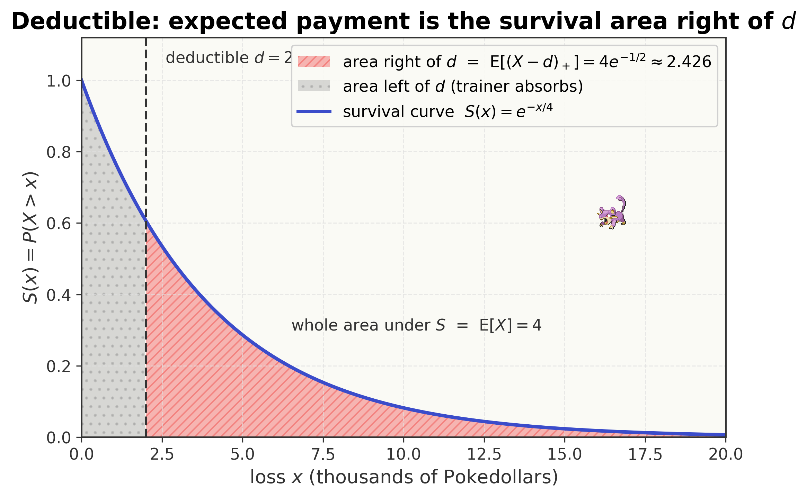
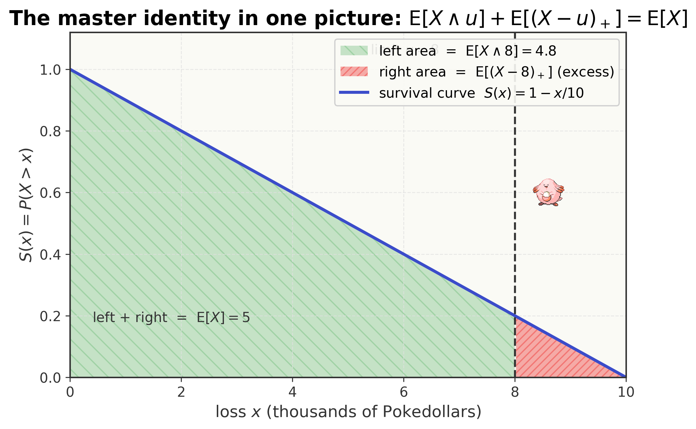
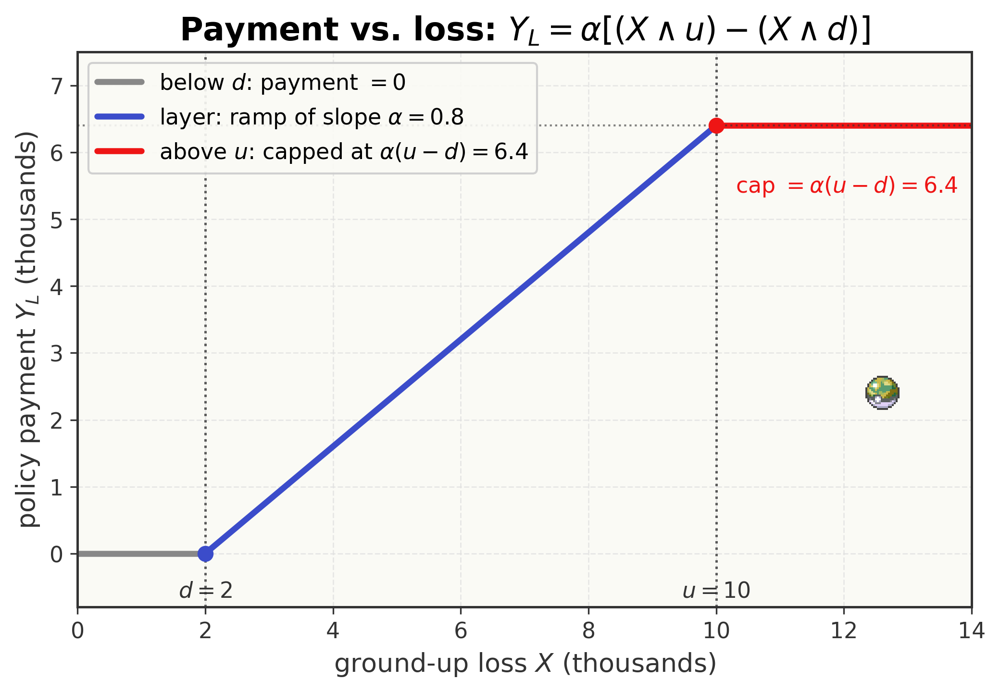
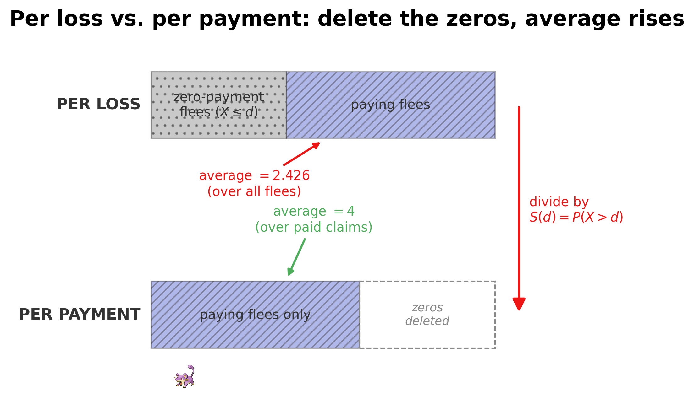

<!--
  file: ch10_pricing
  tier: A
  outcomes: 2e,2f
  draft1_source: drafts/chapters_draft1/ch08_fuchsia_safari.md
  maps_to: Fuchsia, Safari Zone, Koga — highest weight
-->

# Pricing the Risk {.type-poison}

<figure>

<figcaption>Route to a 10 — you have crossed the southern routes to Fuchsia City, home of the Safari Zone, Koga's Poison-type Gym, and the <em>Soul Badge</em>. This is the highest-weight applied chapter on the exam.</figcaption>
</figure>

::: cold-open
**▶ COLD OPEN — EPISODE: "The Warden's Bad Bet"**

The gate to the Safari Zone hisses open and the warden — a weathered man with a Slowpoke dozing on his shoulder — is already shouting before you reach the counter. "You! Pokédex kid! Oak says you do *risk math*. I need you, today, or this whole Zone goes broke."

He drops a ledger on the desk. Trainers, he explains, pay a flat fee for thirty Safari Balls. But lately the rare Pokémon — Chansey, Scyther, Kangaskhan — *flee* with the bait, the balls, sometimes a trainer's expensive lure. The Zone has been reimbursing every single Poké-dollar of those losses out of pocket, and the losses are eating the Zone alive.

"So I'm selling them a *policy*," the warden says. "Trainers pay a premium up front. When a Pokémon flees with their gear, we pay them back. But I can't pay back *everything* or I'm right back where I started."

Brock leans over the ledger. "So make the trainer eat the first few thousand themselves — a *deductible*. And cap what you'll ever pay on one flee — a *limit*." Misty adds, "And only cover, what, eighty cents on the dollar? So they're careful."

The warden nods slowly, then turns to you. "Fine. Deductible. Limit. Eighty percent. Now tell me the one number I actually need: when a Pokémon flees, *on average, how much will I, the Zone, pay?* Get it wrong and either I overcharge and nobody buys, or I undercharge and we close by Friday."

You open Actuary Mode. The loss is a random variable. But the *payment* is not the loss — it's the loss run through a deductible, a cap, and a coinsurance factor. The loss and the payment are two different random variables, and the warden is asking for the average of the *second* one. How do you find the expected value of *that*?
:::

## Where You Are — 60-Second Retrieval

You're carrying badges all the way back from Cerulean, and in the last two chapters you learned to take a continuous random variable $X$ — a loss, a lifetime, a foraging mass — and read its behaviour off three linked curves: the density $f(x)$, the cumulative distribution function $F(x)=P(X\le x)$, and especially the **survival function**

$$S(x) = 1 - F(x) = P(X > x),$$

read aloud "the chance $X$ exceeds $x$." You also learned the **survival-function (Darth Vader) method** for an expectation of a non-negative variable,

$$\E[X] = \int_0^\infty S(x)\,dx,$$

and the exponential's defining curve, $S(x)=e^{-x/\theta}$ for a mean of $\theta$. *Everything* in this chapter is built from $S(x)$ — we will integrate it, we will cap it, we will subtract two copies of it. Take sixty seconds and prove you still own these before reading on.

::: trainers-tip
**60-SECOND RETRIEVAL — prove you still own the last chapters**

Answer from memory; if any feels shaky, flip back before continuing.

1. For $X\sim\Expo(\theta)$ with mean $\theta=4$, what is $S(x)=P(X>x)$? *(Answer: $e^{-x/4}$.)*
2. What does $\int_0^\infty S(x)\,dx$ compute, and what is it for the $\Expo(4)$ above? *(Answer: $\E[X]$; it equals $4$.)*
3. For $X\sim\Unif(0,10)$, what is $S(x)$ on $[0,10]$? *(Answer: $1-x/10$.)*

All three instant? You're ready. Any hesitation? The retrieval *is* the lesson — go reclaim it, then come back.
:::

## Oak's Briefing — Learning Outcomes & Test-Out Gate

<figure style="margin:1.5em auto; max-width:160px; text-align:center;">

<figcaption style="font-size:0.85em;">Professor Oak — the formalizer</figcaption>
</figure>

Professor Oak's voice crackles through the Pokédex's Actuary Mode as you stare at the warden's ledger.

"Fuchsia is where the money is, Ash. This is the single most heavily tested *applied* chapter on Exam P, and it is the chapter that connects most directly to a real actuarial paycheck. But hear the one idea underneath all of it: **a payment is a transformation of a loss.** The loss $X$ is one random variable; you reshape it — knock off the bottom with a deductible, chop the top with a limit, scale the middle with coinsurance — and the *payment* $Y$ is a brand-new random variable. You already know how to take the expected value of a transformed variable. Everything here is that one skill, applied four ways."

By the end of this chapter you will be able to:

- **Compute** the per-loss payment $\dplus{X}{d}$ under an ordinary deductible $d$, and recognize the resulting lump of probability at zero. *(Outcome 2e.)*
- **Compute** the limited expected value $\limexp{X}{u}$ with the survival-integral $\int_0^u S(x)\,dx$, and deploy the **master identity** $\E[X]=\limexp{X}{u}+\E\!\left[\dplus{X}{u}\right]$. *(Outcome 2e.)*
- **Assemble** a full policy payment — deductible, then limit, then coinsurance $\alpha$, with inflation $(1+r)$ applied to the loss *first* — and find its expected value. *(Outcome 2e.)*
- **Distinguish** the loss from the payment, and **per-loss** from **per-payment** expectation (dividing by $S(d)=P(X>d)$). *(Outcome 2f.)*
- **Compute** the variance and standard deviation of a payment, exploit the **exponential memoryless shortcut**, and compute the **loss elimination ratio**. *(Outcomes 2e–2f.)*

> *Exam-weight signpost.* Severity-and-coverage modifications are among the **most heavily tested** ideas in Exam P's Univariate section, and they reward fluency more than any other topic. This is a **Tier A** chapter: it earns the full treatment, slowly built.

::: concept-gate
**CHAPTER TEST-OUT GATE — Do You Already Own All of Fuchsia?**

Already fluent? Prove it. Work these four, ~6 minutes each, *with correct method*:

1. $X\sim\Expo(\theta=4)$, ordinary deductible $d=2$. Find the expected payment **per loss**.
2. Same $X$ and $d$. Find the expected payment **per payment**.
3. $X\sim\Unif(0,10)$, deductible $d=2$, maximum covered loss $u=8$. Find the expected payment per loss.
4. This year $X\sim\Expo(4)$; next year a fixed deductible $d=2$ stays but losses inflate $25\%$. Find next year's per-loss payment and the percentage rise over this year.

*(Answers: $4e^{-0.5}\approx2.426$; $4$; $3.0$; $5e^{-0.4}\approx3.352$, a $+38.1\%$ rise.)* Four for four with the right reasoning? **Skip to the Gym Challenge** and claim the Soul Badge. Any miss or hesitation? The teaching below was built exactly for you — read on. Each concept has its own skip-gate too, so even a partial owner loses no time.
:::

---

Five ideas build on one another here, in increasing difficulty. We teach them **in order**, each with its own "do you already own this?" skip-check, then the full nine-beat lesson, then a Pokédex Entry you can carry into the exam:

1. **The ordinary deductible** — knocking off the bottom of a loss *(the foundation everything else reshapes)*
2. **The policy limit & limited expected value** — capping the top, and the master identity
3. **The full policy** — deductible, limit, coinsurance, and inflation in the right order
4. **Per loss vs. per payment** — averaging over all flees, or only over the checks you write
5. **Variance, the memoryless shortcut & the loss elimination ratio** — the second moment and two prized shortcuts

Throughout, let $X\ge 0$ be the **ground-up loss** — the full size of a loss before any policy terms apply — with density $f(x)$, cdf $F(x)$, and survival function $S(x)=P(X>x)$.

## Concept 1 — The Ordinary Deductible (Knocking Off the Bottom)

::: concept-gate
**DO YOU ALREADY OWN THIS? — Ordinary Deductible**

A loss $X\sim\Expo(\theta=4)$ (mean $4$) hits a policy with an ordinary deductible $d=2$. The insurer pays nothing on the first $2$ and the excess after that. What is the expected payment **per loss**?

If you immediately wrote **$\theta e^{-d/\theta}=4e^{-0.5}\approx2.426$** (and you know *why it is not* $\E[X]-d=2$), you own this — **skip to Concept 2**. If you reached for $4-2=2$, this section is for you: that subtraction is the canonical trap, and we dismantle it below.
:::

**Beat 1 — The one-sentence idea.** *An ordinary deductible $d$ makes the trainer eat the first $d$ of any loss; the policy pays whatever is left over, and pays exactly zero whenever the loss never clears $d$.*

**Beat 2 — Anchor + concrete instance.** A loss is just a non-negative random variable, exactly the kind you learned to average with the survival integral $\int_0^\infty S(x)\,dx$ last chapter. The deductible *reshapes* that variable before we average it. Here is the warden's cleanest case, with real numbers.

A fled Pokémon's replacement cost $X$ (in thousands of Poké-dollars) is exponential with mean $\theta=4$, so $S(x)=e^{-x/4}$. The trial policy has an ordinary deductible $d=2$, no limit, no coinsurance. **When a Pokémon flees, what does the Zone pay on average?**

**Beat 3 — Reason through it in plain words.** Picture every fled Pokémon, sorted by how much it cost.

- If the loss is $\le 2$ thousand, the trainer absorbs the whole thing and the Zone pays **nothing** — a flat $0$.
- If the loss is, say, $5$ thousand, the trainer eats the first $2$ and the Zone pays the **excess**, $5-2=3$ thousand.

So the payment is not the loss; it is the loss with its bottom $2$ knocked off and never allowed below zero. Many flees are small, so a big pile of them pay exactly $0$. The average payment must therefore be *smaller* than the average loss — but how much smaller? We need to add up "loss minus $2$" only over the flees that actually exceed $2$.

**Beat 4 — Surface and dismantle the tempting wrong idea.** The seductive move is to subtract the deductible from the *mean*:

$$\E[X] - d = 4 - 2 = 2. \qquad\textbf{(wrong)}$$

This silently assumes *every* loss is at least $2$, so every loss has $2$ shaved off it. But the small losses can't pay a *negative* amount — a loss of $0.5$ pays $0$, not $-1.5$. The floor at zero means the deductible removes *less* than $2$ on average, so the true payment is *bigger* than $2$. Subtracting $d$ from the mean over-counts the deductible. The correct answer, $2.426$, sits above $2$ for exactly this reason. Keep the picture: **you cannot pay a negative amount, so the deductible's bite is blunted by the lump at zero.**

**Beat 5 — Translate into notation, one glyph at a time.** Name the payment. Let $Y_L$ be the **per-loss payment** — the payment recorded for *every* flee, counting the zeros. In symbols the payment is

$$Y_L = \begin{cases} 0, & X \le d,\\[2pt] X - d, & X > d.\end{cases}$$

This "subtract $d$ but never go below $0$" pattern is so common it gets its own glyph. We write it $\dplus{X}{d}$, with a subscript plus sign:

$$\dplus{X}{d} \quad \text{read aloud: ``}X \text{ minus } d, \text{ positive part''} \;=\; \max(X-d,\,0).$$

The little $+$ subscript means **"if this is negative, call it zero."** So $\dplus{X}{d}$ *is* the per-loss payment $Y_L$, written in one symbol. Its expectation, written out as an integral, sums the payment $(x-d)$ against the density only where the payment is positive ($x>d$):

$$\E\!\left[\dplus{X}{d}\right] = \int_d^{\infty} (x-d)\,f(x)\,dx.$$

**Beat 6 — Generalize: derive the survival-integral shortcut.** That integral has a clumsy $(x-d)$ in it. Watch it collapse. Substitute $t = x - d$ (so $dt=dx$, and the lower limit $x=d$ becomes $t=0$):

$$\E\!\left[\dplus{X}{d}\right] = \int_0^\infty t\, f(t+d)\,dt.$$

Now recall the Darth Vader move from last chapter: for a non-negative variable, $\E[\,\cdot\,]=\int_0^\infty P(\,\cdot\,>t)\,dt$. Here the variable is the excess, and the excess exceeds $t$ exactly when the loss exceeds $t+d$, i.e. with probability $S(t+d)$. Substituting back $x=t+d$ turns $\int_0^\infty S(t+d)\,dt$ into

$$\boxed{\;\E\!\left[\dplus{X}{d}\right] = \int_d^{\infty} S(x)\,dx.\;}$$

We did not assert this — we *derived* it. The expected per-loss payment is just **the area under the survival curve, to the right of the deductible.** No more dragging $(x-d)$ through an integration by parts.

Now finish the concrete case. For $\Expo(4)$, $S(x)=e^{-x/4}$, so

$$\E\!\left[\dplus{X}{2}\right] = \int_2^\infty e^{-x/4}\,dx = \left[-4e^{-x/4}\right]_2^\infty = 4e^{-1/2} \approx 2.426 \text{ (thousand)}.$$

The Zone pays about **2{,}426 Poké-dollars** per flee — above the $2$ the wrong method gave, exactly as Beat 4 promised.

**Beat 7 — Ramp the difficulty.**

- *Simplest:* read $S(x)$ off the distribution and integrate from $d$ to $\infty$, as above.
- *A twist — a different distribution:* for $X\sim\Unif(0,10)$, $S(x)=1-x/10$, and $\E[\dplus{X}{2}]=\int_2^{10}(1-x/10)\,dx$. The survival curve is now a straight ramp, not an exponential, but the recipe is identical: area to the right of $d$.
- *Boundary cases:* if $d=0$, nothing is knocked off and $\E[\dplus{X}{0}]=\int_0^\infty S(x)\,dx=\E[X]$ — the deductible vanishes and the payment is the whole loss. If $d\to\infty$, the policy pays for nothing and the expectation $\to 0$.

**Beat 8 — Picture it.** The figure makes the shortcut literal: the expected payment is a shaded *area* under the survival curve, starting at the deductible.

<figure>

<figcaption>$\E[\dplus{X}{d}]$ is the area under the survival curve $S(x)$ to the <em>right</em> of the deductible $d$. For $\Expo(4)$ with $d=2$, that area is $4e^{-1/2}\approx2.426$.</figcaption>
</figure>

**Beat 9 — Consolidate.** You can now take any loss with a known survival function, apply an ordinary deductible, and find the expected per-loss payment as the area under $S(x)$ past $d$ — never confusing it with the over-counting $\E[X]-d$. That single move — *integrate the survival curve from $d$ onward* — is the seed of everything else in this chapter.

::: pokedex-entry
**POKÉDEX ENTRY №01 — The Ordinary Deductible**

A policy with ordinary deductible $d$ pays the per-loss amount
$$Y_L = \dplus{X}{d} = \max(X-d,\,0), \qquad \E\!\left[\dplus{X}{d}\right] = \int_d^{\infty} S(x)\,dx.$$

*In plain terms:* the trainer eats the first $d$ of any loss; the policy pays the rest, and zero when the loss never reaches $d$. The payment variable carries a lump of probability sitting exactly at $0$.

*Why the integral starts at $d$, not $0$:* losses below $d$ pay nothing, so they add zero area; only the survival curve to the right of $d$ contributes.

*Recognition cue:* "the trainer covers the first \_\_\_," "amount **in excess of**," "after a deductible of $d$" → reach for $\dplus{X}{d}$ and the $\int_d^\infty S(x)\,dx$ shortcut, so you never integrate $(x-d)f(x)$ by parts under time pressure.
:::

## Concept 2 — The Policy Limit & the Limited Expected Value (Capping the Top)

::: concept-gate
**DO YOU ALREADY OWN THIS? — Policy Limit**

$X\sim\Unif(0,10)$ and the insurer will never record more than $u=8$ on one loss, so it pays $\min(X,8)$. What is $\limexp{X}{8}$? And if you're told $\E[X]=10$ and $\limexp{X}{8}=6.2$ for some other loss, what is $\E[\dplus{X}{8}]$?

If you wrote **$\limexp{X}{8}=\int_0^8(1-x/10)\,dx=4.8$** and **$\E[\dplus{X}{8}]=10-6.2=3.8$** (by the master identity), **skip to Concept 3**. If either stalled you, read on.
:::

**Beat 1 — The one-sentence idea.** *A policy limit caps the loss at $u$: anything above $u$ is recorded as exactly $u$, and the whole loss splits cleanly into "the part at or below $u$" plus "the part above $u$."*

**Beat 2 — Anchor + concrete instance.** Concept 1 knocked off the *bottom* of the loss. The limit does the mirror-image move — it chops the *top*. And just as the deductible's expectation was a survival integral, so is the limit's.

For common Pokémon the warden models loss as $X\sim\Unif(0,10)$ (thousands), so $S(x)=1-x/10$ on $[0,10]$. He sets a **maximum covered loss** of $u=8$, so the policy never records more than $8$ on a single flee. **What is the average recorded loss under that cap?**

**Beat 3 — Reason through it in plain words.** Sort the flees again.

- If the loss is $\le 8$, the cap does nothing; the recorded amount *is* the loss.
- If the loss is more than $8$ — say $9.5$ — the cap kicks in and we record exactly $8$, throwing away the part above $8$.

So the **limited loss** is $\min(X,8)$: the loss when it's small, a flat $8$ when it's large. Its average must sit below the unlimited mean $\E[X]=5$… wait — here $\E[X]=5$ and the cap is $8$, which is *above* the mean, so the cap only rarely bites and the limited mean is just a touch below $5$. Capping can only ever *lower* an average, never raise it.

**Beat 4 — Surface and dismantle the tempting wrong idea.** A natural slip is to think the limited expected value is just $u$ itself, or to confuse the *cap on the loss* with the *cap on the payment*. They are not the same number. "The insurer never **records** more than $u$" caps the **loss** at $u$ — that is $\limexp{X}{u}=\E[\min(X,u)]$. "The insurer never **pays** more than $u$" caps the **payment** after a deductible, a different and later operation (Concept 3). Reading "policy limit" as a cap on the payment when the problem means a cap on the loss — or vice versa — is the most common *setup* error in this topic. Decide which quantity $u$ caps **before** you plug in.

**Beat 5 — Translate into notation, one glyph at a time.** "The smaller of $X$ and $u$" gets the **minimum** symbol, written with a wedge $\wedge$:

$$X \wedge u = \min(X,u) \quad \text{read aloud: ``}X \text{ capped at } u\text{'' or ``}X \text{ wedge } u\text{.''}$$

Its expectation is the **limited expected value**, abbreviated and read aloud as one phrase:

$$\limexp{X}{u} = \E[X\wedge u] \quad \text{read aloud: ``the limited expected value of } X \text{ at } u\text{.''}$$

By the very same survival-integral derivation as Concept 1 (the capped variable is non-negative, and $X\wedge u$ exceeds $t$ exactly when $X$ does, *up to* the cap $t<u$), its expectation is the area under $S(x)$ **between $0$ and $u$**:

$$\limexp{X}{u} = \int_0^u S(x)\,dx.$$

Notice the elegant bookend: the deductible kept the survival area to the *right* of $d$; the limit keeps the area to the *left* of $u$.

**Beat 6 — Generalize: derive the master identity.** Now put the two areas side by side. The deductible payment used $\int_u^\infty S(x)\,dx$ (Concept 1, with the deductible playing the role of $u$); the limit uses $\int_0^u S(x)\,dx$. Add them and the whole survival curve reassembles:

$$\underbrace{\int_0^u S(x)\,dx}_{\limexp{X}{u}} + \underbrace{\int_u^\infty S(x)\,dx}_{\E[\dplus{X}{u}]} = \int_0^\infty S(x)\,dx = \E[X].$$

So we have *derived*, not asserted, the **master identity** that every loss-models problem leans on:

$$\boxed{\;\E[X] = \limexp{X}{u} + \E\!\left[\dplus{X}{u}\right].\;}$$

In words: the whole expected loss = the part *at or below* the cap + the part *above* the cap. Hand me any two of these three quantities and the identity returns the third for free — no distribution required.

Finish the concrete case. For $\Unif(0,10)$,

$$\limexp{X}{8} = \int_0^8\!\left(1-\tfrac{x}{10}\right)dx = \left[x-\tfrac{x^2}{20}\right]_0^8 = 8 - \tfrac{64}{20} = 8-3.2 = 4.8 \text{ (thousand)},$$

just below $\E[X]=5$, exactly as Beat 3 predicted.

**Beat 7 — Ramp the difficulty.**

- *Simplest:* integrate $S(x)$ from $0$ to $u$, as above.
- *A twist — the identity does the work:* if you're told $\E[X]=10$ and $\limexp{X}{8}=6.2$ for a loss whose distribution you *don't* know, the excess over the cap is $\E[\dplus{X}{8}]=10-6.2=3.8$ instantly. The identity beats any integral here.
- *Boundary cases:* $\limexp{X}{0}=0$ (cap everything at zero, record nothing) and $\limexp{X}{\infty}=\E[X]$ (no cap at all). Between those extremes $\limexp{X}{u}$ rises from $0$ to $\E[X]$ as $u$ grows.

**Beat 8 — Picture it.** The same survival curve, now split by a vertical line at $u$: the left area is the limited expected value, the right area is the excess.

<figure>

<figcaption>The master identity as one picture: $\limexp{X}{u}$ is the survival area left of $u$; $\E[\dplus{X}{u}]$ is the area right of $u$; together they are $\E[X]$.</figcaption>
</figure>

**Beat 9 — Consolidate.** You can now cap any loss at $u$, compute the limited expected value as the survival area up to $u$, and use the master identity to convert between the whole loss, the capped part, and the excess part without ever knowing the full distribution.

::: pokedex-entry
**POKÉDEX ENTRY №02 — Policy Limit & the Limited Expected Value**

$$X \wedge u = \min(X,u), \qquad \limexp{X}{u} = \int_0^u S(x)\,dx,$$
$$\textbf{Master identity:}\quad \E[X] = \limexp{X}{u} + \E\!\left[\dplus{X}{u}\right].$$

*In plain terms:* $\limexp{X}{u}$ is the average loss if you refuse to ever record more than $u$. The identity says the whole expected loss splits into the part at or below the cap plus the part above it.

*Recognition cue:* "maximum covered loss," "policy limit," "the policy records at most \_\_\_" → $X\wedge u$ with $\int_0^u S(x)\,dx$. Given $\E[X]$ and one of $\limexp{X}{u}$, $\E[\dplus{X}{u}]$, the identity hands you the other instantly.
:::

::: trainers-tip
**TRAINER'S TIP — Read which $u$ they mean**

A **maximum covered loss** $u$ caps the *loss* (so the payment after a deductible is $\limexp{X}{u}-\limexp{X}{d}$). A **policy limit** sometimes means the maximum the insurer will *pay*, i.e. the cap is applied *after* the deductible. The standard Exam P convention is that, when a deductible and a maximum covered loss both appear, the per-loss payment is $(X\wedge u)-(X\wedge d)$ with $u$ the maximum *covered loss*. Read which quantity $u$ limits before plugging in — it is the difference between a right and a wrong answer.
:::

## Concept 3 — The Full Policy (Deductible, Limit, Coinsurance, Inflation)

::: concept-gate
**DO YOU ALREADY OWN THIS? — The Full Policy**

$X\sim\Expo(\theta=8)$ with a deductible $d=2$, maximum covered loss $u=10$, and coinsurance $\alpha=0.80$ (the insurer pays $80\%$ of the covered layer), no inflation. What is the expected payment **per loss**?

If you built $Y_L=\alpha[(X\wedge u)-(X\wedge d)]$ and got **$0.8(\limexp{X}{10}-\limexp{X}{2})=0.8(5.708-1.770)\approx3.151$**, **skip to Concept 4**. If the *order* of the terms, or where coinsurance goes, is fuzzy, read on.
:::

**Beat 1 — The one-sentence idea.** *A real policy stacks all the modifications at once: shrink the loss by the deductible at the bottom, chop it by the limit at the top, and scale the surviving middle slice by the coinsurance fraction — applied in that fixed order, with inflation hitting the loss first.*

**Beat 2 — Anchor + concrete instance.** Concept 1 gave the bottom cut, Concept 2 the top cut. A full policy does both and then scales the result. The covered "layer" — the part of the loss between $d$ and $u$ — is exactly the limited value at $u$ minus the limited value at $d$ (the area under $S(x)$ *between* $d$ and $u$).

The warden's real policy: loss $X\sim\Expo(8)$ (thousands), deductible $d=2$, maximum covered loss $u=10$, and the insurer reimburses only $\alpha=0.80$ of the covered layer. **What does the Zone pay on average per flee?**

**Beat 3 — Reason through it in plain words.** Take a single loss and walk it through the policy.

- The first $2$ thousand is the trainer's deductible — gone.
- Anything above $10$ thousand is above the cap — the Zone never touches it.
- What remains is the **covered layer**: the part of the loss sitting between $2$ and $10$. A loss of $6$ has a layer of $6-2=4$; a loss of $20$ has the full layer $10-2=8$ (capped); a loss of $1.5$ has layer $0$.
- Finally, the Zone pays only $80\%$ of that layer.

So the payment is $0.8\times(\text{layer between }2\text{ and }10)$, and the layer is "loss capped at $10$" minus "loss capped at $2$." Average the layer, then scale by $0.8$.

**Beat 4 — Surface and dismantle the tempting wrong idea.** The trap is **applying coinsurance, or inflation, in the wrong order.** Two specific errors:

- *Scaling first.* If you compute $0.8X$ and *then* cap it at $u$, you are capping $0.8X$ at $10$ — but the cap is supposed to apply to the loss, not the already-scaled payment. The coinsurance is the **last** operation, applied to the finished layer.
- *Inflating the deductible.* When losses inflate by $25\%$, you scale **the loss** $X$, not the deductible. The deductible is a fixed dollar amount written into the contract; it does not inflate. (This single fact drives the "deductible erosion" result you'll see in Concept 5 and the Worked Examples.)

The fixed order is **loss → inflation → deductible → limit → coinsurance.** Run the operations out of order and the answer is wrong even though every individual step looks right.

**Beat 5 — Translate into notation, one glyph at a time.** Two new symbols. **Coinsurance** $\alpha$ (Greek "alpha") is the fraction of the covered layer the insurer pays — here $\alpha=0.80$. **Inflation** multiplies the loss by $(1+r)$, with $r$ the inflation rate — here $r=0$ unless stated. With those, the **per-loss payment** for a full policy is

$$Y_L = \alpha\Bigl[\bigl((1+r)X\bigr)\wedge u \;-\; \bigl((1+r)X\bigr)\wedge d\Bigr]\quad \text{read aloud: ``alpha times the layer of the inflated loss between } d \text{ and } u\text{.''}$$

Each piece is one operation from Beat 3: $(1+r)X$ inflates, $\wedge u$ caps the top, subtracting $\wedge d$ removes the bottom, and $\alpha$ scales the result.

**Beat 6 — Generalize: derive the expected payment.** Take expectations of $Y_L$. With no inflation ($r=0$), expectation is linear, so it passes through the $\alpha$ and the subtraction:

$$\E[Y_L] = \alpha\Bigl(\E[X\wedge u] - \E[X\wedge d]\Bigr) = \alpha\Bigl(\limexp{X}{u} - \limexp{X}{d}\Bigr).$$

The covered-layer expectation is just the **difference of two limited expected values** — two survival integrals you already know how to do — scaled by $\alpha$. We derived this straight from the linearity of expectation; nothing new was assumed.

Finish the concrete case. For $\Expo(8)$, $\limexp{X}{a}=8\bigl(1-e^{-a/8}\bigr)$:

$$\limexp{X}{10}=8(1-e^{-1.25})\approx5.708, \qquad \limexp{X}{2}=8(1-e^{-0.25})\approx1.770,$$
$$\E[Y_L]=0.8\,(5.708-1.770)=0.8\,(3.938)\approx \mathbf{3.151}\text{ (thousand)}.$$

**Beat 7 — Ramp the difficulty.**

- *Simplest:* $\alpha=1$, no inflation — the layer is $\limexp{X}{u}-\limexp{X}{d}$ with nothing scaled.
- *A twist — inflation on a fixed deductible:* replace $X$ by $(1+r)X$. For an exponential, $(1+r)X$ is again exponential with mean $(1+r)\theta$, so the integrals barely change — but the deductible *stays put*, which is what makes payments rise faster than losses (Worked Example 10.4).
- *General / boundary:* with both inflation and coinsurance, $\E[Y_L]=\alpha(\E[(1+r)X\wedge u]-\E[(1+r)X\wedge d])$. If $d=0$ and $u=\infty$ and $\alpha=1$, this collapses all the way back to $\E[(1+r)X]=(1+r)\E[X]$ — the bare inflated loss.

**Beat 8 — Picture it.** The payment as a function of the ground-up loss is a staircase: flat zero up to $d$, a ramp of slope $\alpha$ from $d$ to $u$, then flat again at the capped payment $\alpha(u-d)$.

<figure>

<figcaption>The payment function $Y_L=\alpha[(X\wedge u)-(X\wedge d)]$: zero below the deductible $d$, a ramp of slope $\alpha$ up to the maximum covered loss $u$, then capped at $\alpha(u-d)$.</figcaption>
</figure>

**Beat 9 — Consolidate.** You can now assemble any combination of deductible, limit, and coinsurance — applying inflation to the loss first — and find the expected per-loss payment as $\alpha$ times a difference of two limited expected values.

::: pokedex-entry
**POKÉDEX ENTRY №03 — The Full Policy**

Order of operations: **loss → inflation $(1+r)$ → deductible $d$ → limit $u$ → coinsurance $\alpha$.** The per-loss payment and (with $r=0$) its mean are

$$Y_L = \alpha\bigl[(X\wedge u)-(X\wedge d)\bigr], \qquad \E[Y_L] = \alpha\bigl(\limexp{X}{u}-\limexp{X}{d}\bigr).$$

*In plain terms:* the covered layer is the loss between $d$ and $u$; its expectation is a difference of two limited expected values; coinsurance scales the finished layer.

*Recognition cue:* any problem listing **two or more of** {deductible, limit/maximum, coinsurance, inflation} → build $Y_L=\alpha[(X\wedge u)-(X\wedge d)]$ and take expectations term by term. Apply inflation to $X$ *first*; the deductible does **not** inflate.
:::

## Concept 4 — Per Loss vs. Per Payment (Two Different Averages)

::: concept-gate
**DO YOU ALREADY OWN THIS? — Per Loss vs. Per Payment**

$X\sim\Expo(\theta=4)$, deductible $d=2$. The per-loss expected payment is $4e^{-0.5}\approx2.426$. A trainer asks: "when you *actually* cut a check, how big is it on average?" What's the expected payment **per payment**?

If you answered **$4$** — dividing $2.426$ by $S(2)=e^{-0.5}$, or quoting the memoryless mean directly — and you know *why per-payment exceeds per-loss*, **skip to Concept 5**. If you'd have quoted $2.426$ as the check size, this is the single most-punished error in the topic; read on.
:::

**Beat 1 — The one-sentence idea.** *The same payment variable answers two questions: "averaged over every loss, including the zeros" (per loss) and "averaged only over the losses we actually pay on" (per payment) — and you convert between them by dividing out the chance a payment happens at all.*

**Beat 2 — Anchor + concrete instance.** Concept 1's $\E[\dplus{X}{d}]$ averages the payment over *all* flees, counting the small ones as $0$. But sometimes the question is about the size of an *actual* check. That conditions on a payment occurring — exactly the conditioning move from the Bayes chapter, applied to a loss.

Same warden, same loss: $X\sim\Expo(4)$, deductible $d=2$. A trainer who just lost a Scyther's worth of gear is indignant: "Don't tell me your *average over everything*. When you actually pay out, how big is the check?" **What is the average size of an actual payment?**

**Beat 3 — Reason through it in plain words.** The per-loss figure $2.426$ is dragged down by the big pile of flees that pay $0$ (the losses below $2$). But an *actual* check only ever happens when the loss cleared the deductible. So to get the average check size, throw away every zero and average only over the flees that paid something. That means dividing the per-loss total by the *fraction* of flees that paid — which is $P(X>2)$. Since we're dividing by a number less than $1$, the per-payment average is **larger** than the per-loss average.

**Beat 4 — Surface and dismantle the tempting wrong idea.** The error that bankrupts people: **quoting the per-loss number as the size of an actual payout.** If the Zone prices premiums assuming each *paid* claim averages $2.426$, but the checks it actually writes average $4$, it bleeds money on every claim. The two numbers answer different questions. "Expected payment" with no conditioning is **per loss**; "given a payment is made," "among claims paid," "for losses exceeding the deductible" is **per payment** — and you must divide by $P(X>d)$ to get it.

**Beat 5 — Translate into notation, one glyph at a time.** Name the second variable. The **per-payment** variable $Y_P$ is the payment *given that a payment happens*:

$$Y_P = \bigl(X-d \,\big|\, X>d\bigr) \quad \text{read aloud: ``the payment, given the loss exceeded the deductible.''}$$

Everything to the right of the bar $\given$ is the world we've shrunk into — the flees that actually paid. Its expectation conditions on $X>d$, which (by the definition of conditional expectation, the continuous cousin of conditioning) divides the per-loss expectation by the probability of that world, $S(d)=P(X>d)$:

$$\E[Y_P] = \E\!\left[X-d \,\middle|\, X>d\right] = \frac{\E\!\left[\dplus{X}{d}\right]}{P(X>d)} = \frac{\E\!\left[\dplus{X}{d}\right]}{S(d)}.$$

**Beat 6 — Generalize: derive the relationship.** This isn't a new formula — it is the conditional-probability definition $P(A\given B)=P(A\cap B)/P(B)$ in expectation form. The per-loss expectation $\E[\dplus{X}{d}]$ already counts only the paying flees in its numerator (losses below $d$ contribute $0$); dividing by the share of paying flees, $S(d)$, *renormalizes* to an average over that group alone. So

$$\boxed{\;\E[Y_P] = \frac{\E[Y_L]}{S(d)}, \qquad S(d)=P(X>d).\;}$$

For the concrete case, $\E[Y_P] = \dfrac{4e^{-0.5}}{e^{-0.5}} = 4$. The $e^{-0.5}$ cancels — the average actual check is **4 thousand**, exactly the original mean. (That clean cancellation is the exponential's memoryless magic, the subject of Concept 5.)

**Beat 7 — Ramp the difficulty.**

- *Simplest:* divide the per-loss answer by $S(d)$, as above.
- *A twist — with a cap too:* for $X\sim\Unif(0,10)$, $d=2$, $u=8$, the per-loss payment is $3.0$ (from Concept 2's arithmetic) and $S(2)=0.8$, so per payment is $3.0/0.8=3.75$. The cap is already baked into the per-loss numerator; only the deductible's $S(d)$ goes in the denominator, because a payment "happens" exactly when the loss clears $d$.
- *Boundary:* if $d=0$ every loss is a payment, $S(0)=1$, and per loss = per payment. The two averages only diverge because the deductible creates zeros.

**Beat 8 — Picture it.**

<figure>
d)' connects the two." style="width:80%; max-width:540px; display:block; margin:1em auto;">
<figcaption>Per loss averages over <em>all</em> flees (including the zeros); per payment deletes the zeros and averages only over paid claims — so it is always larger, by the factor $1/S(d)$.</figcaption>
</figure>

**Beat 9 — Consolidate.** You can now tell from the wording which average a problem wants, compute the per-loss payment as usual, and convert to per payment by dividing by $S(d)$ — never quoting one for the other.

::: pokedex-entry
**POKÉDEX ENTRY №04 — Per Loss vs. Per Payment**

$$\underbrace{\E[Y_L]}_{\text{per \textbf{loss}}} = \E\!\left[\dplus{X}{d}\right], \qquad \underbrace{\E[Y_P]}_{\text{per \textbf{payment}}} = \frac{\E\!\left[\dplus{X}{d}\right]}{S(d)}, \quad S(d)=P(X>d).$$

*In plain terms:* "per loss" averages over *all* fled Pokémon, counting the ones below the deductible as $0$. "Per payment" throws away those zeros and averages only over the checks the Zone actually writes — so it is always larger.

*Recognition cue:* "given that a payment is made," "among claims that are paid," "for losses exceeding the deductible" → **per payment**, divide by $S(d)$. Plain "expected payment" with no conditioning → **per loss**.
:::

## Concept 5 — Variance, the Memoryless Shortcut & the Loss Elimination Ratio

::: concept-gate
**DO YOU ALREADY OWN THIS? — Variance, Memoryless, LER**

Three quick checks. (a) $X\sim\Expo(\theta)$, deductible $d$: write the per-loss and per-payment expected payments *on sight*. (b) $X\sim\Expo(4)$, $d=2$, no limit: find $\Var(\dplus{X}{2})$. (c) $X\sim\Expo(4)$, $d=2$: find the loss elimination ratio.

If you wrote **(a)** $\theta e^{-d/\theta}$ per loss and $\theta$ per payment, **(b)** $32e^{-0.5}-(4e^{-0.5})^2\approx13.52$, and **(c)** $1-e^{-0.5}\approx0.393$, you own the whole chapter — **skip to the Worked Examples** (or straight to the Gym Challenge). Otherwise read on; these are the most-rewarded shortcuts in the topic.
:::

**Beat 1 — The one-sentence idea.** *The exponential's memorylessness collapses every deductible computation to a one-liner, the variance of a payment is found by getting its second moment off the same survival logic, and the loss elimination ratio measures what fraction of the expected loss the deductible removes from the insurer's bill.*

**Beat 2 — Anchor + concrete instance.** These three are the payoff: the same survival-integral machinery, sharpened into shortcuts. The headline is the exponential, whose defining property — memorylessness — makes deductibles almost free to compute.

Take $X\sim\Expo(\theta)$ and a deductible $d$. **Memorylessness** says: given the loss has already exceeded $d$, the *extra* amount beyond $d$ is again exponential with the **same** mean $\theta$ — the loss "forgets" how far it has already gone.

**Beat 3 — Reason through it in plain words.** If the conditional excess $(X-d\mid X>d)$ is itself $\Expo(\theta)$, then its mean is just $\theta$ — that *is* the per-payment expected payment, with no work at all. And the per-loss payment is the per-payment payment times the chance a payment happens, $S(d)=e^{-d/\theta}$:

$$\text{per payment } = \theta, \qquad \text{per loss } = \theta\cdot e^{-d/\theta}.$$

For the variance of a pure-deductible payment, the same idea: $Y_L=\dplus{X}{d}$ is $0$ with probability $1-e^{-d/\theta}$ (the loss never cleared $d$), and *given* it's positive it's $\Expo(\theta)$. So its second moment is "the chance it's positive" times "the second moment of an $\Expo(\theta)$," which is $2\theta^2$.

**Beat 4 — Surface and dismantle the tempting wrong idea.** The classic variance trap: computing $\Var(\dplus{X}{d})$ as if the payment were $\Expo(\theta)$ outright — using $\theta^2$ for the variance. That ignores the **lump of probability at zero**. The payment is a *mixed* variable: a spike at $0$ plus an exponential tail. You must build $\E[Y_L^2]$ honestly (weighting the exponential's $2\theta^2$ by the chance $e^{-d/\theta}$ of being on the tail) and subtract $\E[Y_L]^2$. Treating it as a plain exponential is wrong because most of the probability sits at the zero spike, not on the tail.

**Beat 5 — Translate into notation, one glyph at a time.** Memorylessness in symbols:

$$\bigl(X-d \,\big|\, X>d\bigr) \sim \Expo(\theta) \quad\Longrightarrow\quad \E\!\left[\dplus{X}{d}\right] = \theta\,e^{-d/\theta}, \quad \E[X-d\mid X>d] = \theta.$$

The variance, via the mixed-variable second moment ($\E[W^2]=2\theta^2$ for $W\sim\Expo(\theta)$):

$$\E\!\left[\dplus{X}{d}^{\,2}\right] = e^{-d/\theta}\cdot 2\theta^2, \qquad \Var\!\left(\dplus{X}{d}\right) = e^{-d/\theta}\,2\theta^2 - \left(\theta e^{-d/\theta}\right)^2.$$

And the **loss elimination ratio** (LER) — the fraction of the expected loss the deductible removes from the insurer — is the limited value at $d$ over the whole mean:

$$\mathrm{LER}(d) = \frac{\limexp{X}{d}}{\E[X]} = 1 - \frac{\E\!\left[\dplus{X}{d}\right]}{\E[X]} \quad \text{read aloud: ``the share of expected loss the deductible eliminates.''}$$

**Beat 6 — Generalize: derive the LER and the exponential variance.** The LER follows straight from the master identity (Concept 2): divide $\E[X]=\limexp{X}{d}+\E[\dplus{X}{d}]$ through by $\E[X]$ to get $1=\mathrm{LER}(d)+\frac{\E[\dplus{X}{d}]}{\E[X]}$, so $\mathrm{LER}(d)=\limexp{X}{d}/\E[X]$. For an exponential, $\limexp{X}{d}=\theta(1-e^{-d/\theta})$ and $\E[X]=\theta$, so the $\theta$'s cancel:

$$\mathrm{LER}(d) = 1 - e^{-d/\theta}.$$

For the concrete variance, $X\sim\Expo(4)$, $d=2$:

$$\E[Y_L^2]=e^{-0.5}\cdot 2(4^2)=32e^{-0.5}\approx19.41, \quad \E[Y_L]=4e^{-0.5}\approx2.426,$$
$$\Var(Y_L)=19.41-2.426^2 \approx 19.41-5.89 = \mathbf{13.52}.$$

And $\mathrm{LER}(2)=1-e^{-0.5}\approx\mathbf{0.393}$: the $\$2$ deductible eliminates about $39\%$ of the Zone's expected loss.

**Beat 7 — Ramp the difficulty.**

- *Simplest:* exponential per-loss/per-payment on sight, $\theta e^{-d/\theta}$ and $\theta$.
- *A twist — variance with a cap:* when a limit is present too, the payment $Z=(X\wedge u)-(X\wedge d)$ has its second moment computed over three regions (zero below $d$, the ramp between $d$ and $u$, the constant $u-d$ above $u$); the memoryless middle slice $W=X-d\mid X>d\sim\Expo(\theta)$ capped at $c=u-d$ keeps it clean: $\E[Z^2]=S(d)\,\E[(\min(W,c))^2]$. (This is the Gym Battle and Problem C10.15.)
- *Boundary:* $\mathrm{LER}(0)=0$ (no deductible eliminates nothing) and $\mathrm{LER}(\infty)=1$ (an infinite deductible eliminates the whole loss). LER rises from $0$ to $1$ as $d$ grows.

**Beat 8 — Table it.** Dual-code the memoryless results so you can read them off under pressure.

| Quantity, $X\sim\Expo(\theta)$, deductible $d$ | Formula | $\theta=4,\,d=2$ |
|---|---|---|
| Per-loss payment $\E[\dplus{X}{d}]$ | $\theta e^{-d/\theta}$ | $4e^{-0.5}\approx2.426$ |
| Per-payment payment $\E[X-d\mid X>d]$ | $\theta$ | $4$ |
| Variance of $\dplus{X}{d}$ | $2\theta^2 e^{-d/\theta}-\theta^2 e^{-2d/\theta}$ | $\approx13.52$ |
| Loss elimination ratio $\mathrm{LER}(d)$ | $1-e^{-d/\theta}$ | $1-e^{-0.5}\approx0.393$ |

**Beat 9 — Consolidate.** You can now write the exponential deductible answers on sight, find the variance of a payment by handling its zero-lump honestly, and compute the loss elimination ratio from the limited expected value — the three highest-leverage shortcuts in the chapter.

::: pokedex-entry
**POKÉDEX ENTRY №05 — Memoryless Shortcut, Payment Variance & LER**

For $X\sim\Expo(\theta)$ and deductible $d$, memorylessness gives, on sight,
$$\E\!\left[\dplus{X}{d}\right]=\theta e^{-d/\theta}\ (\text{per loss}), \qquad \E[X-d\mid X>d]=\theta\ (\text{per payment}).$$
Variance of a payment uses $\E[Y_L^2]$ honestly (mind the lump at $0$): $\Var(Y_L)=\E[Y_L^2]-\E[Y_L]^2$. The **loss elimination ratio** is
$$\mathrm{LER}(d)=\frac{\limexp{X}{d}}{\E[X]} = 1-\frac{\E[\dplus{X}{d}]}{\E[X]} \;\;\xrightarrow{\ \Expo(\theta)\ }\;\; 1-e^{-d/\theta}.$$

*Recognition cue:* "exponential loss" + "deductible" → write $\theta e^{-d/\theta}$ and $\theta$ instantly. "Fraction of losses eliminated/retained by the deductible," "savings from raising the deductible" → LER.
:::

## Worked Examples — Faded Guidance

<figure style="margin:1.5em auto; max-width:160px; text-align:center;">

<figcaption style="font-size:0.85em;">Koga — Fuchsia Gym Leader, your loss-models examiner</figcaption>
</figure>

Four examples, fading from fully narrated to exam speed. The first leads with the **Professor's Path** (the rigorous *why*) before the **Trainer's Path** (the fast *how*), because this is the load-bearing applied chapter.

### Worked Example 10.1 — The Warden's First Quote (full narration; understanding-first)

**ARCHETYPE:** *Expected payment per loss — exponential loss + ordinary deductible.*

**Setup.** A fled Pokémon's replacement cost $X$ (thousands) is $\Expo(\theta=4)$. Trial policy: ordinary deductible $d=2$, no limit, no coinsurance. When a Pokémon flees, what does the Zone pay on average?

**Step 1 — Identify (which archetype?).** "Expected payment," no conditioning word → **per loss**. Exponential loss + deductible → either the survival integral (Entry №01) or the memoryless shortcut (Entry №05). Target: $\E[\dplus{X}{2}]$.

**Step 2 — Professor's Path (the why).** Build it from the survival integral. For $\Expo(4)$, $S(x)=e^{-x/4}$, and the expected per-loss payment is the survival area to the right of $d$:
$$\E\!\left[\dplus{X}{2}\right]=\int_2^\infty e^{-x/4}\,dx = \left[-4e^{-x/4}\right]_2^\infty = 0 - (-4e^{-1/2}) = 4e^{-1/2}\approx 2.426.$$

**Step 3 — Trainer's Path (the fast how).** Exponential + deductible → memoryless one-liner, no integral:
$$\E\!\left[\dplus{X}{2}\right]=\theta e^{-d/\theta}=4e^{-2/4}=4e^{-0.5}\approx \mathbf{2.426}\text{ (thousand)}.$$
The Zone pays about **2{,}426 Poké-dollars** per flee.

**Step 4 — Check & pitfall.** Sanity: the payment must sit below the unconditional mean $\E[X]=4$, and $2.426<4$ ✓. **Pitfall:** reporting $\E[X]-d=4-2=2$. That subtracts the deductible from the *mean*, ignoring that losses below $d$ pay $0$ (not a negative), so the floor at zero pushes the true answer *above* $2$. *(Back-ref: Entries №01, №05.)*

### Worked Example 10.2 — The Honest Check Size (partial guidance)

**ARCHETYPE:** *Per-payment expected payment — exponential loss + deductible.*

**Setup.** Same loss as 10.1: $X\sim\Expo(4)$, $d=2$. An indignant trainer asks how big the average *actual* payout is. Find the expected payment **per payment**.

**Identify.** "How big when you actually pay" → conditions on a payment → **per payment**: divide the per-loss answer by $S(d)$, or use memorylessness directly. *Your move: pick a path.*

**Trainer's Path.** Memoryless: the conditional excess $(X-2\mid X>2)$ is again $\Expo(4)$, so per payment the expected check is just $\theta=\mathbf{4}$ (thousand). One line.

**Professor's Path.** Divide per-loss by the survival probability (Entry №04):
$$\E[X-d\mid X>d]=\frac{\E[\dplus{X}{d}]}{S(d)}=\frac{4e^{-0.5}}{e^{-0.5}}=4.$$

**Check & pitfall.** Per payment ($4$) exceeds per loss ($2.426$) ✓ — we dropped the zeros. **Pitfall:** quoting the per-loss $2.426$ as the size of an actual payout (forgetting to divide by $S(d)$). *That* is Team Rocket's mistake below. *(Back-ref: Entry №04.)*

### Worked Example 10.3 — Adding a Cap on a Uniform Loss (light guidance)

**ARCHETYPE:** *Expected payment per loss — deductible + limit, uniform loss.*

**Setup.** For common Pokémon, $X\sim\Unif(0,10)$ (thousands). Deductible $d=2$, **maximum covered loss** $u=8$, no coinsurance. Find the expected payment per loss.

**Identify.** Layer between $d$ and $u$ → $\E[Y_L]=\limexp{X}{8}-\limexp{X}{2}$ (Entry №03 with $\alpha=1$).

For $\Unif(0,10)$, $S(x)=1-x/10$ and $\limexp{X}{a}=\int_0^a(1-x/10)\,dx=a-\tfrac{a^2}{20}$:
$$\limexp{X}{8}=8-\tfrac{64}{20}=4.8, \qquad \limexp{X}{2}=2-\tfrac{4}{20}=1.8,$$
$$\E[Y_L]=4.8-1.8=\mathbf{3.0}\text{ (thousand)}.$$

**Check (direct, the long way).** Payment is $0$ on $[0,2]$, equals $x-2$ on $(2,8]$, and is capped at $6$ on $(8,10]$:
$$\E[Y_L]=\int_2^8 (x-2)\tfrac{1}{10}\,dx + \int_8^{10} 6\cdot\tfrac{1}{10}\,dx = \tfrac{1}{10}\cdot\tfrac{6^2}{2} + \tfrac{6\cdot2}{10}=1.8+1.2=3.0.\ \checkmark$$

**Check & pitfall.** $\E[Y_L]=3.0$ sits below $\E[X]=5$, as any deductible-plus-cap payment must ✓. **Pitfall:** forgetting the capped slice $(8,10]$ contributes a *constant* $6$, not $x-2$. *(Back-ref: Entries №02, №03.)*

### Worked Example 10.4 — Inflation Erodes a Fixed Deductible (exam speed)

**ARCHETYPE:** *Inflation eroding a fixed deductible — exponential loss.*

**Setup.** Original loss $X\sim\Expo(4)$. Koga's poison economy inflates rare-Pokémon prices $25\%$ ($r=0.25$). The deductible stays fixed at $d=2$. Find next year's expected payment per loss and the percentage rise over this year's.

**Identify.** Inflate the loss: $X'=(1.25)X\sim\Expo(1.25\cdot4)=\Expo(5)$ (scaling an exponential scales its mean). Deductible unchanged. Compare $\E[\dplus{X'}{2}]$ to $\E[\dplus{X}{2}]$.

$$\text{this year: } 4e^{-0.5}\approx2.426, \qquad \text{next year: } 5e^{-2/5}=5e^{-0.4}\approx \mathbf{3.352},$$
$$\text{rise }=\frac{3.352}{2.426}-1\approx \mathbf{+38.1\%}.$$

**Check & pitfall.** Losses rose $25\%$ but the insurer's expected *payment* rose $38\%$ — **more**, not less. The deductible is a fixed dollar amount, so as losses inflate, $d$ becomes a smaller *fraction* of each loss, exposing the insurer to a larger share. This "deductible erosion" — payments rising faster than losses — is the canonical inflation result, and the *direction* is what graders test. **Pitfall:** inflating the deductible too, or assuming payments scale with losses at $25\%$. *(Back-ref: Entries №03, №05.)*

## Trainer's Tips

::: trainers-tip
**TRAINER'S TIP — Store and subtract the limited values**

On the TI-30XS, set up $\limexp{X}{a}=\int_0^a S(x)\,dx$ once and reuse it: compute $\limexp{X}{u}$ and $\limexp{X}{d}$, store each with **STO→**, then subtract — this avoids re-keying the survival function and kills rounding drift. For exponential losses, skip the integral entirely: $\limexp{X}{a}=\theta(1-e^{-a/\theta})$ is faster than any calculator setup.
:::

::: trainers-tip
**TRAINER'S TIP — Circle the word "given"**

The archetype tell for per-loss vs. per-payment is in the last clause. "Given that a payment is made / among losses that exceed the deductible" → **per payment**, divide by $S(d)$. Bare "expected payment" → **per loss**. Circle the word *given* the instant you see it; it is worth a full point on this topic.
:::

::: trainers-tip
**TRAINER'S TIP — Order of operations is a checklist**

Whenever two or more policy terms appear, write the order down before computing: **loss → inflation $(1+r)$ → deductible $d$ → limit $u$ → coinsurance $\alpha$.** Inflation hits the *loss*, never the deductible; coinsurance is always *last*. Most full-policy errors are order errors, not arithmetic errors.
:::

## Team Rocket's Trap

::: team-rocket
**TRANSMISSION INTERCEPTED — Team Rocket's Trap**

Jessie, James, and Meowth have stolen the warden's data and are reselling a knock-off Safari policy. "Exponential, mean four, deductible two," Meowth reads off the ledger. "We computed da expected payment: $4e^{-0.5}=2.426$ thousand. So dat's what we'll budget for every check we cut!" James prints **"EXPECTED PAYOUT: 2{,}426"** on the brochure and they price the premium off $2.426$ per *paid* claim.

Within a week they're hemorrhaging Poké-dollars. Every check they actually write is bigger than the brochure promised.

**Where it fails:** $2.426$ is the **per-loss** expectation — averaged over *all* flees, including the big pile that pay $0$. The size of an *actual* payout is **per payment**: divide by $P(X>d)=e^{-0.5}$, giving $4$. Per payment always exceeds per loss, because per loss is dragged down by the zeros. Meowth budgeted the wrong average for the wrong question — the exact mistake Worked Example 10.2 warned against — and the Zone they undercut by accident is the one that survives.
:::

## From Kanto to the Real World

::: kanto-realworld
**⬛ FROM KANTO TO THE REAL WORLD**

Everything in this chapter is the literal daily arithmetic of a **property-casualty pricing actuary.** An auto policy with a \$500 deductible, a \$50{,}000 limit, and $80\%$ coinsurance produces a payment variable identical in structure to the warden's flee-cost policy; the actuary computes $\E[Y_L]$ to set the expected claim cost, then loads it for expenses and profit to get the premium you pay.

The **loss elimination ratio** is exactly how an insurer quotes the savings of raising a deductible — "go from a \$500 to a \$1{,}000 deductible and we'll knock this much off your premium" is an LER calculation. The **per-loss vs. per-payment** distinction governs whether reported "average claim size" data — which only ever sees *paid* claims — can be compared to a per-loss model; mixing them is a real pricing error that has sunk real products. And **deductible erosion** is why a policy that looked profitable becomes a money-loser after a few years of inflation if the deductible isn't indexed.

*Series bridge:* this is the on-ramp to **CAS Exam 5 (ratemaking)** and the predictive-analytics severity models stacked on top of it. Limited expected values and layers reappear in **reinsurance pricing** (CAS Exam 8), where an insurer sells off exactly the "middle layer" $(X\wedge u)-(X\wedge d)$ you computed here.

*Transfer check:* could you solve this with **no Pokémon in it**? "Losses are exponential with mean \$4{,}000; a policy has a \$2{,}000 deductible — find the expected payment per loss and per paid claim." Same $\$2{,}426$ and $\$4{,}000$. If you can do that, the skill has transferred.
:::

## The Gym Battle — Soul Badge Capstone

<figure style="margin:1.5em auto; max-width:120px; text-align:center;">

<figcaption style="font-size:0.85em;"><strong>#089 Muk</strong> — Koga's Poison-type</figcaption>
</figure>

**Koga's Challenge.** Koga, the Fuchsia Gym Leader and the warden's old friend, blocks the gym door until you can quote the *real* policy — the one he co-designed. Loss $X$ (thousands) is $\Expo(\theta=8)$. The policy has ordinary deductible $d=2$, **maximum covered loss** $u=10$, and coinsurance $\alpha=0.80$. No inflation. Koga wants **four numbers**, or no Soul Badge:

1. Expected payment **per loss**, $\E[Y_L]$.
2. The probability a flee actually triggers a payment.
3. Expected payment **per payment**, $\E[Y_P]$.
4. The **standard deviation** of the per-loss payment $Y_L$.

**ARCHETYPE:** *Full policy (deductible + limit + coinsurance), exponential loss — per-loss and per-payment moments.*

**Step 1 — Identify.** $Y_L=\alpha[(X\wedge u)-(X\wedge d)]$ with $X\sim\Expo(8)$. Need $\E[Y_L]$ (Entry №03), $S(d)$, $\E[Y_P]=\E[Y_L]/S(d)$ (Entry №04), and $\SD(Y_L)=\sqrt{\E[Y_L^2]-\E[Y_L]^2}$ (Entry №05).

**Step 2 — Trainer's Path.**

*Part 1 — limited expected values.* For $\Expo(8)$, $\limexp{X}{a}=8(1-e^{-a/8})$:
$$\limexp{X}{10}=8(1-e^{-1.25})\approx5.708, \qquad \limexp{X}{2}=8(1-e^{-0.25})\approx1.770,$$
$$\E[Y_L]=0.8\,(5.708-1.770)=0.8\,(3.938)\approx \boxed{3.151}.$$

*Part 2 — payment probability.* A payment occurs iff $X>d$: $\;S(2)=e^{-2/8}=e^{-0.25}\approx \boxed{0.7788}.$

*Part 3 — per payment.*
$$\E[Y_P]=\frac{\E[Y_L]}{S(2)}=\frac{3.151}{0.7788}\approx \boxed{4.046}.$$
*(Memoryless sanity: per payment the excess $W=X-d\mid X>d\sim\Expo(8)$, capped at $u-d=8$ and scaled by $0.8$: $\E[0.8\min(W,8)]=0.8\cdot8(1-e^{-1})=6.4(0.63212)\approx4.046$. ✓)*

*Part 4 — variance.* Work on $Z=(X\wedge10)-(X\wedge2)$, so $Y_L=0.8Z$. Use the **memoryless middle slice**: given $X>2$, $W=X-2\sim\Expo(8)$ and $Z=\min(W,8)$. Then $\E[Z^2]=S(2)\,\E[(\min(W,8))^2]$, with the capped second moment
$$\E[(\min(W,c))^2]=2\theta^2(1-e^{-c/\theta})-2\theta c\,e^{-c/\theta}, \quad \theta=8,\ c=8:$$
$$=2(64)(1-e^{-1})-2(8)(8)e^{-1}=128(0.63212)-128(0.36788)=80.91-47.09=33.82,$$
$$\E[Z^2]=e^{-0.25}(33.82)\approx26.34, \quad \E[Z]=3.938.$$
$$\Var(Z)=26.34-3.938^2=10.83, \quad \Var(Y_L)=0.8^2(10.83)=6.93, \quad \SD(Y_L)=\sqrt{6.93}\approx \boxed{2.633}.$$

**Step 3 — Professor's Path (why the middle-slice trick is legitimate).** The covered amount $Z$ is $0$ for $X\le2$, the excess $X-2$ for $2<X\le10$, and the constant $8$ for $X>10$. Conditioning on $X>2$ peels off the zero region; memorylessness makes the leftover excess $W=X-2$ a fresh $\Expo(8)$, and the cap on $X$ at $10$ becomes a cap on $W$ at $c=u-d=8$. So $\E[Z^2]=P(X>2)\,\E[(\min(W,8))^2]$ — the conditional second moment, weighted by the chance we're past the deductible. A direct integral $\int_0^\infty(0.8[(x\wedge10)-(x\wedge2)])^2\tfrac18 e^{-x/8}dx$ gives the same $\Var(Y_L)\approx6.93$.

**Step 4 — Check, verdict & pitfall.** Order of magnitude: $\E[Y_L]=3.15<\E[Y_P]=4.05$ ✓ (per payment larger); both below the maximum payment $\alpha(u-d)=0.8(8)=6.4$ ✓; $\SD=2.63$ is plausibly large for a skewed, capped exponential. **Pitfall:** applying coinsurance *before* the deductible/limit (capping $0.8X$ at $u$ instead of capping $X$) — the order is loss → inflation → deductible → limit → coinsurance.

> "That," Koga says, sliding the gym door open, "is how you price a risk. Four numbers, the honest way. The Soul Badge is yours."

<figure style="text-align:center; margin:1.5em auto;">

<figcaption class="badge-caption"><strong>Soul Badge earned!</strong></figcaption>
</figure>

## The Gym Challenge — Problem Set

::: problem-set
**TEST-OUT INSTRUCTIONS.** Work this set timed (~6 min/problem), then check the **Answer Key** below. Hit the mastery bar (**80%+ with correct method**) and you may move on. Miss it, and the chapter is waiting. Problems are listed first; full worked solutions follow afterward (never interleaved). Markers: 🔴 Poké Ball = routine method · 🟡 routine-with-a-twist · 🔵 stretch.

### Route Trainers (mechanics)

<figure style="margin:1em auto; max-width:120px; text-align:center;">

<figcaption style="font-size:0.85em;"><strong>#019 Rattata</strong> — the warden's warm-up flee</figcaption>
</figure>

**C10.1.** 🔴 *(Warden's warm-up.)* A fled Rattata's gear costs $X\sim\Expo(\theta=4)$ (thousands). The trial policy carries an ordinary deductible $d=2$. Find the expected payment **per loss**.

**C10.2.** 🔴 *(The honest check size.)* Same loss as C10.1, $X\sim\Expo(4)$, deductible $d=2$. Find the expected payment **per payment**.

**C10.3.** 🔴 *(Capping the common Pokémon.)* For common species, $X\sim\Unif(0,10)$ (thousands). The policy pays $\min(X,8)$ — a maximum covered loss $u=8$, no deductible. Compute the limited expected value $\limexp{X}{8}$.

**C10.4.** 🟡 *(Misty's coinsurance.)* With $X\sim\Unif(0,20)$ (thousands), ordinary deductible $d=4$, coinsurance $\alpha=0.75$, and no limit, find the expected payment per loss, $\alpha\,\E[\dplus{X}{4}]$.

**C10.5.** 🟡 *(How much does the deductible save?)* With $X\sim\Expo(\theta=4)$ and deductible $d=2$, compute the **loss elimination ratio** $\mathrm{LER}(2)$.

**C10.6.** 🟡 *(The master identity.)* The warden tells you $\E[X]=10$ and that, with a maximum covered loss $u=8$, $\limexp{X}{8}=6.2$ (thousands). Without knowing the distribution, find the expected payment per loss above the cap, $\E[\dplus{X}{8}]$.

**C10.7.** 🟡 *(Four-point discrete loss.)* A captured-then-fled Pokémon costs $0$, $5$, $10$, or $20$ (thousands) with probabilities $0.5,\,0.2,\,0.2,\,0.1$. Policy: deductible $d=5$, maximum covered loss $u=15$, no coinsurance. Find the expected payment **per loss**.

### Gym Battles (true SOA difficulty)

**C10.8.** 🔴 *(Koga's deductible + cap, exponential.)* Loss $X\sim\Expo(\theta=8)$ (thousands). Policy: deductible $d=2$, maximum covered loss $u=10$, coinsurance $\alpha=1$. Find the expected payment per loss.

**C10.9.** 🟡 *(The full quote.)* Loss $X\sim\Expo(\theta=8)$, deductible $d=2$, maximum covered loss $u=10$, coinsurance $\alpha=0.80$. Find (a) the expected payment per loss, and (b) the expected payment per payment.

**C10.10.** 🟡 *(Deductible erosion.)* This year's losses follow $X\sim\Expo(4)$; next year brings $25\%$ inflation with a fixed deductible $d=2$. Find next year's expected payment per loss, and state the percentage increase over this year's.

**C10.11.** 🔵 *(Variance of a pure-deductible payment.)* Loss $X\sim\Expo(\theta=4)$, ordinary deductible $d=2$, no limit, $\alpha=1$. For the per-loss payment $Y_L=\dplus{X}{2}$, find $\Var(Y_L)$.

**C10.12.** 🔵 *(Franchise vs. ordinary.)* Big-game loss $X\sim\Expo(\theta=1000)$. A **franchise** deductible of $250$ pays *nothing* if $X\le250$ but the *entire* loss $X$ if $X>250$. Find the expected payment per loss under this franchise deductible, and compare it to the ordinary-deductible per-loss payment $\E[\dplus{X}{250}]$.

**C10.13.** 🟡 *(Per-payment under a cap.)* Loss $X\sim\Unif(0,10)$, deductible $d=2$, maximum covered loss $u=8$. Find the expected payment **per payment**.

**C10.14.** 🟡 *(Reading the convention.)* Loss $X\sim\Expo(\theta=5)$. The policy has a **policy limit** (maximum the insurer will *pay*) of $6$, no deductible, no coinsurance, so the payment is $\min(X,6)$. Find the expected payment per loss, and the probability the insurer pays the full $6$.

### Elite Challenge (integrative / stretch)

**C10.15.** 🔵 *(Koga's full gauntlet — variance edition.)* Loss $X\sim\Expo(\theta=8)$, deductible $d=2$, maximum covered loss $u=10$, coinsurance $\alpha=0.80$. Find the **standard deviation** of the per-loss payment $Y_L$.

**C10.16.** 🔵 *(Layer pricing.)* The warden reinsures only the "middle layer" of losses: the insurer pays the part of $X$ between $d=3$ and $u=12$ (thousands), i.e. $(X\wedge12)-(X\wedge3)$, with $X\sim\Expo(\theta=10)$. (a) Find the expected payment per loss for this layer. (b) If $20\%$ inflation hits losses next year (attachment $3$ and cap $12$ fixed), find the new expected per-loss layer payment and the percentage change.

**C10.17.** 🔵 *(Mixed coverage, integrative.)* With probability $0.7$ a flee is "minor" with loss $M\sim\Unif(0,10)$; with probability $0.3$ it is "major" with loss $J\sim\Expo(\theta=10)$ (thousands). The policy applies deductible $d=2$ and coinsurance $\alpha=0.9$ (no limit) to whichever loss occurs. Find the overall expected payment per loss.
:::

## Answer Key

::: answer-key
**Full worked solution per problem, in C10.k order, each labeled with its archetype and the Pokédex Entry it draws on. A quick-answer table closes the section.**

**C10.1** — *Per loss, exponential + deductible (Entry №05).*
Memoryless: $\E[\dplus{X}{d}]=\theta e^{-d/\theta}=4e^{-2/4}=4e^{-0.5}\approx\mathbf{2.426}$ thousand.

**C10.2** — *Per payment, exponential + deductible (Entries №04–№05).*
The conditional excess is again $\Expo(4)$, so $\E[X-d\mid X>d]=\theta=\mathbf{4}$ thousand. (Equivalently $4e^{-0.5}/e^{-0.5}=4$.)

**C10.3** — *Limited expected value, uniform (Entry №02).*
$S(x)=1-x/10$, so $\limexp{X}{8}=\int_0^8(1-x/10)\,dx=8-\tfrac{64}{20}=8-3.2=\mathbf{4.8}$ thousand.

**C10.4** — *Per loss with coinsurance, uniform + deductible (Entries №01, №03).*
$\E[\dplus{X}{4}]=\int_4^{20}\tfrac{x-4}{20}\,dx=\tfrac{16^2}{2\cdot20}=\tfrac{128}{20}=6.4$. Apply $\alpha$: $0.75\times6.4=\mathbf{4.8}$ thousand.

**C10.5** — *Loss elimination ratio, exponential (Entry №05).*
$\mathrm{LER}(2)=1-e^{-d/\theta}=1-e^{-2/4}=1-e^{-0.5}\approx\mathbf{0.3935}$.

**C10.6** — *Master identity (Entry №02).*
$\E[\dplus{X}{8}]=\E[X]-\limexp{X}{8}=10-6.2=\mathbf{3.8}$ thousand.

**C10.7** — *Per loss, discrete loss + deductible + limit (Entries №01–№03).*
Payment $=\min(X,15)-\min(X,5)$: at $X=0\to0$; $X=5\to0$; $X=10\to10-5=5$; $X=20\to15-5=10$.
$\E[Y_L]=0.5(0)+0.2(0)+0.2(5)+0.1(10)=1.0+1.0=\mathbf{2.0}$ thousand.

**C10.8** — *Per loss, exponential + deductible + limit (Entries №02–№03).*
$\limexp{X}{10}=8(1-e^{-1.25})\approx5.708$, $\limexp{X}{2}=8(1-e^{-0.25})\approx1.770$.
$\E[Y_L]=5.708-1.770\approx\mathbf{3.938}$ thousand.

**C10.9** — *Full policy (deductible+limit+coinsurance), exponential — per-loss & per-payment (Entries №03, №04).*
(a) From C10.8 the uncoinsured layer is $3.938$; apply $\alpha=0.8$: $\E[Y_L]=0.8(3.938)\approx\mathbf{3.151}$ thousand.
(b) $P(X>2)=e^{-0.25}\approx0.7788$, so $\E[Y_P]=3.151/0.7788\approx\mathbf{4.046}$ thousand.

**C10.10** — *Inflation eroding a fixed deductible, exponential (Entries №03, №05).*
Inflated loss $X'=1.25X\sim\Expo(5)$. New per-loss payment $=5e^{-2/5}=5e^{-0.4}\approx\mathbf{3.352}$ thousand. This year's was $4e^{-0.5}\approx2.426$; increase $=3.352/2.426-1\approx\mathbf{38.1\%}$ (losses rose only $25\%$ — deductible erosion).

**C10.11** — *Variance of a per-loss deductible payment, exponential (Entry №05).*
$Y_L=0$ w.p. $1-e^{-0.5}$; given $Y_L>0$, $Y_L\sim\Expo(4)$. So $\E[Y_L]=4e^{-0.5}\approx2.426$, and $\E[Y_L^2]=e^{-0.5}\cdot\E[W^2]$ with $W\sim\Expo(4)$, $\E[W^2]=2\theta^2=32$; thus $\E[Y_L^2]=32e^{-0.5}\approx19.41$. $\Var(Y_L)=19.41-2.426^2\approx19.41-5.89=\mathbf{13.52}$.

**C10.12** — *Franchise deductible, exponential (Entries №01, №04).*
Franchise pays $X\cdot\indicator{X>250}$, so $\E[X;X>250]=\int_{250}^\infty x\tfrac1{1000}e^{-x/1000}\,dx=(250+1000)e^{-250/1000}=1250e^{-0.25}\approx\mathbf{973.5}$.
Ordinary: $\E[\dplus{X}{250}]=1000e^{-0.25}\approx778.8$. The franchise pays an extra $d\,S(d)=250e^{-0.25}\approx194.7$ more (it does not subtract the deductible once the loss clears the threshold).

**C10.13** — *Per payment with deductible + cap, uniform (Entries №03, №04).*
Per loss (Worked Example 10.3) $=\limexp{X}{8}-\limexp{X}{2}=4.8-1.8=3.0$. $P(X>2)=1-2/10=0.8$.
$\E[Y_P]=3.0/0.8=\mathbf{3.75}$ thousand.

**C10.14** — *Policy limit / limited expected value, exponential (Entry №02).*
Payment $\min(X,6)$, so per loss $=\limexp{X}{6}=5(1-e^{-6/5})=5(1-e^{-1.2})\approx5(0.6988)=\mathbf{3.494}$ thousand. The insurer pays the full $6$ iff $X>6$: $P(X>6)=e^{-1.2}\approx\mathbf{0.3012}$.

**C10.15** — *Standard deviation of full-policy per-loss payment, exponential (capstone; Entries №03, №05).*
$Y_L=0.8Z$, $Z=(X\wedge10)-(X\wedge2)$, $X\sim\Expo(8)$. $\E[Z]=3.938$. Using the memoryless middle slice $W\sim\Expo(8)$, cap $c=8$: $\E[Z^2]=e^{-0.25}[2\theta^2(1-e^{-c/\theta})-2\theta c\,e^{-c/\theta}]=0.7788\,[128(1-e^{-1})-128e^{-1}]\approx0.7788(33.82)\approx26.34$. $\Var(Z)=26.34-3.938^2\approx10.83$; $\Var(Y_L)=0.64(10.83)\approx6.93$; $\SD(Y_L)=\sqrt{6.93}\approx\mathbf{2.633}$ thousand.

**C10.16** — *Insurance layer + inflation, exponential (Entries №02–№03).*
(a) Layer $=\limexp{X}{12}-\limexp{X}{3}$, $X\sim\Expo(10)$: $10(1-e^{-1.2})-10(1-e^{-0.3})=10(e^{-0.3}-e^{-1.2})=10(0.7408-0.3012)\approx\mathbf{4.396}$ thousand.
(b) Inflated $X'=1.2X\sim\Expo(12)$; layer $=12(1-e^{-12/12})-12(1-e^{-3/12})=12(e^{-0.25}-e^{-1})=12(0.7788-0.3679)\approx\mathbf{4.931}$. Change $=4.931/4.396-1\approx\mathbf{+12.2\%}$.

**C10.17** — *Mixture loss + deductible + coinsurance, total expectation (Entries №01, №03).*
Condition on flee type.
Minor ($M\sim\Unif(0,10)$, $d=2$): $\E[\dplus{M}{2}]=\int_2^{10}\tfrac{x-2}{10}\,dx=\tfrac{8^2}{2\cdot10}=3.2$.
Major ($J\sim\Expo(10)$, $d=2$): $\E[\dplus{J}{2}]=10e^{-2/10}=10e^{-0.2}\approx8.187$.
Overall excess $=0.7(3.2)+0.3(8.187)=2.24+2.456=4.696$. Apply $\alpha=0.9$: $\E[Y_L]=0.9(4.696)\approx\mathbf{4.227}$ thousand.

### Quick-Answer Table

| # | Answer | | # | Answer |
|---|---|---|---|---|
| C10.1 | $4e^{-0.5}\approx2.426$ | | C10.10 | $3.352$; $+38.1\%$ |
| C10.2 | $4$ | | C10.11 | $\approx13.52$ |
| C10.3 | $4.8$ | | C10.12 | $1250e^{-0.25}\approx973.5$; ord. $778.8$ |
| C10.4 | $4.8$ | | C10.13 | $3.75$ |
| C10.5 | $1-e^{-0.5}\approx0.3935$ | | C10.14 | $3.494$; $P=e^{-1.2}\approx0.3012$ |
| C10.6 | $3.8$ | | C10.15 | $\approx2.633$ |
| C10.7 | $2.0$ | | C10.16 | (a) $4.396$ (b) $4.931$, $+12.2\%$ |
| C10.8 | $\approx3.938$ | | C10.17 | $\approx4.227$ |
| C10.9 | (a) $3.151$ (b) $4.046$ | | | |
:::

## Badge Earned — Mastery Checklist

<figure style="text-align:center; margin:1.5em auto;">

<figcaption class="badge-caption"><strong>Soul Badge</strong></figcaption>
</figure>

You earn the **Soul Badge** when you can, unaided:

1. **Build the payment variable** $Y_L=\alpha[(X\wedge u)-(X\wedge d)]$ for any combination of deductible, limit, and coinsurance, applying inflation to $X$ *first*, and compute $\E[\dplus{X}{d}]=\int_d^\infty S(x)\,dx$. *(Outcome 2e.)*
2. **Compute** $\limexp{X}{a}=\int_0^a S(x)\,dx$ and deploy the **master identity** $\E[X]=\limexp{X}{u}+\E[\dplus{X}{u}]$ to recover any missing piece. *(Outcome 2e.)*
3. **Convert** between per-loss and per-payment by dividing the per-loss expectation by $S(d)=P(X>d)$, and never confuse the two. *(Outcome 2f.)*
4. **Deploy** the exponential memoryless shortcut ($\theta e^{-d/\theta}$ per loss, $\theta$ per payment) and compute the **loss elimination ratio** on sight. *(Outcomes 2e–2f.)*
5. **Find** the variance/SD of a payment variable (minding the lump at zero) and **explain** deductible erosion under inflation — payments rise faster than losses. *(Outcomes 2e–2f.)*

> **Gym rematch pointers (🧴 Potion).** Miss item 1 or 2 → re-read Concepts 1–3 and Worked Examples 10.1, 10.3. Miss item 3 → Concept 4 + Worked Example 10.2 + Team Rocket's Trap. Miss item 4 or 5 → Concept 5, then drill C10.10, C10.11, and C10.15 until each runs under six minutes.

*Onward — Checkpoint B, then the leap from one random variable to **two at once**.*

<!-- ===== CALLOUT BOX TEMPLATES (Pandoc fenced divs; styled by book/theme.css) =====
     ::: cold-open / pokedex-entry / trainers-tip / team-rocket / kanto-realworld
     Concept gate ("Do you already own this?") also uses a styled panel.
     Wrap the problem set in ::: problem-set and the key in ::: answer-key . -->
