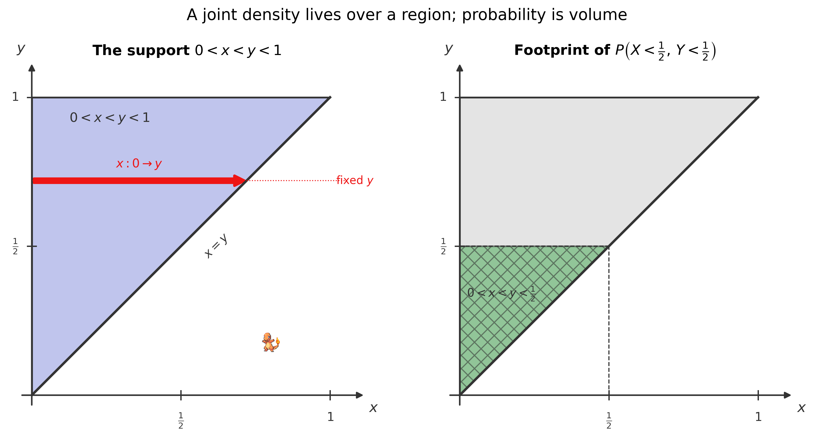
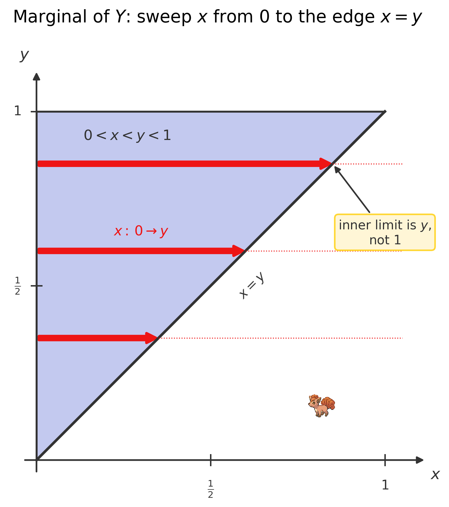
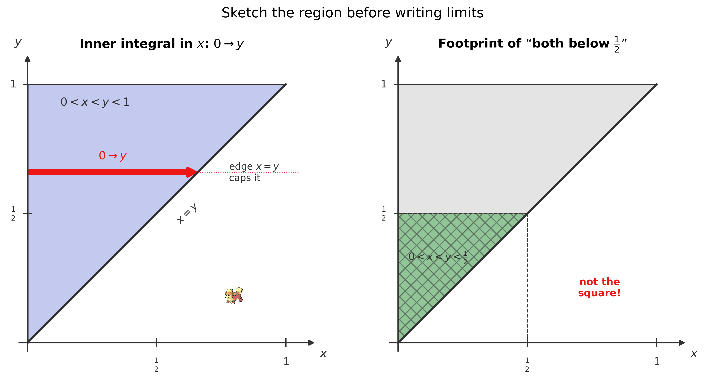
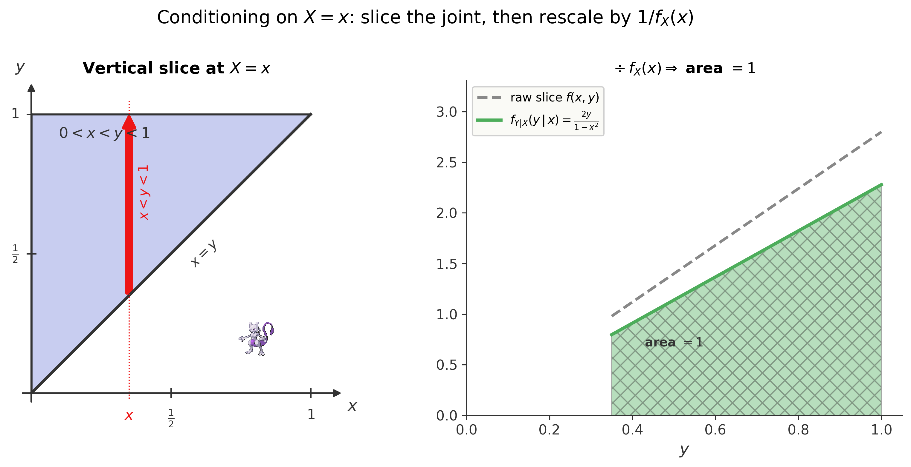
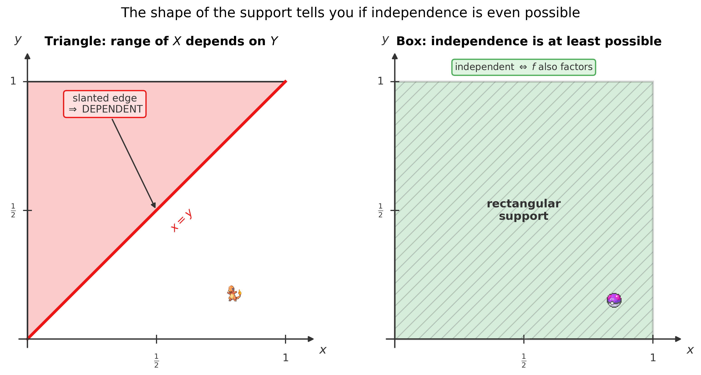

<!--
  file: ch11_joint
  tier: A
  outcomes: 3a,3b
  draft1_source: drafts/chapters_draft1/ch09_cinnabar_island.md
  maps_to: Cinnabar — joint/marginal/conditional
-->

# Two Fates Entwined {.type-fire}

<figure>

<figcaption>Route to a 10 — you have crossed the southern sea to Cinnabar Island, home of the Volcano Badge and the first city where two random variables move <em>together</em>.</figcaption>
</figure>

::: cold-open
**▶ COLD OPEN — EPISODE: "The Mansion's Paired Logs"**

The ferry drops you at Cinnabar Island under a sky the color of cooling lava. The volcano gym is locked — Blaine, the islanders say, only opens it for trainers who can answer his riddles — so you and Brock pick your way up to the abandoned Pokémon Mansion instead, the ruin where a research team once tried to engineer the strongest Pokémon alive.

Inside, the floor is a confetti of singed research logs. Brock kneels and reads one aloud. "They weren't tracking one number. They tracked *two at once* — a specimen's raw **power** and its **stability**, recorded together, every trial." He flips a page. "And the two move together. High power tends to come with low stability. They never appear alone in this ledger; every entry is a *pair*."

You open Actuary Mode. The Pokédex hums. A single random variable — power alone — you could handle from the last chapter. But here power and stability are bound together by *one shared distribution*, smeared across a charred, oddly-shaped region of the page where not every combination was even possible.

A scorched note in the margin asks the exact question you need: *"Given a specimen of known power, what stability should we expect? And what fraction of all specimens fall below both thresholds?"*

Pikachu's ears twitch — it senses the trap before you do. You **cannot** just multiply the chance of low power by the chance of low stability, because the two are *not* independent; the ledger's burnt edge proves the possible pairs don't fill a clean rectangle.

So how do you pull *one* variable's behavior out of a *two*-variable law — and how do you update it once the other variable is known?
:::

## Where You Are — 60-Second Retrieval

You crossed the sea holding everything you built for a **single** random variable. Back there you learned that a continuous variable $X$ is described by a **density** $f(x)$, that probabilities are **areas under it**, and that the expectation is a weighted average:

$$P(a < X < b) = \int_a^b f(x)\,dx, \qquad \E[X] = \int x\,f(x)\,dx, \qquad \int_{-\infty}^{\infty} f(x)\,dx = 1.$$

That last fact — *a density integrates to one* — is the foundation this entire chapter stands on. Everything here is the **two-variable** version of those three moves: a density you integrate to find probability, a density you integrate to find an average, and a density that must total one. Take sixty seconds and prove you still own the one-variable versions before reading on.

::: trainers-tip
**60-SECOND RETRIEVAL — prove you still own the last chapter**

Answer from memory; if any feels shaky, flip back before continuing.

1. $f(x) = 2x$ on $0 < x < 1$. What is $P(X < \tfrac12)$? *(Answer: $\int_0^{1/2} 2x\,dx = \tfrac14$.)*
2. For that same density, what is $\E[X]$? *(Answer: $\int_0^1 x\cdot 2x\,dx = \tfrac23$.)*
3. A density $f(x) = c$ on $0 < x < 4$ must integrate to $1$. What is $c$? *(Answer: $c = \tfrac14$.)*

All three instant? You're ready. Any hesitation? The retrieval *is* the lesson — go reclaim it, then come back. Every formula in this chapter is one of these three with a *second integral sign* wrapped around it.
:::

## Oak's Briefing — Learning Outcomes & Test-Out Gate

<figure style="margin:1.5em auto; max-width:160px; text-align:center;">

<figcaption style="font-size:0.85em;">Professor Oak — the formalizer</figcaption>
</figure>

Professor Oak's voice crackles through the Pokédex's Actuary Mode as you stare at the paired logs.

"Cinnabar opens the **multivariate** block, Ash — Topic 3, between $23$ and $30$ percent of the whole exam. Everything in it grows from one move: a **joint distribution** describes two random variables *together*, and you recover any single-variable question, or any conditional question, by **summing or integrating out** the variable you don't want. The single hardest skill here is the **geometry** — integrating a joint density over a region that is *not* a rectangle, and getting the inner limits right. Master that one move and the rest of multivariate probability is bookkeeping. This is a proving ground; take it slowly."

By the end of this chapter you will be able to:

- **Verify** a joint pmf or pdf (nonnegative, sums/integrates to $1$), **find the normalizing constant**, and compute a joint probability $P\bigl((X,Y)\in A\bigr)$ as a sum or double integral over $A$. *(Outcome 3a.)*
- **Extract** the **marginal** distribution of $X$ (or $Y$) by summing/integrating the joint over the *other* variable — with the limits read off the support. *(Outcome 3a.)*
- **Set up and reverse** double integrals over general (triangular, capped) regions, choosing the inner-variable limits correctly. *(Outcome 3a.)*
- **Build** the **conditional** distribution $f_{X\mid Y}(x\mid y) = f(x,y)/f_Y(y)$ and compute conditional probabilities and conditional expectations from it. *(Outcome 3b.)*
- **Test independence** by checking whether the joint **factors** into the product of marginals *over a rectangular support*. *(Outcome 3b.)*

> *Exam-weight signpost.* The multivariate block is **Tier A** and heavily tested. The region geometry in particular shows up on nearly every sitting. What you build here is reused without mercy in the next three chapters — conditional expectation, covariance, and the central limit theorem all stand on the joint distribution.

::: concept-gate
**CHAPTER TEST-OUT GATE — Do You Already Own All of Cinnabar?**

Already fluent? Prove it. Work these four, ~5 minutes each, *with correct method*:

1. $f(x,y) = c(x+y)$ on the unit square $0<x<1,\ 0<y<1$. Find $c$ and the marginal $f_X(x)$.
2. For the triangle $0<x<y<1$ with $f(x,y) = 8xy$, find the marginal $f_Y(y)$.
3. For that same triangle, find $P\bigl(X<\tfrac12,\ Y<\tfrac12\bigr)$.
4. Are $X,Y$ with $f(x,y)=8xy$ on $0<x<y<1$ independent? Justify in one sentence.

*(Answers: $c=1$, $f_X(x)=x+\tfrac12$; $f_Y(y)=4y^3$; $\tfrac{1}{16}=0.0625$; **not** independent — the support is a triangle, not a rectangle.)* Four for four with the right reasoning — including the inner limits and the support argument? **Skip to the Gym Challenge** and claim the badge. Any miss or hesitation? The teaching below was built exactly for you. Each concept has its own skip-gate too, so even a partial owner loses no time.
:::

---

Five ideas build on one another here, in increasing difficulty. We teach them **in order**, each with its own "do you already own this?" skip-check, then the full nine-beat lesson, then a Pokédex Entry you can carry into the exam:

1. **The joint distribution** — one law for a *pair* *(the foundation everything else uses)*
2. **Marginals** — forgetting one coordinate
3. **Double integrals over a region** — the burnt-edge geometry *(the hard, load-bearing skill)*
4. **Conditional distributions** — slicing the joint and re-weighing
5. **Independence** — when the pair separates, and the rectangle test

## Concept 1 — The Joint Distribution: One Law for a Pair

::: concept-gate
**DO YOU ALREADY OWN THIS? — Joint Distributions**

A research log gives $f(x,y) = c$ (a flat density) on the unit square $0<x<1,\ 0<y<1$, and zero elsewhere. What is $c$?

If you immediately answered **$c = 1$** (because the square has area $1$, and density $\times$ area must total $1$), you own the idea of a joint density — **skip to Concept 2**. If you're not sure why area enters, or you'd have guessed some other number, this section is for you.
:::

**Beat 1 — The one-sentence idea.** *A joint distribution spreads a total probability of one over the plane of pairs $(x,y)$, and the probability of any shape is just the amount of that "stuff" sitting inside the shape.*

**Beat 2 — Anchor + concrete instance.** For one variable, a density was a curve and probability was **area under** it. For two variables, the density is a *surface* $f(x,y)$ floating above the floor, and probability is **volume under** it. Same idea, one dimension up.

Here is the mansion log, with real numbers. Brock smooths out a page. Power $X$ and stability $Y$ have both been rescaled to lie in $[0,1]$, and the recorded joint density is

$$f(x,y) = c\,(x+y) \qquad \text{on the unit square } 0<x<1,\ 0<y<1,$$

and zero everywhere else. The constant $c$ was on the burnt corner. *What was $c$?*

**Beat 3 — Reason through it in plain words.** Whatever $c$ is, the total probability has to come out to **one** — every specimen lands *somewhere* in the square. "Total probability" now means **the whole volume** under the surface $f$ over the square. So we add up $c(x+y)$ over every point of the square and demand the result equal $1$. Sweeping across the square is a *double* sum of slivers — an integral inside an integral:

$$\text{total} = \int_0^1\!\!\int_0^1 c\,(x+y)\,dx\,dy = 1.$$

Do the inner sweep first (hold $y$ fixed, run $x$ from $0$ to $1$), then the outer:

$$\int_0^1 (x+y)\,dx = \Bigl[\tfrac{x^2}{2} + xy\Bigr]_0^1 = \tfrac12 + y, \qquad \int_0^1\Bigl(\tfrac12 + y\Bigr)dy = \tfrac12 + \tfrac12 = 1.$$

So the bare density already integrates to $1$, which forces $c = 1$.

**Beat 4 — Surface and dismantle the tempting wrong idea.** The natural first instinct, carried over from one variable, is to integrate $f$ over $x$ *only* — one integral sign — and set that to one. But a single sweep across $x$ leaves a leftover function of $y$; it has not accounted for *all* the probability, only a slice of it. A joint density lives over a **two-dimensional** floor, so "it all adds to one" needs **two** integral signs, one per variable. Forgetting the second sweep is the most common first-timer error here, and it's why the normalizing condition is $\iint f = 1$, never $\int f = 1$.

**Beat 5 — Translate into notation, one glyph at a time.** Two new pieces of language.

First, the pair itself. We write $(X, Y)$ — read aloud **"the pair $X, Y$"** — for two random variables sharing one distribution. Their joint density is

$$f(x,y) \qquad \text{read aloud: ``}f \text{ of } x \text{ and } y\text{''} \quad (\text{the height of the probability surface at the point } (x,y)).$$

Second, the **double integral** symbol. To total something over a flat region $S$ we write

$$\iint_S \qquad \text{read aloud: ``the double integral over } S \text{ of''} \quad (\text{just: add it up over every point of the region } S).$$

The two stacked integral signs are *only* shorthand for "sweep one variable, then sweep the other." Nothing deeper. The normalizing law and the probability-of-a-region law then read:

$$\iint_S f(x,y)\,dx\,dy = 1, \qquad P\bigl((X,Y)\in A\bigr) = \iint_A f(x,y)\,dx\,dy.$$

The first says "all the volume is one"; the second says "the chance of landing in shape $A$ is the volume sitting over $A$."

**Beat 6 — Generalize: derive the rule from the instance.** We did not assert these laws — we built them. "Every specimen lands somewhere" *is* "the whole volume is one," and we computed that volume as a double integral. "The chance of landing in $A$" is the same construction restricted to $A$. The discrete version swaps each integral for a sum (you can't slice a single grid point, so you add the lumps of probability instead):

$$\text{discrete: } p(x,y) = P(X=x,\,Y=y),\quad p(x,y)\ge 0,\quad \sum_x\sum_y p(x,y) = 1.$$

A valid joint distribution is the same two demands in either world: **nonnegative**, and **totals one** over its support.

**Beat 7 — Ramp the difficulty.**

- *Simplest:* a **flat** density. If $f(x,y) = c$ on the unit square, the volume is $c \times (\text{area}) = c\cdot 1$, so $c = 1$ — a flat sheet of height $1$. The gate problem.
- *Twist (the constant is not $1$):* if instead the square were $0<x<2,\ 0<y<1$ with $f(x,y)=c$, the area is $2$, so $c = \tfrac12$. **The height adjusts so the volume stays one.**
- *General (a tilted surface):* the mansion's $f(x,y) = x+y$ is a tilted plane, not flat — but the same $\iint = 1$ test pins it, as we just saw, with $c = 1$.
- *Edge (recover $f$ from the cdf):* sometimes you're handed the **joint cdf** $F(x,y) = P(X\le x,\,Y\le y)$ instead. Then $f(x,y) = \dfrac{\partial^2}{\partial x\,\partial y}F(x,y)$ — differentiate once in each variable to undo the double integral. *(This is Problem C11.12.)*

**Beat 8 — Picture it.** A joint density is a *surface*; the probability of a region is the *volume* under it, sitting above that region's footprint on the floor.

<figure>

<figcaption>A joint distribution lives over a region of the floor. Left: the mansion-log support $0<x<y<1$. Right: the footprint for $P\bigl(X<\tfrac12,\,Y<\tfrac12\bigr)$ is the smaller triangle — the probability is the volume standing over it.</figcaption>
</figure>

**Beat 9 — Consolidate.** You can now read a joint density or pmf, demand that it total one, solve for any unknown constant, and compute the probability of a region as a double integral (or double sum). Every later move in the chapter is *this* with one variable stripped away or one region restricted.

::: pokedex-entry
**POKÉDEX ENTRY №01 — Joint Distribution (pmf / pdf / cdf)**

A valid joint distribution is **nonnegative** and **totals one** over its support $S$:

$$\text{discrete: } p(x,y)\ge 0,\ \sum_x\sum_y p(x,y)=1; \qquad \text{continuous: } f(x,y)\ge 0,\ \iint_S f(x,y)\,dx\,dy=1.$$

The probability of a region $A$ is the total weight inside it:

$$P\bigl((X,Y)\in A\bigr) = \sum_{(x,y)\in A} p(x,y) \quad\text{or}\quad \iint_A f(x,y)\,dx\,dy.$$

The **joint cdf** is $F(x,y) = P(X\le x,\,Y\le y)$, and in the continuous case $f(x,y) = \dfrac{\partial^2}{\partial x\,\partial y}F(x,y)$.

*In plain terms:* the joint law assigns probability to *pairs*. Any question you can phrase as "what fraction of the pairs land in this shape?" is one double sum or one double integral.

*Recognition cue:* two variables described by a single $p(x,y)$ or $f(x,y)$; an unknown constant to pin down; or a probability over a region — set up $\iint_A$ and find any constant from "it all integrates to $1$."
:::

## Concept 2 — Marginals: Forgetting One Coordinate

::: concept-gate
**DO YOU ALREADY OWN THIS? — Marginals**

For the mansion log $f(x,y) = x+y$ on the unit square, what is the marginal density $f_X(x)$ of power alone?

If you wrote **$f_X(x) = x + \tfrac12$** on $0<x<1$ (by integrating out $y$ from $0$ to $1$), **skip to Concept 3**. If you're unsure which variable to integrate away or what limits to use, read on.
:::

**Beat 1 — The one-sentence idea.** *To study just one variable, "forget" the other by adding up the joint over every value the forgotten one could take.*

**Beat 2 — Anchor + concrete instance.** This is the total-probability move from a single variable, applied to a pair: to find how power behaves *on its own*, you average over every possible stability — exactly the way the law of total probability averaged over cases. The leftover is an ordinary one-variable density.

Same mansion log: $f(x,y) = x+y$ on $0<x<1,\ 0<y<1$. Blaine's first riddle: *"Forget stability. What is the distribution of power alone?"*

**Beat 3 — Reason through it in plain words.** Fix a power value $x$. Power can sit at that value alongside *any* stability between $0$ and $1$. To get the total density of "power $= x$, regardless of stability," sweep the joint across every $y$ in the support:

$$f_X(x) = \int_0^1 (x+y)\,dy = \Bigl[xy + \tfrac{y^2}{2}\Bigr]_0^1 = x + \tfrac12, \qquad 0<x<1.$$

We integrated *out* the variable we no longer care about. By the same move with $x$ swept away, $f_Y(y) = y + \tfrac12$.

**Beat 4 — Surface and dismantle the tempting wrong idea.** The trap is integrating over the *wrong* variable, or — far more punishing — using the wrong **limits**. Here the support is the full square, so $y$ runs $0$ to $1$ and the limits are easy. But when the support is a *triangle*, the inner limits depend on $x$, and integrating $0$-to-$1$ on autopilot gives the wrong marginal. **The marginal of $X$ integrates over $y$ across the support *at the fixed value of $x$*, not always $0$ to $1$.** We'll make this the centerpiece of Concept 3; for now, hold the rule: *keep the variable you want, sweep away the other across whatever range the support allows.*

**Beat 5 — Translate into notation, one glyph at a time.** The marginal of $X$ wears a subscript that names which variable survives:

$$f_X(x) \qquad \text{read aloud: ``the marginal density of } X\text{''} \quad (\text{the density of } X \text{ once } Y \text{ is forgotten}).$$

"Forget $Y$" becomes "integrate the joint over $y$":

$$f_X(x) = \int_y f(x,y)\,dy, \qquad f_Y(y) = \int_x f(x,y)\,dx,$$

and in the discrete world the integrals become sums over the other variable:

$$p_X(x) = \sum_y p(x,y) \quad(\text{row sums}), \qquad p_Y(y) = \sum_x p(x,y) \quad(\text{column sums}).$$

The name *marginal* is literal: in a discrete table, $p_X$ is the column of **row totals you'd jot in the margin**.

**Beat 6 — Generalize: derive the formula.** Why does integrating out $Y$ give the density of $X$? Because the chance that $X$ lands near $x$ — for *any* $Y$ — is the total probability of the thin vertical strip at $x$, and that strip's probability is the joint summed (integrated) up the strip. So $f_X(x) = \int f(x,y)\,dy$ is just "the probability of the strip at $x$," which is exactly what a density of $X$ must report. The marginal is the compression of "stack up the whole strip."

**Beat 7 — Ramp the difficulty.**

- *Simplest:* the mansion square, $f_X(x) = x+\tfrac12$ — limits $0$ to $1$.
- *Discrete:* a joint table's marginals are its **row and column sums**. (Worked Example 11.4.)
- *Twist (triangular support):* for $f(x,y) = 8xy$ on $0<x<y<1$, the marginal of $Y$ sweeps $x$ from $0$ up to $y$ — *the upper limit is $y$, not $1$:*
$$f_Y(y) = \int_0^y 8xy\,dx = 8y\cdot\tfrac{y^2}{2} = 4y^3, \qquad 0<y<1.$$
The triangle's edge $x<y$ caps the inner sweep. This is the skill Concept 3 is built on.
- *Edge (sanity check):* a marginal must itself integrate to $1$. Here $\int_0^1 4y^3\,dy = 1$ ✓. If your marginal doesn't, you used the wrong limits.

**Beat 8 — Picture it.** The marginal of $X$ at a value $x$ is the **shadow** of the joint along a vertical strip — collapse the surface down onto the $x$-axis.

<figure>

<figcaption>Marginal of $Y$ over a triangle: at height $y$, sweep $x$ from $0$ to the slanted edge $x=y$. The inner limit is $y$, not $1$ — the support dictates the limits.</figcaption>
</figure>

**Beat 9 — Consolidate.** You can now extract the one-variable distribution of either coordinate by integrating (or summing) out the other, reading the inner limits off the support. The marginal is an ordinary distribution — everything from the single-variable chapters applies to it.

::: pokedex-entry
**POKÉDEX ENTRY №02 — Marginal Distributions (sum / integrate out)**

The **marginal** of one variable is obtained by summing or integrating the joint over the *other* variable:

$$f_X(x) = \int_y f(x,y)\,dy, \qquad f_Y(y) = \int_x f(x,y)\,dx;$$
$$p_X(x) = \sum_y p(x,y), \qquad p_Y(y) = \sum_x p(x,y).$$

*In plain terms:* to study just one variable, average over every value of the other. "Marginal" = "what's left after you forget the other coordinate."

*Recognition cue:* "find the distribution of $X$ alone," "the unconditional mean of $X$," or you need $f_Y(y)$ as the denominator of a conditional. **Watch the limits: integrate over the support at the fixed value of the kept variable — not always $0$ to $1$.**
:::

## Concept 3 — Double Integrals over a Region: The Burnt-Edge Geometry

::: concept-gate
**DO YOU ALREADY OWN THIS? — Double Integrals over Regions**

For $f(x,y) = 8xy$ on the triangle $0<x<y<1$, set up (don't evaluate) the double integral for $P\bigl(X<\tfrac12,\,Y<\tfrac12\bigr)$. What are the inner and outer limits?

If you wrote **$\displaystyle\int_0^{1/2}\!\!\int_0^{y} 8xy\,dx\,dy$** — outer $y$ from $0$ to $\tfrac12$, inner $x$ from $0$ to $y$ — **skip to Concept 4**. If you wrote $\int_0^{1/2}\!\int_0^{1/2}$ as if the region were a square, this is the most important section in the chapter for you.
:::

**Beat 1 — The one-sentence idea.** *Over a non-rectangular region, sweep the inner variable across the slice at a fixed outer value, then sweep the outer variable across its whole range — the support tells you where each slice starts and stops.*

**Beat 2 — Anchor + concrete instance.** A rectangle was easy: both variables ran between fixed numbers. The mansion's burnt ledgers are not rectangles, and *that* is the entire difficulty of multivariate probability. We anchor on the most common shape: a **triangle**.

A second ledger only ever recorded specimens whose power was *below* their stability, so the support is the triangle $0<x<y<1$, with joint density $f(x,y) = 8xy$ there. Find $P\bigl(X<\tfrac12,\,Y<\tfrac12\bigr)$ — the chance both attributes come in low.

**Beat 3 — Reason through it in plain words.** "Both below $\tfrac12$" *inside* this support does **not** mean a little square. The burnt edge $x<y$ forbids the entire lower-right half. The pairs that satisfy *all three* of $x<\tfrac12$, $y<\tfrac12$, and $x<y$ form a **smaller triangle**, $0<x<y<\tfrac12$ — the green region in the figure above. To total the volume over it, fix a stability $y$ between $0$ and $\tfrac12$; for that $y$, power $x$ can run from $0$ up to $y$ (the edge). Sweep $x$ first, then $y$:

$$P\bigl(X<\tfrac12,\,Y<\tfrac12\bigr) = \int_0^{1/2}\!\!\int_0^{y} 8xy\,dx\,dy.$$

Inner sweep: $\int_0^y 8xy\,dx = 8y\cdot\tfrac{y^2}{2} = 4y^3$. Outer sweep:

$$\int_0^{1/2} 4y^3\,dy = \bigl[y^4\bigr]_0^{1/2} = \tfrac{1}{16} = 0.0625.$$

**Beat 4 — Surface and dismantle the tempting wrong idea.** Here is the canonical multivariate trap. "Both below $\tfrac12$" *screams* the square $\int_0^{1/2}\!\int_0^{1/2}$:

$$\int_0^{1/2}\!\!\int_0^{1/2} 8xy\,dx\,dy = \Bigl(\int_0^{1/2} 8x\,dx\Bigr)\!\Bigl(\int_0^{1/2} y\,dy\Bigr) = (1)\bigl(\tfrac18\bigr) = \tfrac18. \qquad\textbf{(wrong)}$$

But that square *includes the forbidden lower-right half* where $x>y$ — pairs the ledger says are impossible. It double-counts a region of zero probability as if it were live, and overstates the answer ($\tfrac18$ instead of $\tfrac{1}{16}$). **The support is not a square; the inner limit is $0\to y$, not $0\to\tfrac12$.** Ignoring the burnt edge is the single most-punished error in this whole topic — sketch the region *first*, every time.

**Beat 5 — Translate into notation, one glyph at a time.** The inner integral's limits are allowed to **contain the other variable**:

$$\int_0^{1} \underbrace{\int_0^{y}}_{\text{inner limit is } y} g(x,y)\,dx\,dy \qquad \text{read aloud: ``for each } y \text{, sweep } x \text{ from } 0 \text{ to } y\text{, then sweep } y\text{.''}$$

A limit that is a *variable* (like $\int_0^y$ or $\int_x^1$ or $\int_0^{1-x}$) is the unmistakable signature of a **non-rectangular** region. A limit that is a plain *number* ($\int_0^1$) means that edge of the region is a straight wall.

**Beat 6 — Generalize: derive the reversal.** You may sweep the variables in *either order* — the volume over the triangle is the same object regardless of which way you slice it. For $0<x<y<1$:

$$\iint_S g\,dA = \int_0^1\!\!\int_0^y g(x,y)\,dx\,dy = \int_0^1\!\!\int_x^1 g(x,y)\,dy\,dx.$$

In the first order, for a fixed $y$, $x$ enters at $0$ and exits at the edge $y$. In the second order, for a fixed $x$, $y$ enters at the edge $x$ and exits at the top $1$. Both describe the same triangle; equating them is **reversing the order of integration**. We derive this not by a rule but by *re-reading the same picture two ways.*

**Beat 7 — Ramp the difficulty.**

- *Simplest:* a rectangle — both limits are numbers, sweep in any order, the inner integral never sees the outer variable.
- *Triangle below the diagonal* ($0<x<y<1$): inner $x$ runs $0\to y$, as above.
- *Capped triangle* ($x>0,\ y>0,\ x+y<1$): the slanted cap is the line $x+y=1$, so for a fixed $x$, $y$ runs $0\to 1-x$. (Problem C11.11.)
- *The rescue move (reverse the order):* if an inner antiderivative is ugly, **flip the order** — that single trick saves most stuck multivariate integrals. We verify the $\tfrac{1}{16}$ both ways in Worked Example 11.3.
- *Edge (the trap, restated):* a problem that hands you a triangular or capped support and asks for a "both below $c$" probability is testing exactly whether you sketch the region before writing limits.

**Beat 8 — Picture it.** The figure makes the inner limit visible: at each height $y$, the slice of live $x$-values starts at $0$ and ends at the slanted edge.

<figure>

<figcaption>Left: for a fixed $y$, the inner integral in $x$ runs $0\to y$ — the edge $x=y$ caps it. Right: the sub-triangle $0<x<y<\tfrac12$ is the true footprint of "both below $\tfrac12$," not the square.</figcaption>
</figure>

**Beat 9 — Consolidate.** You can now translate any region — rectangle, triangle, cap — into the correct nested limits, sweep inner-then-outer, and reverse the order when the inner antiderivative resists. This is the load-bearing skill of the multivariate block; the rest of the chapter rides on it.

::: pokedex-entry
**POKÉDEX ENTRY №03 — Double Integrals over General Regions**

To integrate over a non-rectangular region, sweep the **inner** variable across the slice at a fixed **outer** value, then sweep the **outer** variable across its full range. For the triangle $0<x<y<1$:

$$\iint_S g\,dA = \int_0^1\!\!\int_0^y g(x,y)\,dx\,dy = \int_0^1\!\!\int_x^1 g(x,y)\,dy\,dx.$$

Both orders give the same value; pick whichever has the easier inner antiderivative.

*In plain terms:* draw the region; pick which variable goes on the outside; for each fixed outer value, find where the inner variable **enters and exits** the region.

*Recognition cue:* inner limits that contain the *other* variable ($\int_0^y$, $\int_x^1$, $\int_0^{1-x}$) signal a non-rectangular region. If an inner integral is ugly, **reverse the order** — that single move rescues most stuck multivariate integrals.
:::

::: trainers-tip
**TRAINER'S TIP — Sketch the support before you write a single limit**

Three seconds with a pencil tells you the inner-integral limits and instantly settles independence (Concept 5). The exam's favorite multivariate trap is a non-rectangular region disguised by inner limits like $\int_0^y$ or $\int_0^{1-x}$ — the picture makes those limits obvious and stops you from integrating $0$-to-$1$ on autopilot.
:::

## Concept 4 — Conditional Distributions: Slice and Re-Weigh

::: concept-gate
**DO YOU ALREADY OWN THIS? — Conditional Distributions**

For the mansion log $f(x,y) = x+y$ on the unit square, a specimen is known to have power $X = \tfrac12$. What is the conditional density of stability, $f_{Y\mid X}(y\mid \tfrac12)$?

If you wrote **$f_{Y\mid X}(y\mid \tfrac12) = \tfrac12 + y$** on $0<y<1$ (the joint at $x=\tfrac12$ divided by $f_X(\tfrac12) = 1$), **skip to Concept 5**. If you're unsure what to divide by, read on.
:::

**Beat 1 — The one-sentence idea.** *Once you know one variable's value, slice the joint at that value and rescale the slice so it sums to one — that rescaled slice is the conditional distribution of the other variable.*

**Beat 2 — Anchor + concrete instance.** This is conditioning from the Bayes chapter — "shrink the world, re-weigh what's left" — now applied to a *slice* of a joint density. Knowing $X=x$ collapses the whole surface down to the single strip at $x$; rescaling that strip to total one gives the conditional.

Same mansion log: $f(x,y) = x+y$ on the unit square. A surviving specimen is logged at power $X = \tfrac12$. Blaine's riddle: *"Among all specimens of that exact power, what is the expected stability?"*

**Beat 3 — Reason through it in plain words.** Slice the surface at $x = \tfrac12$. Along that strip the joint reads $f(\tfrac12, y) = \tfrac12 + y$. But a slice of a density is **not** itself a density — it doesn't integrate to one. We must rescale it. The total weight in the strip is the marginal $f_X(\tfrac12)$. With $f_X(x) = x+\tfrac12$ (from Concept 2), $f_X(\tfrac12) = 1$. So the rescaled slice is

$$f_{Y\mid X}\bigl(y\mid \tfrac12\bigr) = \frac{f(\tfrac12, y)}{f_X(\tfrac12)} = \frac{\tfrac12 + y}{1} = \tfrac12 + y, \qquad 0<y<1.$$

Now it's a genuine density in $y$. The expected stability, *given that power is $\tfrac12$*, is its mean:

$$\E\bigl[Y\mid X=\tfrac12\bigr] = \int_0^1 y\Bigl(\tfrac12 + y\Bigr)dy = \tfrac12\cdot\tfrac12 + \tfrac13 = \tfrac14 + \tfrac13 = \tfrac{7}{12} \approx 0.583.$$

**Beat 4 — Surface and dismantle the tempting wrong idea.** The trap is to *use the joint as if it were the conditional* — to skip the division by $f_X$. If you'd written $\E[Y\mid X=\tfrac12] = \int_0^1 y\,f(\tfrac12,y)\,dy$ with no rescaling, you'd be averaging against something that doesn't integrate to one, and the answer would be meaningless. **The slice must be divided by the marginal of the conditioning variable** so it becomes a true distribution. The division is not optional decoration — it's what turns a slice back into a probability law.

**Beat 5 — Translate into notation, one glyph at a time.** The conditional density carries the bar $\mid$ you met in Bayes, read **"given"**:

$$f_{Y\mid X}(y\mid x) \qquad \text{read aloud: ``the density of } Y \text{ given } X = x\text{''} \quad (\text{everything right of the bar is fixed}).$$

"Slice and rescale" becomes "joint over marginal of the conditioning variable":

$$f_{Y\mid X}(y\mid x) = \frac{f(x,y)}{f_X(x)}, \qquad f_{X\mid Y}(x\mid y) = \frac{f(x,y)}{f_Y(y)},$$

valid wherever the denominator is positive. The discrete version is identical with $p$'s:

$$p_{Y\mid X}(y\mid x) = \frac{p(x,y)}{p_X(x)}.$$

**Beat 6 — Generalize: derive the formula.** This is *exactly* the conditional-probability definition $P(A\mid B) = P(A\cap B)/P(B)$ from the Bayes chapter, written for densities. "$Y$ near $y$ **and** $X$ near $x$" has density $f(x,y)$; "$X$ near $x$" has density $f_X(x)$; their ratio is the conditional density. We did not invent a new rule — we recognized the old one with a joint density in the numerator. From the conditional density, every conditional quantity follows as an ordinary one-variable computation:

$$P(Y\in A\mid X=x) = \int_A f_{Y\mid X}(y\mid x)\,dy, \qquad \E[Y\mid X=x] = \int y\,f_{Y\mid X}(y\mid x)\,dy.$$

**Beat 7 — Ramp the difficulty.**

- *Simplest:* the mansion slice at $x=\tfrac12$, where $f_X(\tfrac12)=1$ makes the division trivial.
- *Discrete (divide by a row sum):* from a joint table, $P(Y=1\mid X=1) = p(1,1)/p_X(1)$ — joint cell over row total. (Worked Example 11.4.)
- *Twist (triangular support):* for $f(x,y)=8xy$ on $0<x<y<1$, conditioning on $X=x$ gives $f_{Y\mid X}(y\mid x) = \dfrac{8xy}{4x(1-x^2)} = \dfrac{2y}{1-x^2}$ for $x<y<1$ — and the support of the *conditional* is $x<y<1$, inherited from the triangle. (Gym Battle.)
- *Edge (which way does the bar point?):* $P(Y=1\mid X=1)$ divides by the **row** sum $p_X(1)$; $P(X=1\mid Y=1)$ divides by the **column** sum $p_Y(1)$. They are different numbers — don't swap them.

**Beat 8 — Picture it.** Conditioning on $X=x$ is taking the **vertical slice** of the surface at $x$, then stretching it vertically until its area is one.

<figure>

<figcaption>Conditioning on $X=x$ slices the joint at that $x$; dividing the slice by $f_X(x)$ rescales it into a genuine density of $Y$.</figcaption>
</figure>

**Beat 9 — Consolidate.** You can now condition on a known value of either variable — slice the joint, divide by the conditioning variable's marginal — and use the resulting conditional density for any conditional probability or conditional expectation. This is the engine of the next chapter, *Double Expectation.*

::: pokedex-entry
**POKÉDEX ENTRY №04 — Conditional Distributions**

Given $X = x$ (with $f_X(x) > 0$), the **conditional** distribution of $Y$ is the joint **renormalized** by the marginal of the conditioning variable:

$$f_{Y\mid X}(y\mid x) = \frac{f(x,y)}{f_X(x)}, \qquad p_{Y\mid X}(y\mid x) = \frac{p(x,y)}{p_X(x)}.$$

It is a genuine distribution in $y$ (integrates / sums to $1$). From it,

$$P(Y\in A\mid X=x) = \int_A f_{Y\mid X}(y\mid x)\,dy, \qquad \E[Y\mid X=x] = \int y\,f_{Y\mid X}(y\mid x)\,dy.$$

*In plain terms:* "now that I know power is $x$, what does stability look like?" Slice the joint at $X=x$ and rescale that slice so it totals one.

*Recognition cue:* the words "**given** $X=x$," "**knowing that**," "**among the specimens with** $X=x$" → divide the joint by the marginal of the conditioning variable. The conditioning variable's value is *fixed*; you redistribute probability over the other.
:::

## Concept 5 — Independence: When the Pair Separates

::: concept-gate
**DO YOU ALREADY OWN THIS? — Independence of Random Variables**

Two embers have joint density $f(x,y) = 2\,e^{-x}e^{-2y}$ for $x>0,\ y>0$. Are $X$ and $Y$ independent? And: is $X,Y$ with $f(x,y) = 8xy$ on $0<x<y<1$ independent?

If you answered **"yes, the embers are independent — rectangular support and the density factors,"** and **"no, the triangle kills independence on sight,"** you own this — **skip to the Worked Examples**. If either tripped you, the two-part test below is exactly what you need.
:::

**Beat 1 — The one-sentence idea.** *Two variables are independent exactly when knowing one tells you nothing about the other — which happens precisely when the joint factors into the product of the two marginals, over a rectangular support.*

**Beat 2 — Anchor + concrete instance.** Independence of *events* (Bayes chapter) was $P(A\cap B) = P(A)P(B)$. Independence of *variables* is the same promise for every pair of values at once: the joint density factors into a function of $x$ times a function of $y$. And there's a geometric pre-condition we'll meet head-on.

Two independent embers have joint density $f(x,y) = 2\,e^{-x}e^{-2y}$ on $x>0,\ y>0$. Are power and stability of the mansion's *triangle* log, $f(x,y) = 8xy$ on $0<x<y<1$, also independent? *Decide both.*

**Beat 3 — Reason through it in plain words.** Independence means the conditional equals the marginal — knowing $X$ doesn't shift $Y$'s law. For the embers, the support is the whole quarter-plane (a rectangle running to infinity), and the density already comes pre-split: $f(x,y) = \underbrace{e^{-x}}_{\text{only }x}\cdot\underbrace{2e^{-2y}}_{\text{only }y}$. Each factor is a clean one-variable density. So the embers are **independent**.

For the triangle, something is wrong *before* we even look at the algebra: the support $0<x<y<1$ **constrains the variables**. If you learn $Y = 0.1$, then $X$ is forced below $0.1$; if $Y = 0.9$, $X$ may range much higher. Knowing one *changes* the other's possible range — that is the opposite of independence. So $f(x,y)=8xy$ on the triangle is **dependent**, and we didn't need any factoring algebra to see it.

**Beat 4 — Surface and dismantle the tempting wrong idea.** The seductive error: "$f(x,y) = 8xy$ *already factors* into $(8x)(y)$ — so they must be independent!" **No.** The factoring test only applies *after* the support passes. On a triangle, $X$ and $Y$ fence each other in regardless of how the formula looks; a density that factors algebraically but lives on a non-rectangular region is still **dependent**. Independence is a **two-part test, and the support comes first.** The reverse trap is just as common: a *rectangular* support does **not** by itself give independence — you must *still* check the density factors. (On the unit square, $f(x,y)=x+y$ has a rectangular support but does **not** factor, so those variables are dependent too.)

**Beat 5 — Translate into notation, one glyph at a time.** The defining test:

$$f(x,y) = f_X(x)\,f_Y(y) \quad\text{for all } (x,y) \qquad \Longleftrightarrow \qquad X \perp Y,$$

where $\perp$ — read aloud **"is independent of"** — is the independence symbol. Equivalently, the conditional equals the marginal:

$$f_{Y\mid X}(y\mid x) = f_Y(y) \qquad \text{read aloud: ``given } X \text{ doesn't change } Y\text{.''}$$

**Beat 6 — State the test precisely (independence is *defined*, not derived).** Like event-independence, this is a *defining condition*, not a theorem to prove. The operational content is the **two-part test**, both parts required:

1. **The support is a rectangle** — a product set, where $x$'s range does not depend on $y$ (and vice versa). A triangle, a cap $x+y<1$, a curved boundary $y<x^2$ — any of these **fails part 1 instantly**.
2. **The density factors** — $f(x,y) = g(x)\,h(y)$ for some single-variable functions. Then, after normalizing, $g$ and $h$ *are* the marginals.

Pass both → independent. Fail either → dependent.

**Beat 7 — Ramp the difficulty.**

- *Simplest (factors on a rectangle):* the embers $2e^{-x}e^{-2y}$ — independent; marginals $e^{-x}$ ($X\sim\Expo$, mean $1$) and $2e^{-2y}$ ($Y\sim\Expo$, mean $\tfrac12$).
- *Rectangle, but no factoring:* $f(x,y) = x+y$ on the unit square — support OK, but $x+y \ne g(x)h(y)$, so **dependent**.
- *Non-rectangle (support kills it):* $f(x,y) = 8xy$ on $0<x<y<1$ — **dependent**, no algebra needed.
- *Edge (independent ⇒ the easy life):* when $X\perp Y$, conditionals collapse to marginals, $\E[XY] = \E[X]\E[Y]$, and a probability like $P(X<Y)$ factors cleanly. Independence is the simplifying gift; the exam mostly tests whether you can tell when you *don't* have it.

**Beat 8 — Picture it.** On a rectangle the support is a clean box; on a triangle the slanted edge is the visible proof the variables constrain each other.

<figure>

<figcaption>The slanted edge $x=y$ is the visible signature of dependence: the range of $X$ depends on $Y$. Only a clean rectangular box even permits independence — and then only if the density also factors.</figcaption>
</figure>

**Beat 9 — Consolidate.** You can now decide independence in two glances: *is the support a rectangle?* and, only if so, *does the density factor?* You will never again be fooled by a density that factors over a triangle, nor by a rectangle whose density refuses to split.

::: pokedex-entry
**POKÉDEX ENTRY №05 — Independence of Random Variables**

$X$ and $Y$ are **independent** iff the joint factors into the marginals for **all** $(x,y)$:

$$f(x,y) = f_X(x)\,f_Y(y) \quad\Longleftrightarrow\quad X \perp Y.$$

Operationally, a **two-part test**, both required: **(1)** the support is a **rectangle** (a product set — $x$'s range doesn't depend on $y$), and **(2)** the density **factors** into (function of $x$) $\times$ (function of $y$).

*In plain terms:* independent means knowing one tells you nothing about the other — the conditional equals the marginal, and the joint is just the product.

*Recognition cue:* a support like $0<x<y<1$ or $x+y<1$ or $y<x^2$ **kills independence instantly** — the variables constrain each other. Only on a clean rectangle should you even try to factor.
:::

::: trainers-tip
**TRAINER'S TIP — Independence is a two-part test, support first**

If the region is anything but a rectangle, **stop** — the variables are dependent, no algebra needed. Only on a product region do you check whether $f(x,y)$ splits as (stuff in $x$) $\times$ (stuff in $y$). If it does, the marginals *are* those two factors after normalizing. This one habit kills the most common multivariate-independence error on the exam.
:::

## Worked Examples — Faded Guidance

<figure style="margin:1.5em auto; max-width:160px; text-align:center;">

<figcaption style="font-size:0.85em;">Blaine — Cinnabar Gym Leader, your riddle-master for the joint distribution</figcaption>
</figure>

Four examples, fading from fully narrated to exam-speed. The first leads with the **Professor's Path** (the rigorous *why*) before the **Trainer's Path** (the fast *how*), because the region geometry is the hard, load-bearing idea.

### Worked Example 11.1 — Pinning Down the Mansion-Log Constant (full narration; understanding-first)

**ARCHETYPE:** *Normalize a joint pdf on a rectangle; marginal; independence test.*

**Setup.** Brock smooths out a log page. The joint density of power $X$ and stability $Y$, both on $[0,1]$, is recorded as $f(x,y) = c\,(x+y)$ on the unit square $0<x<1,\ 0<y<1$, zero elsewhere. The constant $c$ was on the burnt corner. Recover $c$, the marginal of $X$, and decide whether power and stability are independent.

**Step 1 — Identify.** A joint density with an unknown constant → use $\iint f = 1$ to find $c$ (Entry №01). Then integrate out $y$ for $f_X$ (Entry №02), and apply the two-part independence test (Entry №05).

**Step 2 — Professor's Path (the why).** The constant exists to make the *total volume* one. Sweep the inner $x$ first:

$$\int_0^1 (x+y)\,dx = \Bigl[\tfrac{x^2}{2} + xy\Bigr]_0^1 = \tfrac12 + y,$$

then the outer $y$:

$$\int_0^1\Bigl(\tfrac12 + y\Bigr)dy = \tfrac12 + \tfrac12 = 1.$$

So $\iint (x+y) = 1$ already, forcing $c = 1$. The marginal of $X$ forgets $Y$ by integrating it out:

$$f_X(x) = \int_0^1 (x+y)\,dy = \Bigl[xy + \tfrac{y^2}{2}\Bigr]_0^1 = x + \tfrac12, \qquad 0<x<1,$$

and by symmetry $f_Y(y) = y + \tfrac12$.

**Step 3 — Trainer's Path (the fast how).** Square support, so split each integral as a product of one-variable pieces. $\iint(x+y) = \int_0^1\!\int_0^1 x + \int_0^1\!\int_0^1 y = \tfrac12 + \tfrac12 = 1 \Rightarrow c=1$. Marginal: $f_X(x) = x\cdot 1 + \tfrac12 = x+\tfrac12$. Independence: is $f = f_X f_Y$? Here $x+y \ne (x+\tfrac12)(y+\tfrac12)$, so **not independent** — even though the support *is* a rectangle, the density does not factor.

**Step 4 — Check & pitfall.** $f_X$ integrates to $\int_0^1(x+\tfrac12)\,dx = \tfrac12+\tfrac12 = 1$ ✓. **Pitfall:** seeing a rectangular support and *assuming* independence. The rectangle is necessary, not sufficient — you must still check the density factors, and $x+y$ does not. *(Back-ref: Entries №01, №02, №05.)*

### Worked Example 11.2 — Stability, Given the Power (partial guidance)

**ARCHETYPE:** *Conditional density and conditional expectation, continuous.*

**Setup.** Same joint as 11.1, $f(x,y) = x+y$ on the unit square. A surviving specimen is logged at power $X = \tfrac12$. Blaine's riddle: "Among all specimens of that exact power, what is the expected stability?"

**Identify.** Build $f_{Y\mid X}(y\mid x) = f(x,y)/f_X(x)$ (Entry №04), then compute $\E[Y\mid X=\tfrac12]$. *Your move: slice and rescale.*

With $f_X(x) = x+\tfrac12$,

$$f_{Y\mid X}(y\mid x) = \frac{x+y}{x+\tfrac12}, \qquad 0<y<1.$$

At $x = \tfrac12$: $f_{Y\mid X}(y\mid\tfrac12) = \dfrac{\tfrac12 + y}{1} = \tfrac12 + y$. Then

$$\E\bigl[Y\mid X=\tfrac12\bigr] = \int_0^1 y\Bigl(\tfrac12 + y\Bigr)dy = \tfrac12\cdot\tfrac12 + \tfrac13 = \tfrac14 + \tfrac13 = \tfrac{7}{12} \approx 0.583.$$

**Check & pitfall.** The conditional density integrates to $\int_0^1(\tfrac12+y)\,dy = \tfrac12+\tfrac12 = 1$ ✓. **Pitfall:** forgetting to divide by $f_X$ — using the joint slice as if it were the conditional. Then it would not integrate to $1$ and the "expectation" would be nonsense. *(Back-ref: Entry №04.)*

### Worked Example 11.3 — The Burnt-Edge Triangle (light guidance)

**ARCHETYPE:** *Marginal and region probability over a triangular support; reverse the order.*

**Setup.** A second ledger only recorded specimens whose power was *below* their stability, so the support is the triangle $0<x<y<1$, with joint density $f(x,y) = 8xy$. Find (a) the marginal of $Y$, and (b) $P\bigl(X<\tfrac12,\,Y<\tfrac12\bigr)$.

**(a)** Marginal of $Y$ — inner $x$ runs $0\to y$ (the edge):

$$f_Y(y) = \int_0^y 8xy\,dx = 8y\cdot\tfrac{y^2}{2} = 4y^3, \qquad 0<y<1.$$

**(b)** "Both below $\tfrac12$" *inside the support* is the sub-triangle $0<x<y<\tfrac12$:

$$P\bigl(X<\tfrac12,\,Y<\tfrac12\bigr) = \int_0^{1/2}\!\!\int_0^y 8xy\,dx\,dy = \int_0^{1/2} 4y^3\,dy = \bigl[y^4\bigr]_0^{1/2} = \tfrac{1}{16} = 0.0625.$$

**Professor's Path — reverse the order to check (b).** For a fixed $x\in(0,\tfrac12)$, $y$ runs from the edge $x$ up to $\tfrac12$:

$$\int_0^{1/2}\!\!\int_x^{1/2} 8xy\,dy\,dx = \int_0^{1/2} 4x\bigl(\tfrac14 - x^2\bigr)dx = \int_0^{1/2}\bigl(x - 4x^3\bigr)dx = \tfrac18 - \tfrac{1}{16} = \tfrac{1}{16}. \ \checkmark$$

**Check & pitfall.** First confirm it's a density: $\int_0^1 4y^3\,dy = 1$ ✓. **Pitfall:** writing $\int_0^{1/2}\!\int_0^{1/2}$ as if the region were a square — that includes the forbidden half $x>y$ and gives $\tfrac18$, exactly double the truth. The burnt edge $x<y$ forces the inner limit $0\to y$. *(Back-ref: Entries №02, №03.)*

### Worked Example 11.4 — A Pair of Logged Specimens (exam speed, discrete)

**ARCHETYPE:** *Discrete marginal and conditional probability from a joint table.*

**Setup.** One log records a specimen's **type-count** $X\in\{0,1\}$ (single- vs. dual-type) and its **evolution stage** $Y\in\{0,1,2\}$ as a joint pmf:

| $p(x,y)$ | $y=0$ | $y=1$ | $y=2$ |
|---|---|---|---|
| $x=0$ | $0.10$ | $0.20$ | $0.10$ |
| $x=1$ | $0.15$ | $0.25$ | $0.20$ |

Find $P(Y=1\mid X=1)$ and $\E[X]$.

Row sums give the marginal of $X$: $p_X(0) = 0.40$, $p_X(1) = 0.60$ (and the whole table sums to $1$ ✓). Then

$$P(Y=1\mid X=1) = \frac{p(1,1)}{p_X(1)} = \frac{0.25}{0.60} \approx 0.4167, \qquad \E[X] = 0(0.40) + 1(0.60) = 0.60.$$

**Check & pitfall.** Row $X=1$'s three conditionals $\tfrac{0.15}{0.6}, \tfrac{0.25}{0.6}, \tfrac{0.20}{0.6} = 0.25, 0.4167, 0.3333$ sum to $1$ ✓. **Pitfall:** dividing by the *column* sum $p_Y(1) = 0.45$ instead of the *row* sum $p_X(1) = 0.60$ — that computes $P(X=1\mid Y=1)$, the **reversed** conditional. *(Back-ref: Entries №02, №04.)*

## Trainer's Tips

::: trainers-tip
**TRAINER'S TIP — A conditional *probability* often skips the constant**

To get a conditional probability you usually don't need the messy normalizing constant. $P(X\in A\mid Y=y) = \dfrac{\int_A f(x,y)\,dx}{\int_{\text{all }x} f(x,y)\,dx}$ — the conditioning constant $c$ and the $f_Y(y)$ denominator **cancel** between numerator and denominator. On the TI-30XS, hold that cancellation and you'll finish a conditional in one quotient of two short integrals.
:::

::: trainers-tip
**TRAINER'S TIP — Which marginal is the denominator?**

A conditional of $Y$ given $X$ divides by $f_X$ (the *conditioning* variable's marginal), and its support is read off the **slice** at the fixed $x$. Mixing up "given $X$" with "given $Y$" — dividing by the wrong marginal — is the discrete-table trap from WE 11.4 and the continuous trap alike. Name the conditioning variable, then divide by *its* marginal.
:::

## Team Rocket's Trap

<figure style="margin:1.5em auto; max-width:140px; text-align:center;">

<figcaption style="font-size:0.85em;"><strong>#52 Meowth</strong> — Team Rocket factors $8xy$ on a triangle and pays for it</figcaption>
</figure>

::: team-rocket
**TRANSMISSION INTERCEPTED — Team Rocket's Trap**

Jessie, James, and Meowth slink into the Mansion to steal the Mewtwo data. They find the triangular ledger, $f(x,y) = 8xy$ on $0<x<y<1$, and need $P\bigl(X<\tfrac12,\,Y<\tfrac12\bigr)$ to crack the vault code.

"Easy!" James announces. "The density's just $8xy$ — that *factors* into $8x$ times $y$, so they're **independent**! Multiply the marginals — $P(X<\tfrac12)$ times $P(Y<\tfrac12)$!" He grabs $f_Y(y)=4y^3$, computes $P(Y<\tfrac12) = \int_0^{1/2}4y^3\,dy = \tfrac{1}{64}$, squares something, and reads off a wrong code. Klaxons blare; the vault stays shut; the floor opens beneath them. "Team Rocket's blasting off agaaain!"

**Where it fails:** the support $0<x<y<1$ is a **triangle, not a rectangle**, so $X$ and $Y$ are **dependent** — James fell for the exact trap from Concept 5, mistaking a density that *factors algebraically* for one whose variables are *independent*. On a triangle the variables fence each other in regardless of the formula. The honest route ignores factoring entirely and integrates $8xy$ over the actual sub-triangle $0<x<y<\tfrac12$, giving $\tfrac{1}{16}$ — **not** a product of marginals.
:::

## From Kanto to the Real World

::: kanto-realworld
**⬛ FROM KANTO TO THE REAL WORLD**

Real losses arrive in correlated *pairs*. A house fire produces both **fire damage** and **smoke damage**; a hurricane produces both **wind** and **flood** losses; an auto collision produces both **property** and **bodily-injury** claims. Treating the two as independent — multiplying their marginal probabilities — *underprices* the bundle, because their joint distribution piles extra probability on "both large at once." Pricing actuaries fit a joint model (often via a **copula** that links the two marginals) precisely to capture that dependence, and the **conditional** distribution answers the underwriter's daily question: "given this much wind, how much flood should we reserve for?"

The same machinery prices a reinsurance treaty on a *bundle* of perils: integrate the joint density over the region where total loss exceeds the retention, and that volume is the reinsurer's expected payout share.

*Series bridge:* the dependence structure here is the seed of correlation and **copulas** in CAS Exam 5 ratemaking, and of the dependency models on later exams. Conditioning on a joint distribution is the spine of every multivariate model that follows.

*Transfer check:* could you solve this with **no Pokémon in it**? "Fire loss $X$ and smoke loss $Y$ have joint density $f(x,y)=x+y$ on the unit square (in $\$10\text{k}$). Given fire loss is $\tfrac12$, find the expected smoke loss." Same slice-and-rescale, same $\tfrac{7}{12}$. If you can do that, the skill has transferred.
:::

## The Gym Battle — Volcano Badge Capstone

<figure style="margin:1.5em auto; max-width:150px; text-align:center;">

<figcaption style="font-size:0.85em;"><strong>#150 Mewtwo — the entwined-attributes creation log</strong></figcaption>
</figure>

**Blaine's Challenge.** The gym doors finally open. Blaine, lit from below by his volcano floor, slides a single charred page across the desk — the Mewtwo creation log. "Two entwined attributes," he says, "power $X$ and stability $Y$, on the same rescaled $[0,1]$ axes, with joint density"

$$f(x,y) = 8xy, \qquad 0<x<y<1.$$

"Answer all four and the Volcano Badge is yours: **(a)** the marginal density of power $X$; **(b)** whether power and stability are independent; **(c)** the conditional probability that stability exceeds $\tfrac12$ given the power is exactly $\tfrac14$; **(d)** the expected power, $\E[X]$."

**ARCHETYPE:** *Full joint workout over a triangular support — marginal, independence, conditional probability, expectation.*

**Step 1 — Identify.** This is the whole chapter at once. (a) integrate out $y$ (Entry №02); (b) inspect the support (Entry №05); (c) conditional density then integrate (Entry №04); (d) integrate $x\,f_X(x)$ (Entry №02).

**Step 2 — Trainer's Path.**

**(a) Marginal of $X$.** For a fixed $x$, stability $y$ runs from the edge $x$ up to $1$:

$$f_X(x) = \int_x^1 8xy\,dy = 8x\cdot\frac{1-x^2}{2} = 4x\bigl(1-x^2\bigr), \qquad 0<x<1.$$

**(b) Independence.** The support is the triangle $0<x<y<1$ — *not* a rectangle (the range of $y$ depends on $x$). By Entry №05 that alone forces **dependence**; no factoring needed.

**(c) Conditional $P\bigl(Y>\tfrac12\mid X=\tfrac14\bigr)$.** The conditional density of $Y$ given $X=x$ is

$$f_{Y\mid X}(y\mid x) = \frac{f(x,y)}{f_X(x)} = \frac{8xy}{4x(1-x^2)} = \frac{2y}{1-x^2}, \qquad x<y<1.$$

At $x=\tfrac14$, $1-x^2 = \tfrac{15}{16}$, so $f_{Y\mid X}(y\mid\tfrac14) = \dfrac{2y}{15/16} = \dfrac{32y}{15}$ for $\tfrac14<y<1$. Then

$$P\bigl(Y>\tfrac12\mid X=\tfrac14\bigr) = \int_{1/2}^{1}\frac{32y}{15}\,dy = \frac{16}{15}\bigl[y^2\bigr]_{1/2}^{1} = \frac{16}{15}\Bigl(1 - \tfrac14\Bigr) = \frac{16}{15}\cdot\frac34 = \frac{4}{5} = 0.80.$$

**(d) Expected power.** Using $f_X(x) = 4x(1-x^2)$:

$$\E[X] = \int_0^1 x\cdot 4x\bigl(1-x^2\bigr)dx = \int_0^1\bigl(4x^2 - 4x^4\bigr)dx = \frac43 - \frac45 = \frac{20-12}{15} = \frac{8}{15} \approx 0.533.$$

**Step 3 — Professor's Path (independence cross-check for (b)).** If one doubted the support argument, compare $\E[XY]$ with $\E[X]\E[Y]$. With $f_Y(y) = 4y^3$, $\E[Y] = \int_0^1 4y^4\,dy = \tfrac45$, and $\E[XY] = \int_0^1\!\int_x^1 8x^2 y^2\,dy\,dx = \tfrac49$. Since $\E[XY] = \tfrac49 \ne \E[X]\E[Y] = \tfrac{8}{15}\cdot\tfrac45 = \tfrac{32}{75}$, the pair is **dependent** — consistent with the support argument (and a preview of covariance two chapters on).

**Step 4 — Check, verdict & the pitfall Blaine is testing.** Each conditional density integrates to $1$: $\int_{1/4}^1 \tfrac{32y}{15}\,dy = \tfrac{16}{15}(1-\tfrac{1}{16}) = 1$ ✓. The decisive pitfall — the one Team Rocket fell for — is treating $0<x<y<1$ as a square and either claiming independence or using $0\to1$ inner limits. The constrained, triangular support **is** the whole point of the riddle.

> "That," Blaine says, the volcano glow flickering across the page, "is how you read a *paired* ledger. You let the burnt edge set your limits, and you never let a factoring formula fool you off a triangle. The Volcano Badge is yours."

<figure style="text-align:center; margin:1.5em auto;">

<figcaption class="badge-caption"><strong>Volcano Badge</strong></figcaption>
</figure>

## The Gym Challenge — Problem Set

::: problem-set
**TEST-OUT INSTRUCTIONS.** Work this set timed (~6 min/problem), then check the **Answer Key** below. Hit the mastery bar (**80%+ with correct method**) and you may move on. Miss it, and the chapter is waiting. Problems are listed first; full worked solutions follow afterward (never interleaved). Markers: 🔴 Poké Ball = routine method · 🟡 routine-with-a-twist · 🔵 stretch.

### Route Trainers (mechanics)

**C11.1.** 🔴 *(Calibrate the Ponyta log.)* A researcher's joint density for a Ponyta's speed $X$ and temperature $Y$, both on $[0,1]$, is $f(x,y) = c\,xy$ on the unit square $0<x<1,\ 0<y<1$. Find the constant $c$ and the marginal density $f_X(x)$.

**C11.2.** 🔴 *(Read the Growlithe table.)* A log records a Growlithe's loyalty $X\in\{1,2\}$ and bark-volume $Y\in\{1,2,3\}$ with joint pmf $p(x,y) = \tfrac{1}{21}(x+y)$ on those values. Verify it is a pmf and find $P(X=1)$.

**C11.3.** 🔴 *(Coin-flip coordinates.)* You drop two markers independently and uniformly on the unit square, so $(X,Y)$ has joint density $f(x,y) = 1$ on $[0,1]^2$. Find $P(Y>X)$ and state the marginal of $X$.

**C11.4.** 🟡 *(Vulpix tail-curl ledger.)* A Vulpix's joint density of two attributes on the triangle $0<x<y<1$ is $f(x,y) = 6(1-y)$. Find the marginal density $f_X(x)$ of the first attribute.

**C11.5.** 🟡 *(Independent burn timers.)* Two independent embers have joint density $f(x,y) = 2\,e^{-x}e^{-2y}$ for $x>0,\ y>0$. Confirm $X$ and $Y$ are independent and identify each marginal distribution.

**C11.6.** 🔴 *(Slice the discrete log.)* Using the Growlithe table of C11.2, find the conditional probability $P(Y=2\mid X=2)$.

### Gym Battles (true SOA difficulty)

**C11.7.** 🟡 *(Charmander's twin attributes.)* A Charmander research log gives $f(x,y) = \tfrac32\,x^2 y$ on $0<x<1,\ 0<y<2$. (a) Verify it integrates to $1$. (b) Find both marginals and determine whether $X$ and $Y$ are independent. (c) Find $\E[X]$.

**C11.8.** 🟡 *(Blaine's rectangular riddle.)* The joint density of two flame readings is $f(x,y) = \tfrac13(x+y)$ on $0<x<2,\ 0<y<1$. Find $P\bigl(Y<\tfrac12\bigr)$.

**C11.9.** 🔵 *(Conditioning on a known power.)* For the Mewtwo triangle $f(x,y) = 8xy$ on $0<x<y<1$, find $P\bigl(Y>\tfrac12\mid X=\tfrac14\bigr)$ from the conditional density.

**C11.10.** 🟡 *(Which ember faints first?)* Two Pokémon's recovery times are independent exponentials, $X$ with mean $2$ minutes and $Y$ with mean $3$ minutes. Find the probability the first recovers before the second, $P(X<Y)$.

**C11.11.** 🔵 *(Triangle of dual readings.)* The joint density is $f(x,y) = 24xy$ on the region $x>0,\ y>0,\ x+y<1$. (a) Find the marginal $f_X(x)$. (b) Find $\E[X]$.

**C11.12.** 🟡 *(Recover the density from the cdf.)* A pair of normalized attributes has joint cdf $F(x,y) = \tfrac12\,xy(x+y)$ on $0\le x\le 1,\ 0\le y\le 1$. Find the joint density $f(x,y)$ and verify it integrates to $1$.

### Elite Challenge (integrative / stretch)

**C11.13.** 🔵 *(The asymmetric ledger.)* A log uses density $f(x,y) = \tfrac38 x$ on the triangle $0<y<x<2$. (a) Find the marginal $f_X(x)$. (b) Show the conditional of $Y$ given $X=x$ is uniform on $(0,x)$, and use it to find $\E[Y]$ via $\E[Y] = \E\!\left[\tfrac{X}{2}\right]$.

**C11.14.** 🔵 *(Probability of a low-loss day.)* Fire damage $X$ and smoke damage $Y$ (in thousands) are independent exponentials each with mean $1$. The insurer cares about $P(X+Y<2)$, the chance total damage stays under $2$. Compute it.
:::

## Answer Key

::: answer-key
**Full worked solution per problem, archetype-labeled and back-referenced to the Pokédex Entry used. A quick-answer table closes the section.**

**C11.1** — *Normalize a joint pdf on a rectangle; marginal (Entries №01, №02).*
$\iint xy\,dx\,dy = \bigl(\int_0^1 x\,dx\bigr)\bigl(\int_0^1 y\,dy\bigr) = \tfrac12\cdot\tfrac12 = \tfrac14$, so $c = 4$. Then $f_X(x) = \int_0^1 4xy\,dy = 4x\cdot\tfrac12 = 2x$ on $0<x<1$ (and $X\perp Y$, since $4xy = (2x)(2y)$ on a rectangle).

**C11.2** — *Verify discrete joint; marginal (Entries №01, №02).*
$\sum_x\sum_y(x+y)$ over $x\in\{1,2\},\,y\in\{1,2,3\}$: the six values $2,3,4,3,4,5$ sum to $21$, so $\sum p = \tfrac{21}{21} = 1$ ✓. $P(X=1) = \tfrac{1}{21}\bigl[(1{+}1)+(1{+}2)+(1{+}3)\bigr] = \tfrac{9}{21} = \tfrac{3}{7} \approx 0.4286$.

**C11.3** — *Region probability + marginal, uniform square (Entries №01, №02).*
$P(Y>X)$ is the area above the diagonal of the unit square $= \tfrac12$. Marginal $f_X(x) = \int_0^1 1\,dy = 1$ on $0<x<1$, i.e. $X\sim\Unif(0,1)$.

**C11.4** — *Marginal over a triangular support (Entries №02, №03).*
For fixed $x$, $y$ runs $x\to 1$: $f_X(x) = \int_x^1 6(1-y)\,dy = 6\cdot\tfrac{(1-x)^2}{2} = 3(1-x)^2$ on $0<x<1$. (Check: $\int_0^1 3(1-x)^2\,dx = 1$ ✓.)

**C11.5** — *Independence by factoring on a rectangle (Entry №05).*
Support is the product set $\{x>0\}\times\{y>0\}$ and $f(x,y) = \bigl(e^{-x}\bigr)\bigl(2e^{-2y}\bigr)$ factors, so $X\perp Y$. Marginals: $f_X(x) = e^{-x}$ → $X\sim\Expo$ with mean $1$; $f_Y(y) = 2e^{-2y}$ → $Y\sim\Expo$ with mean $\tfrac12$. **Independent.**

**C11.6** — *Discrete conditional from a table (Entry №04).*
$p_X(2) = \tfrac{1}{21}\bigl[(2{+}1)+(2{+}2)+(2{+}3)\bigr] = \tfrac{12}{21}$. $P(Y=2\mid X=2) = \dfrac{p(2,2)}{p_X(2)} = \dfrac{4/21}{12/21} = \tfrac13 \approx 0.3333$.

**C11.7** — *Full joint workout on a rectangle — normalize, marginals, independence, mean (Entries №01, №02, №05).*
(a) $\int_0^2\!\int_0^1 \tfrac32 x^2 y\,dx\,dy = \tfrac32\cdot\tfrac13\cdot\tfrac{2^2}{2} = \tfrac32\cdot\tfrac13\cdot 2 = 1$ ✓.
(b) $f_X(x) = \int_0^2 \tfrac32 x^2 y\,dy = \tfrac32 x^2\cdot 2 = 3x^2$ ($0<x<1$); $f_Y(y) = \int_0^1 \tfrac32 x^2 y\,dx = \tfrac32 y\cdot\tfrac13 = \tfrac{y}{2}$ ($0<y<2$). Product $(3x^2)(\tfrac{y}{2}) = \tfrac32 x^2 y = f$ on the rectangle, so **independent**.
(c) $\E[X] = \int_0^1 x\cdot 3x^2\,dx = \tfrac34 = 0.75$.

**C11.8** — *Region probability via a marginal, rectangle (Entries №01, №02).*
$f_Y(y) = \int_0^2 \tfrac13(x+y)\,dx = \tfrac13\bigl[\tfrac{x^2}{2} + xy\bigr]_0^2 = \tfrac13(2+2y) = \tfrac23(1+y)$ on $0<y<1$. Then $P(Y<\tfrac12) = \int_0^{1/2}\tfrac23(1+y)\,dy = \tfrac23\bigl[\tfrac12 + \tfrac18\bigr] = \tfrac23\cdot\tfrac58 = \tfrac{5}{12} \approx 0.4167$.

**C11.9** — *Conditional probability over a triangular support (Entries №03, №04).*
$f_X(x) = \int_x^1 8xy\,dy = 4x(1-x^2)$. $f_{Y\mid X}(y\mid\tfrac14) = \dfrac{8\cdot\frac14\cdot y}{4\cdot\frac14(1-\frac{1}{16})} = \dfrac{2y}{15/16} = \tfrac{32y}{15}$ for $\tfrac14<y<1$. $P(Y>\tfrac12\mid X=\tfrac14) = \int_{1/2}^1 \tfrac{32y}{15}\,dy = \tfrac{16}{15}\bigl(1-\tfrac14\bigr) = \tfrac45 = 0.80$.

**C11.10** — *$P(X<Y)$ for independent exponentials (Entries №01, №05).*
For independent exponentials with rates $\lambda_X = \tfrac12$ (mean $2$) and $\lambda_Y = \tfrac13$ (mean $3$), $P(X<Y) = \dfrac{\lambda_X}{\lambda_X+\lambda_Y} = \dfrac{1/2}{1/2+1/3} = \dfrac{1/2}{5/6} = \tfrac35 = 0.60$.

**C11.11** — *Marginal and mean over the triangle $x+y<1$ (Entries №02, №03).*
(a) For fixed $x\in(0,1)$, $y$ runs $0\to 1-x$: $f_X(x) = \int_0^{1-x} 24xy\,dy = 24x\cdot\tfrac{(1-x)^2}{2} = 12x(1-x)^2$.
(b) $\E[X] = \int_0^1 x\cdot 12x(1-x)^2\,dx = 12\int_0^1 x^2(1-2x+x^2)\,dx = 12\bigl(\tfrac13 - \tfrac24 + \tfrac15\bigr) = 12\cdot\tfrac{10-15+6}{30} = 12\cdot\tfrac{1}{30} = \tfrac25 = 0.40$.

**C11.12** — *Density from a joint cdf (Entry №01).*
$f(x,y) = \dfrac{\partial^2 F}{\partial x\,\partial y}$. $\dfrac{\partial F}{\partial x} = \tfrac12 y(2x+y) = xy + \tfrac12 y^2$; $\dfrac{\partial}{\partial y}\bigl(xy + \tfrac12 y^2\bigr) = x+y$. So $f(x,y) = x+y$ on $[0,1]^2$, and $\int_0^1\!\int_0^1(x+y)\,dx\,dy = 1$ ✓.

**C11.13** — *Marginal + conditional (uniform) over a triangle (Entries №02, №04).*
(a) Support $0<y<x<2$; for fixed $x$, $y$ runs $0\to x$: $f_X(x) = \int_0^x \tfrac38 x\,dy = \tfrac38 x\cdot x = \tfrac38 x^2$ on $0<x<2$. (Check: $\int_0^2 \tfrac38 x^2\,dx = \tfrac38\cdot\tfrac83 = 1$ ✓.)
(b) $f_{Y\mid X}(y\mid x) = \dfrac{(3/8)x}{(3/8)x^2} = \dfrac1x$ for $0<y<x$ — that is $\Unif(0,x)$, so $\E[Y\mid X=x] = \tfrac{x}{2}$. Then $\E[Y] = \E\!\left[\tfrac{X}{2}\right] = \tfrac12\E[X] = \tfrac12\int_0^2 x\cdot\tfrac38 x^2\,dx = \tfrac12\cdot\tfrac38\cdot\tfrac{16}{4} = \tfrac12\cdot\tfrac32 = \tfrac34 = 0.75$.

**C11.14** — *Sum of independent exponentials = region probability (Entries №01, №03, №05).*
$X,Y\sim\Expo$ with mean $1$, independent, $f(x,y) = e^{-x}e^{-y}$. $P(X+Y<2) = \int_0^2\!\int_0^{2-x} e^{-x}e^{-y}\,dy\,dx = \int_0^2 e^{-x}\bigl(1 - e^{-(2-x)}\bigr)dx = \int_0^2\bigl(e^{-x} - e^{-2}\bigr)dx = (1-e^{-2}) - 2e^{-2} = 1 - 3e^{-2} \approx 0.5940$. (Equivalently $X+Y\sim\GammaDist(2,1)$, cdf $1 - e^{-2}(1+2)$.)

### Quick-Answer Table

| # | Answer | | # | Answer |
|---|---|---|---|---|
| C11.1 | $c=4$, $f_X(x)=2x$ | | C11.8 | $\tfrac{5}{12}\approx 0.4167$ |
| C11.2 | $P(X=1)=\tfrac37\approx 0.4286$ | | C11.9 | $\tfrac45 = 0.80$ |
| C11.3 | $P(Y>X)=\tfrac12$, $X\sim\Unif(0,1)$ | | C11.10 | $\tfrac35 = 0.60$ |
| C11.4 | $f_X(x)=3(1-x)^2$ | | C11.11 | $f_X=12x(1-x)^2$, $\E[X]=0.40$ |
| C11.5 | independent; $\Expo$ means $1,\tfrac12$ | | C11.12 | $f(x,y)=x+y$ |
| C11.6 | $P(Y=2\mid X=2)=\tfrac13$ | | C11.13 | $f_X=\tfrac38 x^2$, $\E[Y]=0.75$ |
| C11.7 | independent; $\E[X]=0.75$ | | C11.14 | $1-3e^{-2}\approx 0.5940$ |
:::

## Badge Earned — Mastery Checklist

<figure style="text-align:center; margin:1.5em auto;">

<figcaption class="badge-caption"><strong>Volcano Badge earned!</strong></figcaption>
</figure>

You earn the **Volcano Badge** when you can, unaided:

1. **Validate a joint distribution and find its constant** ($\iint f = 1$ or $\sum\sum p = 1$), then compute $P\bigl((X,Y)\in A\bigr)$ as the correct double sum or double integral over $A$ — **including over non-rectangular regions**. *(Outcome 3a.)*
2. **Extract a marginal** by summing/integrating out the other variable, with the **inner limits read off the support** ($\int_0^y$, $\int_x^1$, $\int_0^{1-x}$). *(Outcome 3a.)*
3. **Set up and reverse the order** of a double integral over a triangular or capped region when the natural order is intractable. *(Outcome 3a.)*
4. **Form the conditional** $f_{Y\mid X} = f(x,y)/f_X(x)$ and use it for conditional probabilities and conditional expectations, without confusing $P(Y\mid X)$ with $P(X\mid Y)$. *(Outcome 3b.)*
5. **Decide independence** with the two-part test — rectangular support **and** factoring — and reject independence on sight for constrained supports. *(Outcome 3b.)*

> **Gym rematch pointers (🧴 Potion).** Miss item 1 or 2 → revisit Entries №01–№02 and Worked Example 11.3. Miss item 3 → redo the burnt-edge integral in Concept 3 and reverse every integral in C11.11. Miss item 4 → re-read Entry №04, Worked Examples 11.2 and 11.4, and Team Rocket's Trap. Miss item 5 → drill C11.5 and C11.7 against the support-first rule.

*Onward — where conditioning on a joint distribution becomes a full machine: **double expectation** and the law of total variance.*
